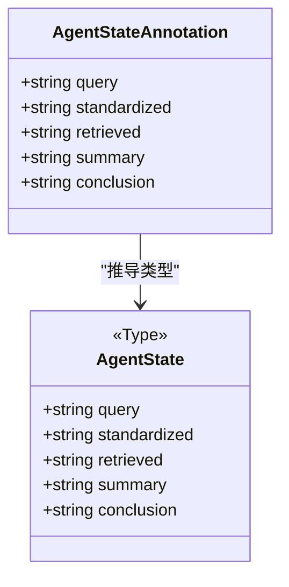
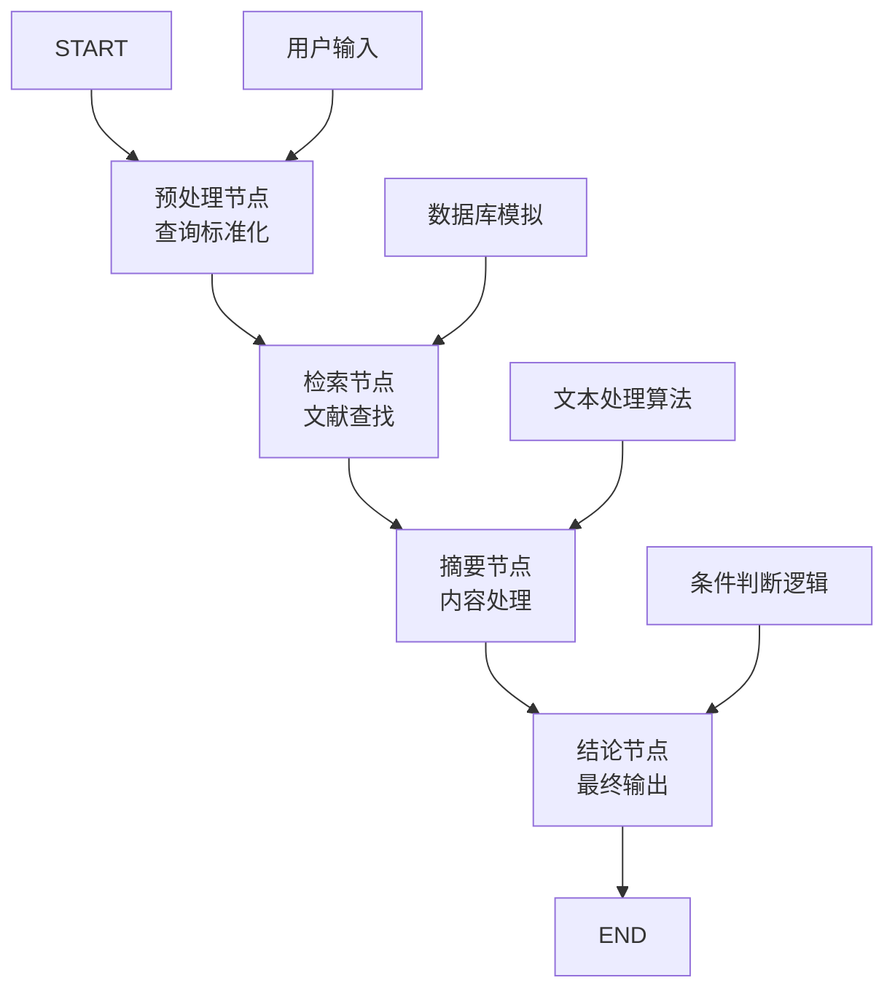
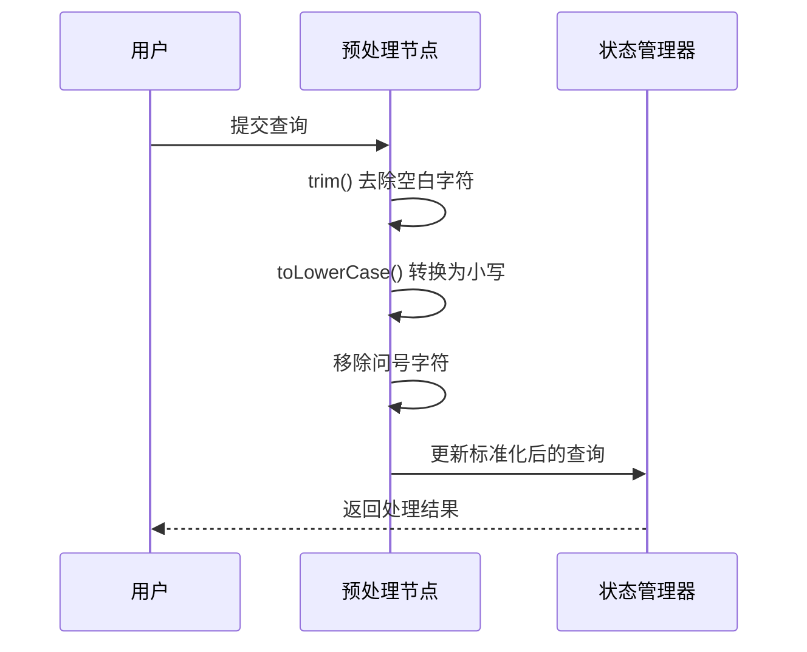
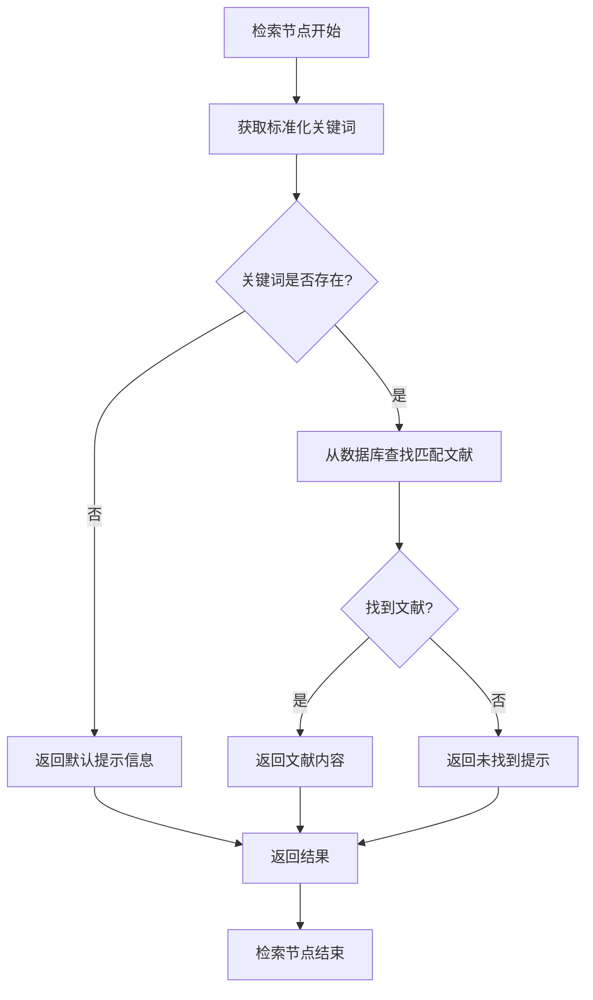
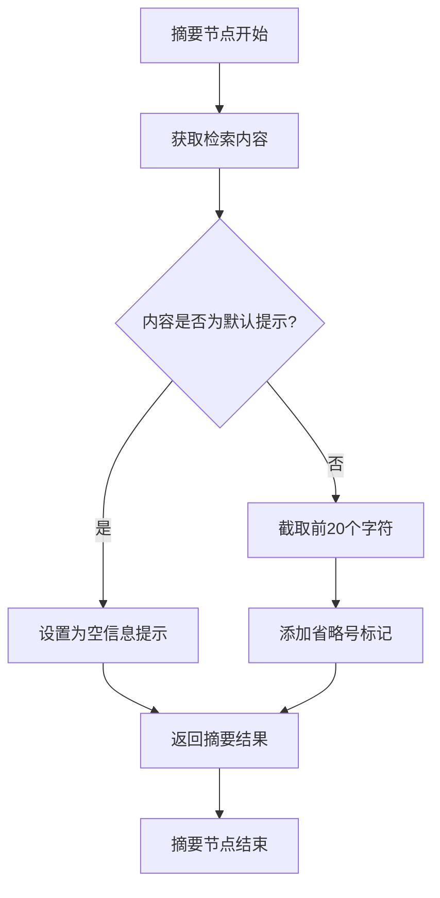
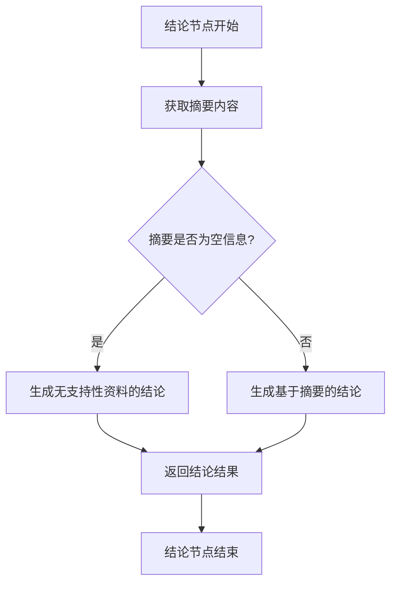
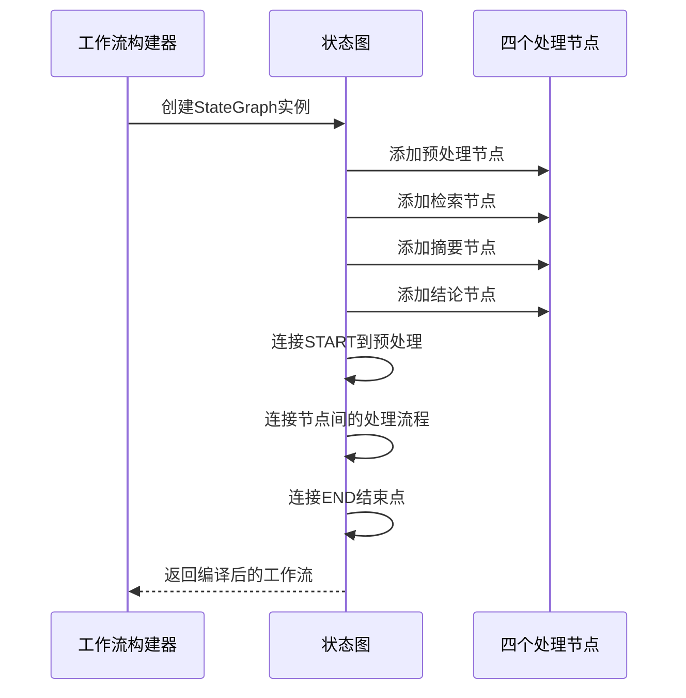

# 代码实现详解

<cite>
**本文档引用的文件**
- [main.ts](file://main.ts)
- [package.json](file://package.json)
- [tsconfig.json](file://tsconfig.json)
</cite>

## 目录
1. [简介](#简介)
2. [项目结构](#项目结构)
3. [核心组件](#核心组件)
4. [架构概览](#架构概览)
5. [详细组件分析](#详细组件分析)
6. [依赖分析](#依赖分析)
7. [性能考虑](#性能考虑)
8. [故障排除指南](#故障排除指南)
9. [结论](#结论)

## 简介

本文档对main.ts文件中的代码实现进行全面解析，重点分析基于LangGraph的状态图编排系统。该实现展示了如何构建一个完整的AI智能体工作流，包含查询标准化、文献检索、内容摘要和结论生成四个核心节点。文档将逐行解释每个组件的功能和实现细节，并提供最佳实践建议。

## 项目结构

该项目采用极简的单文件架构设计，主要包含以下核心文件：

```mermaid
graph TB
subgraph "项目根目录"
A[main.ts - 主程序文件]
B[package.json - 依赖配置]
C[tsconfig.json - TypeScript配置]
end
subgraph "依赖管理"
D[@langchain/langgraph - 核心库]
E[Node.js 运行时环境]
end
A --> D
A --> E
B --> D
```

**图表来源**
- [main.ts:1-85](file://main.ts#L1-L85)
- [package.json:13-15](file://package.json#L13-L15)

**章节来源**
- [main.ts:1-85](file://main.ts#L1-L85)
- [package.json:1-17](file://package.json#L1-L17)
- [tsconfig.json:1-114](file://tsconfig.json#L1-L114)

## 核心组件

### 状态定义系统

项目使用LangGraph的Annotation系统来定义强类型的状态结构。这是现代LangGraph应用的标准模式，提供了类型安全的状态管理。



**图表来源**
- [main.ts:4-13](file://main.ts#L4-L13)

状态定义的关键特性：
- **类型安全**：通过Annotation.Root确保所有状态字段都有明确的类型定义
- **字段完整性**：涵盖从原始查询到最终结论的完整数据流
- **可扩展性**：易于添加新的状态字段而保持类型一致性

**章节来源**
- [main.ts:4-13](file://main.ts#L4-L13)

## 架构概览

整个系统采用状态图（State Graph）架构，通过四个核心节点形成线性处理流水线：



**图表来源**
- [main.ts:64-76](file://main.ts#L64-L76)

这种架构的优势：
- **模块化设计**：每个节点职责单一，便于测试和维护
- **状态传递**：通过共享状态实现节点间的数据传递
- **可扩展性**：可以轻松添加新的处理步骤或修改现有逻辑

## 详细组件分析

### 预处理节点（preprocessNode）

预处理节点负责接收用户输入并进行查询标准化处理：



**图表来源**
- [main.ts:16-21](file://main.ts#L16-L21)

标准化逻辑的核心要点：
- **输入清理**：移除首尾空白字符，避免后续处理的歧义
- **大小写统一**：将所有字符转换为小写，提高匹配准确性
- **标点符号处理**：移除问号等特殊字符，简化检索逻辑

**章节来源**
- [main.ts:16-21](file://main.ts#L16-L21)

### 检索节点（retrieveNode）

检索节点实现文献查找机制，使用简单的内存数据库作为知识源：



**图表来源**
- [main.ts:24-33](file://main.ts#L24-L33)

检索机制的设计特点：
- **键值映射**：使用简单对象模拟数据库，键为关键词，值为文献内容
- **容错处理**：当关键词不存在时返回友好的提示信息
- **灵活性**：可以轻松替换为真实的数据库连接或API调用

**章节来源**
- [main.ts:24-33](file://main.ts#L24-L33)

### 摘要节点（summarizeNode）

摘要节点负责将检索到的文献内容进行压缩处理：



**图表来源**
- [main.ts:36-47](file://main.ts#L36-L47)

摘要算法的核心策略：
- **内容检测**：通过预设的默认提示字符串判断是否有有效内容
- **长度控制**：限制摘要长度在合理范围内，避免信息过载
- **格式优化**：使用省略号表示内容被截断，保持语义完整性

**章节来源**
- [main.ts:36-47](file://main.ts#L36-L47)

### 结论节点（concludeNode）

结论节点根据摘要内容生成最终的结论输出：



**图表来源**
- [main.ts:50-61](file://main.ts#L50-L61)

结论生成的逻辑规则：
- **条件分支**：根据摘要内容的存在与否选择不同的输出策略
- **信息整合**：将摘要内容嵌入到标准的结论模板中
- **用户体验**：提供清晰、易懂的最终结果表达

**章节来源**
- [main.ts:50-61](file://main.ts#L50-L61)

### 工作流编排系统

工作流编排通过链式调用的方式构建完整的处理流程：



**图表来源**
- [main.ts:64-76](file://main.ts#L64-L76)

编排系统的实现特点：
- **链式调用**：提供流畅的API体验，便于快速构建复杂工作流
- **明确的执行路径**：通过START和END标记定义清晰的生命周期
- **可读性强**：节点名称直观反映其功能，便于理解和维护

**章节来源**
- [main.ts:64-76](file://main.ts#L64-L76)

## 依赖分析

### 核心依赖关系

项目的主要依赖关系如下：

```mermaid
graph LR
A[main.ts] --> B[@langchain/langgraph]
C[package.json] --> B
D[TypeScript配置] --> A
B --> E[状态图编排引擎]
B --> F[节点管理]
B --> G[边连接机制]
```

**图表来源**
- [main.ts:1](file://main.ts#L1)
- [package.json:14](file://package.json#L14)

### 版本兼容性

项目配置显示使用了特定版本范围的依赖：

| 依赖包 | 版本要求 | 兼容性 |
|--------|----------|--------|
| @langchain/langgraph | ^1.2.8 | 向后兼容 |
| TypeScript | 4.x | 语法兼容 |

**章节来源**
- [package.json:13-15](file://package.json#L13-L15)
- [tsconfig.json:14](file://tsconfig.json#L14)

## 性能考虑

### 内存使用优化

- **状态最小化**：只存储必要的状态字段，避免内存浪费
- **字符串处理**：使用高效的字符串操作方法，如trim()和toLowerCase()
- **条件短路**：在摘要节点中提前判断空值，减少不必要的处理

### 扩展性建议

- **异步处理**：对于耗时的检索操作，考虑使用异步函数
- **缓存机制**：为频繁访问的文献内容添加缓存层
- **并发处理**：在多节点场景下考虑并行处理的可能性

## 故障排除指南

### 常见问题及解决方案

| 问题类型 | 症状描述 | 可能原因 | 解决方案 |
|----------|----------|----------|----------|
| 输入格式错误 | 预处理失败 | 空输入或特殊字符 | 添加输入验证和异常处理 |
| 检索不到内容 | 返回默认提示 | 关键词不匹配 | 优化关键词匹配算法 |
| 摘要截断异常 | 内容丢失 | 字符串长度边界 | 添加长度检查和边界处理 |
| 结论生成错误 | 输出不符合预期 | 条件判断逻辑错误 | 重新审视条件分支逻辑 |

### 调试技巧

1. **状态监控**：在每个节点中添加状态打印，跟踪数据流转
2. **单元测试**：为每个节点编写独立的测试用例
3. **日志记录**：添加详细的执行日志，便于问题定位

**章节来源**
- [main.ts:16-61](file://main.ts#L16-L61)

## 结论

该实现展示了基于LangGraph的状态图编排系统的核心概念和最佳实践。通过四个精心设计的处理节点，构建了一个完整的AI智能体工作流。代码结构清晰、逻辑简洁，为学习和扩展提供了良好的基础。

主要优势包括：
- **类型安全**：利用TypeScript确保代码质量
- **模块化设计**：每个节点职责明确，便于维护
- **可扩展性**：架构支持轻松添加新功能
- **学习友好**：代码简洁明了，适合初学者理解

建议在实际应用中进一步完善错误处理、添加日志记录，并考虑性能优化措施。