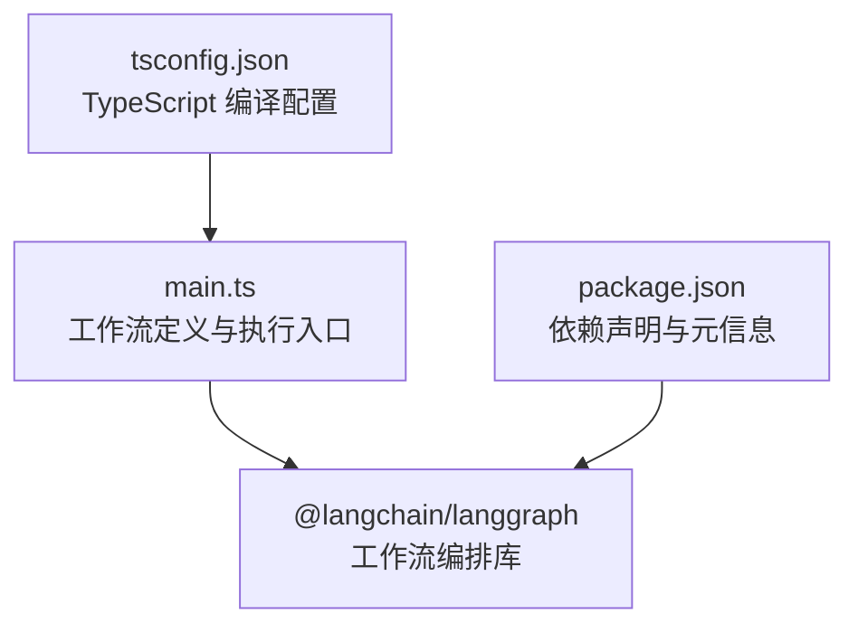
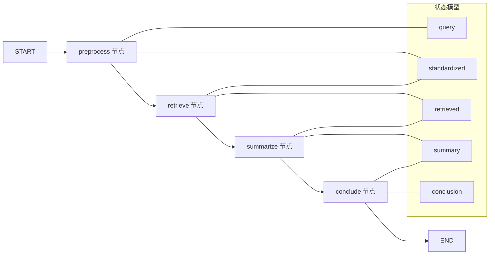
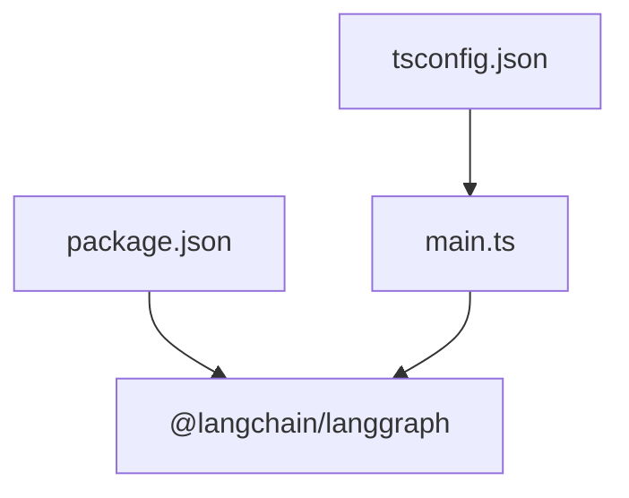

# 工作流编排与执行

<cite>
**本文引用的文件**
- [main.ts](file://main.ts)
- [package.json](file://package.json)
- [tsconfig.json](file://tsconfig.json)
</cite>

## 目录
1. [简介](#简介)
2. [项目结构](#项目结构)
3. [核心组件](#核心组件)
4. [架构总览](#架构总览)
5. [详细组件分析](#详细组件分析)
6. [依赖关系分析](#依赖关系分析)
7. [性能考量](#性能考量)
8. [故障排查指南](#故障排查指南)
9. [结论](#结论)
10. [附录](#附录)

## 简介
本文件围绕 main.ts 中的工作流编排实现进行深入解析，重点覆盖以下方面：
- StateGraph 的创建过程与节点添加方式
- 节点间执行路径配置与边连接逻辑
- START/END 节点的作用及工作流生命周期管理
- workflow.compile() 的编译过程与 graph.invoke() 的执行机制
- 异步执行模式与错误处理策略
- 工作流优化技巧与性能考虑
- 实际执行示例与调试方法

## 项目结构
该项目采用最小化结构，核心逻辑集中在单个入口文件中，并通过包管理器引入 LangGraph 进行工作流编排。

图表来源
- [main.ts:1-85](file://main.ts#L1-L85)
- [package.json:13-15](file://package.json#L13-L15)
- [tsconfig.json:1-114](file://tsconfig.json#L1-L114)

章节来源
- [main.ts:1-85](file://main.ts#L1-L85)
- [package.json:1-17](file://package.json#L1-L17)
- [tsconfig.json:1-114](file://tsconfig.json#L1-L114)

## 核心组件
- 状态注解与类型推导：通过 Annotation.Root 定义状态字段，并从注解派生强类型，确保编译期对状态结构的约束。
- 节点函数：定义若干纯函数节点，每个节点接收完整状态并返回部分状态更新，遵循“只读输入、部分输出”的设计原则。
- 工作流构建：使用 StateGraph 链式 API 添加节点与边，形成线性流水线。
- 编译与执行：通过 compile() 生成可执行图，随后以 invoke() 触发异步执行。

章节来源
- [main.ts:3-13](file://main.ts#L3-L13)
- [main.ts:15-61](file://main.ts#L15-L61)
- [main.ts:63-76](file://main.ts#L63-L76)
- [main.ts:78-84](file://main.ts#L78-L84)

## 架构总览
下图展示了从状态定义到执行完成的端到端流程，包括节点函数、边连接以及 START/END 生命周期标记。

图表来源
- [main.ts:63-76](file://main.ts#L63-L76)
- [main.ts:15-61](file://main.ts#L15-L61)

## 详细组件分析

### 状态模型与类型安全
- 使用 Annotation.Root 声明状态字段，涵盖查询、标准化结果、检索结果、摘要与结论等关键阶段。
- 通过 typeof 注解推导出强类型 AgentState，使节点函数在编译期即可获得完整的状态结构提示，降低运行时错误概率。

章节来源
- [main.ts:3-13](file://main.ts#L3-L13)

### 节点函数设计
- preprocessNode：接收 query 并生成 standardized；返回部分状态更新，保持其他字段不变。
- retrieveNode：根据 standardized 关键词从本地映射中检索内容，返回 retrieved。
- summarizeNode：基于 retrieved 生成摘要；若未检索到则返回默认值。
- concludeNode：基于 summary 生成最终结论；若无有效信息则给出兜底结论。

这些节点均遵循“纯函数”风格：仅依赖输入状态，返回增量状态更新，便于测试与复用。

章节来源
- [main.ts:15-61](file://main.ts#L15-L61)

### StateGraph 创建与边连接
- 创建 StateGraph 实例并传入状态注解，作为后续节点与边的类型上下文。
- 通过链式调用 addNode 为每个节点命名并注册函数。
- 通过 addEdge 将 START 与首个节点连接，再依次连接各中间节点，最后将 END 与最后一个节点连接，形成线性执行序列。

该连接方式确保了明确的执行顺序与生命周期边界。

章节来源
- [main.ts:63-76](file://main.ts#L63-L76)

### START/END 节点与生命周期
- START：作为工作流的入口标记，用于声明第一条执行边的起点。
- END：作为工作流的出口标记，用于声明最后一条执行边的终点。
- 生命周期管理：从 START 开始，按边顺序依次执行节点，直到遇到 END 结束。此模式适合线性流水线场景。

章节来源
- [main.ts:63-76](file://main.ts#L63-L76)

### 编译过程 workflow.compile()
- compile() 将已定义的节点与边转换为可执行图，内部会进行：
  - 类型校验与边完整性检查
  - 执行计划构建（确定节点执行顺序与可达性）
  - 生成可调用的执行对象（graph），支持 invoke() 等接口
- 返回的 graph 对象承载了完整的执行上下文，供后续调用。

章节来源
- [main.ts:75-76](file://main.ts#L75-L76)

### 执行机制 graph.invoke()
- graph.invoke() 是异步执行入口，接收初始状态（如包含 query），并沿边顺序依次调用各节点函数。
- 每次节点执行后，其返回的部分状态会被合并到共享状态中，供后续节点使用。
- 最终到达 END，返回完整状态作为执行结果。

章节来源
- [main.ts:75-84](file://main.ts#L75-L84)

### 异步执行与错误处理策略
- 异步模式：graph.invoke() 返回 Promise，需使用 await 或 .then 获取结果；节点函数本身也应避免阻塞操作。
- 错误处理建议：
  - 在节点函数内对异常输入进行防御性检查（例如空字符串、缺失字段）。
  - 对外部依赖（如网络请求或数据库）进行超时与重试控制。
  - 使用 try/catch 包裹可能抛错的逻辑，并在必要时抛出自定义错误以便上层捕获。
  - 对于并发场景，避免共享可变状态；若必须共享，使用不可变数据结构或锁机制。

章节来源
- [main.ts:15-61](file://main.ts#L15-L61)
- [main.ts:78-84](file://main.ts#L78-L84)

### 执行示例与调试方法
- 示例输入：包含 query 字段的状态对象。
- 输出结果：包含 query、standardized、retrieved、summary、conclusion 的完整状态。
- 调试建议：
  - 在每个节点函数内打印关键中间状态，验证标准化、检索与摘要生成是否符合预期。
  - 使用最小化输入（如仅包含 query）逐步验证边连接正确性。
  - 对比不同关键词的检索结果，确认兜底逻辑生效。
  - 若出现死循环或未到达 END，检查边连接是否遗漏或重复。

章节来源
- [main.ts:78-84](file://main.ts#L78-L84)

## 依赖关系分析
- 项目依赖 @langchain/langgraph，版本满足引擎要求与对等依赖约束。
- TypeScript 严格模式开启，有助于在编译期发现潜在问题。
- 项目结构简单，主要逻辑集中在 main.ts，便于快速定位与修改。

图表来源
- [package.json:13-15](file://package.json#L13-L15)
- [tsconfig.json:1-114](file://tsconfig.json#L1-L114)
- [main.ts:1](file://main.ts#L1)

章节来源
- [package.json:1-17](file://package.json#L1-L17)
- [tsconfig.json:1-114](file://tsconfig.json#L1-L114)
- [main.ts:1](file://main.ts#L1)

## 性能考量
- 节点函数尽量保持轻量，避免同步阻塞与高开销计算。
- 合理拆分节点粒度，提升可测试性与可观测性。
- 对外部依赖（如检索）进行缓存与批量处理，减少重复调用。
- 在大规模并发场景下，评估内存占用与状态增长，必要时对状态进行裁剪或分页处理。
- 利用链式调用与类型系统减少运行时错误，从而降低回滚成本。

## 故障排查指南
- 节点未执行：检查对应边是否正确连接至该节点，或是否存在循环导致无法到达。
- 状态不一致：确认节点返回的是部分状态而非覆盖式替换，避免丢失其他字段。
- 未到达 END：核对最后一条边是否指向 END，以及节点函数是否返回必要的字段。
- 异步未完成：确保调用方使用 await 或 .catch 处理 Promise，避免静默失败。
- 类型错误：利用 TypeScript 严格模式，修正注解与节点函数签名不匹配的问题。

章节来源
- [main.ts:63-76](file://main.ts#L63-L76)
- [main.ts:78-84](file://main.ts#L78-L84)

## 结论
本项目以简洁清晰的方式演示了基于 LangGraph 的工作流编排：通过 Annotation 定义强类型状态，使用链式 API 添加节点与边，形成稳定的线性执行序列。workflow.compile() 生成可执行图，graph.invoke() 提供异步执行能力。结合良好的错误处理与调试实践，可在保证类型安全的同时实现高性能、可维护的工作流系统。

## 附录
- 快速开始步骤
  - 安装依赖：使用包管理器安装 @langchain/langgraph 及其对等依赖。
  - 编译与运行：使用 TypeScript 编译器或 Node 运行时执行 main.ts。
  - 修改与扩展：新增节点与边，调整状态字段，验证执行路径与结果。

章节来源
- [package.json:13-15](file://package.json#L13-L15)
- [main.ts:1-85](file://main.ts#L1-L85)