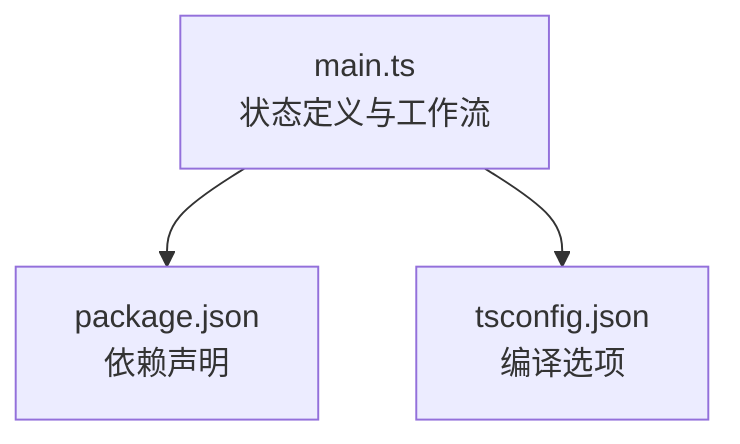
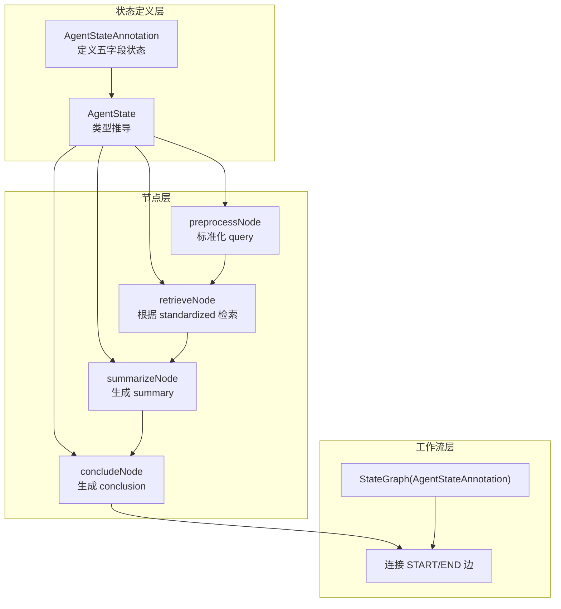
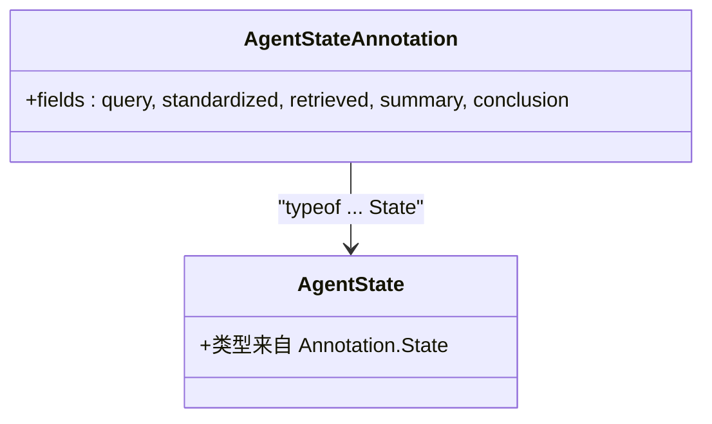
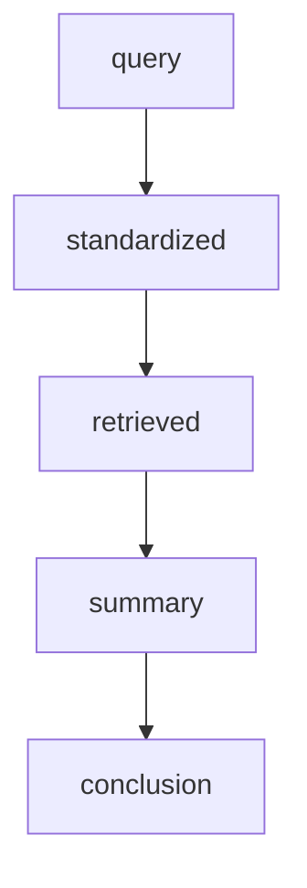
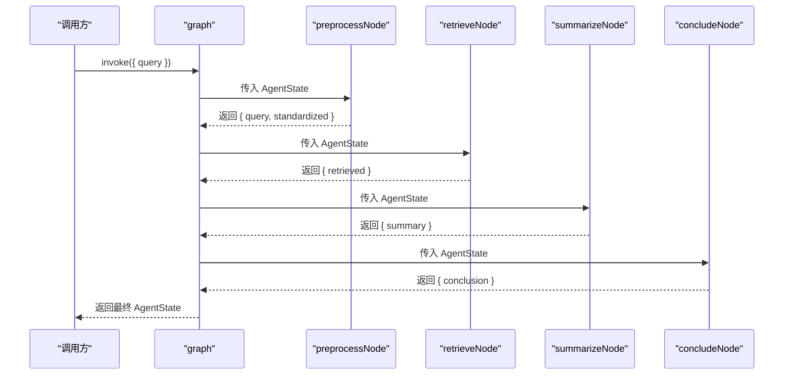
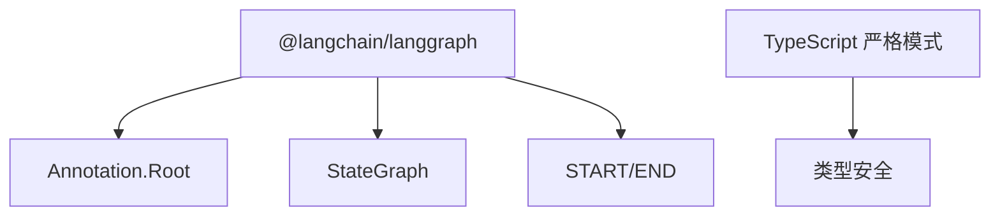

# 状态定义与类型系统

<cite>
**本文引用的文件**
- [main.ts](file://main.ts)
- [package.json](file://package.json)
- [tsconfig.json](file://tsconfig.json)
</cite>

## 目录
1. [引言](#引言)
2. [项目结构](#项目结构)
3. [核心组件](#核心组件)
4. [架构总览](#架构总览)
5. [详细组件分析](#详细组件分析)
6. [依赖分析](#依赖分析)
7. [性能考虑](#性能考虑)
8. [故障排查指南](#故障排查指南)
9. [结论](#结论)
10. [附录](#附录)

## 引言
本节聚焦于 main.ts 中的状态定义与类型系统设计，围绕以下目标展开：
- 解析 AgentStateAnnotation 的创建过程与 Annotation.Root 的使用方式
- 逐项说明各状态字段：query（原始查询）、standardized（标准化查询）、retrieved（检索结果）、summary（摘要内容）、conclusion（最终结论）的职责与取值来源
- 解释如何从 Annotation 推导出 TypeScript 类型 AgentState，并阐述类型驱动开发的优势
- 描述状态字段之间的数据流转关系与依赖关系
- 提供状态管理的最佳实践与扩展建议

## 项目结构
该项目为最小可运行示例，包含一个入口文件与基础配置文件：
- main.ts：状态定义、节点函数、工作流构建与执行
- package.json：项目元信息与依赖声明
- tsconfig.json：TypeScript 编译选项（启用严格模式）

**图表来源**
- [main.ts:1-85](file://main.ts#L1-L85)
- [package.json:1-17](file://package.json#L1-L17)
- [tsconfig.json:1-114](file://tsconfig.json#L1-L114)

**章节来源**
- [main.ts:1-85](file://main.ts#L1-L85)
- [package.json:1-17](file://package.json#L1-L17)
- [tsconfig.json:1-114](file://tsconfig.json#L1-L114)

## 核心组件
本节聚焦状态定义与类型推导的核心部分：
- 使用 Annotation.Root 声明状态结构，包含五个字段：query、standardized、retrieved、summary、conclusion
- 通过 typeof Annotation.State 推导出 AgentState 类型，使类型系统与状态结构保持一致
- 各节点函数接收 AgentState 参数，返回 Partial<AgentState>，仅更新必要的字段

关键实现要点：
- Annotation.Root 用于声明状态根对象及其字段类型
- AgentState 由 Annotation 推导而来，确保类型与状态结构同步演进
- 节点函数遵循“读取旧状态、计算新值、返回增量”的模式

**章节来源**
- [main.ts:3-13](file://main.ts#L3-L13)

## 架构总览
下图展示了从状态定义到工作流执行的整体架构：

**图表来源**
- [main.ts:4-13](file://main.ts#L4-L13)
- [main.ts:15-61](file://main.ts#L15-L61)
- [main.ts:64-76](file://main.ts#L64-L76)

## 详细组件分析

### 状态注解与类型推导
- Annotation.Root 用于声明状态根对象，其内部字段通过 Annotation<T>() 定义，明确每个字段的类型约束
- 通过 typeof AgentStateAnnotation.State 推导出 AgentState 类型，使后续节点函数签名与状态结构保持一致
- 这种“先定义结构，再推导类型”的方式实现了类型驱动开发，减少手写类型带来的不一致风险

**图表来源**
- [main.ts:4-13](file://main.ts#L4-L13)

**章节来源**
- [main.ts:4-13](file://main.ts#L4-L13)

### 字段定义与职责
- query：原始用户输入，作为流程起点
- standardized：对 query 的标准化处理结果，用于检索匹配
- retrieved：检索阶段产出的文本内容或默认提示
- summary：对 retrieved 的摘要化处理
- conclusion：基于 summary 生成最终结论

字段之间的依赖关系：
- preprocessNode 依赖 query 并输出 standardized
- retrieveNode 依赖 standardized 并输出 retrieved
- summarizeNode 依赖 retrieved 并输出 summary
- concludeNode 依赖 summary 并输出 conclusion

**图表来源**
- [main.ts:16-61](file://main.ts#L16-L61)

**章节来源**
- [main.ts:16-61](file://main.ts#L16-L61)

### 节点函数与数据流
- preprocessNode：读取 query，进行清洗与标准化，返回 query 与 standardized
- retrieveNode：以 standardized 为键在本地映射中查找，返回 retrieved
- summarizeNode：根据 retrieved 决定摘要内容，返回 summary
- concludeNode：基于 summary 生成结论，返回 conclusion

**图表来源**
- [main.ts:16-61](file://main.ts#L16-L61)
- [main.ts:79-82](file://main.ts#L79-L82)

**章节来源**
- [main.ts:16-61](file://main.ts#L16-L61)
- [main.ts:79-82](file://main.ts#L79-L82)

### 工作流构建与执行
- 使用 StateGraph(AgentStateAnnotation) 构建有向图
- 通过 addNode 添加四个节点，按顺序连接 START 到 preprocess，再到 retrieve、summarize、conclude，最后到 END
- compile() 编译后，graph.invoke() 可直接执行

**图表来源**
- [main.ts:64-76](file://main.ts#L64-L76)

**章节来源**
- [main.ts:64-76](file://main.ts#L64-L76)

## 依赖分析
- @langchain/langgraph：提供 Annotation、StateGraph、START/END 等核心能力
- TypeScript 严格模式：提升类型安全，便于在大型项目中维护状态结构与类型一致性

**图表来源**
- [package.json:13-15](file://package.json#L13-L15)
- [tsconfig.json:88](file://tsconfig.json#L88)

**章节来源**
- [package.json:13-15](file://package.json#L13-L15)
- [tsconfig.json:88](file://tsconfig.json#L88)

## 性能考虑
- 状态字段数量与节点数量线性增长，适合小型到中型流程
- 对于大规模检索场景，建议将本地映射替换为外部检索服务，避免阻塞与内存压力
- 在节点内尽量减少不必要的字符串操作，优先复用已有字段值
- 对于长文本摘要，可采用分块策略或外部摘要模型，平衡准确度与性能

## 故障排查指南
- 类型错误：若节点函数返回的字段不在 AgentState 中，TypeScript 将报错。请检查 Annotation.Root 的字段定义与节点返回值是否一致
- 空值处理：当检索不到结果时，节点应返回默认提示；在下游节点中需对空值或默认提示进行分支处理
- 边界条件：query 可能为空或仅含空白字符，应在 preprocessNode 中进行清理与校验
- 执行异常：graph.invoke() 抛出的异常通常来自节点内部逻辑或外部依赖，建议在节点函数中增加 try/catch 并记录上下文

**章节来源**
- [main.ts:16-61](file://main.ts#L16-L61)
- [main.ts:79-82](file://main.ts#L79-L82)

## 结论
本示例通过 Annotation.Root 明确声明状态结构，并借助类型推导 AgentState 实现类型驱动开发。四个节点清晰地描述了从“原始查询”到“最终结论”的完整数据流，展示了 LangGraph 在状态管理与流程编排上的简洁与强大。对于更复杂的业务场景，建议在保持状态结构稳定的同时，逐步引入外部服务与更精细的错误处理机制。

## 附录
- 扩展建议
  - 引入中间态：如 embedding、rerank 等步骤，丰富检索前后的处理链路
  - 增加缓存：对检索与摘要结果进行缓存，降低重复计算成本
  - 分支与回退：在检索失败时提供备选方案或回退路径
  - 日志与可观测性：为每个节点增加日志记录，便于调试与审计