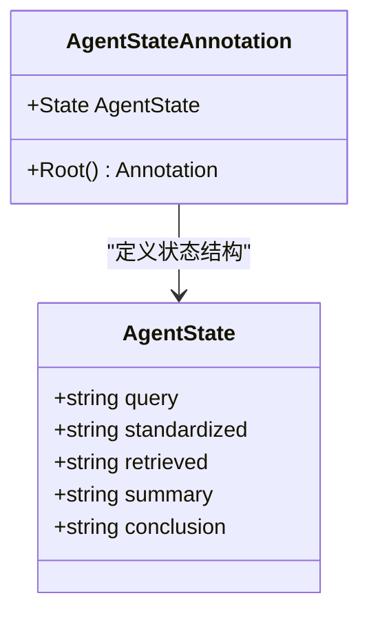
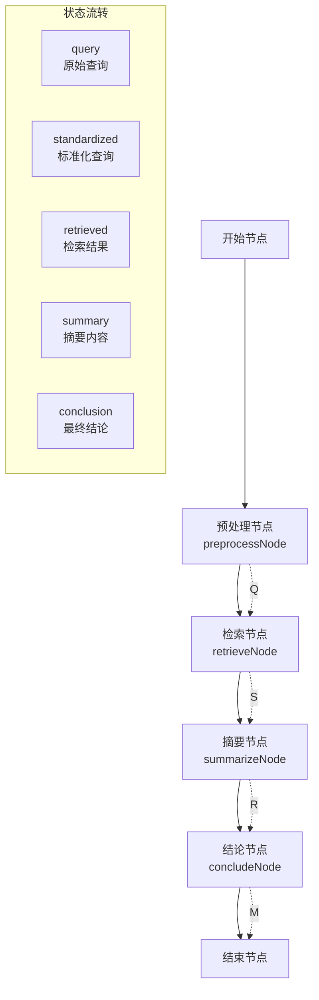
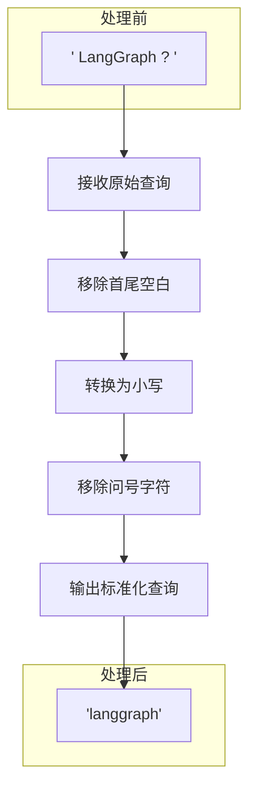
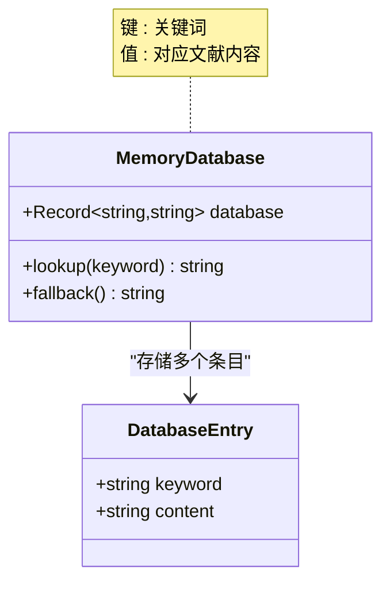
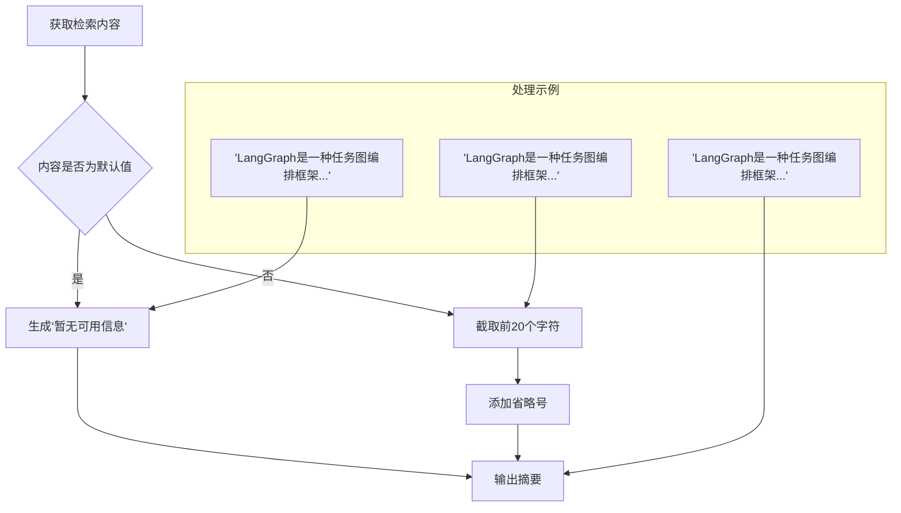
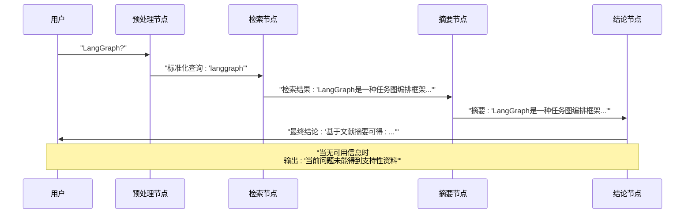
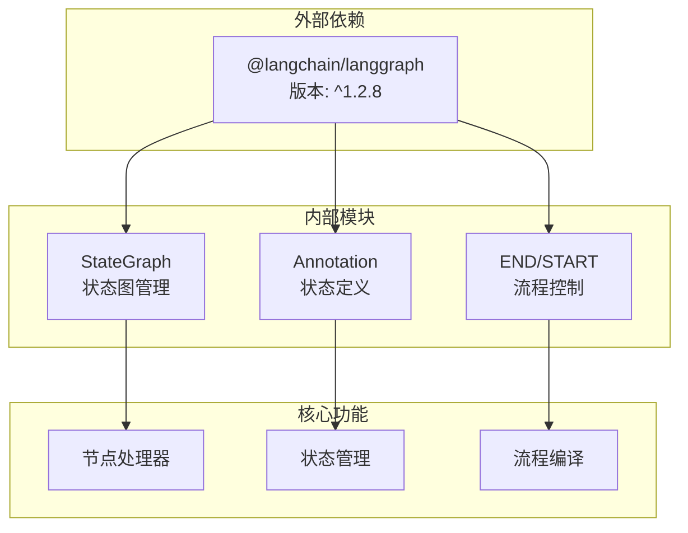

# 节点处理器实现

<cite>
**本文档引用的文件**
- [main.ts](file://main.ts)
- [package.json](file://package.json)
- [tsconfig.json](file://tsconfig.json)
</cite>

## 目录
1. [简介](#简介)
2. [项目结构](#项目结构)
3. [核心组件](#核心组件)
4. [架构概览](#架构概览)
5. [详细组件分析](#详细组件分析)
6. [依赖关系分析](#依赖关系分析)
7. [性能考虑](#性能考虑)
8. [故障排除指南](#故障排除指南)
9. [结论](#结论)

## 简介

本文档全面解析了main.ts文件中四个核心节点处理器的实现细节。这是一个基于LangGraph构建的AI代理工作流，包含四个主要处理节点：预处理节点(preprocessNode)、检索节点(retrieveNode)、摘要节点(summarizeNode)和结论节点(concludeNode)。每个节点都承担着特定的数据处理职责，通过状态图的形式串联起来形成完整的知识检索和生成流程。

该系统采用TypeScript编写，使用LangGraph的状态图模式来管理复杂的多步骤处理流程，实现了从用户查询到最终结论输出的完整自动化处理管道。

## 项目结构

项目采用极简的单文件架构设计，所有核心逻辑集中在main.ts文件中，配合必要的配置文件：

```mermaid
graph TB
subgraph "项目根目录"
A[main.ts<br/>核心业务逻辑]
B[package.json<br/>依赖管理]
C[tsconfig.json<br/>TypeScript配置]
end
subgraph "依赖关系"
D[@langchain/langgraph<br/>状态图框架]
E[Node.js 运行时]
end
A --> D
A --> E
B --> D
B --> E
```

**图表来源**
- [main.ts:1-85](file://main.ts#L1-L85)
- [package.json:1-17](file://package.json#L1-L17)

**章节来源**
- [main.ts:1-85](file://main.ts#L1-L85)
- [package.json:1-17](file://package.json#L1-L17)
- [tsconfig.json:1-114](file://tsconfig.json#L1-L114)

## 核心组件

本项目的核心是四个精心设计的节点处理器，它们共同构成了一个完整的AI代理处理流程：

### 状态定义与类型系统

系统使用LangGraph的Annotation机制定义了统一的状态结构，确保各节点间的数据传递具有一致性和类型安全：



**图表来源**
- [main.ts:4-13](file://main.ts#L4-L13)

### 节点处理器架构

四个节点处理器遵循相同的函数签名模式，接受AgentState作为输入，返回部分状态更新对象：

| 节点名称 | 输入参数 | 输出字段 | 主要职责 |
|---------|---------|---------|---------|
| preprocessNode | AgentState | standardized | 查询标准化处理 |
| retrieveNode | AgentState | retrieved | 文献检索匹配 |
| summarizeNode | AgentState | summary | 内容摘要生成 |
| concludeNode | AgentState | conclusion | 最终结论生成 |

**章节来源**
- [main.ts:15-61](file://main.ts#L15-L61)

## 架构概览

整个系统采用线性的状态图架构，四个节点按顺序执行，形成完整的处理流水线：



**图表来源**
- [main.ts:64-76](file://main.ts#L64-L76)

**章节来源**
- [main.ts:64-76](file://main.ts#L64-L76)

## 详细组件分析

### 预处理节点 (preprocessNode)

预处理节点负责对用户输入进行标准化处理，为后续的精确检索奠定基础。

#### 查询标准化逻辑

预处理节点实现了三个关键的标准化步骤：

1. **输入清理**：移除首尾空白字符
2. **大小写转换**：将所有字符转换为小写
3. **标点符号清理**：移除问号字符



**图表来源**
- [main.ts:16-21](file://main.ts#L16-L21)

#### 处理算法详解

预处理算法采用三步处理流程，每一步都有明确的目的和影响范围：

1. **字符串修剪**：使用trim()方法移除输入两端的空白字符，确保查询的纯净性
2. **大小写归一化**：通过toLowerCase()实现不区分大小写的匹配
3. **标点符号规范化**：专门移除问号字符，消除查询中的疑问语气

这种标准化策略确保了后续检索阶段能够准确匹配到相关的文献内容。

**章节来源**
- [main.ts:16-21](file://main.ts#L16-L21)

### 检索节点 (retrieveNode)

检索节点实现了内存数据库的简化版本，用于模拟真实的文献检索过程。

#### 内存数据库实现

检索节点使用JavaScript对象作为内存数据库，提供了键值对形式的文献存储：



**图表来源**
- [main.ts:25-33](file://main.ts#L25-L33)

#### 关键词匹配策略

检索节点采用直接键值匹配的方式，具有以下特点：

1. **精确匹配**：直接使用标准化后的关键词作为数据库键
2. **快速查找**：利用JavaScript对象的O(1)访问特性
3. **默认回退**：当找不到匹配项时返回"未找到相关文献"

匹配策略简单而高效，适合演示目的的原型系统。

**章节来源**
- [main.ts:24-33](file://main.ts#L24-L33)

### 摘要节点 (summarizeNode)

摘要节点负责将检索到的文献内容转换为简洁的摘要信息。

#### 内容处理算法

摘要节点实现了基于条件判断的摘要生成逻辑：



**图表来源**
- [main.ts:36-47](file://main.ts#L36-L47)

#### 文本截取逻辑

摘要生成采用了保守的截断策略：

1. **长度限制**：最多保留20个字符，确保摘要的简洁性
2. **完整性保证**：在截断位置添加省略号，表明内容被截断
3. **默认处理**：对于"未找到相关文献"的特殊情况，直接返回标准提示

这种设计平衡了信息量和可读性，避免了过长摘要对用户造成的认知负担。

**章节来源**
- [main.ts:36-47](file://main.ts#L36-L47)

### 结论节点 (concludeNode)

结论节点是整个处理流程的最终环节，负责生成面向用户的最终输出。

#### 信息整合与格式化

结论节点实现了智能的信息整合机制：



**图表来源**
- [main.ts:50-61](file://main.ts#L50-L61)

#### 输出生成规则

结论节点遵循严格的格式化规则：

1. **条件分支**：根据摘要内容是否存在进行不同的处理
2. **模板化输出**：有信息时使用"基于文献摘要可得: "的格式
3. **默认响应**：无信息时提供友好的解释性文本
4. **语义一致性**：确保输出与系统内部状态保持一致

这种设计确保了用户能够获得清晰、一致且有帮助的最终结果。

**章节来源**
- [main.ts:50-61](file://main.ts#L50-L61)

## 依赖关系分析

系统对外部依赖的使用体现了现代JavaScript开发的最佳实践：



**图表来源**
- [package.json:13-15](file://package.json#L13-L15)
- [main.ts:1-10](file://main.ts#L1-L10)

### 依赖配置分析

项目使用pnpm包管理器，配置相对简洁但功能完备：

| 依赖项 | 版本 | 用途 |
|-------|------|-----|
| @langchain/langgraph | ^1.2.8 | 核心状态图框架 |
| pnpm | 10.21.0 | 包管理器 |

**章节来源**
- [package.json:13-15](file://package.json#L13-L15)

## 性能考虑

### 时间复杂度分析

每个节点的时间复杂度都是O(1)，整体流程的性能表现优异：

- **预处理节点**：字符串操作O(n)，其中n为输入长度
- **检索节点**：对象属性访问O(1)
- **摘要节点**：字符串截取O(k)，其中k为截取长度
- **结论节点**：条件判断O(1)

### 空间复杂度优化

系统采用增量状态管理模式，避免了不必要的数据复制：

- 状态对象只包含必要字段
- 每个节点只返回需要更新的字段
- 内存数据库使用紧凑的键值对存储

### 可扩展性建议

为了支持更大规模的应用场景，可以考虑以下改进：

1. **数据库优化**：使用更高效的内存数据库或持久化存储
2. **缓存机制**：实现查询结果缓存减少重复计算
3. **并发处理**：支持多查询并发处理提升吞吐量
4. **分页检索**：实现分页机制处理大量检索结果

## 故障排除指南

### 常见问题诊断

#### 输入验证问题

**症状**：预处理节点返回空字符串
**原因**：输入参数缺失或为空
**解决方案**：确保传入的query参数存在且非空

#### 检索失败问题

**症状**：检索节点始终返回"未找到相关文献"
**原因**：关键词不匹配或数据库中缺少对应条目
**解决方案**：检查标准化后的关键词是否正确，确认数据库条目完整性

#### 摘要异常问题

**症状**：摘要节点输出不符合预期
**原因**：输入内容格式异常或长度计算错误
**解决方案**：验证输入内容的编码和长度

#### 结论生成问题

**症状**：结论节点输出格式不正确
**原因**：摘要状态传递异常
**解决方案**：检查状态图的节点连接和数据传递

### 错误处理机制

系统目前采用简单的默认值处理策略：

1. **空输入处理**：所有节点都对空输入进行了安全检查
2. **默认回退**：使用"未找到相关文献"和"暂无可用信息"等友好提示
3. **类型安全**：通过TypeScript确保状态字段的类型正确性

**章节来源**
- [main.ts:16-61](file://main.ts#L16-L61)

## 结论

本项目成功展示了如何使用LangGraph构建一个完整的AI代理处理流程。四个核心节点处理器各司其职，形成了从查询标准化到最终结论输出的完整闭环。

### 主要成就

1. **架构清晰**：采用状态图模式，逻辑层次分明
2. **实现简洁**：代码量少但功能完整，易于理解和维护
3. **类型安全**：充分利用TypeScript的类型系统确保代码质量
4. **扩展性强**：模块化设计便于功能扩展和修改

### 技术亮点

- **标准化处理**：有效的查询预处理提升了检索准确性
- **内存数据库**：简洁的键值存储满足演示需求
- **智能摘要**：合理的截断策略平衡了信息量和可读性
- **格式化输出**：一致的结论生成规则提升了用户体验

### 改进建议

虽然当前实现已经相当完善，但仍有一些可以改进的地方：
- 实现更复杂的检索算法和匹配策略
- 添加错误日志和监控机制
- 支持配置化的处理参数
- 实现异步处理以支持长时间运行的任务

这个项目为构建更复杂的AI代理系统提供了良好的基础和参考模式。