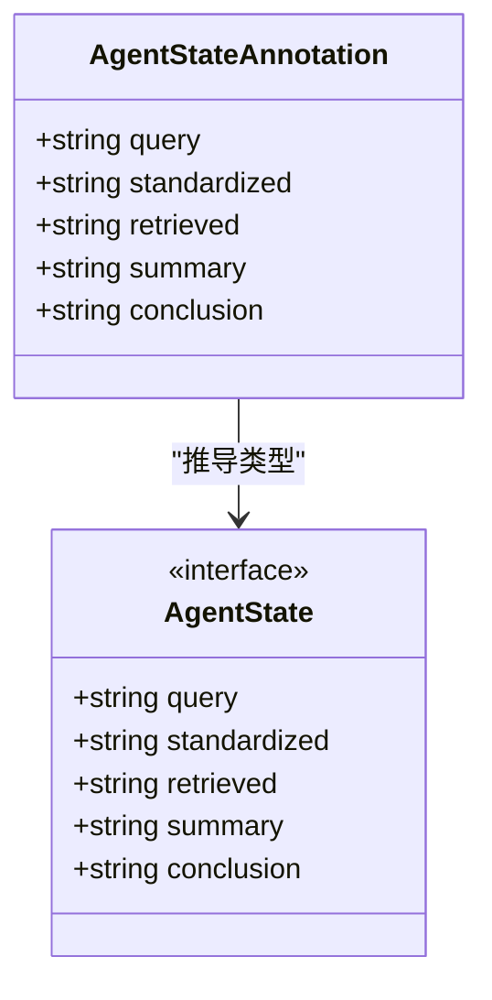
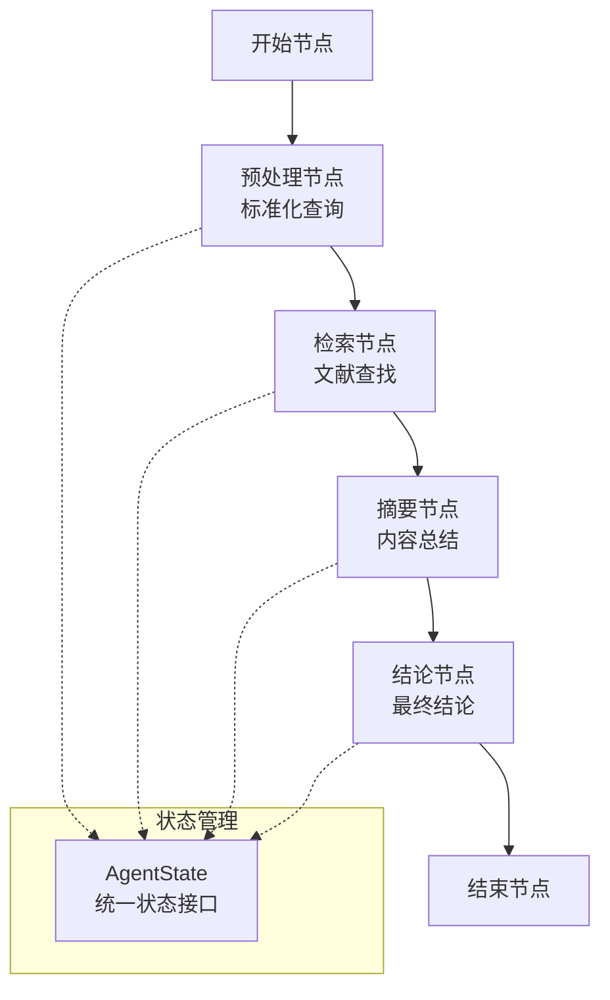
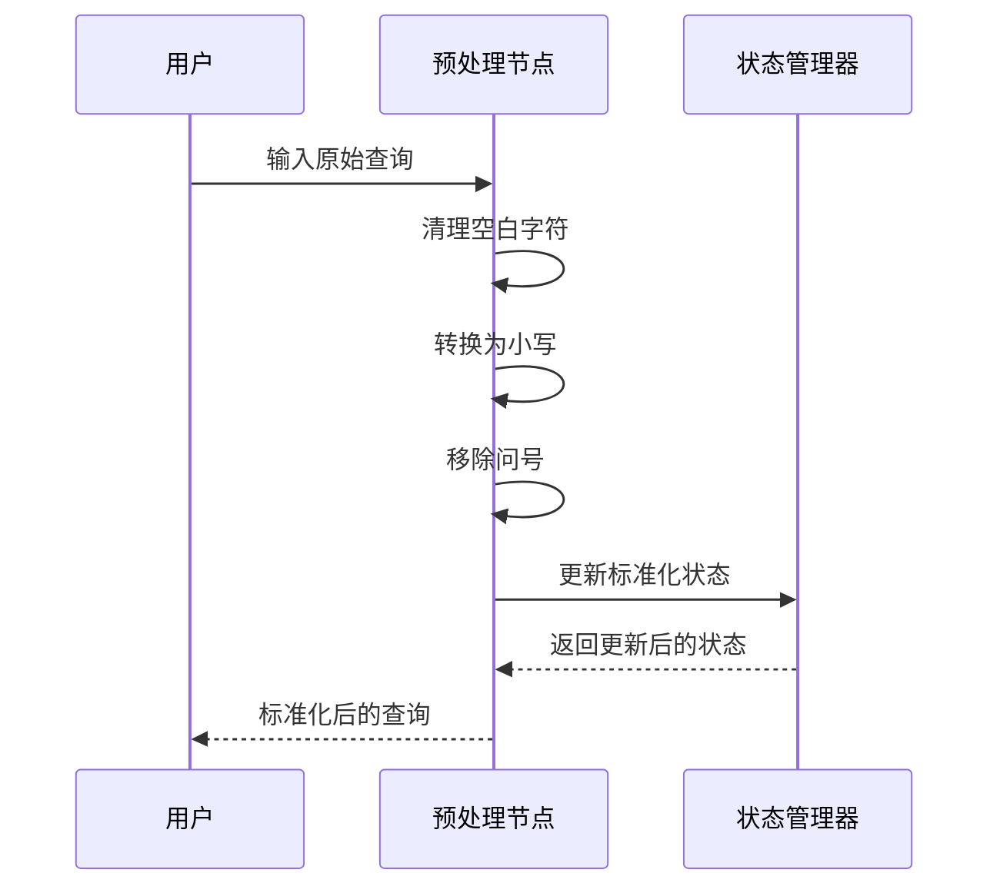
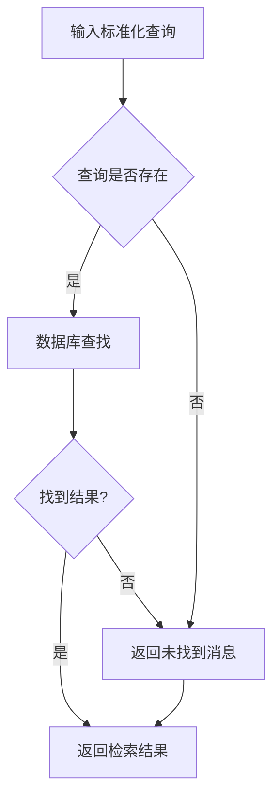
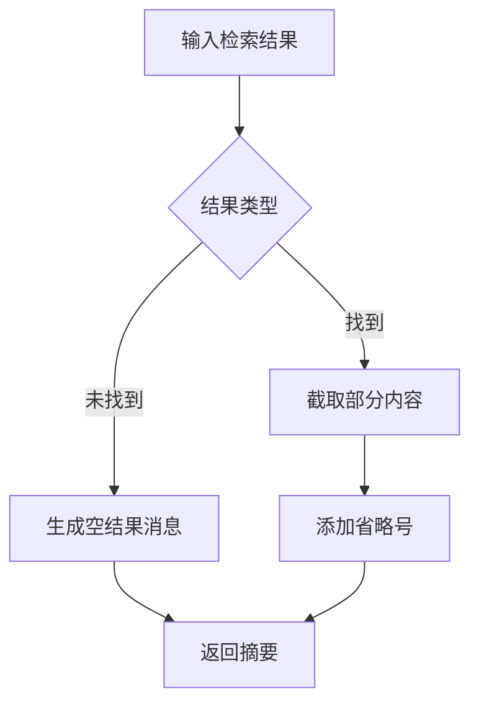
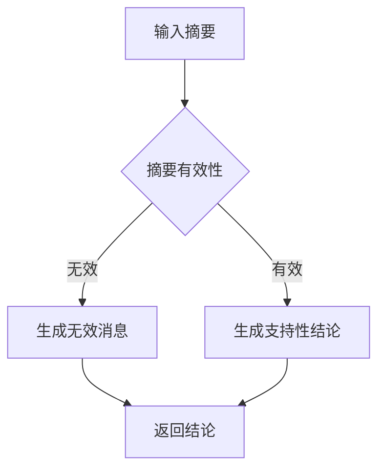
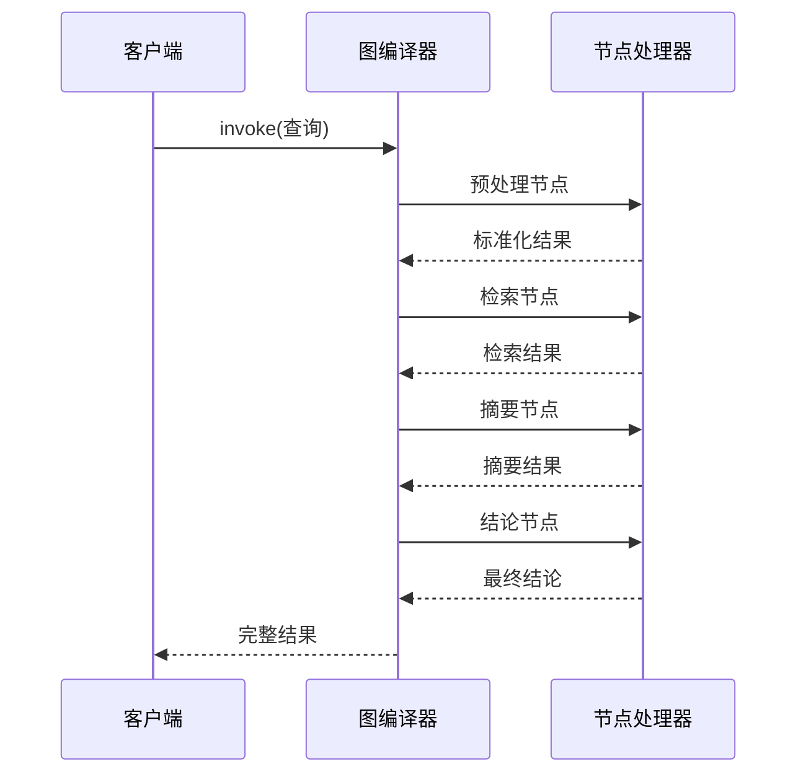
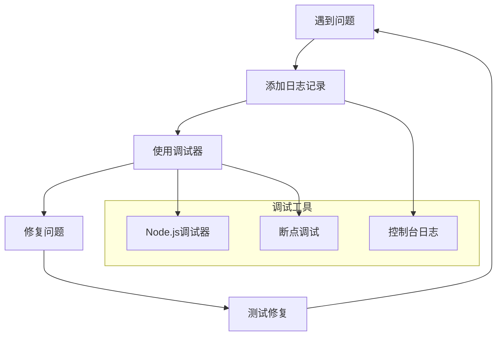

# 复杂智能体工作流设计

<cite>
**本文档中引用的文件**
- [main.ts](file://main.ts)
- [package.json](file://package.json)
- [tsconfig.json](file://tsconfig.json)
</cite>

## 目录
1. [引言](#引言)
2. [项目结构](#项目结构)
3. [核心组件](#核心组件)
4. [架构概览](#架构概览)
5. [详细组件分析](#详细组件分析)
6. [依赖关系分析](#依赖关系分析)
7. [性能考虑](#性能考虑)
8. [故障排除指南](#故障排除指南)
9. [结论](#结论)

## 引言

本项目展示了如何使用LangGraph构建复杂的智能体工作流系统。该工作流实现了从用户查询到最终结论的完整处理管道，包括查询标准化、文献检索、内容摘要和结论生成等关键步骤。通过状态图（StateGraph）模式，系统能够有效地管理多智能体协作、任务分配和结果整合。

该项目的核心价值在于演示了现代AI智能体系统的架构设计原则，包括模块化组件设计、状态管理、异步处理和可扩展性考虑。通过实际的代码实现，开发者可以理解如何构建生产级别的智能体工作流系统。

## 项目结构

该项目采用极简但功能完整的结构设计：

```mermaid
graph TB
subgraph "项目根目录"
A[main.ts<br/>主程序入口]
B[package.json<br/>项目配置]
C[tsconfig.json<br/>TypeScript配置]
end
subgraph "依赖管理"
D[@langchain/langgraph<br/>核心框架]
end
A --> D
B --> D
```

**图表来源**
- [main.ts:1-85](file://main.ts#L1-L85)
- [package.json:1-17](file://package.json#L1-L17)

**章节来源**
- [main.ts:1-85](file://main.ts#L1-L85)
- [package.json:1-17](file://package.json#L1-L17)
- [tsconfig.json:1-114](file://tsconfig.json#L1-L114)

## 核心组件

### 状态定义系统

项目使用LangGraph的Annotation系统来定义智能体状态，这是一个类型安全的状态管理模式：



**图表来源**
- [main.ts:4-13](file://main.ts#L4-L13)

### 工作流节点设计

系统包含四个核心处理节点，每个节点负责特定的功能：

1. **预处理节点**：标准化用户查询
2. **检索节点**：从知识库中查找相关信息
3. **摘要节点**：生成内容摘要
4. **结论节点**：基于摘要生成最终结论

**章节来源**
- [main.ts:15-61](file://main.ts#L15-L61)

## 架构概览

整个智能体工作流采用状态图（StateGraph）架构，实现了清晰的流程控制和状态管理：



**图表来源**
- [main.ts:64-76](file://main.ts#L64-L76)

该架构的关键优势包括：
- **模块化设计**：每个节点独立且可替换
- **状态一致性**：通过统一的AgentState确保数据完整性
- **流程控制**：明确的执行顺序和条件判断
- **可扩展性**：易于添加新的处理节点

## 详细组件分析

### 预处理节点分析

预处理节点负责清理和标准化用户输入：



**图表来源**
- [main.ts:16-21](file://main.ts#L16-L21)

**章节来源**
- [main.ts:15-21](file://main.ts#L15-L21)

### 检索节点分析

检索节点模拟从数据库中查找相关信息的过程：



**图表来源**
- [main.ts:24-33](file://main.ts#L24-L33)

**章节来源**
- [main.ts:23-33](file://main.ts#L23-L33)

### 摘要节点分析

摘要节点根据检索结果生成适当的摘要：



**图表来源**
- [main.ts:36-47](file://main.ts#L36-L47)

**章节来源**
- [main.ts:35-47](file://main.ts#L35-L47)

### 结论节点分析

结论节点基于摘要生成最终的结论：



**图表来源**
- [main.ts:50-61](file://main.ts#L50-L61)

**章节来源**
- [main.ts:49-61](file://main.ts#L49-L61)

## 依赖关系分析

项目依赖关系简洁而明确，主要依赖于LangGraph框架：

```mermaid
graph LR
subgraph "应用层"
MAIN[main.ts]
end
subgraph "框架层"
LANGGRAPH[@langchain/langgraph]
end
subgraph "配置层"
PKG[package.json]
TSCONFIG[tsconfig.json]
end
MAIN --> LANGGRAPH
PKG --> LANGGRAPH
TSCONFIG -.-> MAIN
```

**图表来源**
- [main.ts:1](file://main.ts#L1)
- [package.json:13-15](file://package.json#L13-L15)

**章节来源**
- [package.json:13-15](file://package.json#L13-L15)

### 依赖特性分析

- **LangGraph版本**：使用1.2.8版本，提供稳定的工作流编排能力
- **TypeScript配置**：启用严格模式，确保类型安全
- **模块系统**：使用CommonJS模块格式

## 性能考虑

### 异步处理优化

系统采用异步模式处理，避免阻塞主线程：



**图表来源**
- [main.ts:79-84](file://main.ts#L79-L84)

### 内存管理策略

- **状态最小化**：只存储必要的状态信息
- **异步处理**：避免长时间占用内存
- **垃圾回收友好**：及时释放中间结果

## 故障排除指南

### 常见问题诊断

1. **查询未被识别**
   - 检查预处理节点的标准化逻辑
   - 验证数据库中的关键词匹配

2. **检索结果为空**
   - 确认查询是否在数据库中存在
   - 检查大小写敏感性问题

3. **摘要生成异常**
   - 验证输入内容的有效性
   - 检查字符串截取边界

### 调试技巧



**章节来源**
- [main.ts:79-84](file://main.ts#L79-L84)

## 结论

本项目成功展示了复杂智能体工作流的设计模式和实现策略。通过LangGraph框架，系统实现了：

1. **模块化架构**：清晰的节点分离和职责划分
2. **状态管理**：类型安全的状态接口设计
3. **异步处理**：高效的并发执行模式
4. **可扩展性**：易于添加新功能的架构设计

该工作流为构建更复杂的智能体系统提供了坚实的基础，包括多智能体协作、动态决策制定和自适应学习等高级功能的扩展可能性。

对于生产环境部署，建议考虑以下改进方向：
- 添加错误处理和重试机制
- 实现性能监控和日志记录
- 增加缓存机制以提高响应速度
- 设计更灵活的配置管理系统