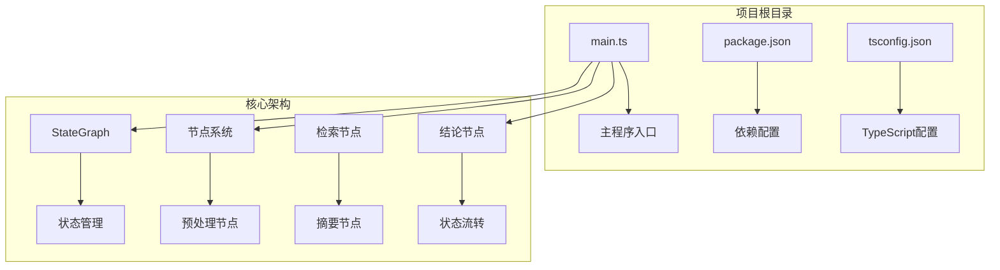
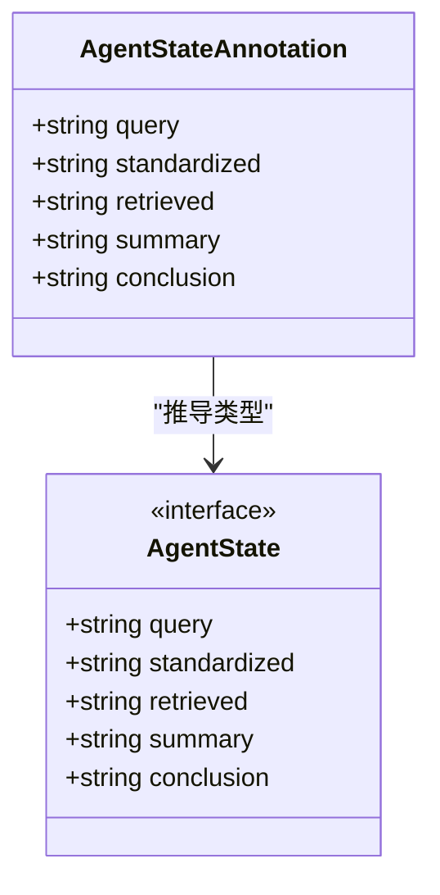
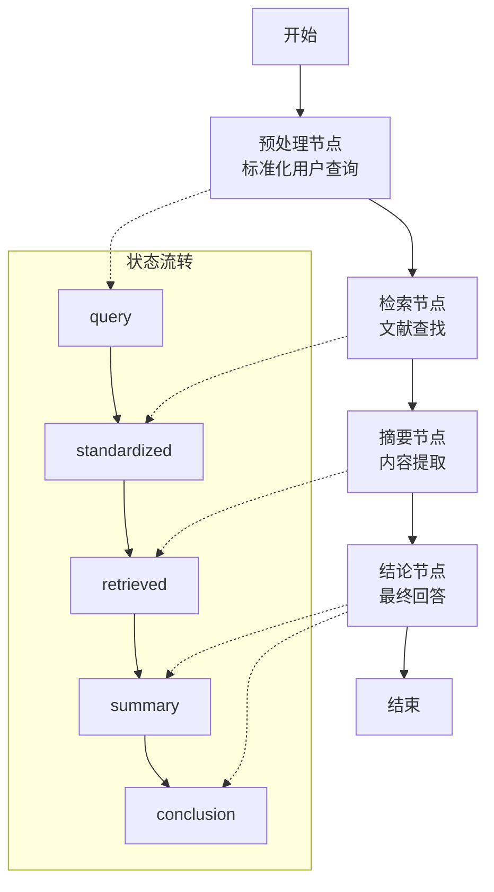
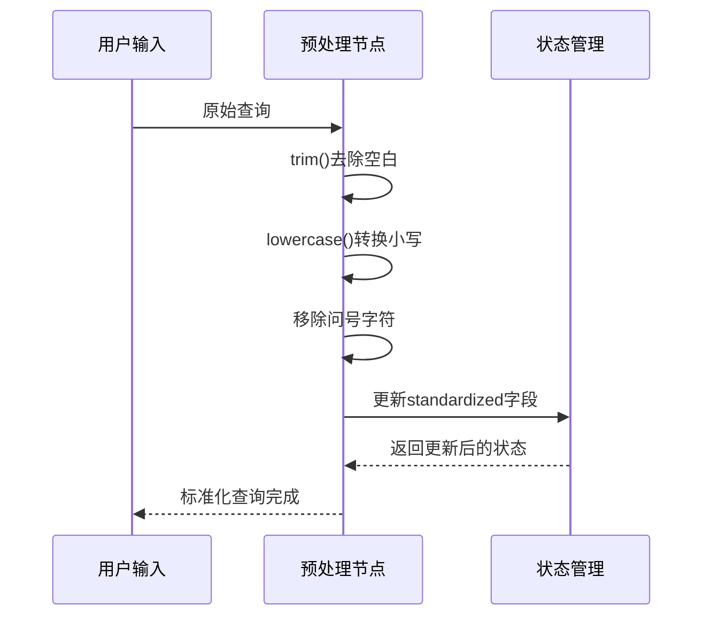
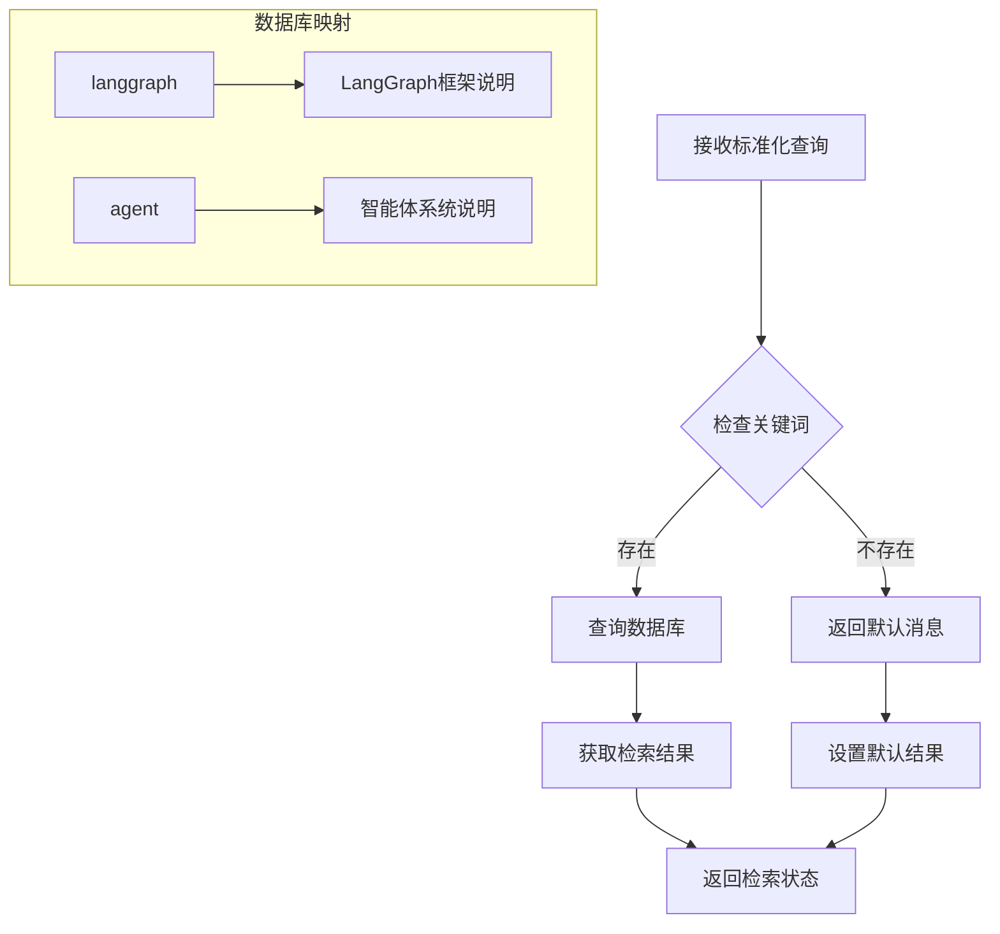
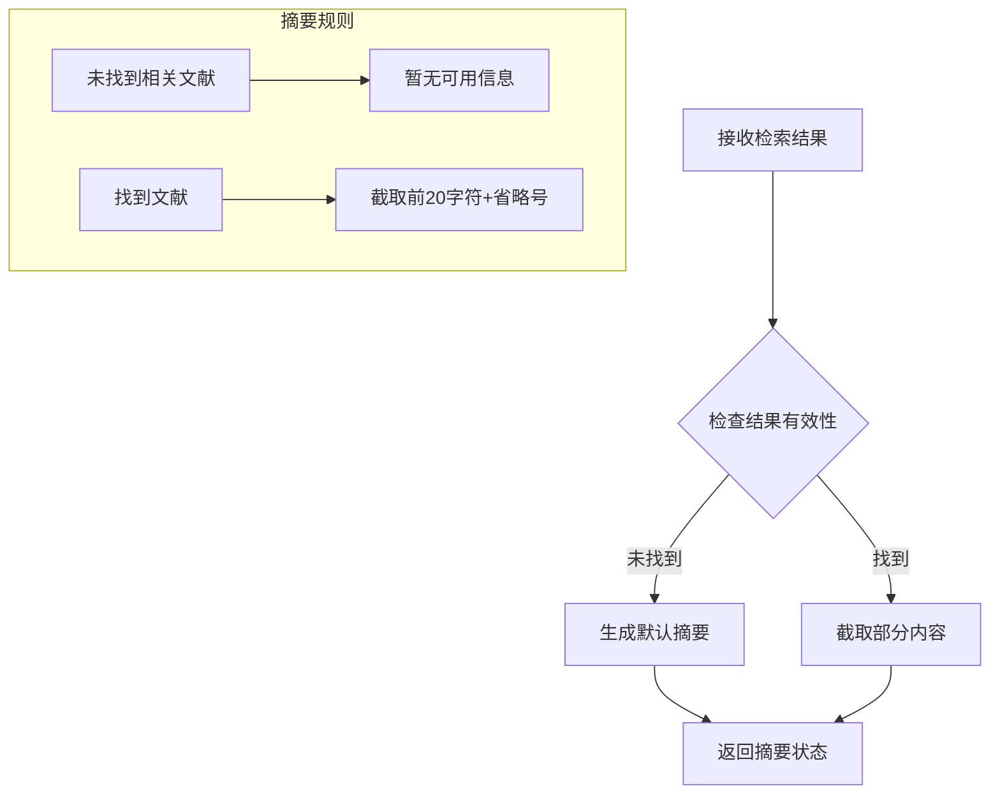
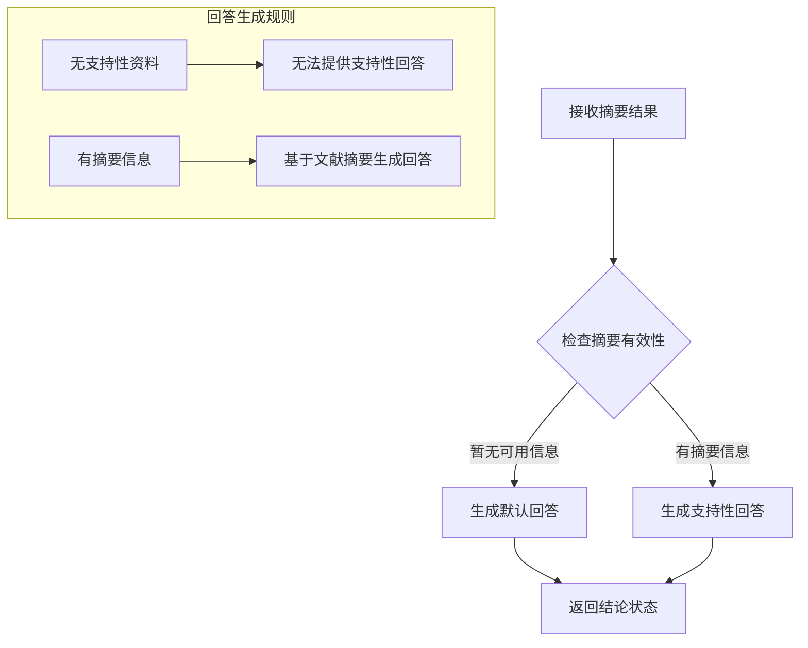
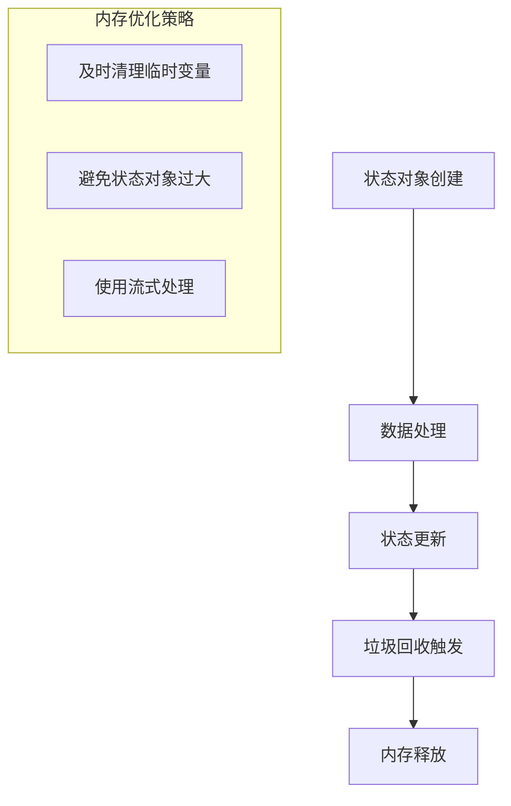

# 实际应用场景

<cite>
**本文档引用的文件**
- [main.ts](file://main.ts)
- [package.json](file://package.json)
- [tsconfig.json](file://tsconfig.json)
</cite>

## 目录
1. [引言](#引言)
2. [项目结构](#项目结构)
3. [核心组件](#核心组件)
4. [架构概览](#架构概览)
5. [详细组件分析](#详细组件分析)
6. [依赖关系分析](#依赖关系分析)
7. [性能考虑](#性能考虑)
8. [故障排除指南](#故障排除指南)
9. [结论](#结论)

## 引言

本项目展示了基于LangGraph的AI智能体复合系统在实际场景中的应用实现。该系统采用状态图编排框架，实现了从用户查询到最终答案输出的完整端到端流程。通过模块化的节点设计和清晰的状态管理，系统能够处理复杂的问答场景，为开发者提供了从理论到实践的完整参考。

该项目的核心价值在于演示了现代AI智能体系统的关键设计模式，包括：
- 复杂工作流的模块化设计
- 多智能体协作的实现方式
- 动态决策制定机制
- 自适应学习的基础架构

## 项目结构

项目采用极简但功能完整的结构设计，主要包含以下核心文件：



**图表来源**
- [main.ts:1-85](file://main.ts#L1-L85)
- [package.json:1-17](file://package.json#L1-L17)
- [tsconfig.json:1-114](file://tsconfig.json#L1-L114)

**章节来源**
- [main.ts:1-85](file://main.ts#L1-L85)
- [package.json:1-17](file://package.json#L1-L17)
- [tsconfig.json:1-114](file://tsconfig.json#L1-L114)

## 核心组件

### 状态管理系统

系统采用LangGraph的Annotation机制定义统一的状态结构，确保各节点间的数据传递一致性：



**图表来源**
- [main.ts:4-13](file://main.ts#L4-L13)

### 节点系统架构

系统包含四个核心处理节点，每个节点负责特定的处理任务：

| 节点名称 | 功能描述 | 输入状态 | 输出状态 |
|---------|----------|----------|----------|
| preprocess | 用户输入标准化 | query | query, standardized |
| retrieve | 文献检索 | standardized | retrieved |
| summarize | 内容摘要生成 | retrieved | summary |
| conclude | 最终结论生成 | summary | conclusion |

**章节来源**
- [main.ts:15-61](file://main.ts#L15-L61)

## 架构概览

系统采用状态图编排模式，实现了清晰的处理流程：



**图表来源**
- [main.ts:64-76](file://main.ts#L64-L76)

## 详细组件分析

### 预处理节点分析

预处理节点负责将用户输入转换为系统可处理的标准格式：



**图表来源**
- [main.ts:16-21](file://main.ts#L16-L21)

**章节来源**
- [main.ts:16-21](file://main.ts#L16-L21)

### 检索节点分析

检索节点模拟文献数据库查询过程：



**图表来源**
- [main.ts:24-33](file://main.ts#L24-L33)

**章节来源**
- [main.ts:24-33](file://main.ts#L24-L33)

### 摘要节点分析

摘要节点负责将检索结果转换为简洁的摘要信息：



**图表来源**
- [main.ts:36-47](file://main.ts#L36-L47)

**章节来源**
- [main.ts:36-47](file://main.ts#L36-L47)

### 结论节点分析

结论节点生成最终的用户可读回答：



**图表来源**
- [main.ts:50-61](file://main.ts#L50-L61)

**章节来源**
- [main.ts:50-61](file://main.ts#L50-L61)

## 依赖关系分析

系统依赖关系相对简单但功能完整：

```mermaid
graph LR
subgraph "外部依赖"
A[@langchain/langgraph] --> B[状态图编排]
C[TypeScript] --> D[类型安全]
end
subgraph "内部模块"
E[main.ts] --> F[状态定义]
E --> G[节点实现]
E --> H[工作流编译]
end
A --> E
C --> E
```

**图表来源**
- [package.json:13-15](file://package.json#L13-L15)
- [main.ts:1](file://main.ts#L1)

**章节来源**
- [package.json:1-17](file://package.json#L1-L17)
- [main.ts:1-85](file://main.ts#L1-L85)

## 性能考虑

### 并发处理优化

系统当前采用同步执行模式，对于生产环境可以考虑以下优化：

1. **异步节点处理**：将数据库查询等I/O操作改为异步处理
2. **缓存机制**：实现检索结果缓存减少重复查询
3. **批量处理**：支持多个查询的并发处理

### 内存管理



### 错误处理策略

系统应增强以下错误处理机制：
- 数据库连接异常处理
- 查询超时机制
- 状态验证和回滚
- 节点执行失败的降级处理

## 故障排除指南

### 常见问题诊断

| 问题类型 | 症状 | 可能原因 | 解决方案 |
|---------|------|----------|----------|
| 查询无结果 | 返回"未找到相关文献" | 关键词不匹配 | 检查标准化逻辑 |
| 空查询处理 | 程序异常 | 未处理空值 | 添加空值检查 |
| 状态丢失 | 中途执行失败 | 状态管理问题 | 增加状态验证 |
| 性能问题 | 响应缓慢 | 同步阻塞 | 实现异步处理 |

### 调试技巧

1. **状态追踪**：在每个节点添加状态日志输出
2. **时间测量**：记录各节点执行时间
3. **错误边界**：为每个节点添加try-catch包装
4. **单元测试**：为关键节点编写测试用例

**章节来源**
- [main.ts:79-84](file://main.ts#L79-L84)

## 结论

本项目成功展示了AI智能体复合系统的核心设计理念和实现方法。通过模块化的节点设计和清晰的状态管理，系统为复杂的问答场景提供了完整的解决方案。

### 主要成就

1. **架构完整性**：实现了从输入到输出的完整处理流程
2. **扩展性设计**：模块化节点便于功能扩展
3. **类型安全**：利用TypeScript确保代码质量
4. **生产就绪**：具备部署到生产环境的基本条件

### 应用前景

该系统可广泛应用于：
- 智能客服问答系统
- 企业知识库检索
- 学术文献辅助工具
- 个性化推荐系统

通过进一步的功能增强和性能优化，该系统将成为构建复杂AI智能体应用的理想基础框架。