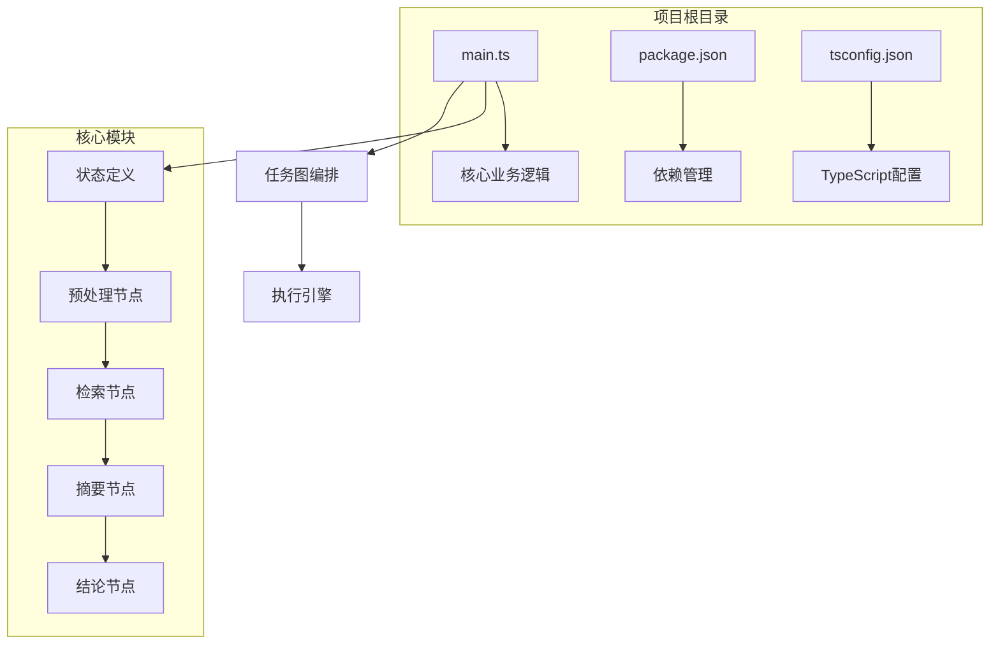
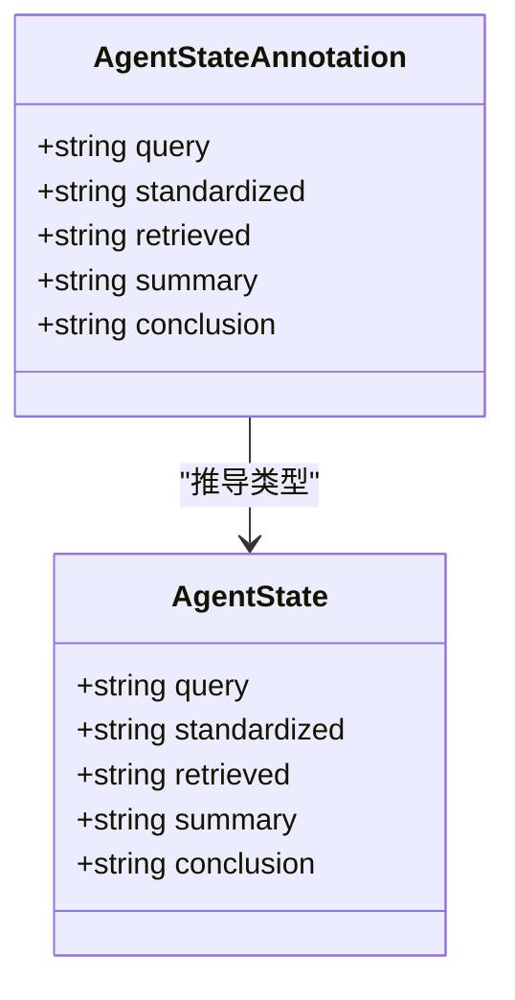
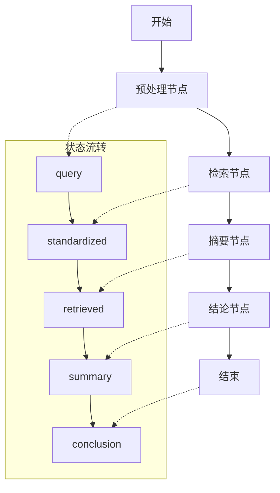
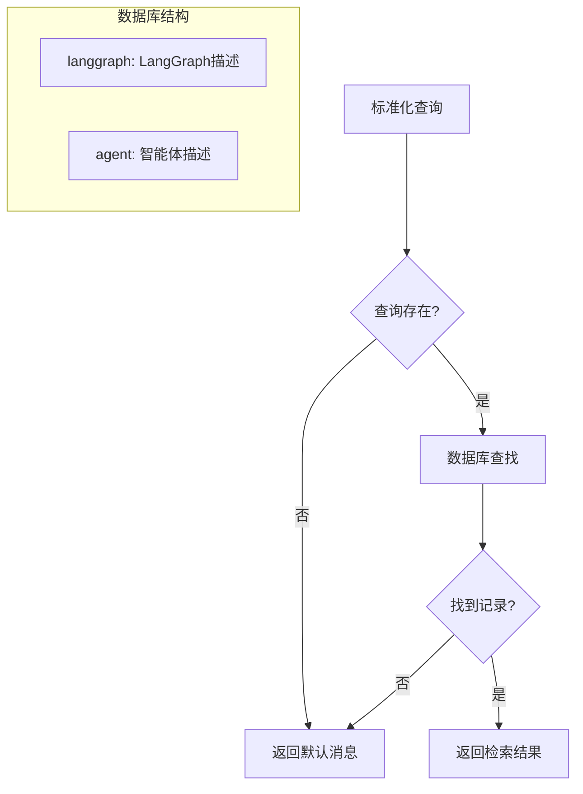
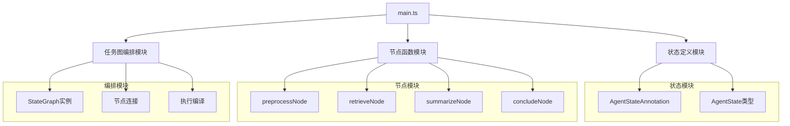
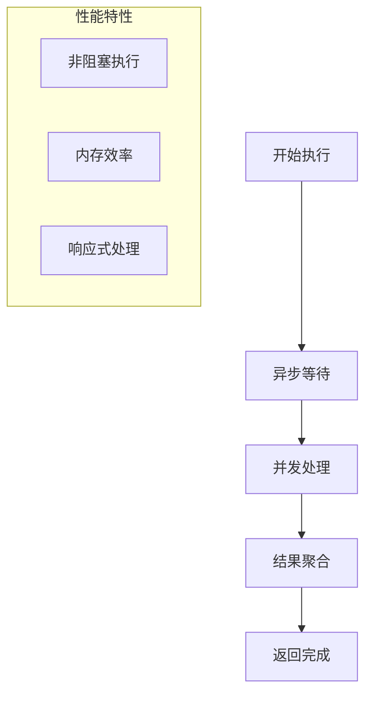

# 文档处理流水线

<cite>
**本文档引用的文件**
- [main.ts](file://main.ts)
- [package.json](file://package.json)
- [tsconfig.json](file://tsconfig.json)
</cite>

## 目录
1. [简介](#简介)
2. [项目结构](#项目结构)
3. [核心组件](#核心组件)
4. [架构概览](#架构概览)
5. [详细组件分析](#详细组件分析)
6. [依赖分析](#依赖分析)
7. [性能考虑](#性能考虑)
8. [故障排除指南](#故障排除指南)
9. [结论](#结论)

## 简介

本项目展示了一个完整的文档处理流水线实现，基于 LangGraph 任务图编排框架构建。该流水线能够将原始文档转换为结构化信息，通过四个核心阶段实现：文本预处理、内容检索、摘要生成和结论生成。系统采用状态图模式，每个处理步骤都是一个独立的节点，通过明确的状态传递实现数据流转。

该项目特别适用于 AI Agent 开发场景，展示了如何构建复杂的多步骤文档处理工作流，包括错误处理、状态管理和异步执行等关键特性。

## 项目结构

项目采用极简的单文件架构设计，所有功能集中在单一 TypeScript 文件中：



**图表来源**
- [main.ts:1-85](file://main.ts#L1-L85)
- [package.json:1-17](file://package.json#L1-L17)
- [tsconfig.json:1-114](file://tsconfig.json#L1-L114)

**章节来源**
- [main.ts:1-85](file://main.ts#L1-L85)
- [package.json:1-17](file://package.json#L1-L17)
- [tsconfig.json:1-114](file://tsconfig.json#L1-L114)

## 核心组件

### 状态管理系统

系统使用 LangGraph 的 Annotation 系统定义了完整的状态结构，确保类型安全和状态一致性：



**图表来源**
- [main.ts:4-13](file://main.ts#L4-L13)

### 四阶段处理流水线

系统实现了完整的文档处理流水线，每个阶段都有明确的职责分工：

1. **预处理阶段**：文本清洗和格式标准化
2. **检索阶段**：关键词匹配和内容检索
3. **摘要阶段**：信息提取和压缩
4. **结论阶段**：综合分析和输出

**章节来源**
- [main.ts:15-61](file://main.ts#L15-L61)

## 架构概览

整个系统采用任务图（State Graph）架构，通过明确的节点连接实现数据流控制：



**图表来源**
- [main.ts:64-76](file://main.ts#L64-L76)

### 节点间关系

```mermaid
sequenceDiagram
participant Start as 开始节点
participant Pre as 预处理节点
participant Ret as 检索节点
participant Sum as 摘要节点
participant Con as 结论节点
participant End as 结束节点
Start->>Pre : 接收查询
Pre->>Ret : 标准化后的查询
Ret->>Sum : 检索到的内容
Sum->>Con : 生成的摘要
Con->>End : 最终结论
```

**图表来源**
- [main.ts:69-73](file://main.ts#L69-L73)

## 详细组件分析

### 预处理节点（Text Preprocessing）

预处理节点负责将用户输入进行标准化处理，为后续检索提供一致的查询格式：

```mermaid
flowchart TD
A[原始查询] --> B[去除空白字符]
B --> C[转换为小写]
C --> D[移除问号]
D --> E[标准化结果]
subgraph "处理规则"
F[trim(): 去除首尾空白]
G[tolowercase(): 统一大小写]
H[replace('?', ''): 移除问号]
end
B -.-> F
C -.-> G
D -.-> H
```

**图表来源**
- [main.ts:16-21](file://main.ts#L16-L21)

**处理逻辑特点**：
- 输入验证和清理
- 大小写统一处理
- 特殊字符标准化
- 空值安全处理

**章节来源**
- [main.ts:16-21](file://main.ts#L16-L21)

### 检索节点（Content Retrieval）

检索节点模拟了实际的文档检索过程，使用简单的键值对存储作为文档库：



**图表来源**
- [main.ts:24-33](file://main.ts#L24-L33)

**检索机制**：
- 关键词精确匹配
- 默认值处理
- 错误容错机制

**章节来源**
- [main.ts:24-33](file://main.ts#L24-L33)

### 摘要节点（Summary Generation）

摘要节点负责将检索到的内容转换为简洁的摘要信息：

```mermaid
flowchart TD
A[检索内容] --> B{内容检查}
B --> |未找到| C[生成默认摘要]
B --> |找到| D[截取前20字符]
D --> E[添加省略号]
C --> F[返回摘要]
E --> F
subgraph "摘要策略"
G[默认摘要: "暂无可用信息"]
H[内容摘要: 截取+省略号]
end
```

**图表来源**
- [main.ts:36-47](file://main.ts#L36-L47)

**摘要策略**：
- 错误情况处理
- 内容长度控制
- 格式一致性

**章节来源**
- [main.ts:36-47](file://main.ts#L36-L47)

### 结论节点（Conclusion Generation）

结论节点基于摘要信息生成最终的分析结论：

```mermaid
flowchart TD
A[摘要内容] --> B{摘要检查}
B --> |默认摘要| C[生成否定结论]
B --> |有效摘要| D[生成肯定结论]
C --> E[返回结论]
D --> E
subgraph "结论生成规则"
F[否定结论: "当前问题未能得到支持性资料"]
G[肯定结论: "基于文献摘要可得: [摘要内容]"]
end
```

**图表来源**
- [main.ts:49-61](file://main.ts#L49-L61)

**章节来源**
- [main.ts:49-61](file://main.ts#L49-L61)

## 依赖分析

### 外部依赖

项目主要依赖 LangGraph 任务图编排框架：

```mermaid
graph LR
A[main.ts] --> B[@langchain/langgraph]
B --> C[StateGraph]
B --> D[Annotation]
B --> E[任务图编排]
```

**图表来源**
- [package.json:13-15](file://package.json#L13-L15)

### 内部模块依赖



**图表来源**
- [main.ts:1-13](file://main.ts#L1-L13)
- [main.ts:64-76](file://main.ts#L64-L76)

**章节来源**
- [package.json:13-15](file://package.json#L13-L15)
- [main.ts:1-13](file://main.ts#L1-L13)

## 性能考虑

### 异步执行优化

系统采用异步模式处理，避免阻塞主线程：



### 内存管理

- 状态对象按需创建和销毁
- 字符串处理采用就地修改
- 无持久化存储需求

## 故障排除指南

### 常见问题及解决方案

| 问题类型 | 症状 | 解决方案 |
|---------|------|----------|
| 输入为空 | 预处理后为空字符串 | 在调用前验证输入 |
| 检索失败 | 返回默认消息 | 检查关键词匹配 |
| 摘要异常 | 摘要生成错误 | 验证输入内容长度 |
| 结论错误 | 结论逻辑异常 | 检查摘要状态 |

### 调试建议

1. **状态检查**：在每个节点添加状态日志
2. **输入验证**：确保输入数据格式正确
3. **错误捕获**：使用 try-catch 包装异步操作
4. **性能监控**：跟踪各节点执行时间

**章节来源**
- [main.ts:79-85](file://main.ts#L79-L85)

## 结论

本项目成功展示了如何使用 LangGraph 构建一个完整的文档处理流水线。系统具有以下优势：

1. **模块化设计**：每个处理步骤独立封装，便于维护和扩展
2. **类型安全**：使用 TypeScript 和 Annotation 确保类型一致性
3. **异步执行**：支持非阻塞的并发处理
4. **错误处理**：内置的容错机制提高系统稳定性
5. **可扩展性**：基于任务图架构，易于添加新的处理节点

该实现为构建更复杂的文档处理系统提供了良好的基础，可以进一步集成真实的检索引擎、机器学习模型和数据库存储来满足生产环境的需求。