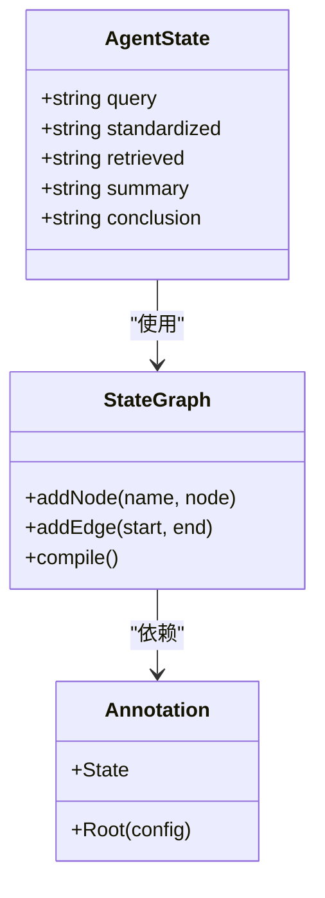
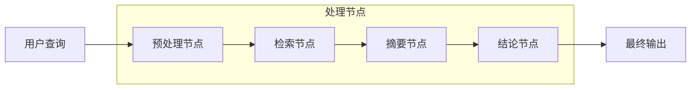
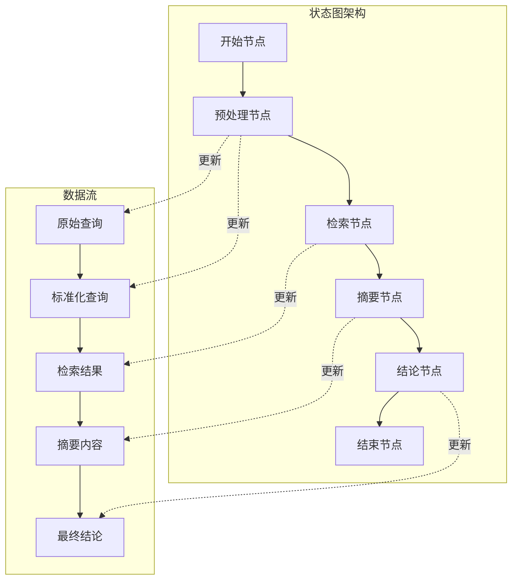
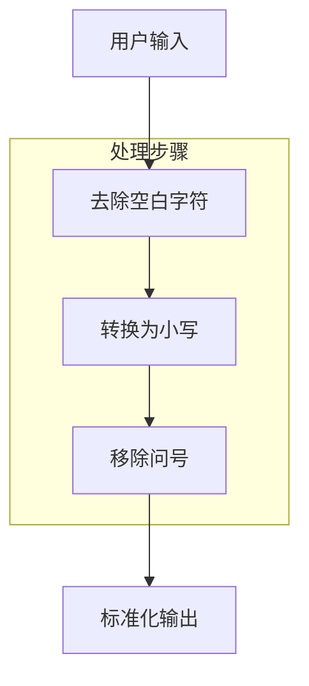
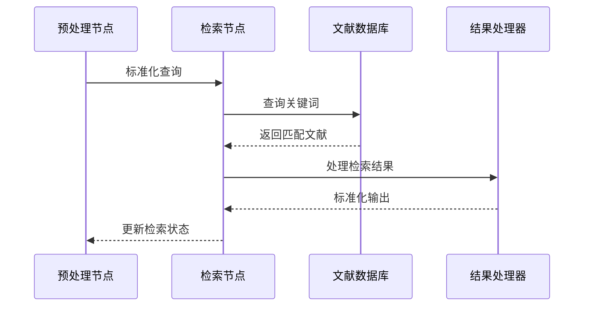
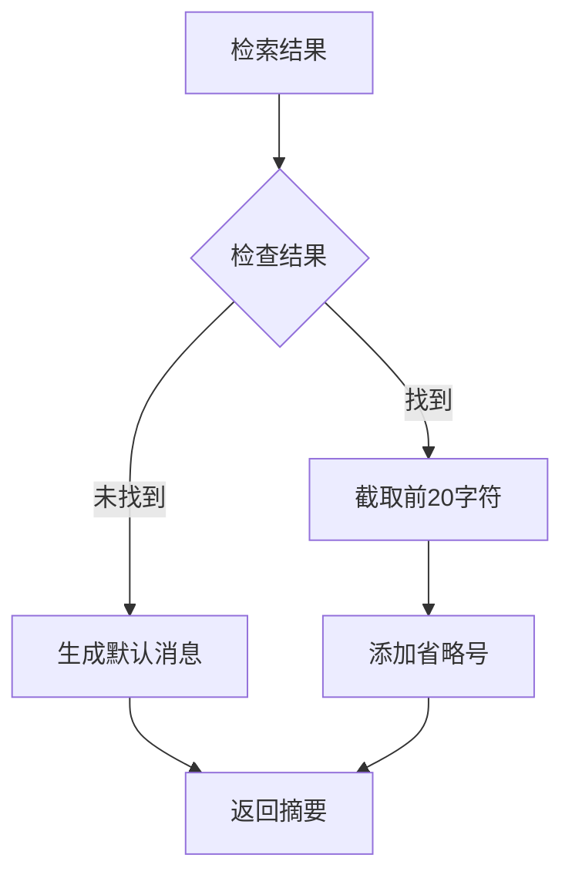
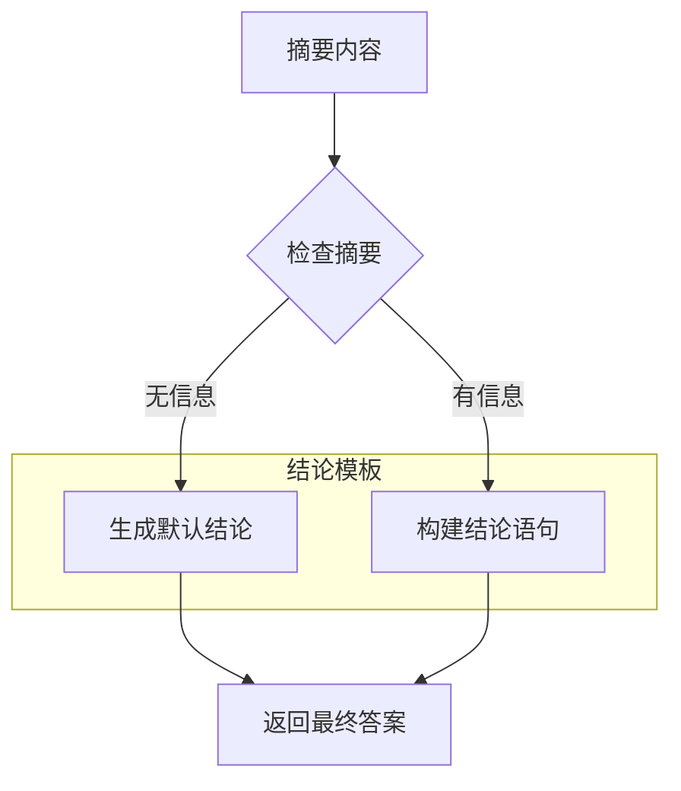

# 问答系统构建

<cite>
**本文档中引用的文件**
- [main.ts](file://main.ts)
- [package.json](file://package.json)
- [tsconfig.json](file://tsconfig.json)
</cite>

## 目录
1. [简介](#简介)
2. [项目结构](#项目结构)
3. [核心组件](#核心组件)
4. [架构概览](#架构概览)
5. [详细组件分析](#详细组件分析)
6. [依赖关系分析](#依赖关系分析)
7. [性能考虑](#性能考虑)
8. [故障排除指南](#故障排除指南)
9. [结论](#结论)

## 简介

本项目展示了如何基于LangGraph框架构建一个完整的智能问答系统。该系统采用状态图编排的方式，实现了从用户查询接收开始的完整问答流程：查询标准化、文献检索、内容摘要和最终结论生成。系统通过四个核心处理节点实现了端到端的问答处理管道，为构建更复杂的智能问答应用提供了坚实的基础架构。

## 项目结构

该项目采用极简的单文件架构设计，主要包含以下核心文件：

```mermaid
graph TB
subgraph "项目根目录"
A[main.ts - 主程序入口]
B[package.json - 项目配置]
C[tsconfig.json - TypeScript配置]
end
subgraph "依赖管理"
D[@langchain/langgraph - 核心框架]
E[TypeScript - 类型支持]
end
A --> D
A --> E
B --> D
```

**图表来源**
- [main.ts:1-85](file://main.ts#L1-L85)
- [package.json:1-17](file://package.json#L1-L17)

**章节来源**
- [main.ts:1-85](file://main.ts#L1-L85)
- [package.json:1-17](file://package.json#L1-L17)
- [tsconfig.json:1-114](file://tsconfig.json#L1-L114)

## 核心组件

### 状态定义与类型系统

系统使用LangGraph的Annotation机制定义了完整的状态结构，确保类型安全和明确的数据流转：



**图表来源**
- [main.ts:4-13](file://main.ts#L4-L13)

系统定义了五个关键状态字段：
- `query`: 原始用户输入
- `standardized`: 标准化后的查询
- `retrieved`: 文献检索结果
- `summary`: 内容摘要
- `conclusion`: 最终结论

**章节来源**
- [main.ts:4-13](file://main.ts#L4-L13)

### 四个核心处理节点

系统实现了完整的问答处理流水线，包含四个独立的处理节点：



**图表来源**
- [main.ts:15-61](file://main.ts#L15-L61)

## 架构概览

整个问答系统采用状态图（State Graph）架构，通过节点间的有序连接实现数据流转：



**图表来源**
- [main.ts:64-76](file://main.ts#L64-L76)

系统的核心优势在于其模块化设计，每个节点都专注于特定的功能，便于扩展和维护。

## 详细组件分析

### 预处理节点（Query Preprocessing）

预处理节点负责将用户输入转换为系统可处理的标准格式：



**图表来源**
- [main.ts:16-21](file://main.ts#L16-L21)

实现特点：
- 输入验证和清理
- 统一大小写处理
- 特殊字符标准化

**章节来源**
- [main.ts:16-21](file://main.ts#L16-L21)

### 检索节点（Document Retrieval）

检索节点模拟文献数据库查询过程：



**图表来源**
- [main.ts:24-33](file://main.ts#L24-L33)

数据库模拟实现：
- 使用简单对象作为内存数据库
- 支持关键词精确匹配
- 提供默认"未找到"处理

**章节来源**
- [main.ts:24-33](file://main.ts#L24-L33)

### 摘要节点（Content Summarization）

摘要节点负责将检索到的长文本转换为简洁的摘要：



**图表来源**
- [main.ts:36-47](file://main.ts#L36-L47)

摘要策略：
- 缺少信息时的优雅降级
- 固定长度截断
- 清晰的省略标识

**章节来源**
- [main.ts:36-47](file://main.ts#L36-L47)

### 结论节点（Conclusion Generation）

结论节点基于摘要生成最终的问答结果：



**图表来源**
- [main.ts:50-61](file://main.ts#L50-L61)

结论生成规则：
- 无可用信息时的诚实反馈
- 有信息时的结构化总结
- 明确的来源标注

**章节来源**
- [main.ts:50-61](file://main.ts#L50-L61)

## 依赖关系分析

### 核心依赖关系

```mermaid
graph TB
subgraph "外部依赖"
A[@langchain/langgraph v1.2.8]
end
subgraph "内部模块"
B[状态定义]
C[节点实现]
D[工作流编译]
end
subgraph "执行环境"
E[TypeScript运行时]
F[Node.js环境]
end
A --> B
B --> C
C --> D
D --> E
E --> F
```

**图表来源**
- [package.json:13-15](file://package.json#L13-L15)
- [main.ts:1-10](file://main.ts#L1-L10)

### 版本兼容性

系统使用了稳定的LangGraph版本，确保了功能的可靠性和向后兼容性。

**章节来源**
- [package.json:13-15](file://package.json#L13-L15)

## 性能考虑

### 当前实现的性能特征

基于当前的简单实现，系统具有以下性能特点：

1. **时间复杂度**：O(n)，其中n为输入字符串长度
2. **空间复杂度**：O(n)，用于存储处理后的状态
3. **响应时间**：毫秒级，适合实时交互场景

### 优化建议

#### 缓存策略
- **查询缓存**：对频繁出现的查询进行缓存
- **结果缓存**：缓存检索和摘要结果
- **会话缓存**：保持多轮对话的状态

#### 并发处理
- **批量处理**：支持多个查询同时处理
- **异步操作**：使用Promise处理非阻塞操作
- **资源池**：复用数据库连接和计算资源

#### 响应时间优化
- **预加载模型**：在启动时加载必要的模型
- **分页检索**：对大量结果进行分页处理
- **增量摘要**：只处理新增内容

## 故障排除指南

### 常见问题及解决方案

#### 状态更新失败
**症状**：节点间状态传递异常
**原因**：返回值不完整或类型不匹配
**解决**：确保每个节点返回完整的状态更新对象

#### 查询处理异常
**症状**：预处理节点抛出错误
**原因**：输入为空或类型不正确
**解决**：添加输入验证和默认值处理

#### 检索结果异常
**症状**：检索节点返回意外结果
**原因**：数据库键值不匹配
**解决**：实现模糊匹配和键值规范化

### 调试技巧

1. **日志记录**：在关键节点添加状态检查点
2. **单元测试**：为每个节点编写独立的测试用例
3. **性能监控**：跟踪各节点的执行时间和内存使用

**章节来源**
- [main.ts:16-61](file://main.ts#L16-L61)

## 结论

本项目成功展示了如何使用LangGraph框架构建一个功能完整的智能问答系统。通过四个精心设计的处理节点，系统实现了从查询标准化到最终结论生成的完整流程。

### 主要成就

1. **模块化架构**：清晰的节点分离使得系统易于理解和扩展
2. **类型安全**：利用TypeScript确保代码质量和开发体验
3. **可扩展性**：基于状态图的设计为复杂功能扩展提供了基础

### 未来发展方向

1. **多轮对话支持**：实现上下文记忆和对话历史管理
2. **个性化回答**：根据用户偏好调整回答风格和内容
3. **增强检索**：集成真正的搜索引擎和知识库
4. **性能优化**：实现缓存、并发和分布式处理
5. **接口扩展**：支持Webhook、WebSocket等实时通信方式

该系统为构建更复杂的智能问答应用奠定了坚实的技术基础，通过持续的迭代和优化，可以满足各种实际应用场景的需求。