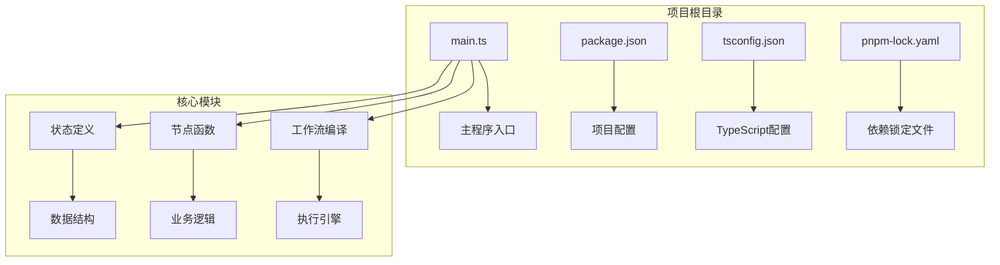
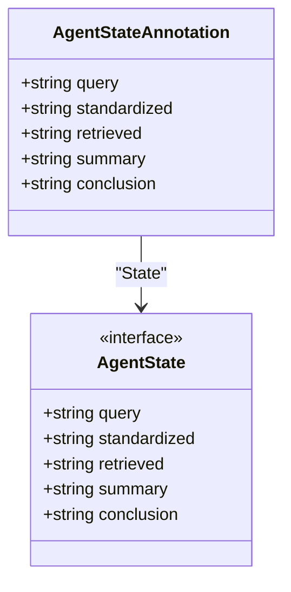
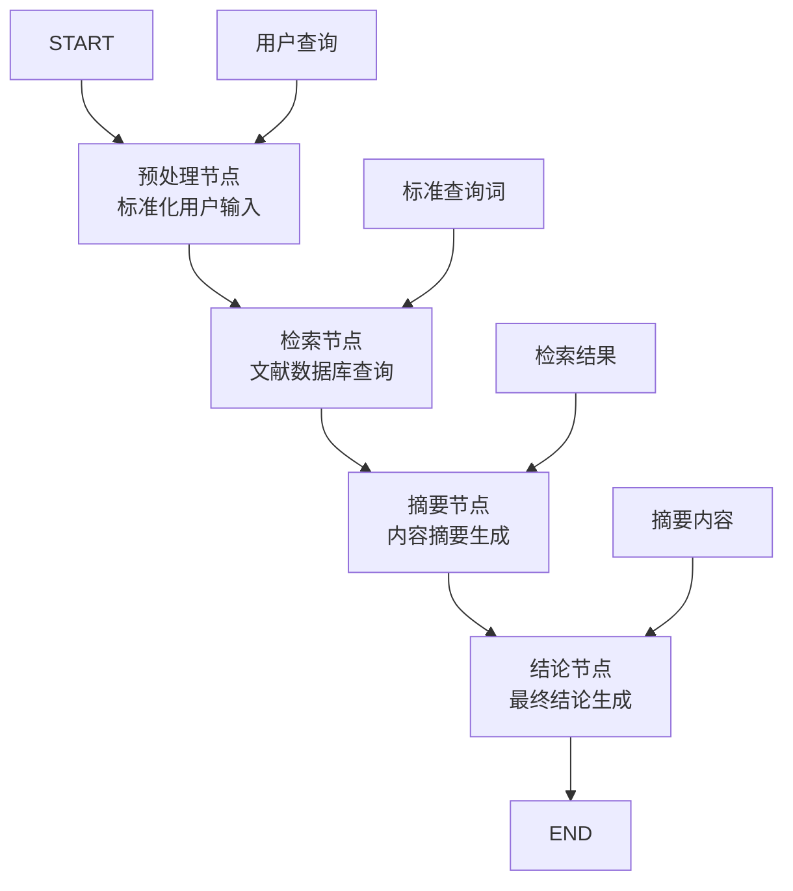
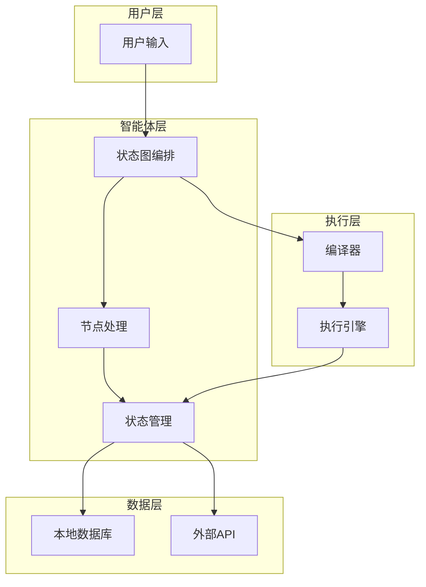
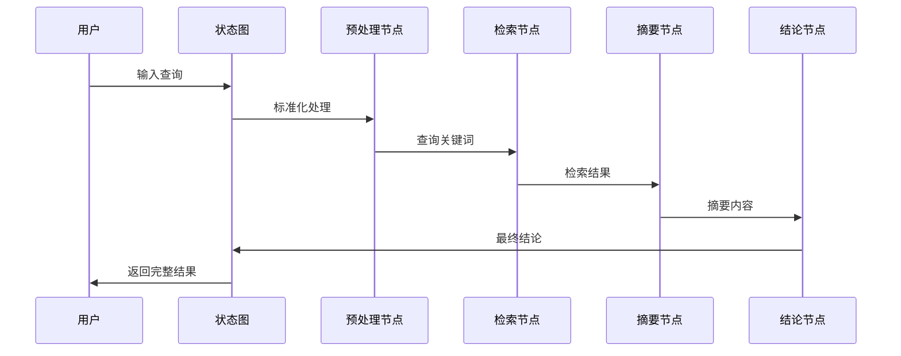

# 快速开始

<cite>
**本文档引用的文件**
- [main.ts](file://main.ts)
- [package.json](file://package.json)
- [tsconfig.json](file://tsconfig.json)
- [pnpm-lock.yaml](file://pnpm-lock.yaml)
</cite>

## 目录
1. [简介](#简介)
2. [项目结构](#项目结构)
3. [环境要求](#环境要求)
4. [安装步骤](#安装步骤)
5. [运行指南](#运行指南)
6. [核心组件分析](#核心组件分析)
7. [架构概览](#架构概览)
8. [故障排除](#故障排除)
9. [总结](#总结)

## 简介

这是一个基于 LangChain LangGraph 的 AI 智能体项目，展示了如何构建一个复合智能体系统。该项目通过状态图（StateGraph）实现多节点协作的智能体工作流程，包括问题标准化、文献检索、摘要生成和结论生成等核心功能模块。

智能体的工作流程采用经典的"预处理-检索-摘要-结论"模式，每个阶段都有明确的职责分工，体现了现代 AI 智能体设计的最佳实践。

## 项目结构

项目采用极简的单文件架构设计，所有核心逻辑都集中在主入口文件中：



**图表来源**
- [main.ts:1-85](file://main.ts#L1-L85)
- [package.json:1-17](file://package.json#L1-L17)
- [tsconfig.json:1-114](file://tsconfig.json#L1-L114)

**章节来源**
- [main.ts:1-85](file://main.ts#L1-L85)
- [package.json:1-17](file://package.json#L1-L17)
- [tsconfig.json:1-114](file://tsconfig.json#L1-L114)

## 环境要求

### Node.js 版本要求

根据依赖锁定文件显示，项目对 Node.js 版本有以下要求：

- **主要依赖要求**: Node.js >= 20
- **LangGraph 要求**: Node.js >= 18
- **其他组件要求**: Node.js >= 16 或 >= 12.17.0

这意味着您需要安装满足最高版本要求的 Node.js，即 **Node.js 20+**。

### 包管理器要求

项目使用 **pnpm** 作为包管理器，版本为 **10.21.0**。pnpm 提供了比 npm 更高效的依赖管理机制，特别适合大型项目。

**章节来源**
- [pnpm-lock.yaml:20-22](file://pnpm-lock.yaml#L20-L22)
- [pnpm-lock.yaml:50-56](file://pnpm-lock.yaml#L50-L56)

## 安装步骤

### 步骤 1：克隆项目

```bash
git clone <项目URL>
cd AI-Agent-Development
```

### 步骤 2：验证 Node.js 版本

```bash
node --version
# 确保输出版本 >= 20.0.0
```

### 步骤 3：安装 pnpm

如果尚未安装 pnpm：
```bash
npm install -g pnpm@10.21.0
```

### 步骤 4：安装项目依赖

```bash
pnpm install
```

### 步骤 5：验证安装

```bash
pnpm list @langchain/langgraph
# 应该显示已安装的版本
```

**章节来源**
- [package.json:12-15](file://package.json#L12-L15)
- [pnpm-lock.yaml:10-13](file://pnpm-lock.yaml#L10-L13)

## 运行指南

### 运行示例代码

项目提供了完整的示例执行流程：

```bash
# 直接运行 TypeScript 文件
pnpm exec tsx main.ts

# 或者先编译再运行
pnpm run build
node dist/main.js
```

### 预期输出结果

当成功运行后，您应该看到类似以下的输出：

```json
{
  "query": "LangGraph?",
  "standardized": "langgraph",
  "retrieved": "LangGraph是一种任务图编排框架,擅长复杂流程管理",
  "summary": "LangGraph是一种任务图编排框架,擅长复杂流程管理...",
  "conclusion": "基于文献摘要可得: LangGraph是一种任务图编排框架,擅长复杂流程管理..."
}
```

### 自定义查询

您可以修改 `main.ts` 中的查询参数来测试不同的输入：

```typescript
// 在 main 函数中修改查询
await graph.invoke({ query: "您的自定义查询?" })
```

**章节来源**
- [main.ts:78-84](file://main.ts#L78-L84)

## 核心组件分析

### 状态定义系统

项目使用 LangGraph 的 `Annotation.Root` 来定义智能体的状态结构：



**图表来源**
- [main.ts:4-13](file://main.ts#L4-L13)

### 工作流节点设计

项目实现了四个核心处理节点，每个节点都有特定的功能：



**图表来源**
- [main.ts:15-61](file://main.ts#L15-L61)
- [main.ts:64-76](file://main.ts#L64-L76)

**章节来源**
- [main.ts:15-61](file://main.ts#L15-L61)

## 架构概览

### 整体架构设计



### 数据流处理



**图表来源**
- [main.ts:64-76](file://main.ts#L64-L76)
- [main.ts:78-84](file://main.ts#L78-L84)

## 故障排除

### 常见环境问题

#### Node.js 版本不兼容

**问题**: `Error: Cannot find module '@langchain/core'`

**解决方案**:
```bash
# 检查 Node.js 版本
node --version

# 如果版本过低，升级到 Node.js 20+
# 然后重新安装依赖
pnpm install --force
```

#### pnpm 版本问题

**问题**: `Error: This version of pnpm requires Node.js X.X.X or higher`

**解决方案**:
```bash
# 升级 pnpm 到指定版本
npm install -g pnpm@10.21.0

# 清理缓存
pnpm store prune
```

#### 依赖安装失败

**问题**: 依赖安装过程中出现网络错误

**解决方案**:
```bash
# 设置淘宝镜像源
pnpm config set registry https://registry.npmmirror.com/

# 清理缓存后重试
pnpm install --frozen-lockfile=false
```

### 运行时错误

#### TypeScript 编译错误

**问题**: `Error: Cannot compile TypeScript`

**解决方案**:
```bash
# 检查 TypeScript 配置
pnpm exec tsc --noEmit

# 更新 TypeScript 版本
pnpm add typescript@latest --save-dev
```

#### 内存不足错误

**问题**: `FATAL ERROR: Reached heap limit`

**解决方案**:
```bash
# 增加 Node.js 内存限制
export NODE_OPTIONS="--max-old-space-size=4096"
pnpm exec tsx main.ts
```

### 调试技巧

#### 启用详细日志

在 `main.ts` 中添加调试信息：

```typescript
// 在关键节点添加日志
function preprocessNode(state: AgentState): Partial<AgentState> {
  console.log('预处理节点输入:', state);
  // ... 处理逻辑
  console.log('预处理节点输出:', result);
  return result;
}
```

#### 验证依赖完整性

```bash
# 检查依赖树
pnpm ls @langchain/langgraph

# 验证锁文件
pnpm verify-store-integrity
```

**章节来源**
- [pnpm-lock.yaml:20-22](file://pnpm-lock.yaml#L20-L22)
- [pnpm-lock.yaml:50-56](file://pnpm-lock.yaml#L50-L56)

## 总结

这个 AI 智能体项目为开发者提供了一个完整的入门示例，展示了现代智能体系统的构建方法。通过 30 分钟的时间，您应该能够：

1. **环境搭建**: 成功安装 Node.js 20+ 和 pnpm 10.21.0
2. **项目运行**: 成功运行示例代码并观察输出结果
3. **理解原理**: 掌握智能体状态图的基本概念和工作流程
4. **扩展开发**: 基于现有架构进行功能扩展和定制

### 下一步建议

- 尝试修改查询关键词来测试不同场景
- 扩展检索节点以集成真实的数据库或 API
- 添加更多的处理节点来增强智能体能力
- 学习 LangGraph 的高级特性如检查点、并行处理等

这个项目为构建更复杂的 AI 智能体系统奠定了坚实的基础，是学习现代智能体开发技术的优秀起点。