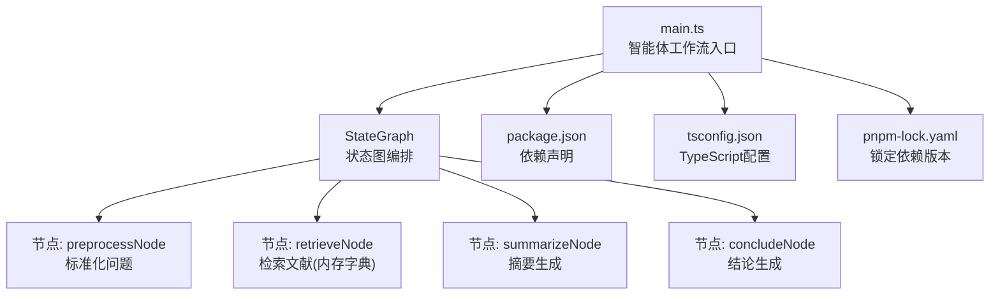
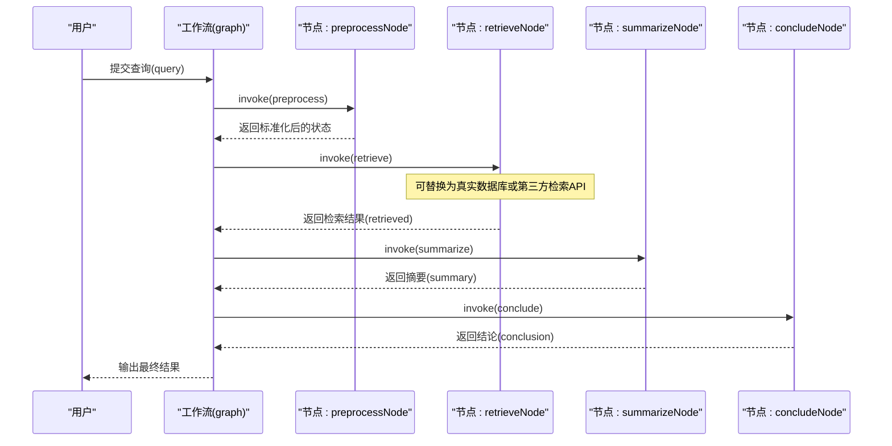
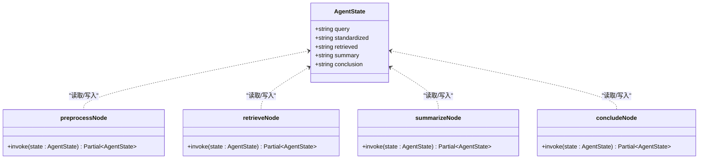
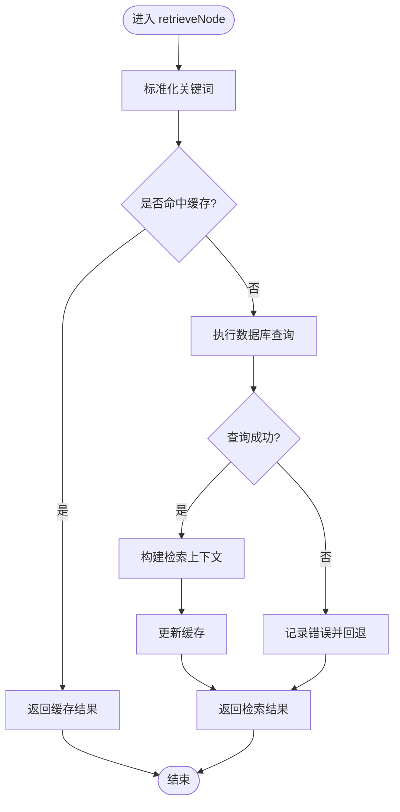
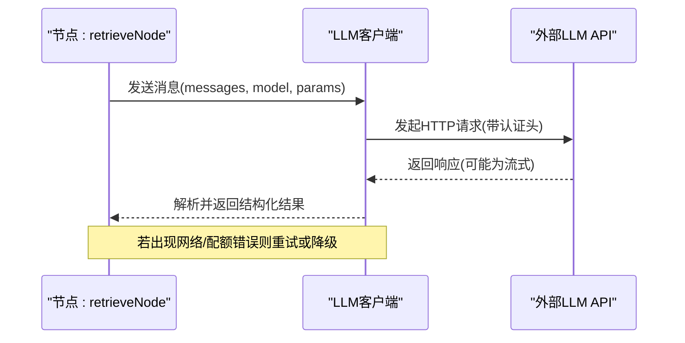
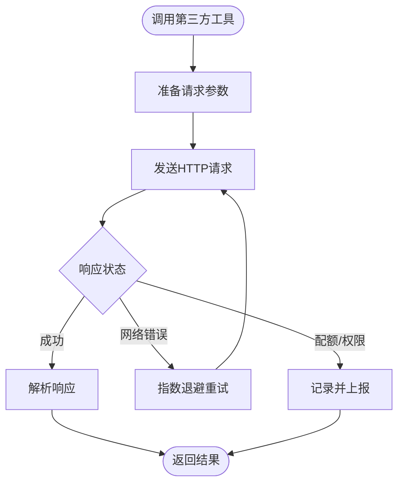
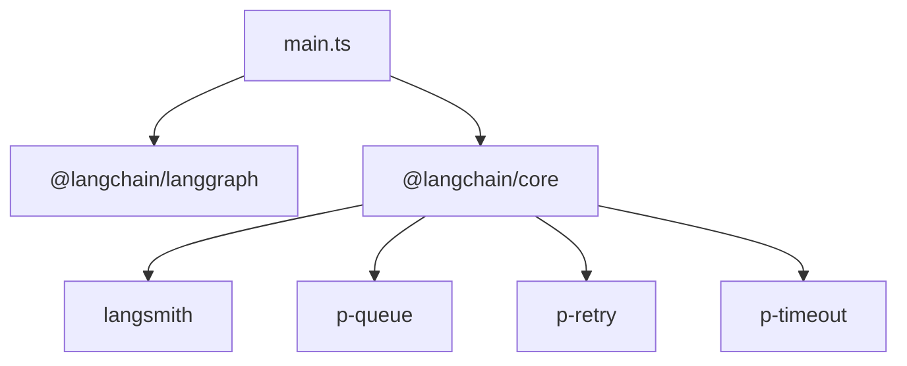

# 外部服务集成

<cite>
**本文引用的文件**
- [main.ts](file://main.ts)
- [package.json](file://package.json)
- [tsconfig.json](file://tsconfig.json)
- [pnpm-lock.yaml](file://pnpm-lock.yaml)
</cite>

## 目录
1. [简介](#简介)
2. [项目结构](#项目结构)
3. [核心组件](#核心组件)
4. [架构总览](#架构总览)
5. [详细组件分析](#详细组件分析)
6. [依赖关系分析](#依赖关系分析)
7. [性能考量](#性能考量)
8. [故障排查指南](#故障排查指南)
9. [结论](#结论)
10. [附录](#附录)

## 简介
本指南围绕“外部服务集成”的主题，结合仓库中的智能体工作流与LangGraph框架，系统讲解如何将真实AI服务、数据库与第三方工具接入智能体系统。文档覆盖以下关键点：
- 大语言模型API的集成方法：认证、请求格式与响应处理
- 数据库连接与查询优化策略：多数据库类型集成示例
- 第三方工具API的封装与调用模式：错误重试、超时处理与限流控制
- 安全考虑与最佳实践：敏感数据保护、API密钥管理与访问控制
- 完整集成案例：从需求分析到代码实现的全流程

## 项目结构
本仓库包含一个最小可运行的智能体工作流示例，展示了LangGraph的状态图编排能力，并在检索节点中以内存字典模拟数据库查询。该结构为后续接入真实外部服务提供了清晰的扩展路径。

图表来源
- [main.ts:1-85](file://main.ts#L1-L85)
- [package.json:1-17](file://package.json#L1-L17)
- [tsconfig.json:1-114](file://tsconfig.json#L1-L114)
- [pnpm-lock.yaml:1-295](file://pnpm-lock.yaml#L1-L295)

章节来源
- [main.ts:1-85](file://main.ts#L1-L85)
- [package.json:1-17](file://package.json#L1-L17)
- [tsconfig.json:1-114](file://tsconfig.json#L1-L114)
- [pnpm-lock.yaml:1-295](file://pnpm-lock.yaml#L1-L295)

## 核心组件
- 状态定义与类型推导：通过 LangGraph 的 Annotation 定义状态字段，确保类型安全与可维护性。
- 工作流构建：使用 StateGraph 链式添加节点与边，形成线性处理流水线。
- 节点函数：每个节点负责特定阶段的任务，如标准化、检索、摘要与结论生成。
- 执行器：编译后的工作流可通过 invoke 触发执行，返回最终状态结果。

章节来源
- [main.ts:3-13](file://main.ts#L3-L13)
- [main.ts:64-76](file://main.ts#L64-L76)
- [main.ts:79-84](file://main.ts#L79-L84)

## 架构总览
下图展示了从用户输入到最终结论输出的端到端流程，以及可替换为真实外部服务的位置。

图表来源
- [main.ts:64-84](file://main.ts#L64-L84)

## 详细组件分析

### 组件A：状态与节点设计
- 状态注解：使用 Annotation.Root 定义 query、standardized、retrieved、summary、conclusion 字段，便于在各节点间传递与累积信息。
- 类型推导：通过 typeof Annotation.Root(...) 推导出 AgentState 类型，保证类型安全。
- 节点职责：
  - preprocessNode：清洗与标准化用户输入
  - retrieveNode：检索文献（当前使用内存字典，可替换为真实数据库或API）
  - summarizeNode：对检索结果进行摘要生成
  - concludeNode：基于摘要生成最终结论

图表来源
- [main.ts:4-13](file://main.ts#L4-L13)
- [main.ts:16-21](file://main.ts#L16-L21)
- [main.ts:24-33](file://main.ts#L24-L33)
- [main.ts:36-47](file://main.ts#L36-L47)
- [main.ts:50-61](file://main.ts#L50-L61)

章节来源
- [main.ts:4-13](file://main.ts#L4-L13)
- [main.ts:16-21](file://main.ts#L16-L21)
- [main.ts:24-33](file://main.ts#L24-L33)
- [main.ts:36-47](file://main.ts#L36-L47)
- [main.ts:50-61](file://main.ts#L50-L61)

### 组件B：数据库集成（内存字典到真实数据库）
- 当前实现：retrieveNode 使用内存字典作为“数据库”，根据关键词匹配返回结果。
- 扩展建议：
  - 关系型数据库（如 PostgreSQL/MySQL）：使用连接池、参数化查询、分页与索引优化；在节点中封装连接与事务。
  - 文档数据库（如 MongoDB）：使用聚合管道优化检索，结合全文索引提升关键词匹配效率。
  - 向量数据库（如 Pinecone/Weaviate）：先对问题向量化，再执行相似度检索，最后拼接上下文供LLM总结。
  - 缓存层（Redis/Memcached）：对高频检索结果进行缓存，降低数据库压力。

图表来源
- [main.ts:24-33](file://main.ts#L24-L33)

章节来源
- [main.ts:24-33](file://main.ts#L24-L33)

### 组件C：大语言模型API集成
- 认证与密钥管理：
  - 将API密钥存储在环境变量中，避免硬编码；在生产环境中使用密钥轮换与最小权限原则。
  - 对于多供应商（OpenAI、Anthropic、Groq等），统一抽象客户端工厂，按配置选择具体实现。
- 请求格式与响应处理：
  - 统一封装请求体（messages、model、temperature、max_tokens等），并处理流式与非流式两种响应。
  - 对响应进行结构化解析，提取必要字段（如content、usage），并记录日志与指标。
- 错误重试与超时：
  - 基于指数退避与抖动的重试策略，区分网络错误与业务错误；对429/5xx进行重试，对401/403直接失败。
  - 设置合理的超时时间（连接超时、读取超时），并在超时发生时快速失败并记录。
- 限流控制：
  - 依据供应商配额与速率限制，采用令牌桶或漏桶算法进行限流；在节点中引入队列与并发控制。

图表来源
- [main.ts:24-33](file://main.ts#L24-L33)

章节来源
- [main.ts:24-33](file://main.ts#L24-L33)

### 组件D：第三方工具API封装与调用模式
- 封装策略：
  - 抽象统一接口（如 search、translate、weather），在节点中以函数形式调用，隐藏底层差异。
  - 对外暴露统一的错误码与异常类型，便于上层统一处理。
- 错误重试与超时：
  - 使用 p-retry 与 p-timeout 实现可靠调用；对网络错误启用自动重试。
- 限流控制：
  - 依据第三方API配额，设置并发上限与队列长度；必要时引入本地缓存减少调用次数。

图表来源
- [pnpm-lock.yaml:138-148](file://pnpm-lock.yaml#L138-L148)
- [pnpm-lock.yaml:275-277](file://pnpm-lock.yaml#L275-L277)

章节来源
- [pnpm-lock.yaml:138-148](file://pnpm-lock.yaml#L138-L148)
- [pnpm-lock.yaml:275-277](file://pnpm-lock.yaml#L275-L277)

### 组件E：安全考虑与最佳实践
- 敏感数据保护：
  - 不在日志中打印API密钥与明文密码；对数据库连接串与令牌进行脱敏。
  - 使用HTTPS与TLS 1.3，确保传输安全。
- API密钥管理：
  - 使用环境变量或密钥管理服务（如Vault、KMS）；定期轮换密钥并撤销旧密钥。
- 访问控制：
  - 在网关层实施IP白名单与速率限制；对内部服务使用服务账户与最小权限原则。
- 输入验证与输出过滤：
  - 对用户输入进行严格校验与清理，防止注入攻击；对LLM输出进行合规检查与过滤。

章节来源
- [package.json:13-15](file://package.json#L13-L15)

## 依赖关系分析
- LangGraph：提供状态图编排能力，节点间通过状态传递实现流水线。
- LangSmith：用于可观测性与追踪，便于监控与调试。
- p-queue/p-retry/p-timeout：提供并发队列、重试与超时控制，保障外部调用的可靠性。

图表来源
- [main.ts:1](file://main.ts#L1)
- [pnpm-lock.yaml:20-218](file://pnpm-lock.yaml#L20-L218)

章节来源
- [pnpm-lock.yaml:20-218](file://pnpm-lock.yaml#L20-L218)

## 性能考量
- 并发与队列：使用 p-queue 控制外部调用并发度，避免触发第三方限流。
- 超时与重试：合理设置超时与重试策略，平衡成功率与延迟。
- 缓存与预热：对热点数据与常用查询建立缓存，减少重复调用。
- 日志与指标：通过 LangSmith 记录调用耗时、错误率与吞吐，持续优化。

## 故障排查指南
- 常见错误与处理：
  - 网络错误：检查超时与重试配置，确认代理与防火墙设置。
  - 配额/权限：核对API密钥与配额，必要时升级套餐或申请临时额度。
  - 响应解析：捕获并记录原始响应，定位格式不一致问题。
- 调试工具：
  - 使用 LangSmith 进行端到端追踪，定位瓶颈与异常。
  - 在节点中增加细粒度日志，记录输入、输出与中间状态。

章节来源
- [pnpm-lock.yaml:95-97](file://pnpm-lock.yaml#L95-L97)
- [pnpm-lock.yaml:138-148](file://pnpm-lock.yaml#L138-L148)
- [pnpm-lock.yaml:275-277](file://pnpm-lock.yaml#L275-L277)

## 结论
本仓库以最小实现展示了智能体工作流的编排思路，retrieveNode 是接入真实外部服务的关键扩展点。通过统一的节点接口与可靠的外部服务封装（认证、请求格式、响应处理、重试、超时、限流），可以平滑地将数据库与第三方工具集成到智能体系统中。配合LangSmith与严格的安全部署实践，能够构建高可用、可观测且安全的智能体平台。

## 附录
- 需求分析到代码实现的完整案例（概念性流程）：
  - 明确目标：确定需要接入的外部服务类型（LLM、数据库、第三方工具）
  - 设计接口：抽象统一的客户端与节点函数
  - 实现与测试：编写节点函数，加入重试与超时，进行单元与集成测试
  - 部署与监控：配置密钥与环境变量，启用LangSmith追踪，上线观察与优化