# 工作流优化

<cite>
**本文档引用的文件**
- [main.ts](file://main.ts)
- [package.json](file://package.json)
- [tsconfig.json](file://tsconfig.json)
</cite>

## 目录
1. [简介](#简介)
2. [项目结构](#项目结构)
3. [核心组件](#核心组件)
4. [架构概览](#架构概览)
5. [详细组件分析](#详细组件分析)
6. [工作流优化技术](#工作流优化技术)
7. [性能优化策略](#性能优化策略)
8. [调试与监控](#调试与监控)
9. [实际优化案例](#实际优化案例)
10. [故障排除指南](#故障排除指南)
11. [结论](#结论)

## 简介

本指南专注于基于 LangChain LangGraph 的工作流优化技术，涵盖条件分支、循环处理和并行执行的实现方法。通过分析实际的智能体工作流实现，详细介绍如何使用 StateGraph 构建复杂的执行路径，包括条件判断、动态路由和异常处理机制。同时提供性能优化技巧，如缓存策略、并发控制和资源管理，并通过实际案例展示如何将线性工作流转换为网状结构，实现更灵活的智能体行为。

## 项目结构

该项目采用简洁的单文件架构，专注于工作流优化的核心概念演示：

```mermaid
graph TB
subgraph "项目根目录"
main_ts[main.ts<br/>主程序入口]
package_json[package.json<br/>项目配置]
tsconfig_json[tsconfig.json<br/>TypeScript配置]
end
subgraph "依赖管理"
langgraph[@langchain/langgraph<br/>工作流引擎]
end
main_ts --> langgraph
package_json --> langgraph
```

**图表来源**
- [main.ts:1-85](file://main.ts#L1-L85)
- [package.json:13-15](file://package.json#L13-L15)

**章节来源**
- [main.ts:1-85](file://main.ts#L1-L85)
- [package.json:1-17](file://package.json#L1-L17)
- [tsconfig.json:1-114](file://tsconfig.json#L1-L114)

## 核心组件

### 状态定义与类型推导

项目使用 LangGraph 的 Annotation API 来定义强类型的状态结构：

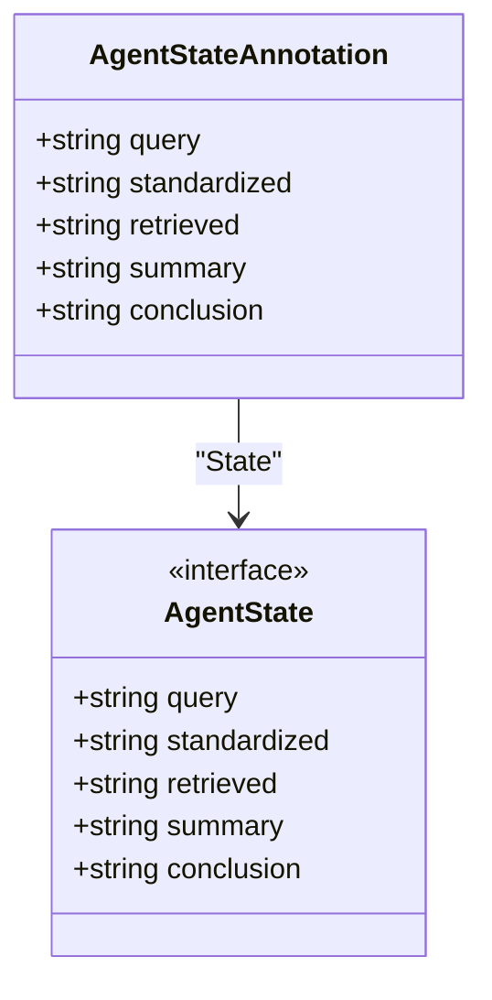
```mermaid
classDiagram
class AgentStateAnnotation {
+string query
+string standardized
+string retrieved
+string summary
+string conclusion
}
class AgentState {
<<interface>>
+string query
+string standardized
+string retrieved
+string summary
+string conclusion
}
AgentStateAnnotation --> AgentState : "State"
```

**图表来源**
- [main.ts:4-13](file://main.ts#L4-L13)

### 工作流节点设计

系统包含四个核心处理节点，每个节点负责特定的业务功能：

| 节点名称 | 功能描述 | 输入状态 | 输出状态 |
|---------|----------|----------|----------|
| preprocess | 用户输入标准化 | query | query, standardized |
| retrieve | 文献检索 | standardized | retrieved |
| summarize | 内容摘要生成 | retrieved | summary |
| conclude | 最终结论生成 | summary | conclusion |

**章节来源**
- [main.ts:15-61](file://main.ts#L15-L61)

## 架构概览

整个工作流采用线性执行模式，通过 StateGraph 实现状态驱动的流程控制：

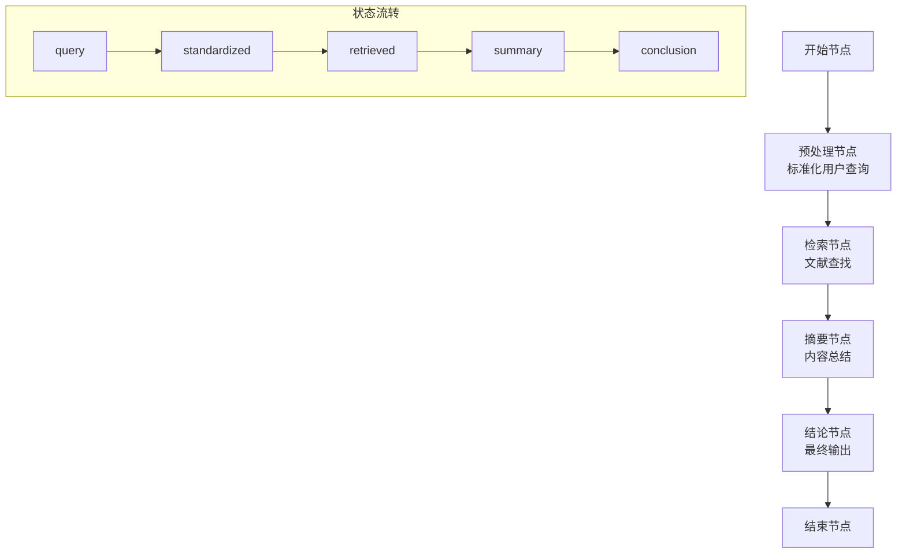
```mermaid
flowchart TD
START["开始节点"] --> PREPROCESS["预处理节点<br/>标准化用户查询"]
PREPROCESS --> RETRIEVE["检索节点<br/>文献查找"]
RETRIEVE --> SUMMARIZE["摘要节点<br/>内容总结"]
SUMMARIZE --> CONCLUDE["结论节点<br/>最终输出"]
CONCLUDE --> END["结束节点"]
subgraph "状态流转"
QUERY["query"] --> STANDARDIZED["standardized"]
STANDARDIZED --> RETRIEVED["retrieved"]
RETRIEVED --> SUMMARY["summary"]
SUMMARY --> CONCLUSION["conclusion"]
end
```

**图表来源**
- [main.ts:64-76](file://main.ts#L64-L76)

**章节来源**
- [main.ts:63-76](file://main.ts#L63-L76)

## 详细组件分析

### 预处理节点分析

预处理节点负责清理和标准化用户输入：

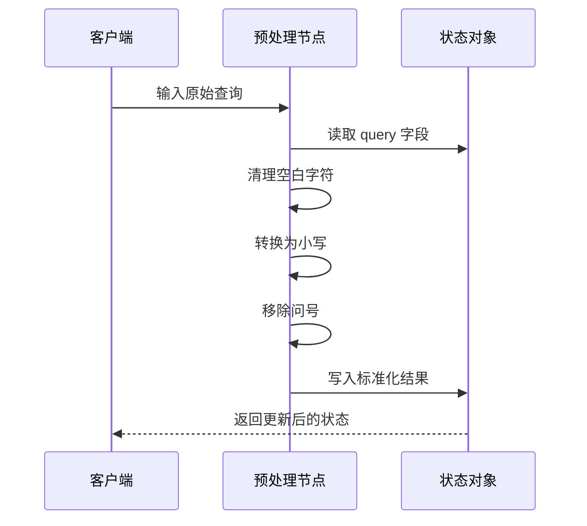
```mermaid
sequenceDiagram
participant Client as 客户端
participant Preprocess as 预处理节点
participant State as 状态对象
Client->>Preprocess : 输入原始查询
Preprocess->>State : 读取 query 字段
Preprocess->>Preprocess : 清理空白字符
Preprocess->>Preprocess : 转换为小写
Preprocess->>Preprocess : 移除问号
Preprocess->>State : 写入标准化结果
State-->>Client : 返回更新后的状态
```

**图表来源**
- [main.ts:16-21](file://main.ts#L16-L21)

### 检索节点分析

检索节点模拟数据库查询操作：

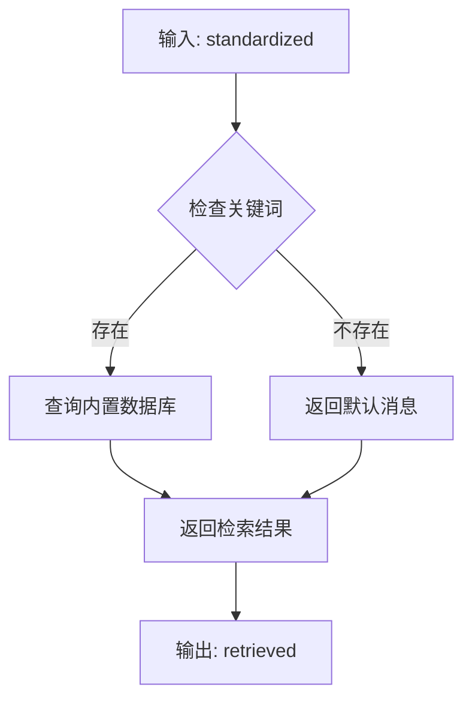
```mermaid
flowchart TD
INPUT["输入: standardized"] --> CHECK{"检查关键词"}
CHECK --> |存在| DATABASE["查询内置数据库"]
CHECK --> |不存在| DEFAULT["返回默认消息"]
DATABASE --> RESULT["返回检索结果"]
DEFAULT --> RESULT
RESULT --> OUTPUT["输出: retrieved"]
```

**图表来源**
- [main.ts:24-33](file://main.ts#L24-L33)

**章节来源**
- [main.ts:24-33](file://main.ts#L24-L33)

### 摘要生成节点分析

摘要节点根据检索结果生成内容摘要：

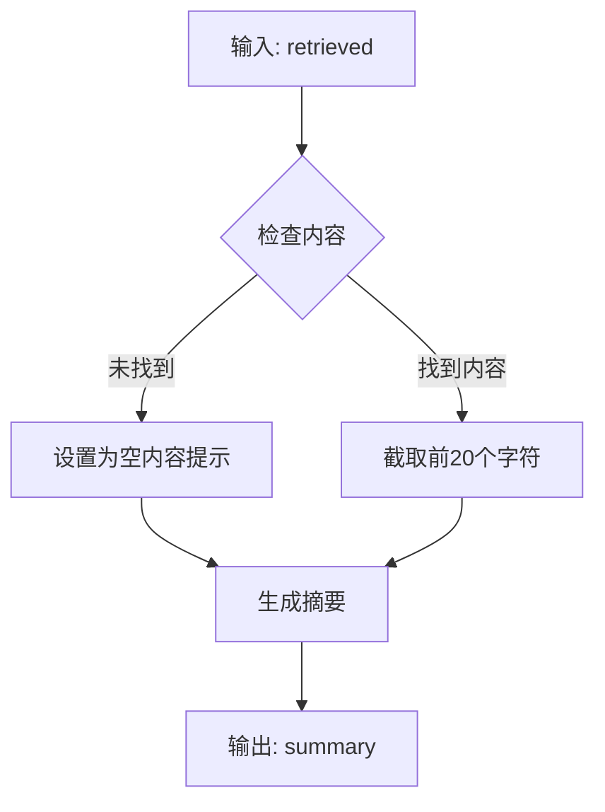
```mermaid
flowchart TD
INPUT["输入: retrieved"] --> CHECK{"检查内容"}
CHECK --> |未找到| EMPTY["设置为空内容提示"]
CHECK --> |找到内容| TRUNCATE["截取前20个字符"]
EMPTY --> SUMMARY["生成摘要"]
TRUNCATE --> SUMMARY
SUMMARY --> OUTPUT["输出: summary"]
```

**图表来源**
- [main.ts:36-47](file://main.ts#L36-L47)

**章节来源**
- [main.ts:36-47](file://main.ts#L36-L47)

### 结论生成节点分析

结论节点基于摘要生成最终结论：

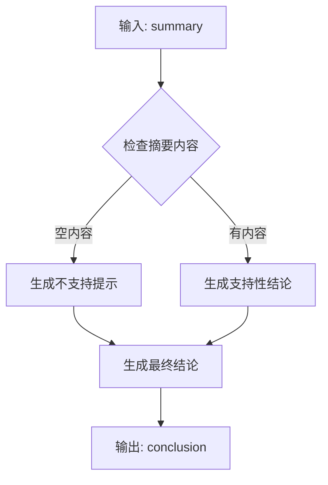
```mermaid
flowchart TD
INPUT["输入: summary"] --> CHECK{"检查摘要内容"}
CHECK --> |空内容| UNSUPPORTED["生成不支持提示"]
CHECK --> |有内容| SUPPORTED["生成支持性结论"]
UNSUPPORTED --> CONCLUSION["生成最终结论"]
SUPPORTED --> CONCLUSION
CONCLUSION --> OUTPUT["输出: conclusion"]
```

**图表来源**
- [main.ts:50-61](file://main.ts#L50-L61)

**章节来源**
- [main.ts:50-61](file://main.ts#L50-L61)

## 工作流优化技术

### 条件分支实现

基于当前实现，可以通过以下方式增强条件分支能力：

#### 动态路由机制

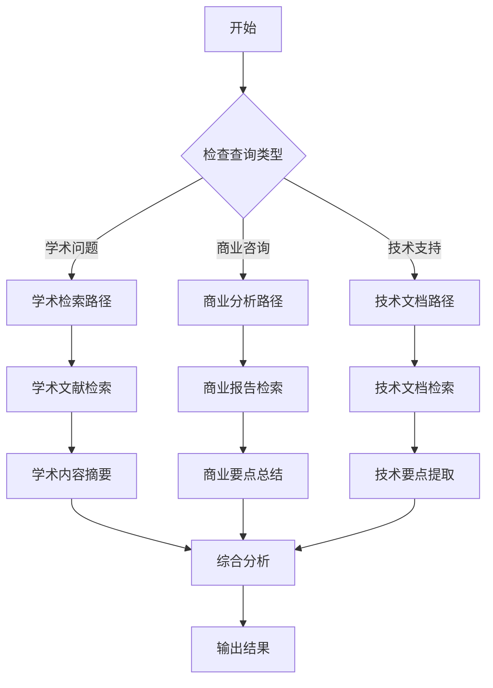
```mermaid
flowchart TD
START["开始"] --> CHECK_TYPE{"检查查询类型"}
CHECK_TYPE --> |学术问题| ACADEMIC["学术检索路径"]
CHECK_TYPE --> |商业咨询| BUSINESS["商业分析路径"]
CHECK_TYPE --> |技术支持| TECH["技术文档路径"]
ACADEMIC --> ACADEMIC_RETRIEVE["学术文献检索"]
BUSINESS --> BUSINESS_RETRIEVE["商业报告检索"]
TECH --> TECH_RETRIEVE["技术文档检索"]
ACADEMIC_RETRIEVE --> ACADEMIC_SUMMARIZE["学术内容摘要"]
BUSINESS_RETRIEVE --> BUSINESS_SUMMARIZE["商业要点总结"]
TECH_RETRIEVE --> TECH_SUMMARIZE["技术要点提取"]
ACADEMIC_SUMMARIZE --> MERGE["综合分析"]
BUSINESS_SUMMARIZE --> MERGE
TECH_SUMMARIZE --> MERGE
MERGE --> END["输出结果"]
```

#### 异常处理机制

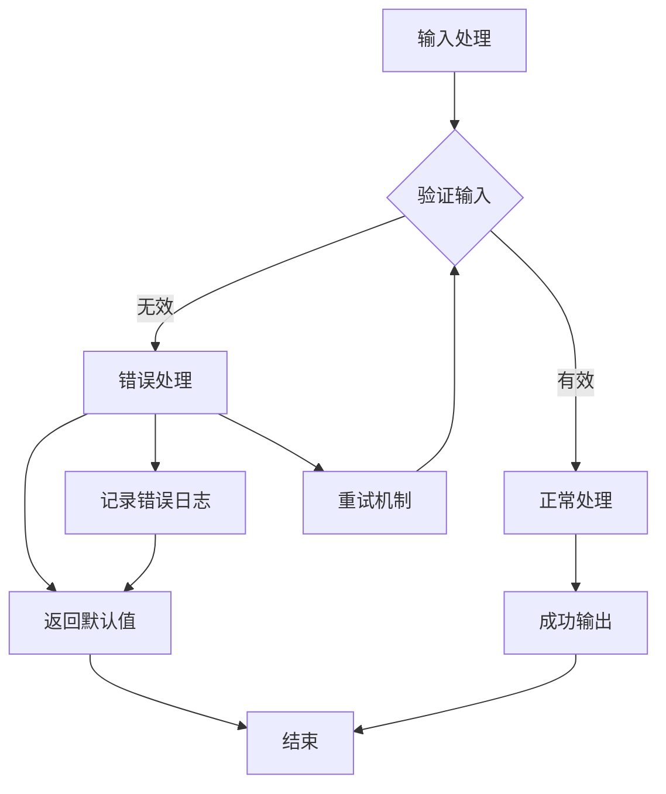
```mermaid
flowchart TD
INPUT["输入处理"] --> VALIDATE{"验证输入"}
VALIDATE --> |有效| PROCESS["正常处理"]
VALIDATE --> |无效| ERROR_HANDLER["错误处理"]
PROCESS --> SUCCESS["成功输出"]
ERROR_HANDLER --> LOG_ERROR["记录错误日志"]
ERROR_HANDLER --> DEFAULT_OUTPUT["返回默认值"]
ERROR_HANDLER --> RETRY["重试机制"]
RETRY --> VALIDATE
LOG_ERROR --> DEFAULT_OUTPUT
DEFAULT_OUTPUT --> END["结束"]
SUCCESS --> END
```

### 循环处理优化

#### 递归工作流设计

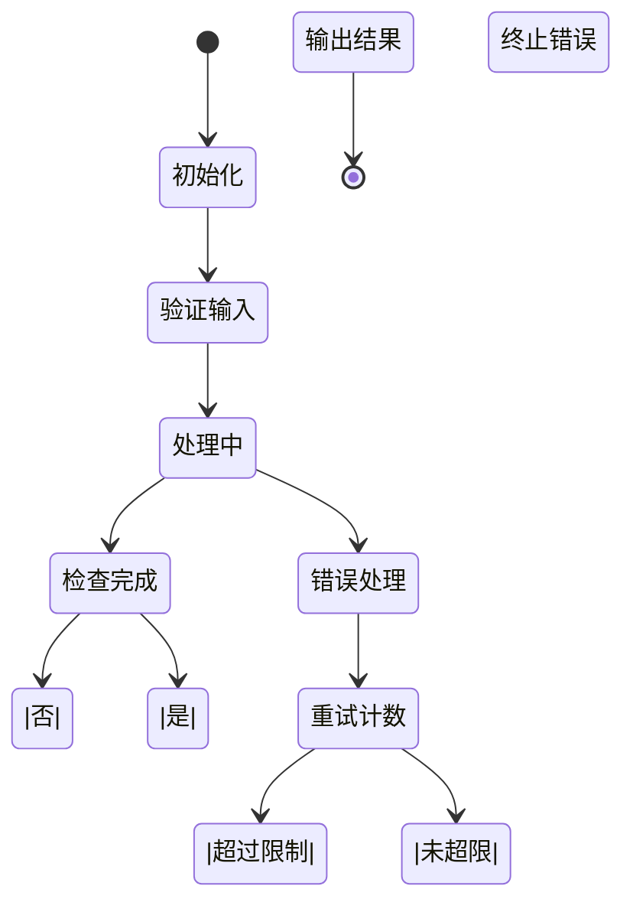
```mermaid
stateDiagram-v2
[*] --> 初始化
初始化 --> 验证输入
验证输入 --> 处理中
处理中 --> 检查完成
检查完成 --> |否| 处理中
检查完成 --> |是| 输出结果
输出结果 --> [*]
处理中 --> 错误处理
错误处理 --> 重试计数
重试计数 --> |超过限制| 终止错误
重试计数 --> |未超限| 处理中
```

#### 迭代优化策略

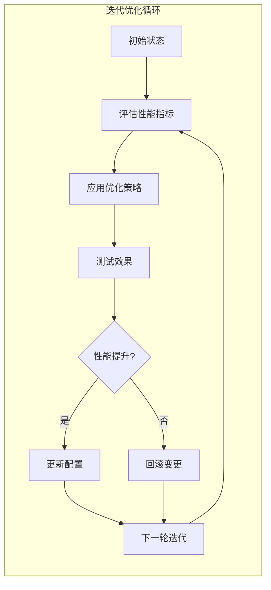
```mermaid
flowchart LR
subgraph "迭代优化循环"
INITIAL["初始状态"] --> EVALUATE["评估性能指标"]
EVALUATE --> OPTIMIZE["应用优化策略"]
OPTIMIZE --> TEST["测试效果"]
TEST --> IMPROVE{"性能提升?"}
IMPROVE --> |是| UPDATE["更新配置"]
IMPROVE --> |否| REVERT["回滚变更"]
UPDATE --> NEXT["下一轮迭代"]
REVERT --> NEXT
NEXT --> EVALUATE
end
```

### 并行执行实现

#### 并行节点设计

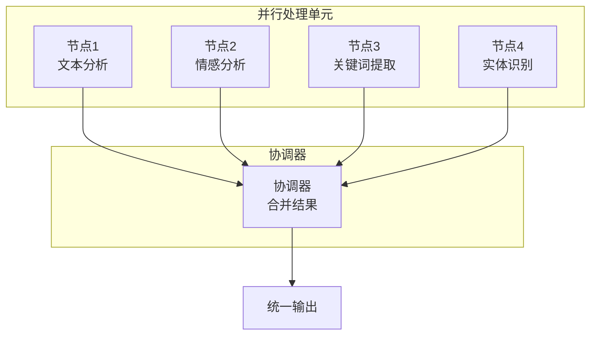
```mermaid
graph TB
subgraph "并行处理单元"
NODE1["节点1<br/>文本分析"]
NODE2["节点2<br/>情感分析"]
NODE3["节点3<br/>关键词提取"]
NODE4["节点4<br/>实体识别"]
end
subgraph "协调器"
COORDINATOR["协调器<br/>合并结果"]
end
NODE1 --> COORDINATOR
NODE2 --> COORDINATOR
NODE3 --> COORDINATOR
NODE4 --> COORDINATOR
COORDINATOR --> OUTPUT["统一输出"]
```

#### 资源池管理

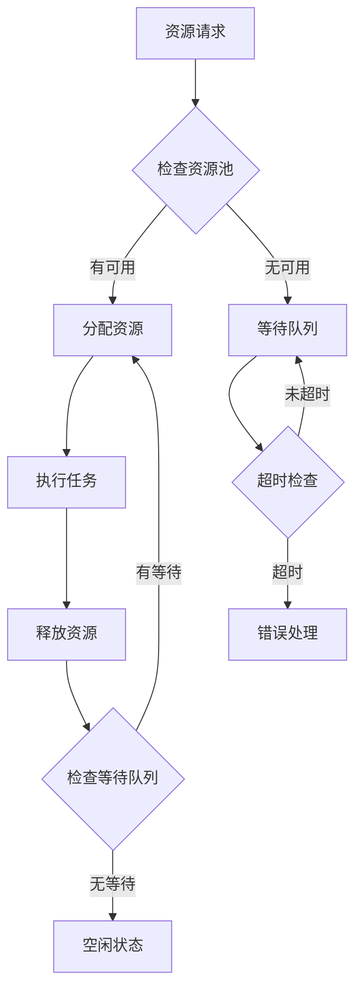
```mermaid
flowchart TD
REQUEST["资源请求"] --> CHECK_POOL{"检查资源池"}
CHECK_POOL --> |有可用| ASSIGN["分配资源"]
CHECK_POOL --> |无可用| WAIT["等待队列"]
ASSIGN --> PROCESS["执行任务"]
PROCESS --> RELEASE["释放资源"]
RELEASE --> CHECK_QUEUE{"检查等待队列"}
CHECK_QUEUE --> |有等待| ASSIGN
CHECK_QUEUE --> |无等待| IDLE["空闲状态"]
WAIT --> TIMEOUT{"超时检查"}
TIMEOUT --> |超时| ERROR["错误处理"]
TIMEOUT --> |未超时| WAIT
```

## 性能优化策略

### 缓存策略

#### 多层缓存架构

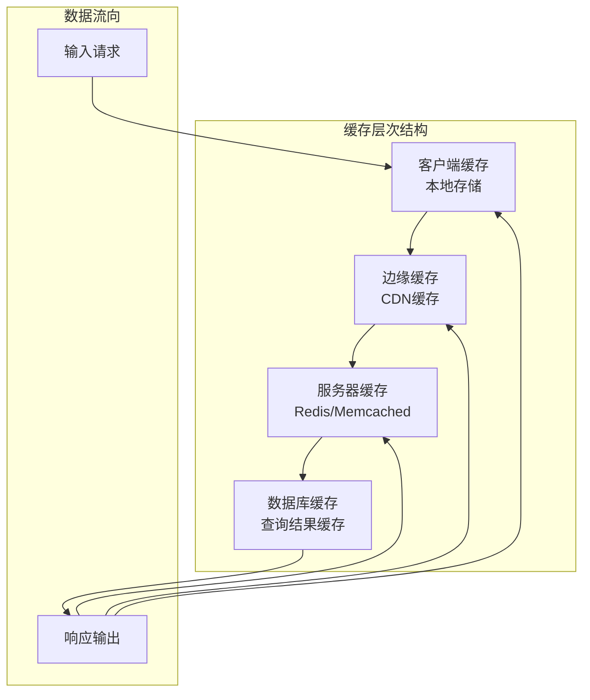
```mermaid
graph TB
subgraph "缓存层次结构"
CLIENT_CACHE["客户端缓存<br/>本地存储"]
EDGE_CACHE["边缘缓存<br/>CDN缓存"]
SERVER_CACHE["服务器缓存<br/>Redis/Memcached"]
DATABASE_CACHE["数据库缓存<br/>查询结果缓存"]
end
subgraph "数据流向"
INPUT["输入请求"] --> CLIENT_CACHE
CLIENT_CACHE --> EDGE_CACHE
EDGE_CACHE --> SERVER_CACHE
SERVER_CACHE --> DATABASE_CACHE
DATABASE_CACHE --> RESPONSE["响应输出"]
RESPONSE --> CLIENT_CACHE
RESPONSE --> EDGE_CACHE
RESPONSE --> SERVER_CACHE
end
```

#### 缓存失效策略

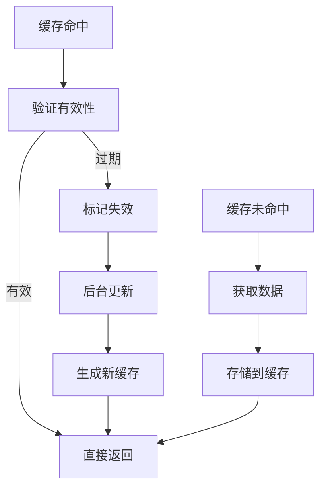
```mermaid
flowchart TD
CACHE_HIT["缓存命中"] --> VALIDATE["验证有效性"]
VALIDATE --> |有效| RETURN["直接返回"]
VALIDATE --> |过期| INVALIDATE["标记失效"]
INVALIDATE --> BACKGROUND_UPDATE["后台更新"]
BACKGROUND_UPDATE --> NEW_CACHE["生成新缓存"]
NEW_CACHE --> RETURN
CACHE_MISS["缓存未命中"] --> FETCH_DATA["获取数据"]
FETCH_DATA --> STORE_CACHE["存储到缓存"]
STORE_CACHE --> RETURN
```

### 并发控制

#### 限流与节流

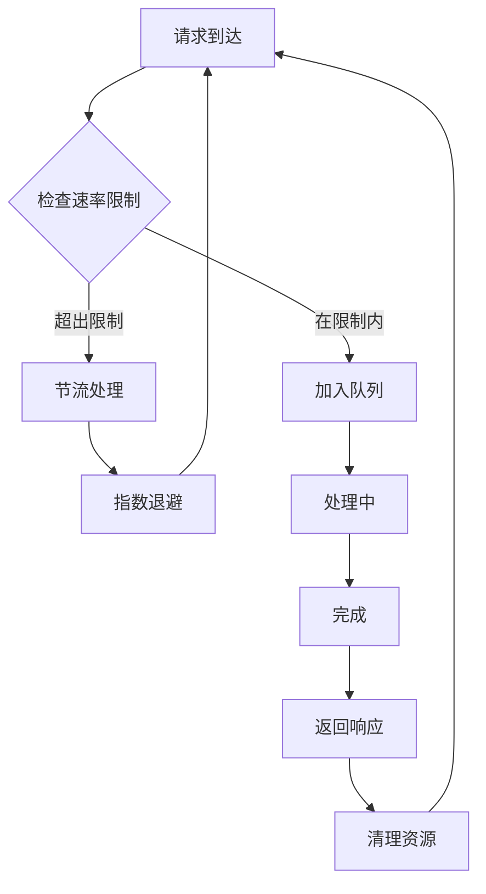
```mermaid
flowchart TD
REQUEST["请求到达"] --> RATE_LIMIT{"检查速率限制"}
RATE_LIMIT --> |超出限制| THROTTLE["节流处理"]
RATE_LIMIT --> |在限制内| QUEUE["加入队列"]
THROTTLE --> BACKOFF["指数退避"]
BACKOFF --> REQUEST
QUEUE --> PROCESSING["处理中"]
PROCESSING --> COMPLETION["完成"]
COMPLETION --> RESPONSE["返回响应"]
RESPONSE --> CLEANUP["清理资源"]
CLEANUP --> REQUEST
```

#### 负载均衡

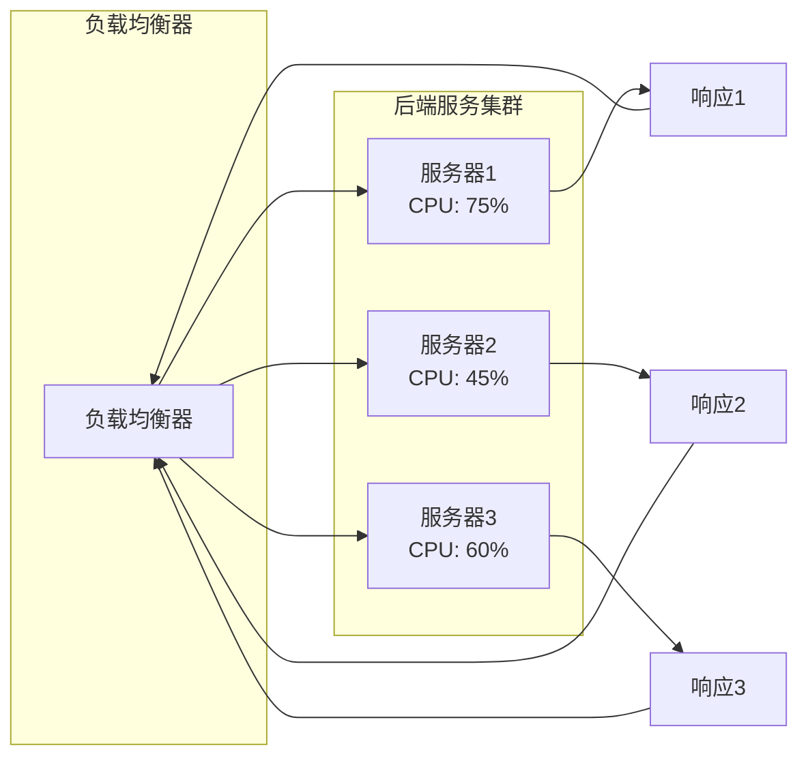
```mermaid
flowchart LR
subgraph "负载均衡器"
LB["负载均衡器"]
end
subgraph "后端服务集群"
SERVER1["服务器1<br/>CPU: 75%"]
SERVER2["服务器2<br/>CPU: 45%"]
SERVER3["服务器3<br/>CPU: 60%"]
end
LB --> SERVER1
LB --> SERVER2
LB --> SERVER3
SERVER1 --> RESPONSE1["响应1"]
SERVER2 --> RESPONSE2["响应2"]
SERVER3 --> RESPONSE3["响应3"]
RESPONSE1 --> LB
RESPONSE2 --> LB
RESPONSE3 --> LB
```

### 资源管理

#### 动态资源分配

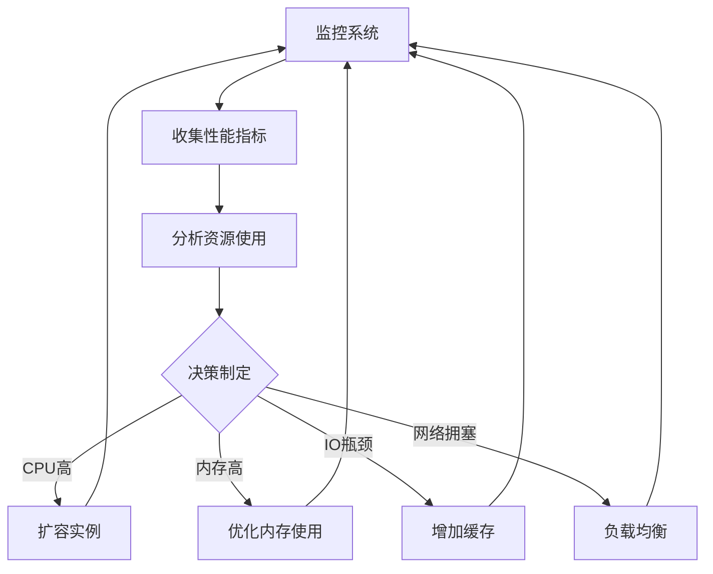
```mermaid
flowchart TD
MONITOR["监控系统"] --> METRICS["收集性能指标"]
METRICS --> ANALYZE["分析资源使用"]
ANALYZE --> DECISION{"决策制定"}
DECISION --> |CPU高| SCALE_UP["扩容实例"]
DECISION --> |内存高| OPTIMIZE["优化内存使用"]
DECISION --> |IO瓶颈| CACHE["增加缓存"]
DECISION --> |网络拥塞| BALANCE["负载均衡"]
SCALE_UP --> MONITOR
OPTIMIZE --> MONITOR
CACHE --> MONITOR
BALANCE --> MONITOR
```

## 调试与监控

### 执行状态跟踪

#### 状态可视化

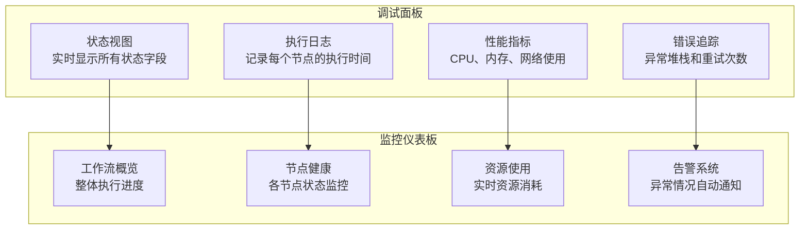
```mermaid
graph TB
subgraph "调试面板"
STATE_VIEW["状态视图<br/>实时显示所有状态字段"]
EXECUTION_LOG["执行日志<br/>记录每个节点的执行时间"]
PERFORMANCE_METRICS["性能指标<br/>CPU、内存、网络使用"]
ERROR_TRACKING["错误追踪<br/>异常堆栈和重试次数"]
end
subgraph "监控仪表板"
WORKFLOW_OVERVIEW["工作流概览<br/>整体执行进度"]
NODE_HEALTH["节点健康<br/>各节点状态监控"]
RESOURCE_USAGE["资源使用<br/>实时资源消耗"]
ALERT_SYSTEM["告警系统<br/>异常情况自动通知"]
end
STATE_VIEW --> WORKFLOW_OVERVIEW
EXECUTION_LOG --> NODE_HEALTH
PERFORMANCE_METRICS --> RESOURCE_USAGE
ERROR_TRACKING --> ALERT_SYSTEM
```

#### 日志记录策略

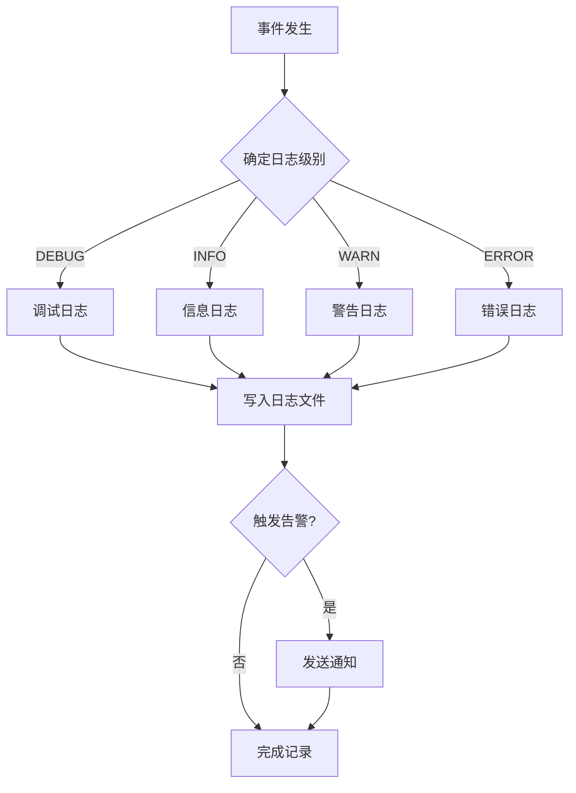
```mermaid
flowchart TD
EVENT["事件发生"] --> LOG_LEVEL{"确定日志级别"}
LOG_LEVEL --> |DEBUG| DEBUG_LOG["调试日志"]
LOG_LEVEL --> |INFO| INFO_LOG["信息日志"]
LOG_LEVEL --> |WARN| WARN_LOG["警告日志"]
LOG_LEVEL --> |ERROR| ERROR_LOG["错误日志"]
DEBUG_LOG --> FILE_WRITE["写入日志文件"]
INFO_LOG --> FILE_WRITE
WARN_LOG --> FILE_WRITE
ERROR_LOG --> FILE_WRITE
FILE_WRITE --> ALERT{"触发告警?"}
ALERT --> |是| NOTIFICATION["发送通知"]
ALERT --> |否| COMPLETE["完成记录"]
NOTIFICATION --> COMPLETE
```

### 性能分析工具

#### 分析指标体系

| 指标类别 | 关键指标 | 目标值 | 监控频率 |
|---------|----------|--------|----------|
| 响应时间 | 平均响应时间、P95延迟 | < 100ms | 实时 |
| 吞吐量 | 请求/秒、处理/秒 | > 1000 | 每分钟 |
| 资源使用 | CPU利用率、内存使用率 | < 80% | 每5分钟 |
| 错误率 | HTTP错误率、业务错误率 | < 1% | 每分钟 |
| 可用性 | 系统可用性、SLA达成率 | > 99.9% | 每小时 |

## 实际优化案例

### 线性工作流到网状结构的转换

#### 原始线性工作流

```mermaid
flowchart TD
START["开始"] --> PREPROCESS["预处理"]
PREPROCESS --> RETRIEVE["检索"]
RETRIEVE --> SUMMARIZE["摘要"]
SUMMARIZE --> CONCLUDE["结论"]
CONCLUDE --> END["结束"]
```

#### 优化后的网状工作流

```mermaid
flowchart TD
START["开始"] --> PREPROCESS["预处理"]
PREPROCESS --> CHECK_TYPE{"检查查询类型"}
CHECK_TYPE --> |学术| ACADEMIC_PATH["学术路径"]
CHECK_TYPE --> |商业| BUSINESS_PATH["商业路径"]
CHECK_TYPE --> |技术| TECH_PATH["技术路径"]
ACADEMIC_PATH --> ACADEMIC_RETRIEVE["学术检索"]
BUSINESS_PATH --> BUSINESS_RETRIEVE["商业检索"]
TECH_PATH --> TECH_RETRIEVE["技术检索"]
ACADEMIC_RETRIEVE --> ACADEMIC_ANALYZE["学术分析"]
BUSINESS_RETRIEVE --> BUSINESS_ANALYZE["商业分析"]
TECH_RETRIEVE --> TECH_ANALYZE["技术分析"]
ACADEMIC_ANALYZE --> MERGE["结果合并"]
BUSINESS_ANALYZE --> MERGE
TECH_ANALYZE --> MERGE
MERGE --> POST_PROCESS["后处理"]
POST_PROCESS --> CONCLUDE["最终结论"]
CONCLUDE --> END["结束"]
```

### 智能体行为优化案例

#### 多轮对话优化

```mermaid
sequenceDiagram
participant User as 用户
participant Agent as 智能体
participant Memory as 记忆模块
participant Tools as 工具集
User->>Agent : 初始查询
Agent->>Memory : 检查上下文
Agent->>Tools : 选择合适工具
Tools-->>Agent : 工具结果
Agent->>Memory : 更新记忆
Agent-->>User : 回答
User->>Agent : 追问问题
Agent->>Memory : 获取历史对话
Agent->>Agent : 分析问题关联性
Agent->>Tools : 选择相关工具
Tools-->>Agent : 工具结果
Agent->>Memory : 更新对话历史
Agent-->>User : 连续回答
```

#### 自适应路由优化

```mermaid
flowchart TD
INPUT["输入查询"] --> ANALYZE["语义分析"]
ANALYZE --> SCORE["计算匹配分数"]
SCORE --> SELECT["选择最优路径"]
SELECT --> PATH1["路径1: 基于规则"]
SELECT --> PATH2["路径2: 基于机器学习"]
SELECT --> PATH3["路径3: 基于混合模型"]
PATH1 --> SCORE1["规则匹配分数"]
PATH2 --> SCORE2["ML预测分数"]
PATH3 --> SCORE3["融合分数"]
SCORE1 --> FINAL_SCORE["最终决策"]
SCORE2 --> FINAL_SCORE
SCORE3 --> FINAL_SCORE
FINAL_SCORE --> EXECUTE["执行选定路径"]
```

## 故障排除指南

### 常见问题诊断

#### 状态异常处理

```mermaid
flowchart TD
STATE_ERROR["状态异常"] --> IDENTIFY["识别异常类型"]
IDENTIFY --> RESET["重置状态"]
IDENTIFY --> CATCH["捕获异常"]
RESET --> VALIDATE["验证状态完整性"]
VALIDATE --> |完整| CONTINUE["继续执行"]
VALIDATE --> |缺失| RECOVER["恢复状态"]
CATCH --> LOG["记录错误日志"]
CATCH --> NOTIFY["通知管理员"]
RECOVER --> VALIDATE
LOG --> CONTINUE
NOTIFY --> CONTINUE
```

#### 性能问题排查

```mermaid
flowchart TD
PERF_ISSUE["性能问题"] --> MEASURE["测量关键指标"]
MEASURE --> ANALYZE["分析瓶颈"]
ANALYZE --> ISOLATE["隔离问题区域"]
ISOLATE --> PROFILE["性能分析"]
PROFILE --> OPTIMIZE["实施优化"]
OPTIMIZE --> VERIFY["验证效果"]
VERIFY --> |改善| MONITOR["持续监控"]
VERIFY --> |无改善| REVERSE["回滚变更"]
MONITOR --> PERF_ISSUE
REVERSE --> PERF_ISSUE
```

### 调试工具推荐

#### 开发环境调试

| 工具类型 | 推荐工具 | 用途 |
|---------|----------|------|
| IDE调试器 | VS Code Debugger | 断点调试、变量检查 |
| 性能分析 | Chrome DevTools | JavaScript性能分析 |
| 网络监控 | Charles Proxy | API调用监控 |
| 日志分析 | ELK Stack | 日志聚合分析 |
| 监控告警 | Prometheus + Grafana | 系统监控仪表板 |

#### 生产环境监控

```mermaid
graph TB
subgraph "监控基础设施"
PROMETHEUS["Prometheus<br/>指标收集"]
GRAFANA["Grafana<br/>可视化仪表板"]
ALERTMANAGER["Alertmanager<br/>告警管理"]
LOGSTASH["Logstash<br/>日志处理"]
end
subgraph "监控目标"
WORKFLOW["工作流执行"]
NODES["节点状态"]
RESOURCES["资源使用"]
ERRORS["错误统计"]
end
WORKFLOW --> PROMETHEUS
NODES --> PROMETHEUS
RESOURCES --> PROMETHEUS
ERRORS --> PROMETHEUS
PROMETHEUS --> GRAFANA
PROMETHEUS --> ALERTMANAGER
PROMETHEUS --> LOGSTASH
```

## 结论

通过深入分析这个基于 LangChain LangGraph 的工作流优化示例，我们可以看到现代智能体系统的关键优化要素：

1. **状态驱动架构**：使用强类型状态定义确保系统的可维护性和可扩展性
2. **模块化设计**：将复杂流程分解为独立的功能节点，便于测试和优化
3. **条件分支机制**：通过动态路由实现灵活的业务逻辑处理
4. **性能优化策略**：缓存、并发控制和资源管理的综合运用
5. **监控调试体系**：完善的日志记录和性能监控机制

未来的工作流优化方向应该重点关注：
- 更智能的自适应路由算法
- 更高效的并行处理机制
- 更精准的性能预测和自动调优
- 更完善的异常处理和容错机制

这些技术和实践为构建高性能、可扩展的智能体系统提供了坚实的基础。