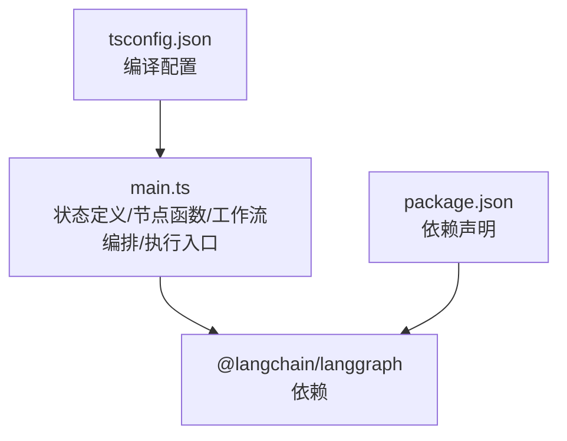
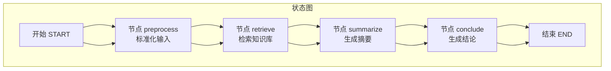
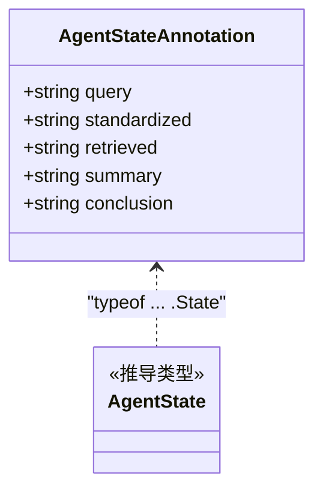
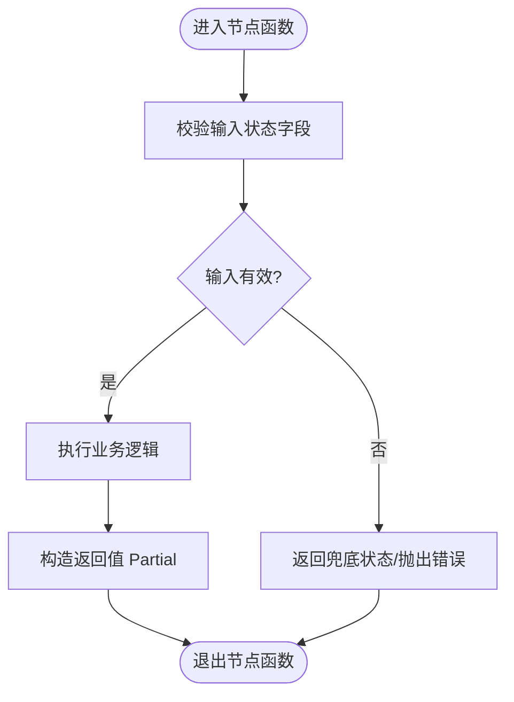
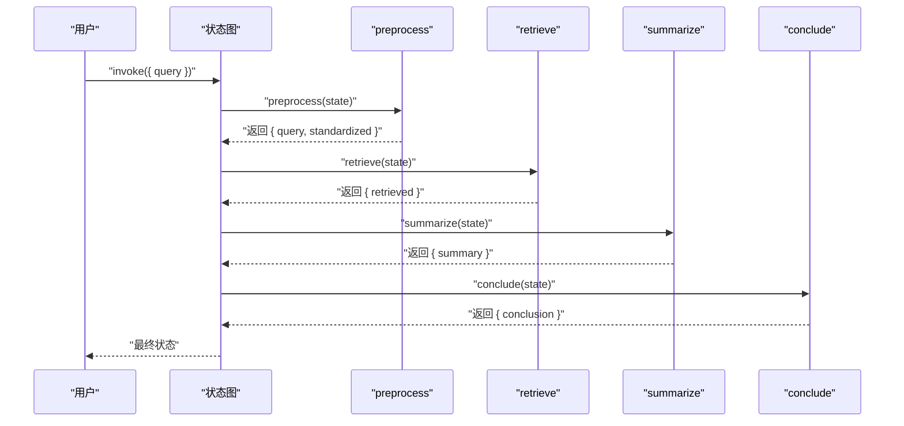
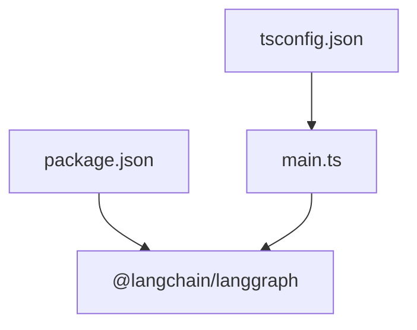

# 扩展与定制

<cite>
**本文引用的文件**
- [main.ts](file://main.ts)
- [package.json](file://package.json)
- [tsconfig.json](file://tsconfig.json)
</cite>

## 目录
1. [简介](#简介)
2. [项目结构](#项目结构)
3. [核心组件](#核心组件)
4. [架构总览](#架构总览)
5. [详细组件分析](#详细组件分析)
6. [依赖关系分析](#依赖关系分析)
7. [性能考量](#性能考量)
8. [故障排查指南](#故障排查指南)
9. [结论](#结论)
10. [附录](#附录)

## 简介
本指南面向希望扩展与定制AI智能体系统的开发者，围绕现有代码库中的状态定义、节点函数、工作流编排与执行进行深入解析，并提供可直接落地的扩展与定制实践建议，包括：
- 新增处理节点的编写规范、状态更新模式与错误处理策略
- 在 AgentStateAnnotation 中扩展状态字段的方法
- 工作流优化技巧：条件分支、循环处理与并行执行
- 集成真实AI服务：大语言模型API、数据库服务与第三方工具的接入方法

## 项目结构
本仓库包含一个最小可运行的智能体示例，采用 LangGraph 的状态图模型构建多节点工作流。核心文件如下：
- main.ts：定义状态注解、节点函数、工作流编排与执行入口
- package.json：声明依赖 @langchain/langgraph
- tsconfig.json：TypeScript 编译配置

图表来源
- [main.ts:1-85](file://main.ts#L1-L85)
- [package.json:13-15](file://package.json#L13-L15)

章节来源
- [main.ts:1-85](file://main.ts#L1-L85)
- [package.json:1-17](file://package.json#L1-L17)
- [tsconfig.json:1-114](file://tsconfig.json#L1-L114)

## 核心组件
- 状态注解与类型推导
  - 使用 Annotation.Root 定义 AgentStateAnnotation，包含 query、standardized、retrieved、summary、conclusion 等字段
  - 通过 typeof AgentStateAnnotation.State 推导出强类型 AgentState，确保节点函数参数与返回值与状态结构一致
- 节点函数
  - preprocessNode：接收用户输入并进行标准化处理，返回 query 与 standardized
  - retrieveNode：基于标准化关键词检索知识库（模拟），返回 retrieved
  - summarizeNode：对检索结果生成摘要，返回 summary
  - concludeNode：基于摘要生成结论，返回 conclusion
- 工作流编排
  - 使用 StateGraph 创建有向无环图，按 START → preprocess → retrieve → summarize → conclude → END 的顺序连接节点
  - 通过 compile() 编译为可执行图，随后以 graph.invoke(...) 触发执行

章节来源
- [main.ts:3-13](file://main.ts#L3-L13)
- [main.ts:15-61](file://main.ts#L15-L61)
- [main.ts:63-76](file://main.ts#L63-L76)

## 架构总览
下图展示了从输入到输出的端到端流程，以及各节点在状态图中的位置与数据传递方向。

图表来源
- [main.ts:63-76](file://main.ts#L63-L76)

## 详细组件分析

### 状态注解与类型安全
- 设计要点
  - 使用 Annotation.Root 声明状态字段，LangGraph 推荐方式，便于静态类型检查与运行时校验
  - 通过 typeof AgentStateAnnotation.State 推导强类型，避免节点函数误用或遗漏字段
- 扩展建议
  - 如需新增状态字段，应在 AgentStateAnnotation 中添加对应条目，并同步更新所有相关节点函数的返回值
  - 对于可选字段，保持默认值或空字符串，避免运行时访问 undefined 导致异常

图表来源
- [main.ts:3-13](file://main.ts#L3-L13)

章节来源
- [main.ts:3-13](file://main.ts#L3-L13)

### 节点函数编写规范
- 输入与输出
  - 输入：AgentState 类型对象，包含当前工作流所需的所有状态字段
  - 输出：Partial<AgentState>，仅返回本次节点需要更新的状态字段
- 处理原则
  - 严格遵循“只写入必要字段”的原则，避免覆盖其他节点已设置的字段
  - 对输入进行防御性处理（如 trim、空值判断），保证后续节点的健壮性
  - 返回值应与 AgentStateAnnotation 中的字段一一对应，避免类型不匹配
- 错误处理策略
  - 对外部依赖（如网络请求、数据库）进行 try/catch 包裹
  - 在节点内部记录上下文信息（如关键词、原始输入），便于定位问题
  - 对异常情况返回兜底状态（如“暂无可用信息”），确保下游节点可继续执行

图表来源
- [main.ts:15-61](file://main.ts#L15-L61)

章节来源
- [main.ts:15-61](file://main.ts#L15-L61)

### 工作流编排与控制流
- 当前工作流
  - 单路径线性执行：START → preprocess → retrieve → summarize → conclude → END
  - 适用于简单问答场景，流程清晰、易于调试
- 条件分支
  - 可在节点内部返回控制信号（例如返回特定字段值），并在 addConditionalEdges 中根据该信号选择不同出口
  - 示例思路：当检索结果为空时跳过摘要生成，直接进入结论生成；或根据摘要长度决定是否进行深度分析
- 循环处理
  - 通过在 addConditionalEdges 中将某节点指向自身，实现自循环
  - 注意设置最大迭代次数或终止条件，防止无限循环
- 并行执行
  - 使用 addNode 并行注册多个节点，再通过 addConditionalEdges 或自定义分支策略将它们并行调度
  - 并行时注意状态隔离与合并策略，避免竞态条件

图表来源
- [main.ts:63-76](file://main.ts#L63-L76)
- [main.ts:78-84](file://main.ts#L78-L84)

章节来源
- [main.ts:63-76](file://main.ts#L63-L76)
- [main.ts:78-84](file://main.ts#L78-L84)

### 扩展状态字段的实践步骤
- 步骤一：在 AgentStateAnnotation 中新增字段
  - 例如新增“history”、“metadata”等字段，用于记录对话历史或元信息
- 步骤二：更新类型推导
  - 保持 typeof AgentStateAnnotation.State 与注解一致，确保类型安全
- 步骤三：修改相关节点函数
  - 在 preprocessNode/retrieveNode/summarizeNode/concludeNode 中读取与写入新字段
  - 对新增字段进行初始化与默认值处理，避免空值传播
- 步骤四：调整工作流连接
  - 若新字段影响控制流（如历史记录触发条件分支），在 addConditionalEdges 中增加相应规则
- 步骤五：测试与验证
  - 使用 graph.invoke(...) 执行端到端流程，观察新字段在各节点间的传递与更新

章节来源
- [main.ts:3-13](file://main.ts#L3-L13)
- [main.ts:15-61](file://main.ts#L15-L61)
- [main.ts:63-76](file://main.ts#L63-L76)

### 集成真实AI服务与外部系统
- 大语言模型API（LLM）
  - 将 retrieveNode 的“数据库”替换为 LLM 的检索/生成调用
  - 在节点函数内封装请求与响应解析，捕获网络异常并返回兜底状态
  - 对提示词模板化，支持动态注入上下文与历史
- 数据库服务
  - 将 retrieveNode 的内存映射替换为真实数据库查询（如 SQL/NoSQL）
  - 使用连接池与超时控制，避免阻塞主线程
  - 对查询结果进行分页与限流，提升稳定性
- 第三方工具
  - 通过适配器模式封装外部API（如搜索引擎、翻译服务）
  - 在节点函数中统一处理鉴权、重试与熔断
  - 记录调用日志与耗时指标，便于监控与排障

章节来源
- [main.ts:23-33](file://main.ts#L23-L33)
- [main.ts:15-61](file://main.ts#L15-L61)

## 依赖关系分析
- 依赖声明
  - @langchain/langgraph：提供 StateGraph、Annotation、START/END 等核心能力
- 版本与兼容性
  - package.json 明确声明了依赖版本范围，建议在升级时关注 LangGraph 的变更日志与迁移指南
- 类型与编译
  - tsconfig.json 启用了严格模式与 esmodule 互操作，确保类型安全与模块加载正确

图表来源
- [package.json:13-15](file://package.json#L13-L15)
- [main.ts:1](file://main.ts#L1)

章节来源
- [package.json:13-15](file://package.json#L13-L15)
- [tsconfig.json:83](file://tsconfig.json#L83)

## 性能考量
- 节点粒度与职责分离
  - 将复杂逻辑拆分为多个小节点，便于缓存与复用
- 异步与并发
  - 对外部调用使用异步处理，避免阻塞状态图推进
  - 在允许的情况下启用并行节点，缩短整体延迟
- 缓存与去重
  - 对重复输入或相似查询进行缓存，减少重复计算
- 资源限制
  - 设置超时与重试上限，防止长时间占用资源
- 监控与可观测性
  - 记录关键指标（耗时、成功率、队列长度），定期评估性能瓶颈

## 故障排查指南
- 常见问题
  - 状态字段缺失：检查 AgentStateAnnotation 是否与节点返回值一致
  - 控制流异常：确认 addEdge/addConditionalEdges 的连接是否符合预期
  - 外部服务失败：在节点函数中捕获异常并返回兜底状态
- 调试建议
  - 在每个节点打印输入与输出，快速定位问题节点
  - 使用 graph.get_graph().draw_ascii()（如可用）可视化工作流结构
  - 对长流程进行分段执行，逐步缩小问题范围

章节来源
- [main.ts:63-76](file://main.ts#L63-L76)
- [main.ts:15-61](file://main.ts#L15-L61)

## 结论
通过对状态注解、节点函数与工作流编排的系统化梳理，开发者可以在此基础上安全地扩展智能体能力。建议优先从状态字段扩展与节点职责拆分入手，逐步引入条件分支、循环与并行执行，并在集成真实AI服务时注重错误处理与性能优化。遵循本文提供的规范与最佳实践，可在保证类型安全与可维护性的前提下，快速实现复杂的智能体工作流。

## 附录
- 快速上手清单
  - 在 AgentStateAnnotation 中新增字段并更新类型
  - 编写节点函数，遵循“只写入必要字段”的原则
  - 在工作流中添加节点与边，必要时引入条件分支
  - 集成真实服务时，封装异常处理与重试机制
  - 使用 graph.invoke(...) 进行端到端测试