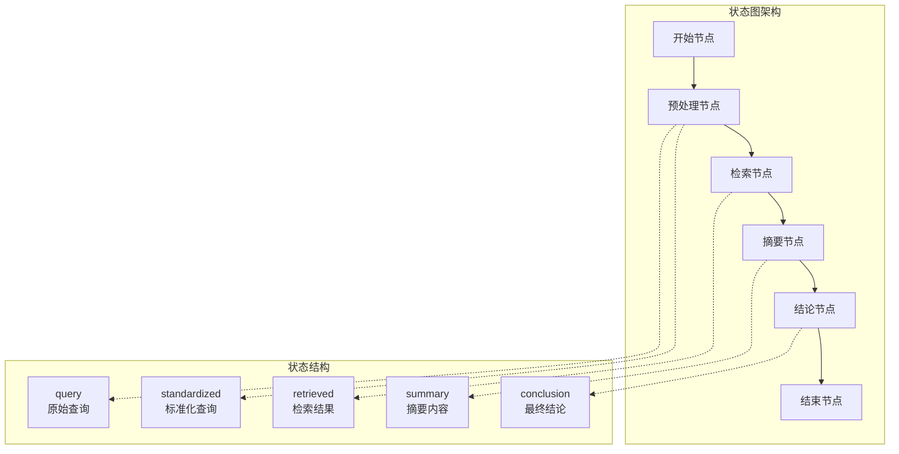
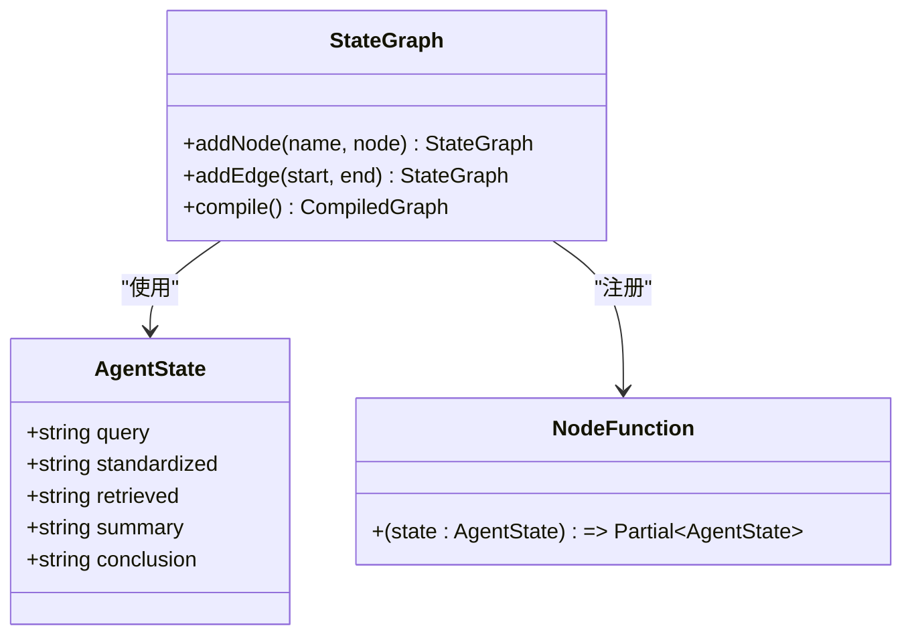
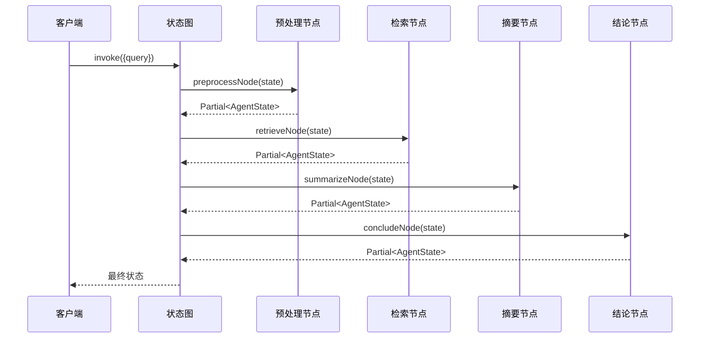
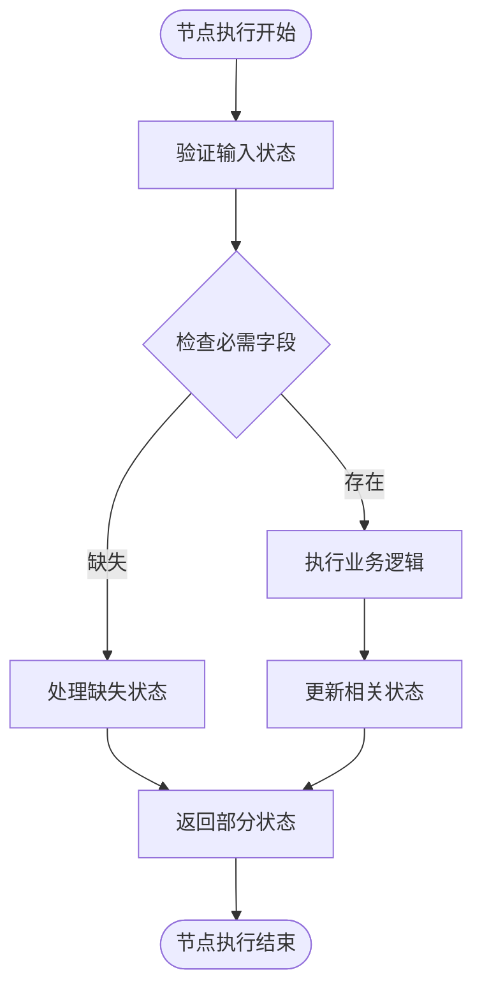
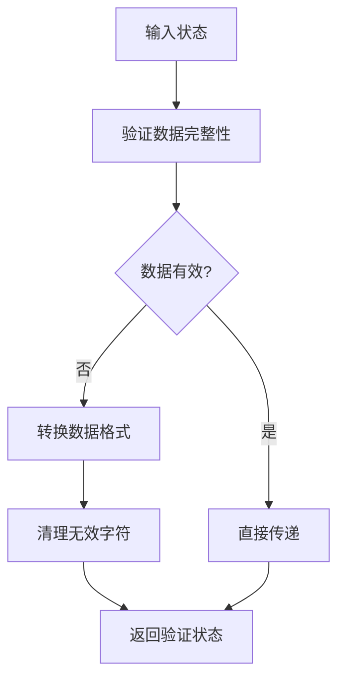
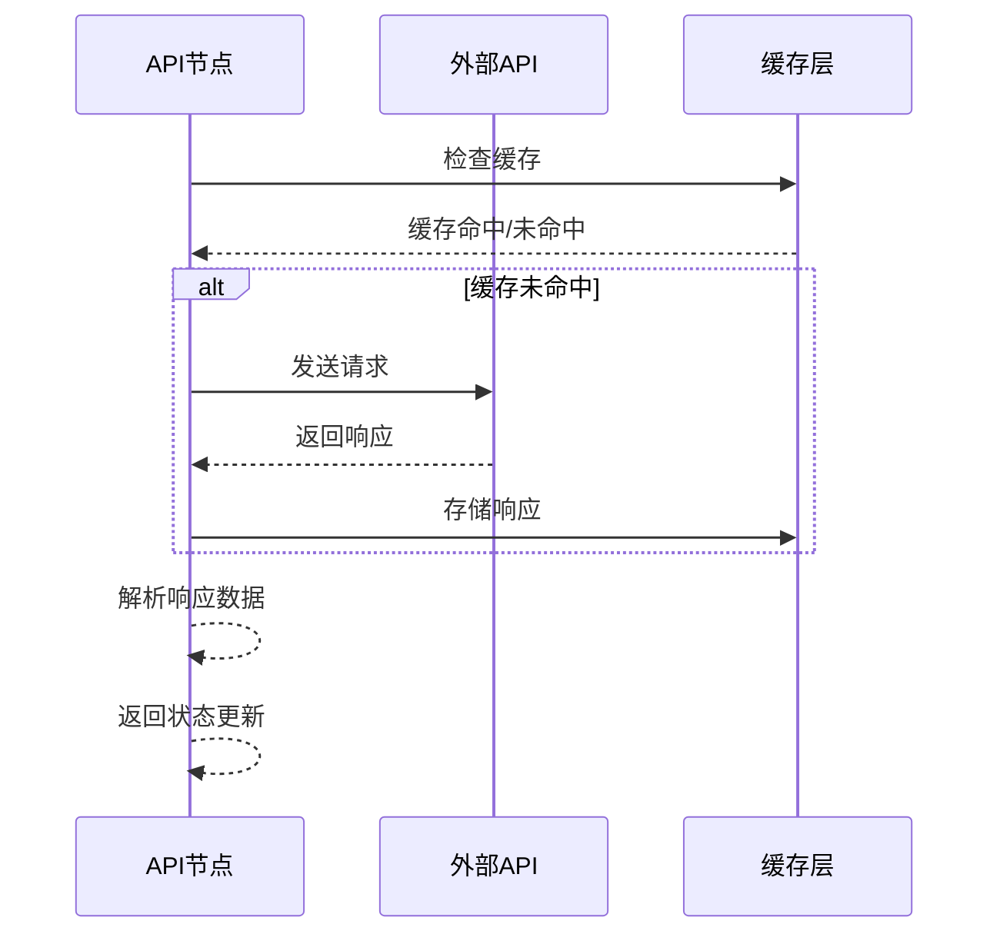
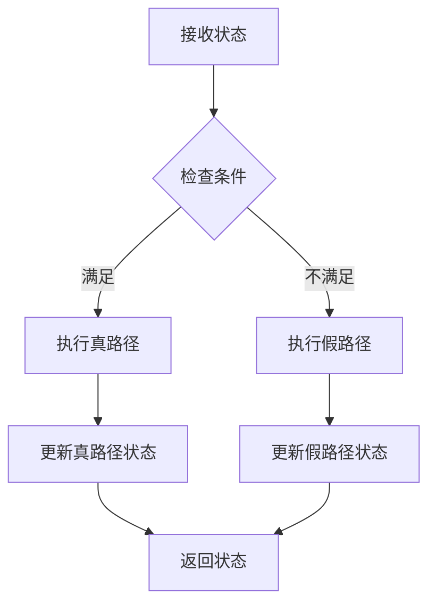
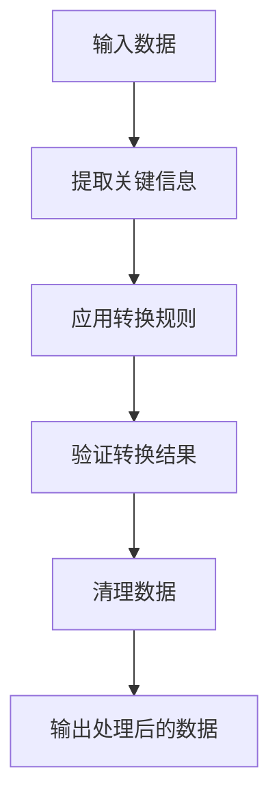
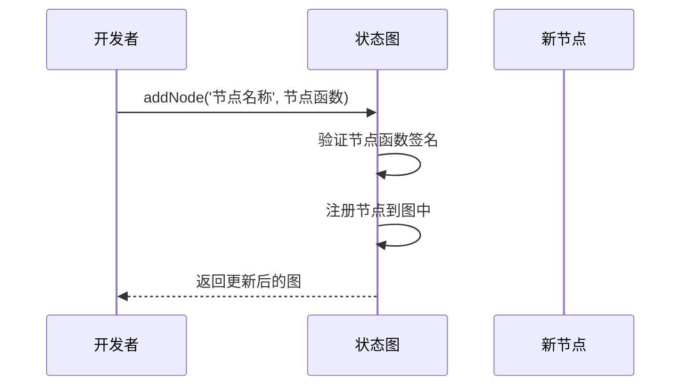
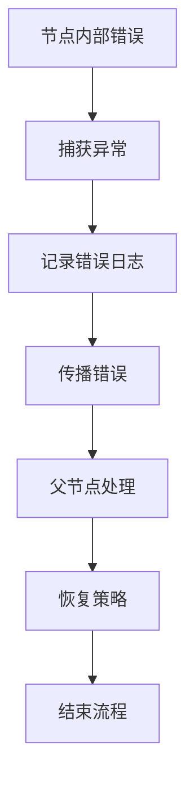

# 新增处理节点

<cite>
**本文档引用的文件**
- [main.ts](file://main.ts)
- [package.json](file://package.json)
- [tsconfig.json](file://tsconfig.json)
</cite>

## 目录
1. [简介](#简介)
2. [项目结构](#项目结构)
3. [核心组件](#核心组件)
4. [架构概览](#架构概览)
5. [详细组件分析](#详细组件分析)
6. [节点开发规范](#节点开发规范)
7. [节点类型与实现示例](#节点类型与实现示例)
8. [节点注册与连接最佳实践](#节点注册与连接最佳实践)
9. [错误处理策略](#错误处理策略)
10. [性能优化技巧](#性能优化技巧)
11. [故障排除指南](#故障排除指南)
12. [结论](#结论)

## 简介

本指南详细说明了如何在现有的智能体系统中添加新的处理节点。该系统基于 LangGraph 框架构建，采用状态图编排的方式实现复杂的任务流程管理。通过本文档，您将学习到节点函数的编写规范、参数类型要求、返回值格式以及状态更新模式。

## 项目结构

该项目采用简洁的单文件架构设计，主要包含以下核心组件：

```mermaid
graph TB
subgraph "项目根目录"
MainTS[main.ts<br/>主程序入口]
PackageJSON[package.json<br/>项目配置]
TSConfig[tsconfig.json<br/>TypeScript配置]
end
subgraph "核心依赖"
LangGraph[@langchain/langgraph<br/>状态图框架]
end
MainTS --> LangGraph
PackageJSON --> LangGraph
```

**图表来源**
- [main.ts:1-85](file://main.ts#L1-L85)
- [package.json:13-15](file://package.json#L13-L15)

**章节来源**
- [main.ts:1-85](file://main.ts#L1-L85)
- [package.json:1-17](file://package.json#L1-L17)
- [tsconfig.json:1-114](file://tsconfig.json#L1-L114)

## 核心组件

系统的核心由以下三个关键部分组成：

### 状态定义与类型推导
系统使用 `Annotation.Root` 来定义状态结构，通过类型推导生成强类型的状态接口。

### 节点函数体系
包含四个预定义的处理节点：
- 预处理节点：标准化用户输入
- 检索节点：模拟文献检索
- 摘要节点：生成内容摘要
- 结论节点：生成最终结论

### 工作流编排
使用 `StateGraph` 创建状态图，通过节点连接形成完整的处理流程。

**章节来源**
- [main.ts:4-13](file://main.ts#L4-L13)
- [main.ts:15-61](file://main.ts#L15-L61)
- [main.ts:64-76](file://main.ts#L64-L76)

## 架构概览

系统采用状态图架构，每个节点都是独立的处理单元，通过状态传递实现数据流转：



**图表来源**
- [main.ts:4-13](file://main.ts#L4-L13)
- [main.ts:64-76](file://main.ts#L64-L76)

## 详细组件分析

### 状态图构建器分析



**图表来源**
- [main.ts:64-76](file://main.ts#L64-L76)
- [main.ts:16-21](file://main.ts#L16-L21)

### 节点执行序列



**图表来源**
- [main.ts:79-84](file://main.ts#L79-L84)
- [main.ts:16-61](file://main.ts#L16-L61)

**章节来源**
- [main.ts:64-76](file://main.ts#L64-L76)
- [main.ts:79-84](file://main.ts#L79-L84)

## 节点开发规范

### 参数类型规范

所有节点函数必须遵循严格的参数类型要求：

- **输入参数**：`state: AgentState`
  - 必须接收完整的状态对象
  - 可选属性需要进行空值检查
  - 类型必须与状态定义完全匹配

- **返回值**：`Partial<AgentState>`
  - 只能返回需要更新的状态字段
  - 不要修改未指定的字段
  - 支持部分状态更新

### 状态更新模式



**图表来源**
- [main.ts:16-21](file://main.ts#L16-L21)
- [main.ts:24-33](file://main.ts#L24-L33)

### 错误处理规范

- 节点内部应捕获并处理异常
- 对于不可恢复的错误，应该抛出明确的错误信息
- 可以考虑实现重试机制或降级策略

**章节来源**
- [main.ts:16-61](file://main.ts#L16-L61)

## 节点类型与实现示例

### 数据验证节点

数据验证节点负责检查和清理输入数据：



**图表来源**
- [main.ts:16-21](file://main.ts#L16-L21)

### API调用节点

API调用节点用于外部服务集成：



**图表来源**
- [main.ts:24-33](file://main.ts#L24-L33)

### 条件判断节点

条件判断节点根据状态分支执行不同路径：



**图表来源**
- [main.ts:36-47](file://main.ts#L36-L47)
- [main.ts:49-61](file://main.ts#L49-L61)

### 数据转换节点

数据转换节点负责格式转换和数据处理：



**图表来源**
- [main.ts:36-47](file://main.ts#L36-L47)

**章节来源**
- [main.ts:16-61](file://main.ts#L16-L61)

## 节点注册与连接最佳实践

### 命名规范

- **节点名称**：使用小写字母和下划线组合
- **函数命名**：使用动词短语描述节点功能
- **常量命名**：使用大写字母和下划线分隔

### 注册流程



**图表来源**
- [main.ts:65-68](file://main.ts#L65-L68)

### 边连接策略

- **顺序连接**：使用 `addEdge(start, end)` 实现线性流程
- **条件连接**：通过条件判断实现分支逻辑
- **循环连接**：允许节点自引用实现重试机制

### 性能优化建议

- **异步处理**：对于I/O密集型操作使用异步节点
- **批量处理**：合并多个小操作减少状态切换开销
- **缓存策略**：实现适当的缓存机制避免重复计算

**章节来源**
- [main.ts:64-76](file://main.ts#L64-L76)

## 错误处理策略

### 异常分类

- **输入验证错误**：参数类型不匹配或格式错误
- **业务逻辑错误**：业务规则违反或数据不一致
- **系统资源错误**：内存不足或网络连接失败

### 错误传播机制



### 重试机制

- **指数退避**：每次重试等待时间翻倍
- **最大重试次数**：限制重试次数防止无限循环
- **错误分类处理**：不同类型错误采用不同重试策略

## 性能优化技巧

### 内存管理

- **状态最小化**：只保存必要的状态信息
- **及时清理**：删除不再使用的中间状态
- **垃圾回收**：合理释放大对象引用

### 并发处理

- **异步节点**：使用Promise处理并发操作
- **队列管理**：实现任务队列避免过载
- **资源池**：复用数据库连接和HTTP连接

### 编译优化

- **类型检查**：启用严格类型检查确保类型安全
- **代码压缩**：生产环境启用代码压缩
- **模块打包**：使用Tree Shaking移除未使用代码

**章节来源**
- [tsconfig.json:88-111](file://tsconfig.json#L88-L111)

## 故障排除指南

### 常见问题诊断

- **节点不执行**：检查节点函数签名是否正确
- **状态更新失败**：验证返回值是否为Partial<AgentState>
- **流程中断**：检查边连接是否正确配置

### 调试技巧

- **日志记录**：在关键节点添加详细日志
- **状态快照**：定期打印状态变化
- **单元测试**：为每个节点编写独立测试

### 性能监控

- **执行时间**：测量各节点执行耗时
- **内存使用**：监控状态对象大小
- **错误率统计**：跟踪节点失败频率

## 结论

通过本文档的学习，您已经掌握了在智能体系统中添加新处理节点的完整流程。关键要点包括：

1. **严格遵循类型规范**：确保节点函数参数和返回值符合要求
2. **正确使用Partial<AgentState>**：只更新需要的状态字段
3. **实现健壮的错误处理**：提供清晰的错误信息和恢复策略
4. **优化性能表现**：采用合适的并发和缓存策略
5. **遵循最佳实践**：保持代码结构清晰和可维护性

这些原则将帮助您构建可靠、高效的智能体处理节点，为复杂的AI应用场景提供强大的技术支持。