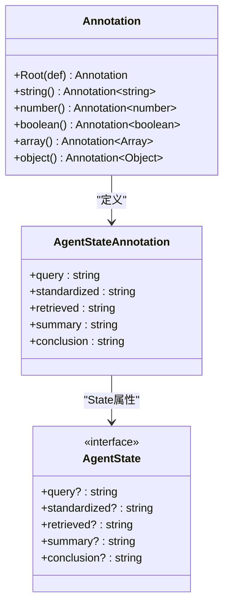
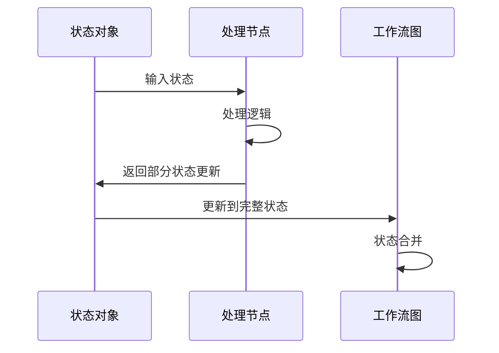
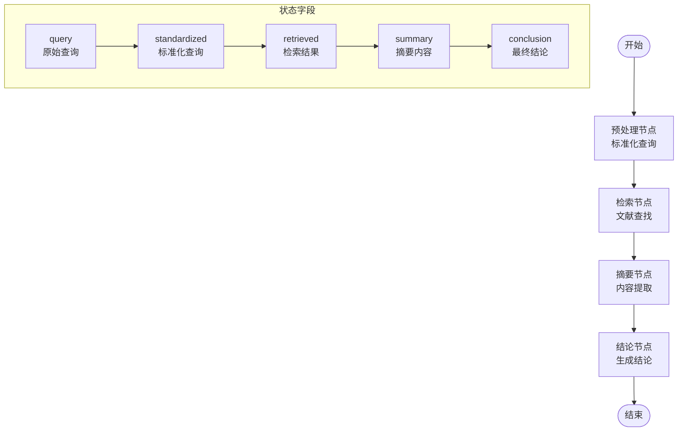
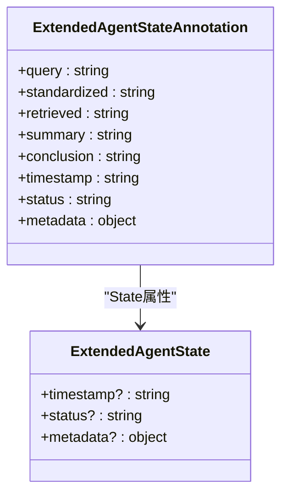
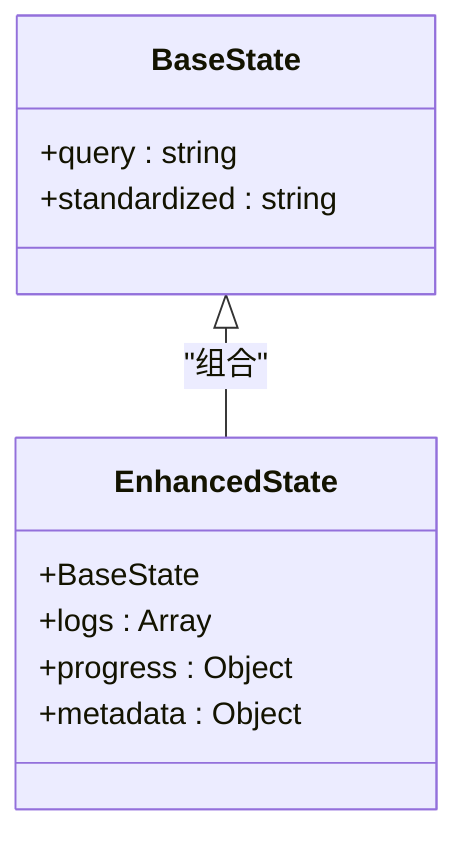

# 状态字段扩展

<cite>
**本文档引用的文件**
- [main.ts](file://main.ts)
- [package.json](file://package.json)
- [tsconfig.json](file://tsconfig.json)
</cite>

## 目录
1. [简介](#简介)
2. [项目结构](#项目结构)
3. [核心组件](#核心组件)
4. [架构概览](#架构概览)
5. [详细组件分析](#详细组件分析)
6. [依赖关系分析](#依赖关系分析)
7. [性能考虑](#性能考虑)
8. [故障排除指南](#故障排除指南)
9. [结论](#结论)

## 简介

本指南详细说明了如何在基于LangGraph的智能体状态系统中扩展AgentStateAnnotation，添加新的状态字段。该系统采用声明式的状态定义方式，通过Annotation.Root来定义状态结构，并自动生成类型安全的状态接口。

该项目演示了一个完整的智能体工作流程，包括查询预处理、文献检索、摘要生成和结论生成四个阶段，为状态字段扩展提供了实际的应用场景。

## 项目结构

项目采用极简的单文件架构，专注于状态系统的实现和扩展：

```mermaid
graph TB
subgraph "项目根目录"
A[main.ts] --> B[主程序入口]
C[package.json] --> D[依赖管理]
E[tsconfig.json] --> F[TypeScript配置]
end
subgraph "核心模块"
G[@langchain/langgraph] --> H[状态图框架]
I[Annotation] --> J[状态定义系统]
K[StateGraph] --> L[工作流编译器]
end
A --> G
A --> I
A --> K
```

**图表来源**
- [main.ts:1-85](file://main.ts#L1-L85)
- [package.json:13-15](file://package.json#L13-L15)

**章节来源**
- [main.ts:1-85](file://main.ts#L1-L85)
- [package.json:1-17](file://package.json#L1-L17)
- [tsconfig.json:1-114](file://tsconfig.json#L1-L114)

## 核心组件

### 状态定义系统

项目使用LangGraph的Annotation系统来定义状态结构，这是类型安全的状态管理核心：



**图表来源**
- [main.ts:4-13](file://main.ts#L4-L13)

### 节点函数系统

每个处理节点都遵循统一的模式，接收状态并返回部分状态更新：



**图表来源**
- [main.ts:16-61](file://main.ts#L16-L61)

**章节来源**
- [main.ts:4-13](file://main.ts#L4-L13)
- [main.ts:16-61](file://main.ts#L16-L61)

## 架构概览

整个系统采用函数式状态图架构，通过节点间的状态传递实现复杂的业务流程：



**图表来源**
- [main.ts:64-76](file://main.ts#L64-L76)
- [main.ts:16-61](file://main.ts#L16-L61)

## 详细组件分析

### 状态定义扩展指南

#### 基本类型扩展

要在AgentStateAnnotation中添加新的状态字段，需要在Annotation.Root定义中添加相应的字段：



**图表来源**
- [main.ts:4-10](file://main.ts#L4-L10)

#### 数组类型使用方法

对于需要存储多个值的状态字段，可以使用数组类型：

```typescript
// 示例：添加日志记录数组
const AgentStateAnnotation = Annotation.Root({
  logs: Annotation.array(Annotation.object({
    timestamp: Annotation.string(),
    level: Annotation.string(),
    message: Annotation.string()
  }))
});
```

#### 对象类型使用方法

对于复杂的数据结构，可以使用对象类型：

```typescript
// 示例：添加进度跟踪对象
const AgentStateAnnotation = Annotation.Root({
  progress: Annotation.object({
    currentStep: Annotation.number(),
    totalSteps: Annotation.number(),
    percentage: Annotation.number()
  })
});
```

### 状态继承和组合模式

#### 继承模式

虽然直接继承可能不适用，但可以通过组合现有状态来实现功能扩展：



#### 组合模式

通过组合多个状态片段来构建复杂的状态结构：

```typescript
// 基础状态
const BaseState = Annotation.Root({
  query: Annotation.string(),
  standardized: Annotation.string()
});

// 扩展状态
const ExtendedState = Annotation.Root({
  ...BaseState,
  logs: Annotation.array(Annotation.object({
    timestamp: Annotation.string(),
    message: Annotation.string()
  })),
  progress: Annotation.object({
    current: Annotation.number(),
    total: Annotation.number()
  })
});
```

### 实际扩展示例

#### 日志记录状态字段

添加日志记录功能，用于跟踪智能体的执行过程：

```typescript
// 在AgentStateAnnotation中添加日志字段
const AgentStateAnnotation = Annotation.Root({
  query: Annotation.string(),
  standardized: Annotation.string(),
  retrieved: Annotation.string(),
  summary: Annotation.string(),
  conclusion: Annotation.string(),
  logs: Annotation.array(Annotation.object({
    timestamp: Annotation.string(),
    level: Annotation.string(),
    message: Annotation.string(),
    nodeId: Annotation.string()
  }))
});

// 在节点中添加日志记录
function logNode(state: AgentState, message: string, level: string = 'info'): Partial<AgentState> {
  const newLogEntry = {
    timestamp: new Date().toISOString(),
    level,
    message,
    nodeId: 'logNode'
  };
  
  return {
    logs: [...(state.logs || []), newLogEntry]
  };
}
```

#### 进度跟踪状态字段

添加进度跟踪功能，监控工作流的执行进度：

```typescript
// 添加进度跟踪字段
const AgentStateAnnotation = Annotation.Root({
  query: Annotation.string(),
  standardized: Annotation.string(),
  retrieved: Annotation.string(),
  summary: Annotation.string(),
  conclusion: Annotation.string(),
  progress: Annotation.object({
    currentStep: Annotation.number(),
    totalSteps: Annotation.number(),
    steps: Annotation.array(Annotation.object({
      nodeId: Annotation.string(),
      startTime: Annotation.string(),
      endTime: Annotation.string(),
      duration: Annotation.number()
    }))
  })
});

// 更新进度跟踪
function updateProgress(state: AgentState, nodeId: string): Partial<AgentState> {
  const now = new Date().toISOString();
  const currentStep = state.progress?.currentStep || 0;
  const totalSteps = state.progress?.totalSteps || 4;
  
  const newStep = {
    nodeId,
    startTime: now,
    duration: 0
  };
  
  return {
    progress: {
      currentStep: currentStep + 1,
      totalSteps,
      steps: [...(state.progress?.steps || []), newStep]
    }
  };
}
```

#### 错误信息状态字段

添加错误处理和状态字段：

```typescript
// 添加错误处理字段
const AgentStateAnnotation = Annotation.Root({
  query: Annotation.string(),
  standardized: Annotation.string(),
  retrieved: Annotation.string(),
  summary: Annotation.string(),
  conclusion: Annotation.string(),
  error: Annotation.object({
    code: Annotation.string(),
    message: Annotation.string(),
    stackTrace: Annotation.string(),
    timestamp: Annotation.string()
  }),
  retryCount: Annotation.number()
});

// 错误处理函数
function handleError(state: AgentState, error: Error): Partial<AgentState> {
  return {
    error: {
      code: error.name,
      message: error.message,
      stackTrace: error.stack,
      timestamp: new Date().toISOString()
    },
    retryCount: (state.retryCount || 0) + 1
  };
}
```

### 状态验证和默认值设置最佳实践

#### 类型验证

使用TypeScript确保状态字段的类型正确：

```typescript
// 定义严格的类型接口
interface LogEntry {
  timestamp: string;
  level: 'info' | 'warning' | 'error';
  message: string;
  nodeId: string;
}

interface ProgressInfo {
  currentStep: number;
  totalSteps: number;
  steps: StepRecord[];
}

interface StepRecord {
  nodeId: string;
  startTime: string;
  endTime?: string;
  duration?: number;
}
```

#### 默认值设置

为可选状态字段提供合理的默认值：

```typescript
// 节点函数中的默认值处理
function preprocessNode(state: AgentState): Partial<AgentState> {
  const query = state.query?.trim() || '';
  const standardized = query.toLowerCase().replace('?', '');
  
  // 确保日志数组有默认值
  const logs = state.logs || [];
  
  return { 
    query, 
    standardized,
    logs: [...logs, {
      timestamp: new Date().toISOString(),
      level: 'info',
      message: '预处理完成',
      nodeId: 'preprocess'
    }]
  };
}
```

#### 版本兼容性处理

为新旧版本的状态数据提供兼容性支持：

```typescript
// 向后兼容的状态升级
function upgradeState(oldState: any): AgentState {
  const newState: AgentState = {
    ...oldState,
    // 新增字段的默认值
    logs: oldState.logs || [],
    progress: oldState.progress || {
      currentStep: 0,
      totalSteps: 4,
      steps: []
    },
    error: oldState.error || null,
    retryCount: oldState.retryCount || 0
  };
  
  return newState;
}
```

**章节来源**
- [main.ts:4-10](file://main.ts#L4-L10)
- [main.ts:16-61](file://main.ts#L16-L61)

## 依赖关系分析

项目的主要依赖关系如下：

```mermaid
graph TB
subgraph "外部依赖"
A[@langchain/langgraph] --> B[状态图框架]
C[TypeScript] --> D[类型检查]
end
subgraph "项目文件"
E[main.ts] --> F[状态定义]
E --> G[节点实现]
E --> H[工作流编译]
I[package.json] --> A
J[tsconfig.json] --> C
end
A --> E
C --> E
```

**图表来源**
- [package.json:13-15](file://package.json#L13-L15)
- [main.ts:1-85](file://main.ts#L1-L85)

**章节来源**
- [package.json:13-15](file://package.json#L13-L15)
- [main.ts:1-85](file://main.ts#L1-L85)

## 性能考虑

### 状态大小优化

- 避免在状态中存储大型数据结构
- 使用引用而非复制大量数据
- 及时清理不需要的日志和中间结果

### 内存管理

- 控制日志数组的大小，定期清理旧日志
- 使用增量更新而非完全替换状态
- 避免在状态中存储重复数据

### 并发处理

- 确保状态更新是原子性的
- 避免状态竞争条件
- 使用适当的同步机制

## 故障排除指南

### 常见问题

1. **状态类型不匹配**
   - 确保返回的Partial<AgentState>包含正确的字段类型
   - 检查可选字段的默认值处理

2. **状态丢失**
   - 确保每个节点都返回需要的状态字段
   - 检查状态合并逻辑

3. **类型推断错误**
   - 确保Annotation定义与实际使用一致
   - 检查TypeScript配置中的严格模式设置

### 调试技巧

- 使用console.log输出状态变化
- 实现状态快照功能
- 添加状态验证中间件

**章节来源**
- [main.ts:16-61](file://main.ts#L16-L61)
- [tsconfig.json:88-111](file://tsconfig.json#L88-L111)

## 结论

通过本指南，您可以在基于LangGraph的智能体系统中有效地扩展状态字段。关键要点包括：

1. **类型安全**：使用Annotation系统确保状态字段的类型正确
2. **扩展性**：通过数组和对象类型支持复杂的数据结构
3. **向后兼容**：设计时考虑未来状态演进的需求
4. **最佳实践**：合理设置默认值，实现状态验证和错误处理

这个系统为智能体状态管理提供了坚实的基础，可以支持各种复杂的业务场景和扩展需求。