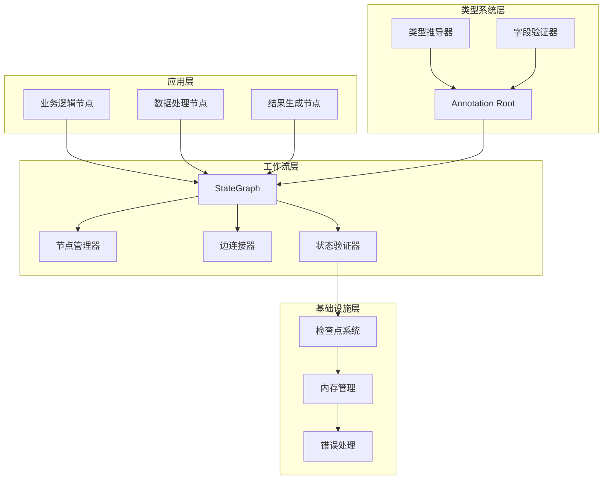
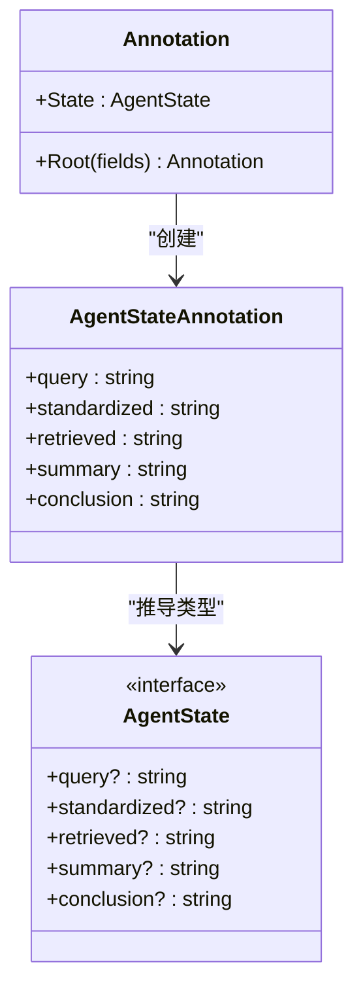
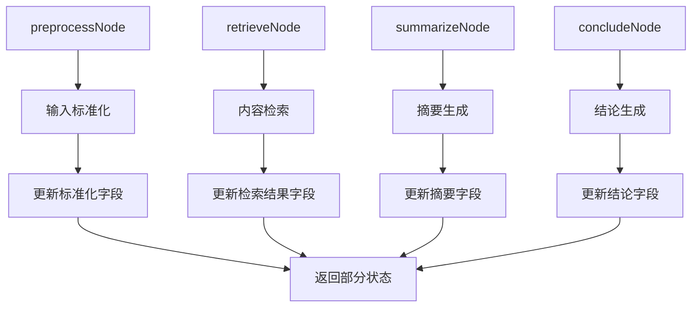
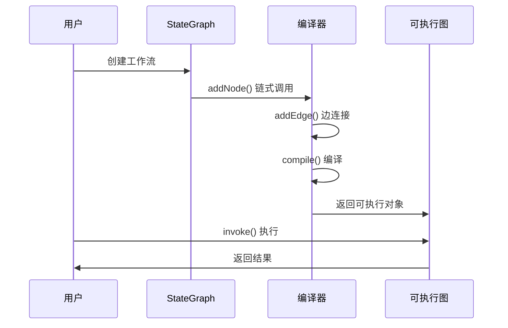

# LangGraph框架介绍

<cite>
**本文档引用的文件**
- [main.ts](file://main.ts)
- [package.json](file://package.json)
- [tsconfig.json](file://tsconfig.json)
- [pnpm-lock.yaml](file://pnpm-lock.yaml)
</cite>

## 目录
1. [简介](#简介)
2. [项目结构](#项目结构)
3. [核心组件](#核心组件)
4. [架构概览](#架构概览)
5. [详细组件分析](#详细组件分析)
6. [依赖关系分析](#依赖关系分析)
7. [性能考虑](#性能考虑)
8. [故障排除指南](#故障排除指南)
9. [结论](#结论)
10. [附录](#附录)

## 简介

LangGraph是一个强大的AI智能体工作流编排框架，专为复杂流程管理和多步骤智能体执行而设计。该框架提供了直观的状态图构建接口，使开发者能够轻松创建和管理复杂的AI工作流。

LangGraph的核心优势在于：
- **类型安全**：完整的TypeScript支持，提供编译时类型检查
- **灵活的状态管理**：基于Annotation的声明式状态定义
- **直观的图构建**：链式调用语法，易于理解和维护
- **强大的扩展性**：支持复杂的分支、条件和并行处理
- **生产就绪**：经过验证的架构，适合企业级应用

## 项目结构

本项目采用最小化但功能完整的结构，专注于演示LangGraph的核心概念和用法。

```mermaid
graph TB
subgraph "项目根目录"
A[main.ts] --> B[主程序入口]
C[package.json] --> D[NPM包配置]
E[tsconfig.json] --> F[TypeScript编译配置]
G[pnpm-lock.yaml] --> H[依赖锁定文件]
end
subgraph "依赖关系"
D --> I[@langchain/langgraph]
I --> J[@langchain/core]
I --> K[@langchain/langgraph-checkpoint]
I --> L[@langchain/langgraph-sdk]
end
```

**图表来源**
- [main.ts:1-85](file://main.ts#L1-L85)
- [package.json:13-15](file://package.json#L13-L15)
- [pnpm-lock.yaml:10-13](file://pnpm-lock.yaml#L10-L13)

**章节来源**
- [main.ts:1-85](file://main.ts#L1-L85)
- [package.json:1-17](file://package.json#L1-L17)
- [tsconfig.json:1-114](file://tsconfig.json#L1-L114)
- [pnpm-lock.yaml:1-233](file://pnpm-lock.yaml#L1-L233)

## 核心组件

### StateGraph类

StateGraph是LangGraph的核心类，用于构建和管理状态图。它提供了以下关键功能：

- **节点管理**：添加、删除和配置工作流节点
- **边连接**：定义节点间的执行顺序和条件
- **状态定义**：通过Annotation定义强类型状态结构
- **工作流编译**：将图结构转换为可执行的工作流

### Annotation系统

Annotation提供了声明式的状态定义方式，具有以下特点：

- **类型推导**：自动推导状态类型，确保类型安全
- **字段声明**：清晰定义状态中的各个字段
- **默认值支持**：可为字段设置默认值
- **嵌套结构**：支持复杂的嵌套状态结构

### START和END常量

- **START**：工作流的起始标记，表示流程的开始
- **END**：工作流的结束标记，表示流程的终止
- **作用**：定义工作流的边界和执行路径

**章节来源**
- [main.ts:1-13](file://main.ts#L1-L13)
- [main.ts:64-76](file://main.ts#L64-L76)

## 架构概览

LangGraph框架采用分层架构设计，从底层的类型系统到上层的工作流编排，形成了完整的解决方案。



**图表来源**
- [main.ts:4-13](file://main.ts#L4-L13)
- [main.ts:64-76](file://main.ts#L64-L76)

## 详细组件分析

### 状态定义组件

状态定义是LangGraph的核心，通过Annotation.Root创建强类型的状态结构。



**图表来源**
- [main.ts:4-13](file://main.ts#L4-L13)

#### 状态字段说明

| 字段名 | 类型 | 描述 | 用途 |
|--------|------|------|------|
| query | string | 用户原始查询 | 输入数据源 |
| standardized | string | 标准化后的查询 | 处理后输入 |
| retrieved | string | 检索到的内容 | 中间处理结果 |
| summary | string | 内容摘要 | 上下文信息 |
| conclusion | string | 最终结论 | 输出结果 |

**章节来源**
- [main.ts:4-13](file://main.ts#L4-L13)

### 节点组件

每个节点都是独立的功能模块，负责特定的数据处理任务。



**图表来源**
- [main.ts:16-61](file://main.ts#L16-L61)

#### 节点功能分析

**预处理节点 (preprocessNode)**
- 功能：清理和标准化用户输入
- 处理：去除空白字符、转换小写、移除问号
- 输出：更新query和standardized字段

**检索节点 (retrieveNode)**
- 功能：根据关键词检索相关内容
- 数据源：内置数据库映射
- 输出：更新retrieved字段

**摘要节点 (summarizeNode)**
- 功能：生成内容摘要
- 处理：对未找到内容进行特殊处理
- 输出：更新summary字段

**结论节点 (concludeNode)**
- 功能：基于摘要生成最终结论
- 逻辑：根据摘要内容生成不同结论
- 输出：更新conclusion字段

**章节来源**
- [main.ts:16-61](file://main.ts#L16-L61)

### 工作流编译组件

工作流编译是将图结构转换为可执行对象的关键过程。



**图表来源**
- [main.ts:64-76](file://main.ts#L64-L76)

#### 编译过程详解

1. **节点注册**：通过addNode方法注册所有工作节点
2. **边连接**：使用addEdge定义执行顺序
3. **边界定义**：START和END常量定义工作流边界
4. **图优化**：编译器优化图结构以提高执行效率
5. **状态验证**：验证状态定义的完整性

**章节来源**
- [main.ts:64-76](file://main.ts#L64-L76)

## 依赖关系分析

LangGraph框架的依赖关系体现了其模块化设计和可扩展性。

```mermaid
graph TB
subgraph "核心依赖"
A[@langchain/langgraph]
B[@langchain/core]
end
subgraph "检查点系统"
C[@langchain/langgraph-checkpoint]
end
subgraph "SDK支持"
D[@langchain/langgraph-sdk]
end
subgraph "类型验证"
E[zod]
F[zod-to-json-schema]
end
A --> B
A --> C
A --> D
A --> E
A --> F
subgraph "运行时要求"
G[Node.js >= 18]
H[TypeScript >= 4.0]
end
A --> G
B --> H
```

**图表来源**
- [pnpm-lock.yaml:50-60](file://pnpm-lock.yaml#L50-L60)
- [package.json:13-15](file://package.json#L13-L15)

### 依赖版本兼容性

| 包名 | 版本要求 | 兼容性 | 用途 |
|------|----------|--------|------|
| @langchain/langgraph | ^1.2.8 | Node.js >= 18 | 核心框架 |
| @langchain/core | ^1.1.16 | Node.js >= 20 | 基础核心 |
| zod | ^3.25.32 或 ^4.2.0 | 可选 | 类型验证 |
| zod-to-json-schema | ^3.x | 可选 | JSON模式转换 |

**章节来源**
- [pnpm-lock.yaml:50-60](file://pnpm-lock.yaml#L50-L60)
- [package.json:13-15](file://package.json#L13-L15)

## 性能考虑

LangGraph框架在设计时充分考虑了性能优化，以下是关键的性能考量因素：

### 内存管理
- **状态压缩**：只保存必要的状态信息
- **增量更新**：节点只返回需要更新的部分状态
- **垃圾回收**：及时释放不再使用的中间状态

### 执行效率
- **并行处理**：支持多个节点同时执行
- **缓存机制**：重复计算的结果可以被缓存
- **异步操作**：充分利用异步I/O提升吞吐量

### 扩展性
- **模块化设计**：便于添加新的节点类型
- **插件架构**：支持自定义检查点存储
- **分布式支持**：可扩展到多节点部署

## 故障排除指南

### 常见问题及解决方案

**问题1：类型错误**
- 症状：TypeScript编译时报错
- 解决方案：确保所有节点都正确返回Partial<AgentState>

**问题2：状态不一致**
- 症状：节点间状态传递异常
- 解决方案：检查边连接是否正确，确认状态字段定义完整

**问题3：执行超时**
- 症状：工作流执行时间过长
- 解决方案：优化节点算法，考虑并行执行可能的步骤

**问题4：内存泄漏**
- 症状：长时间运行后内存占用持续增长
- 解决方案：检查是否有循环引用，及时清理临时状态

**章节来源**
- [main.ts:16-61](file://main.ts#L16-L61)

## 结论

LangGraph框架为AI智能体工作流编排提供了一个强大而灵活的解决方案。通过其类型安全的设计、直观的API和强大的扩展能力，开发者可以轻松构建复杂的智能体执行流程。

### 主要优势总结

1. **类型安全**：完整的TypeScript支持确保代码质量
2. **易用性**：简洁的API设计，学习曲线平缓
3. **灵活性**：支持复杂的分支和条件逻辑
4. **可扩展性**：模块化设计便于功能扩展
5. **生产就绪**：经过验证的架构，适合企业级应用

### 适用场景

- **智能客服系统**：多轮对话和问题解决流程
- **数据分析管道**：复杂的数据处理和报告生成
- **内容创作助手**：多步骤的内容生成和编辑流程
- **决策支持系统**：基于规则的复杂决策流程

## 附录

### 快速开始指南

1. **安装依赖**：`npm install @langchain/langgraph`
2. **定义状态**：使用Annotation.Root创建状态结构
3. **创建节点**：实现各个处理步骤的函数
4. **构建工作流**：使用StateGraph创建流程图
5. **编译执行**：调用compile()获取可执行对象
6. **运行测试**：使用invoke()执行工作流

### 最佳实践建议

1. **状态设计**：保持状态结构简单明了，避免过度嵌套
2. **节点职责**：每个节点专注于单一功能，便于测试和维护
3. **错误处理**：为每个节点实现适当的错误处理逻辑
4. **性能优化**：合理设计节点间的依赖关系，避免不必要的串行执行
5. **监控日志**：添加适当的日志记录，便于调试和性能分析