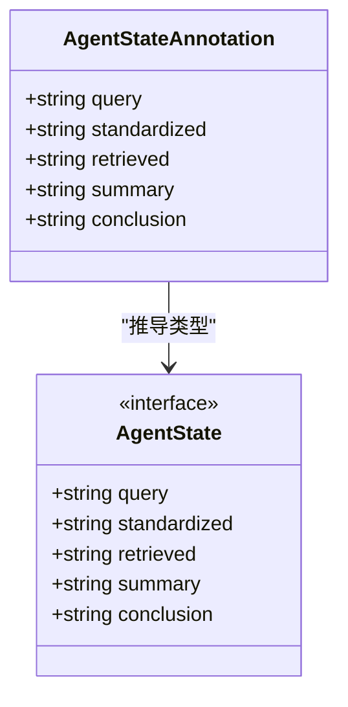
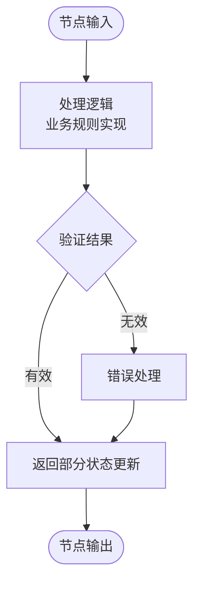
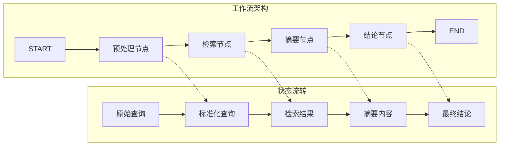
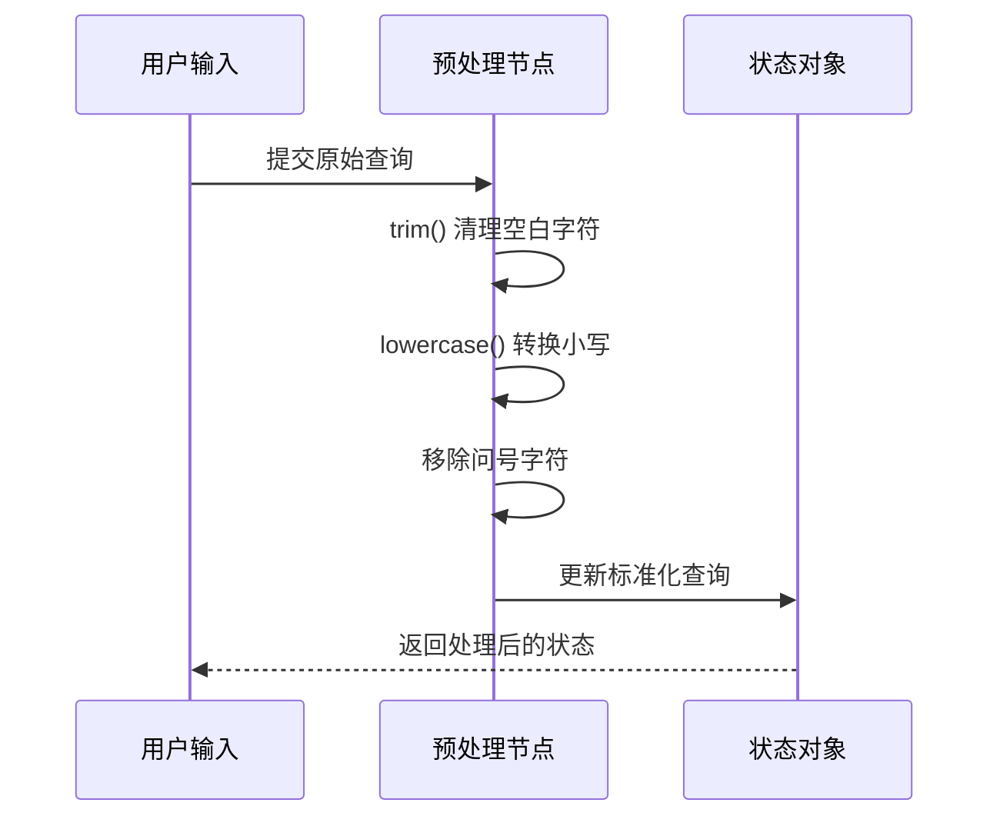
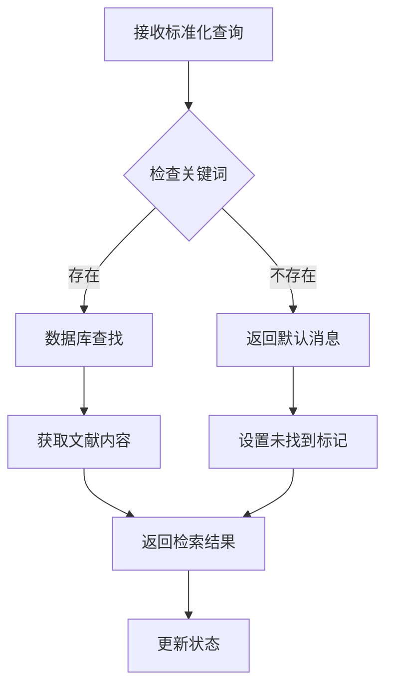
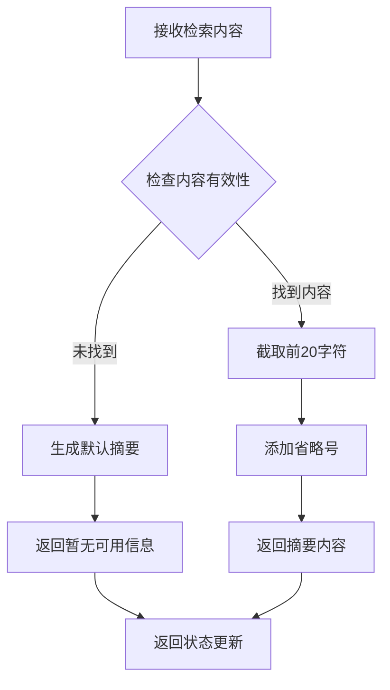
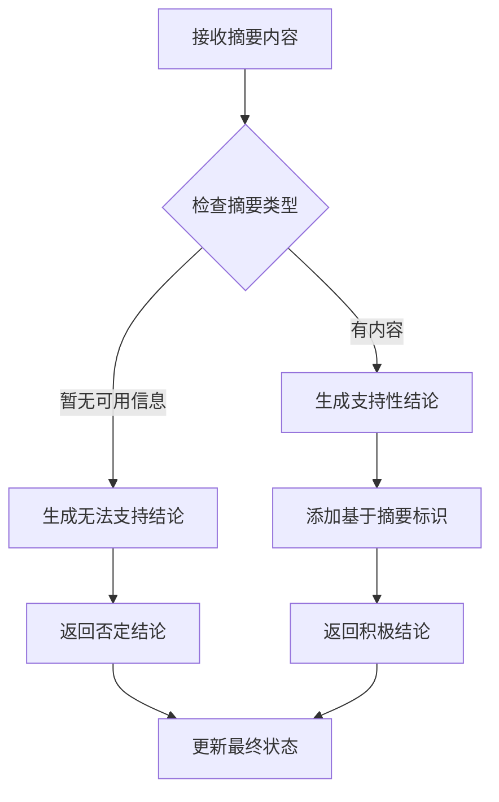
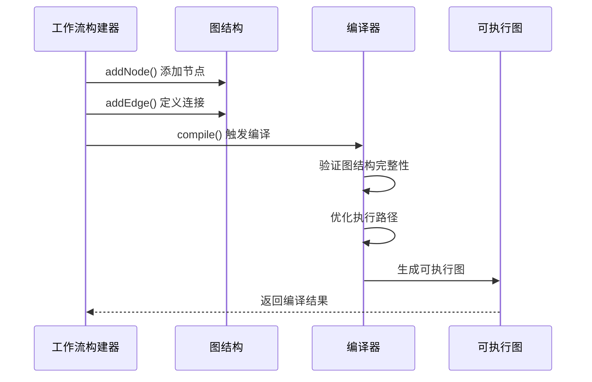

# 工作流编排思想

<cite>
**本文档引用的文件**
- [main.ts](file://main.ts)
- [package.json](file://package.json)
- [tsconfig.json](file://tsconfig.json)
</cite>

## 目录
1. [引言](#引言)
2. [项目结构](#项目结构)
3. [核心组件](#核心组件)
4. [架构概览](#架构概览)
5. [详细组件分析](#详细组件分析)
6. [依赖分析](#依赖分析)
7. [性能考虑](#性能考虑)
8. [故障排除指南](#故障排除指南)
9. [结论](#结论)

## 引言

本项目展示了基于LangChain LangGraph的智能体工作流编排技术。通过StateGraph构建线性工作流，实现了从用户查询到最终结论的完整处理流程。该工作流采用状态驱动的设计模式，每个处理节点专注于特定的任务，通过明确的连接关系实现有序的数据流转。

工作流编排的核心思想是将复杂的智能体操作分解为独立的处理步骤，每个步骤都有明确的输入输出规范，并通过状态对象在节点间传递数据。这种设计使得系统具有良好的可维护性和扩展性。

## 项目结构

该项目采用极简的单文件架构，所有功能集中在主入口文件中：

```mermaid
graph TB
subgraph "项目根目录"
A[main.ts - 主程序入口]
B[package.json - 依赖配置]
C[tsconfig.json - TypeScript配置]
end
subgraph "核心依赖"
D[@langchain/langgraph - 工作流框架]
end
A --> D
B --> D
```

**图表来源**
- [main.ts:1-85](file://main.ts#L1-L85)
- [package.json:13-15](file://package.json#L13-L15)

**章节来源**
- [main.ts:1-85](file://main.ts#L1-L85)
- [package.json:1-17](file://package.json#L1-L17)
- [tsconfig.json:1-114](file://tsconfig.json#L1-L114)

## 核心组件

### 状态定义系统

项目使用Annotation框架定义智能体状态结构，这是一个类型安全的状态管理模式：



**图表来源**
- [main.ts:4-13](file://main.ts#L4-L13)

状态结构包含五个关键字段：
- `query`: 原始用户输入
- `standardized`: 标准化后的查询
- `retrieved`: 检索到的文献内容
- `summary`: 文献摘要
- `conclusion`: 最终结论

### 节点函数设计

每个处理节点都遵循统一的接口规范，接收状态对象并返回部分状态更新：



**图表来源**
- [main.ts:16-61](file://main.ts#L16-L61)

**章节来源**
- [main.ts:4-61](file://main.ts#L4-L61)

## 架构概览

整个工作流采用线性编排模式，形成一个完整的处理管道：



**图表来源**
- [main.ts:64-76](file://main.ts#L64-L76)

工作流的生命周期包括以下阶段：
1. **初始化阶段**: 创建状态注解和节点函数
2. **构建阶段**: 使用StateGraph定义节点和连接关系
3. **编译阶段**: 将工作流转换为可执行的图结构
4. **执行阶段**: 处理输入并产生输出结果

**章节来源**
- [main.ts:64-85](file://main.ts#L64-L85)

## 详细组件分析

### 预处理节点分析

预处理节点负责清理和标准化用户输入：



**图表来源**
- [main.ts:16-21](file://main.ts#L16-L21)

该节点的关键特性：
- 输入验证和清理
- 标准化处理规则
- 类型安全的状态更新

**章节来源**
- [main.ts:16-21](file://main.ts#L16-L21)

### 检索节点分析

检索节点模拟数据库查询过程：



**图表来源**
- [main.ts:24-33](file://main.ts#L24-L33)

检索逻辑包含：
- 关键词匹配算法
- 默认值处理机制
- 错误情况的优雅降级

**章节来源**
- [main.ts:24-33](file://main.ts#L24-L33)

### 摘要节点分析

摘要节点负责内容压缩和格式化：



**图表来源**
- [main.ts:36-47](file://main.ts#L36-L47)

摘要生成策略：
- 内容有效性检查
- 动态长度控制
- 格式一致性保证

**章节来源**
- [main.ts:36-47](file://main.ts#L36-L47)

### 结论节点分析

结论节点整合摘要信息生成最终输出：



**图表来源**
- [main.ts:50-61](file://main.ts#L50-L61)

结论生成规则：
- 条件分支逻辑
- 上下文敏感的输出格式
- 语义一致性保证

**章节来源**
- [main.ts:50-61](file://main.ts#L50-L61)

### 工作流编译机制

工作流编译过程将声明式定义转换为可执行的图结构：



**图表来源**
- [main.ts:64-76](file://main.ts#L64-L76)

编译过程的关键步骤：
- 节点注册和验证
- 边连接关系检查
- 循环依赖检测
- 执行计划优化

**章节来源**
- [main.ts:64-76](file://main.ts#L64-L76)

## 依赖分析

项目依赖关系相对简单，主要依赖于LangGraph框架：

```mermaid
graph TB
subgraph "应用层"
A[main.ts]
end
subgraph "框架层"
B[@langchain/langgraph]
end
subgraph "工具层"
C[TypeScript]
D[Node.js运行时]
end
A --> B
B --> C
C --> D
```

**图表来源**
- [package.json:13-15](file://package.json#L13-L15)

**章节来源**
- [package.json:13-15](file://package.json#L13-L15)

## 性能考虑

### 执行效率优化

1. **状态最小化原则**: 每个节点只返回必要的状态更新，避免状态膨胀
2. **同步执行策略**: 当前实现采用同步执行，适合轻量级处理
3. **内存管理**: 状态对象在每次迭代中重新创建，避免内存泄漏

### 可扩展性设计

1. **节点模块化**: 每个处理节点独立封装，便于替换和扩展
2. **状态演进**: 支持向状态结构添加新字段而不影响现有逻辑
3. **条件路由**: 可以轻松添加分支逻辑和条件判断

## 故障排除指南

### 常见问题诊断

1. **状态不一致错误**
   - 检查节点返回的状态字段是否与Annotation定义匹配
   - 验证状态更新的类型安全性

2. **循环依赖问题**
   - 确认工作流图没有形成循环引用
   - 检查START和END节点的正确使用

3. **执行超时问题**
   - 优化节点处理逻辑的复杂度
   - 考虑异步处理和并发执行

### 调试技巧

1. **状态可视化**: 在关键节点添加状态打印语句
2. **执行追踪**: 记录每个节点的执行时间和结果
3. **边界测试**: 测试各种输入边界和异常情况

**章节来源**
- [main.ts:79-85](file://main.ts#L79-L85)

## 结论

本项目成功展示了基于StateGraph的智能体工作流编排技术。通过清晰的状态定义、模块化的节点设计和严格的连接关系，实现了从简单到复杂的智能体处理流程。

工作流编排的核心价值在于：
- **可维护性**: 模块化设计使得每个组件职责单一
- **可扩展性**: 易于添加新的处理节点和修改现有逻辑
- **可观测性**: 清晰的状态流转便于调试和监控
- **类型安全**: 使用TypeScript确保代码质量

对于更复杂的工作流场景，可以考虑：
- 添加并行处理能力
- 实现条件分支和动态路由
- 集成错误恢复和重试机制
- 优化大规模数据处理的性能