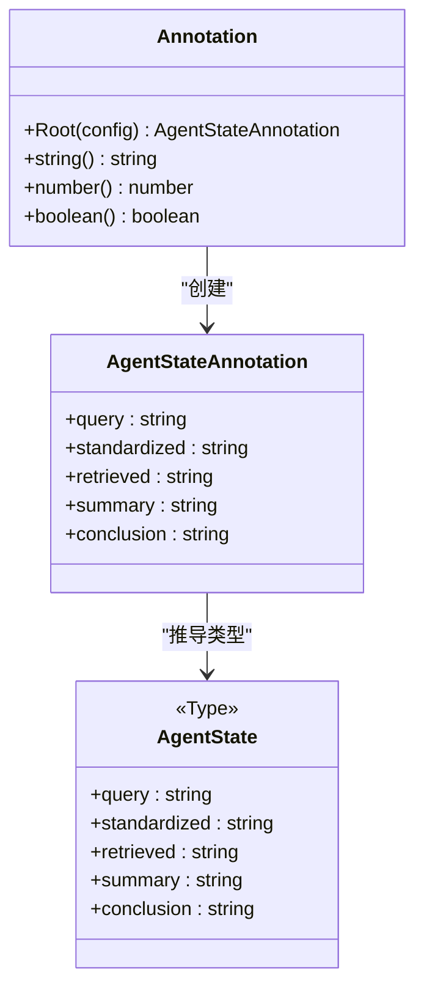
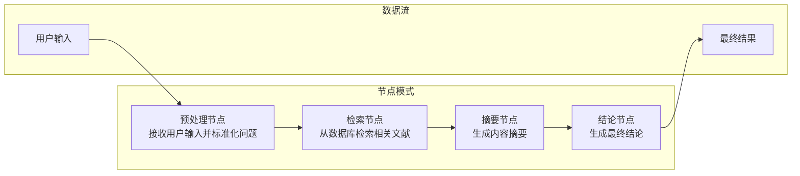
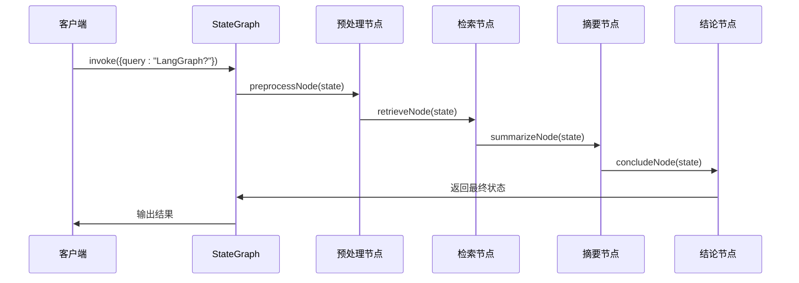
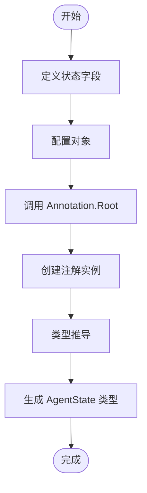
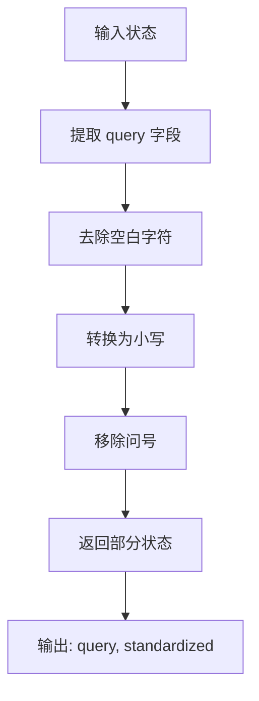
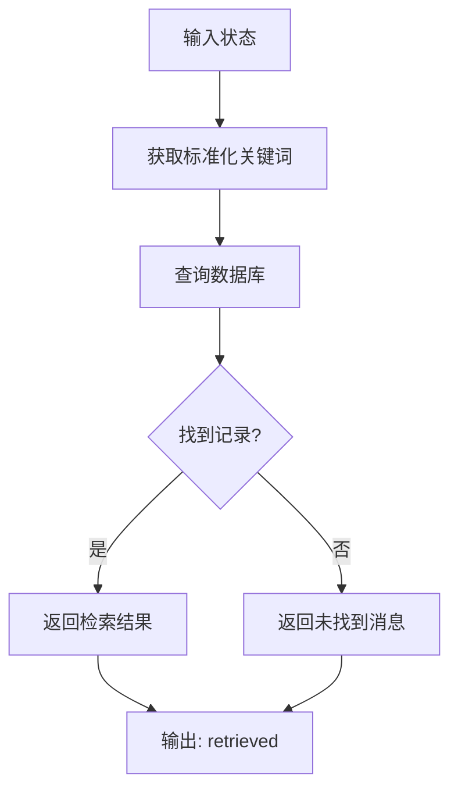
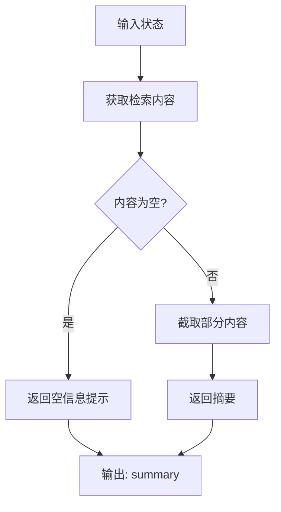
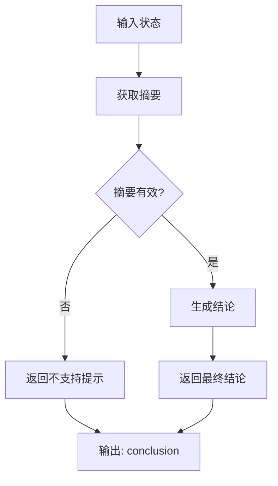
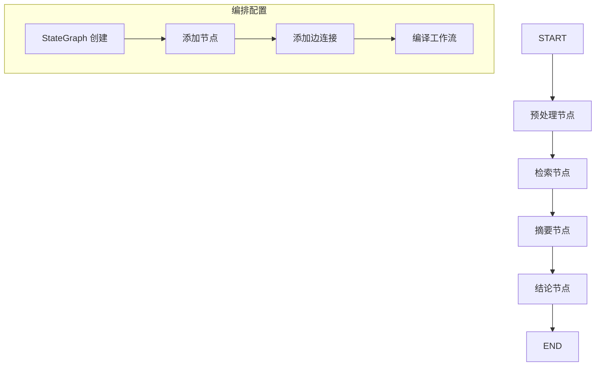
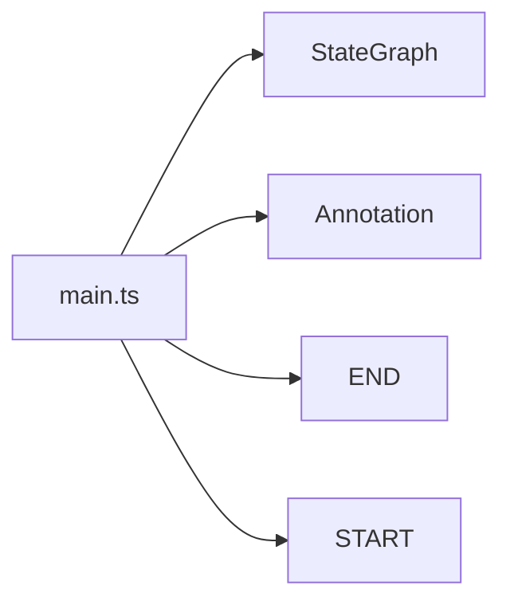

# 核心概念解析

<cite>
**本文档引用的文件**
- [main.ts](file://main.ts)
- [package.json](file://package.json)
- [tsconfig.json](file://tsconfig.json)
</cite>

## 目录
1. [引言](#引言)
2. [项目结构](#项目结构)
3. [核心组件](#核心组件)
4. [架构概览](#架构概览)
5. [详细组件分析](#详细组件分析)
6. [依赖分析](#依赖分析)
7. [性能考虑](#性能考虑)
8. [故障排除指南](#故障排除指南)
9. [结论](#结论)

## 引言

本项目展示了基于LangGraph框架的AI智能体复合系统的设计与实现。该系统通过状态管理、节点模式和工作流编排等核心概念，构建了一个类型安全、可扩展的智能体执行框架。本文档将深入解析这些核心概念的设计思想和实现原理，帮助开发者理解智能体的运行机制。

## 项目结构

该项目采用极简的单文件架构，专注于展示LangGraph框架的核心功能：

```mermaid
graph TB
subgraph "项目根目录"
main_ts[main.ts<br/>主程序入口]
pkg_json[package.json<br/>项目配置]
ts_cfg[tsconfig.json<br/>TypeScript配置]
end
subgraph "依赖管理"
langgraph[@langchain/langgraph<br/>LangGraph框架]
end
main_ts --> langgraph
pkg_json --> main_ts
ts_cfg --> main_ts
```

**图表来源**
- [main.ts:1-85](file://main.ts#L1-L85)
- [package.json:1-17](file://package.json#L1-L17)

**章节来源**
- [main.ts:1-85](file://main.ts#L1-L85)
- [package.json:1-17](file://package.json#L1-L17)
- [tsconfig.json:1-114](file://tsconfig.json#L1-L114)

## 核心组件

### 状态管理机制

系统使用`Annotation.Root`实现类型安全的状态定义，这是LangGraph推荐的状态管理模式：



**图表来源**
- [main.ts:4-13](file://main.ts#L4-L13)

该机制的优势包括：
- **类型安全**：通过TypeScript确保状态字段的类型正确性
- **声明式定义**：使用`Annotation.Root`集中定义所有状态字段
- **自动推导**：从注解定义自动生成对应的TypeScript类型

**章节来源**
- [main.ts:4-13](file://main.ts#L4-L13)

### 节点模式设计

系统实现了经典的节点模式，每个节点都遵循单一功能原则：



**图表来源**
- [main.ts:15-61](file://main.ts#L15-L61)

每个节点的特点：
- **单一职责**：每个节点只负责特定的数据处理任务
- **纯函数特性**：输入状态决定输出状态的部分字段
- **类型安全**：严格遵循AgentState接口定义

**章节来源**
- [main.ts:15-61](file://main.ts#L15-L61)

### 工作流编排

使用`StateGraph`构建智能体执行流程：



**图表来源**
- [main.ts:64-76](file://main.ts#L64-L76)

**章节来源**
- [main.ts:64-76](file://main.ts#L64-L76)

## 架构概览

整个系统采用分层架构设计，体现了清晰的关注点分离：

```mermaid
graph TB
subgraph "应用层"
main_ts[main.ts<br/>应用入口]
end
subgraph "状态管理层"
annotation[Annotation.Root<br/>状态定义]
state_type[AgentState<br/>类型推导]
end
subgraph "节点层"
nodes[节点函数集合]
preprocess_node[预处理节点]
retrieve_node[检索节点]
summarize_node[摘要节点]
conclude_node[结论节点]
end
subgraph "编排层"
state_graph[StateGraph<br/>工作流编排]
edges[边连接<br/>执行路径]
end
subgraph "运行时层"
compiler[编译器<br/>graph.compile()]
executor[执行器<br/>graph.invoke]
end
main_ts --> annotation
annotation --> state_type
state_type --> nodes
nodes --> state_graph
state_graph --> edges
edges --> compiler
compiler --> executor
```

**图表来源**
- [main.ts:1-85](file://main.ts#L1-L85)

## 详细组件分析

### 状态定义组件

状态定义是整个系统的核心基础，通过`Annotation.Root`实现：



**图表来源**
- [main.ts:4-13](file://main.ts#L4-L13)

关键特性：
- **字段声明**：明确声明所有状态字段及其类型
- **类型安全**：确保编译时类型检查
- **运行时验证**：在执行时验证状态完整性

**章节来源**
- [main.ts:4-13](file://main.ts#L4-L13)

### 节点实现组件

每个节点都实现了特定的功能，遵循单一职责原则：

#### 预处理节点分析



**图表来源**
- [main.ts:16-21](file://main.ts#L16-L21)

#### 检索节点分析



**图表来源**
- [main.ts:24-33](file://main.ts#L24-L33)

#### 摘要节点分析



**图表来源**
- [main.ts:36-47](file://main.ts#L36-L47)

#### 结论节点分析



**图表来源**
- [main.ts:50-61](file://main.ts#L50-L61)

**章节来源**
- [main.ts:16-61](file://main.ts#L16-L61)

### 工作流编排组件

工作流编排通过`StateGraph`实现，定义了完整的执行流程：



**图表来源**
- [main.ts:64-76](file://main.ts#L64-L76)

编排特点：
- **声明式配置**：使用链式调用定义工作流
- **类型安全**：编译时验证状态一致性
- **灵活扩展**：易于添加新的节点和边

**章节来源**
- [main.ts:64-76](file://main.ts#L64-L76)

## 依赖分析

### 外部依赖

项目的主要依赖是LangGraph框架，提供了核心的智能体编排能力：

```mermaid
graph TB
subgraph "项目依赖"
main_ts[main.ts]
package_json[package.json]
end
subgraph "外部依赖"
langgraph[@langchain/langgraph v1.2.8]
end
subgraph "TypeScript配置"
tsconfig_json[tsconfig.json]
end
main_ts --> langgraph
package_json --> main_ts
tsconfig_json --> main_ts
```

**图表来源**
- [package.json:13-15](file://package.json#L13-L15)
- [main.ts:1](file://main.ts#L1)

**章节来源**
- [package.json:13-15](file://package.json#L13-L15)
- [main.ts:1](file://main.ts#L1)

### 内部模块依赖



**图表来源**
- [main.ts:1](file://main.ts#L1)

## 性能考虑

### 类型安全带来的性能优势

- **编译时优化**：TypeScript类型检查在编译时完成，运行时无需额外类型验证开销
- **内存效率**：状态对象按需更新，避免不必要的状态复制
- **执行效率**：节点函数的纯函数特性便于缓存和优化

### 扩展性考虑

- **模块化设计**：每个节点独立实现，便于单独测试和优化
- **状态演进**：通过状态字段的增量更新，支持复杂的业务逻辑
- **并发处理**：LangGraph框架支持多线程和异步操作

## 故障排除指南

### 常见问题及解决方案

#### 状态类型不匹配

**问题描述**：节点返回的状态字段与定义的类型不一致

**解决方案**：
- 检查节点函数的返回值是否包含正确的状态字段
- 确保返回的对象符合`Partial<AgentState>`类型要求

#### 节点执行顺序错误

**问题描述**：节点按照错误的顺序执行

**解决方案**：
- 检查`StateGraph`中节点的添加顺序
- 确认边连接的起点和终点配置正确

#### 状态丢失问题

**问题描述**：某些状态字段在执行过程中丢失

**解决方案**：
- 在每个节点中显式返回需要的状态字段
- 使用状态合并策略确保状态完整性

**章节来源**
- [main.ts:16-61](file://main.ts#L16-L61)

## 结论

本项目成功展示了基于LangGraph框架的AI智能体复合系统的核心设计理念。通过类型安全的状态管理、清晰的节点模式设计和灵活的工作流编排，构建了一个可扩展、可维护的智能体执行框架。

### 主要成就

1. **类型安全的状态管理**：通过`Annotation.Root`实现编译时类型检查
2. **模块化的节点设计**：每个节点专注于单一功能，遵循单一职责原则
3. **声明式的工作流编排**：使用`StateGraph`实现清晰的执行流程
4. **简洁而强大的架构**：在保持代码简洁的同时提供强大的功能

### 应用价值

该架构为构建复杂的AI智能体系统提供了良好的基础模板，可以轻松扩展到更复杂的业务场景中。其设计原则和实现模式具有广泛的适用性和参考价值。