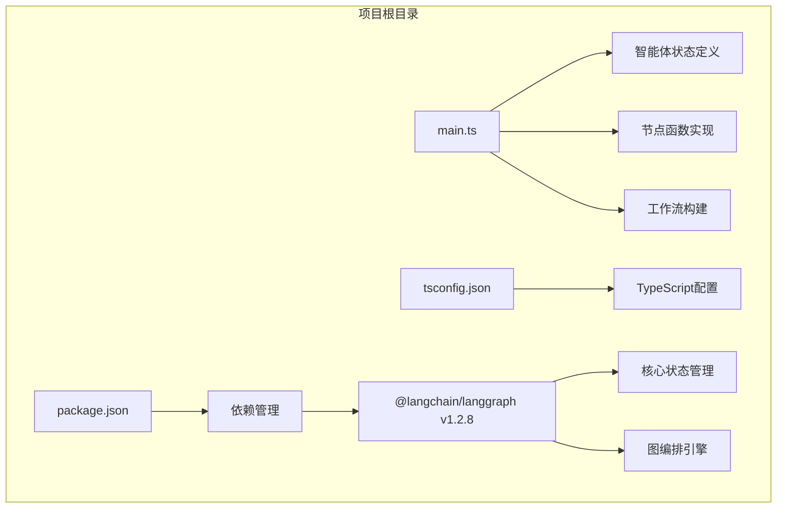
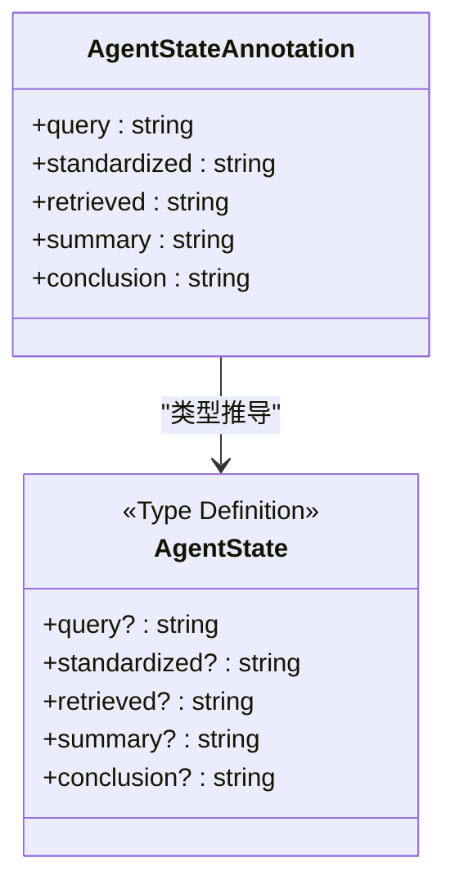
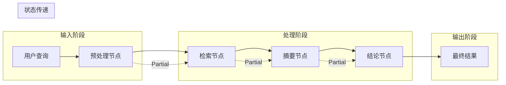
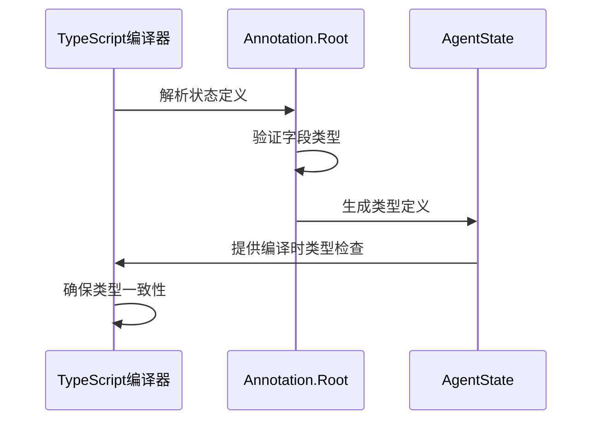
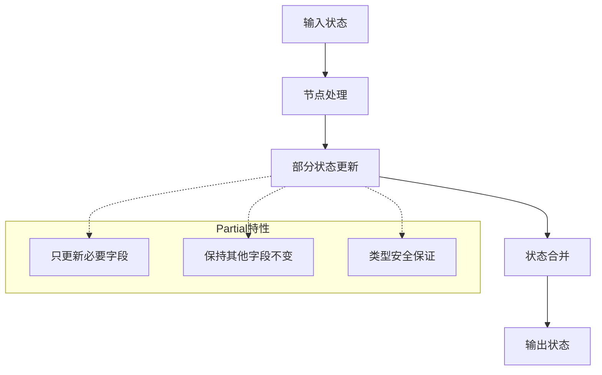

# 状态管理机制

<cite>
**本文引用的文件**
- [main.ts](file://main.ts)
- [package.json](file://package.json)
- [tsconfig.json](file://tsconfig.json)
</cite>

## 目录
1. [引言](#引言)
2. [项目结构](#项目结构)
3. [核心组件](#核心组件)
4. [架构概览](#架构概览)
5. [详细组件分析](#详细组件分析)
6. [依赖关系分析](#依赖关系分析)
7. [性能考虑](#性能考虑)
8. [故障排除指南](#故障排除指南)
9. [结论](#结论)

## 引言

本项目展示了基于LangGraph的智能体状态管理系统的设计与实现。通过使用`Annotation.Root`定义类型安全的状态结构，实现了端到端的智能体工作流程管理。该系统采用函数式编程范式，每个处理节点都遵循相同的输入输出模式，确保了代码的可维护性和可扩展性。

## 项目结构

该项目采用极简的单文件架构，所有功能集中在主入口文件中：



**图表来源**
- [main.ts:1-85](file://main.ts#L1-L85)
- [package.json:13-15](file://package.json#L13-L15)

**章节来源**
- [main.ts:1-85](file://main.ts#L1-L85)
- [package.json:1-17](file://package.json#L1-L17)
- [tsconfig.json:1-114](file://tsconfig.json#L1-L114)

## 核心组件

### 状态定义系统

项目使用LangGraph的`Annotation.Root` API定义类型安全的状态结构。这种设计提供了编译时类型检查和运行时数据验证的双重保障。



**图表来源**
- [main.ts:4-13](file://main.ts#L4-L13)

### 节点函数体系

系统包含四个核心处理节点，每个节点都遵循统一的接口规范：

| 节点名称 | 输入状态 | 输出状态 | 主要职责 |
|---------|---------|---------|----------|
| preprocessNode | AgentState | Partial<AgentState> | 用户查询标准化 |
| retrieveNode | AgentState | Partial<AgentState> | 文献检索与匹配 |
| summarizeNode | AgentState | Partial<AgentState> | 内容摘要生成 |
| concludeNode | AgentState | Partial<AgentState> | 最终结论生成 |

**章节来源**
- [main.ts:15-61](file://main.ts#L15-L61)

## 架构概览

整个智能体系统采用线性流水线架构，数据在节点间按顺序传递：



**图表来源**
- [main.ts:63-76](file://main.ts#L63-L76)

## 详细组件分析

### 状态字段详解

#### query 字段
- **类型**: string
- **含义**: 原始用户查询输入
- **特点**: 支持空值检查，经过预处理后进入标准化流程
- **用途**: 作为智能体处理的起点，承载用户的初始意图

#### standardized 字段
- **类型**: string  
- **含义**: 标准化后的查询文本
- **处理逻辑**: 小写转换、问号移除、空白字符清理
- **用途**: 提供统一格式的查询条件，提高检索准确性

#### retrieved 字段
- **类型**: string
- **含义**: 检索到的文献内容或错误提示
- **默认值**: "未找到相关文献"
- **用途**: 存储检索结果，为后续摘要生成提供素材

#### summary 字段
- **类型**: string
- **含义**: 文献内容的摘要信息
- **特殊值**: "暂无可用信息"（当检索失败时）
- **用途**: 精简内容以便于理解和决策

#### conclusion 字段
- **类型**: string
- **含义**: 基于摘要生成的最终结论
- **逻辑分支**: 
  - 有可用信息时：基于摘要内容生成结论
  - 无可用信息时：提供无法支持的说明
- **用途**: 向用户提供最终的智能体响应

### 类型推导机制

系统通过`Annotation.Root.State`实现类型安全的状态管理：



**图表来源**
- [main.ts:12-13](file://main.ts#L12-L13)

### 状态传递机制

每个节点函数都返回`Partial<AgentState>`对象，这种设计具有以下优势：



**图表来源**
- [main.ts:16-61](file://main.ts#L16-L61)

**章节来源**
- [main.ts:4-13](file://main.ts#L4-L13)
- [main.ts:15-61](file://main.ts#L15-L61)

## 依赖关系分析

### 外部依赖

项目主要依赖LangGraph库提供的核心功能：

```mermaid
graph TB
subgraph "外部依赖"
A[@langchain/langgraph v1.2.8] --> B[StateGraph]
A --> C[Annotation.Root]
A --> D[START/END常量]
B --> E[状态图编排]
C --> F[类型安全状态定义]
D --> G[工作流控制]
end
subgraph "内部模块"
H[main.ts] --> A
H --> I[业务逻辑实现]
end
```

**图表来源**
- [package.json:13-15](file://package.json#L13-L15)
- [main.ts:1](file://main.ts#L1)

### 内部模块耦合

系统采用松耦合设计，各模块职责明确：

| 模块 | 职责 | 依赖关系 | 影响范围 |
|------|------|----------|----------|
| 状态定义 | 定义类型安全的状态结构 | 仅依赖LangGraph | 全局类型定义 |
| 节点函数 | 实现具体业务逻辑 | 依赖AgentState类型 | 对应处理流程 |
| 工作流构建 | 组织节点间的执行关系 | 依赖所有节点函数 | 整体执行流程 |

**章节来源**
- [package.json:13-15](file://package.json#L13-L15)
- [main.ts:63-76](file://main.ts#L63-L76)

## 性能考虑

### 内存优化策略

1. **增量状态更新**: 使用`Partial<AgentState>`避免不必要的状态复制
2. **字符串处理优化**: 在预处理阶段进行必要的字符串清理
3. **缓存机制**: 可考虑为检索结果添加缓存层

### 并发处理

- 当前实现为串行处理，适合简单场景
- 复杂应用可考虑引入并发执行机制
- 需要注意状态同步和一致性问题

## 故障排除指南

### 常见问题及解决方案

#### 类型错误
**问题**: 编译时报错，提示类型不匹配
**原因**: 节点函数返回值不符合`Partial<AgentState>`要求
**解决**: 确保返回对象包含正确的状态字段

#### 运行时错误
**问题**: 执行过程中出现undefined访问
**原因**: 忽略了可选字段的空值检查
**解决**: 在节点函数中添加适当的空值检查逻辑

#### 状态不一致
**问题**: 不同节点间状态传递异常
**原因**: 节点函数返回了不需要的状态字段
**解决**: 严格遵循`Partial<AgentState>`返回约定

**章节来源**
- [main.ts:16-61](file://main.ts#L16-L61)

## 结论

本项目成功展示了基于LangGraph的状态管理系统实现。通过`Annotation.Root`定义类型安全的状态结构，结合函数式节点设计，实现了清晰、可维护的智能体工作流程。该系统的主要优势包括：

1. **类型安全**: 编译时类型检查确保代码质量
2. **可扩展性**: 模块化设计便于功能扩展
3. **可维护性**: 清晰的职责分离和接口约定
4. **易用性**: 简洁的API设计降低学习成本

未来可以考虑的改进方向：
- 添加更复杂的错误处理机制
- 实现状态持久化功能
- 增加监控和日志记录
- 支持并行执行模式