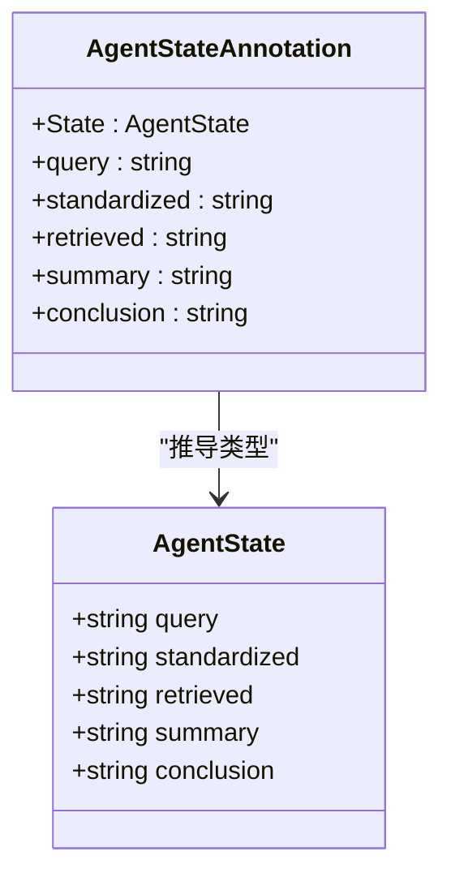
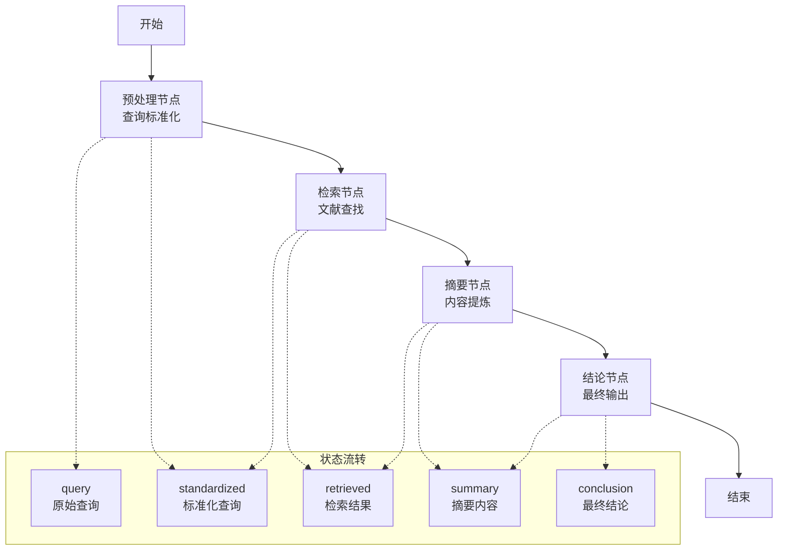
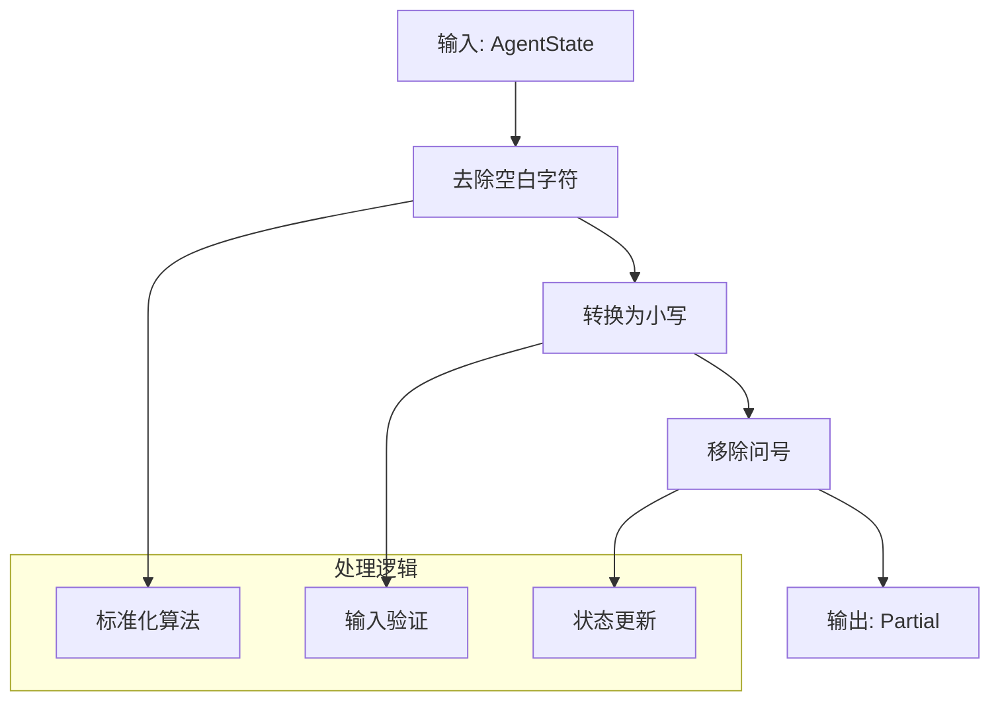
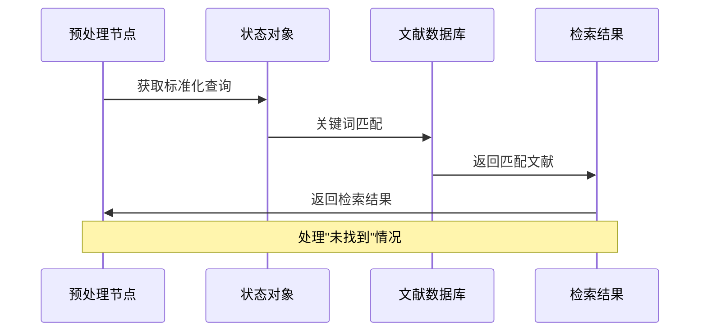
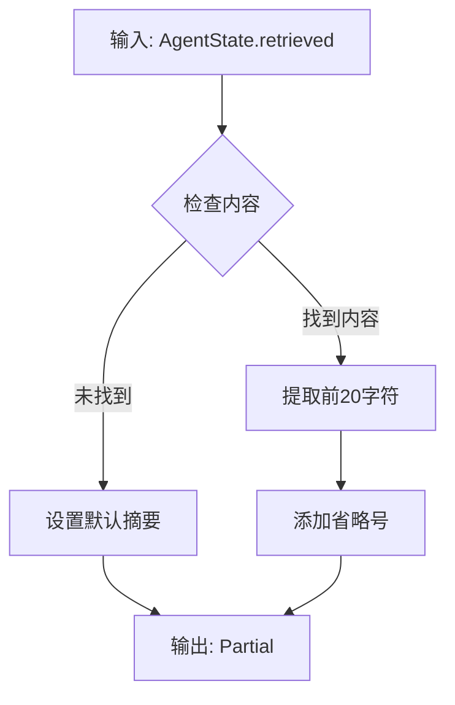
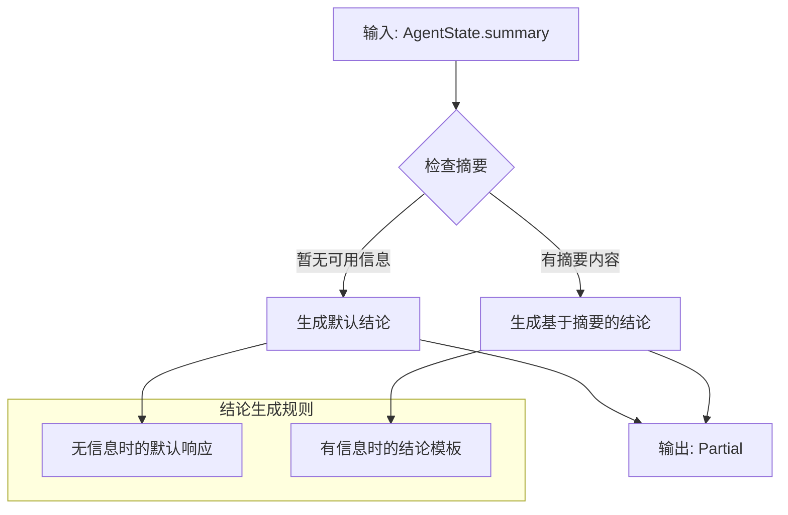

# 节点模式设计

<cite>
**本文档引用的文件**
- [main.ts](file://main.ts)
- [package.json](file://package.json)
- [tsconfig.json](file://tsconfig.json)
</cite>

## 目录
1. [引言](#引言)
2. [项目结构](#项目结构)
3. [核心组件](#核心组件)
4. [架构概览](#架构概览)
5. [详细组件分析](#详细组件分析)
6. [依赖关系分析](#依赖关系分析)
7. [性能考虑](#性能考虑)
8. [故障排除指南](#故障排除指南)
9. [结论](#结论)

## 引言

本项目展示了基于 LangGraph 的智能体节点模式设计，通过四个核心节点实现了从问题查询到最终结论输出的完整工作流程。该设计遵循职责分离原则和单一功能原则，每个节点专注于特定的任务处理，通过节点组合实现复杂的智能体功能。

## 项目结构

该项目采用极简的单文件架构，所有核心逻辑都集中在 `main.ts` 文件中，配合 `package.json` 和 `tsconfig.json` 提供项目配置。

```mermaid
graph TB
subgraph "项目根目录"
main_ts[main.ts<br/>主程序入口]
package_json[package.json<br/>项目配置]
tsconfig_json[tsconfig.json<br/>TypeScript配置]
end
subgraph "依赖管理"
langgraph[@langchain/langgraph<br/>核心依赖]
end
main_ts --> langgraph
package_json --> main_ts
tsconfig_json --> main_ts
```

**图表来源**
- [main.ts:1-85](file://main.ts#L1-L85)
- [package.json:1-17](file://package.json#L1-L17)

**章节来源**
- [main.ts:1-85](file://main.ts#L1-L85)
- [package.json:1-17](file://package.json#L1-L17)
- [tsconfig.json:1-114](file://tsconfig.json#L1-L114)

## 核心组件

### 状态模型设计

项目使用 LangGraph 的 `Annotation.Root` API 定义了智能体的状态结构，确保类型安全和明确的数据流转。



**图表来源**
- [main.ts:4-13](file://main.ts#L4-L13)

### 节点函数统一接口规范

所有节点函数都遵循相同的接口规范：
- **输入参数**: `AgentState` 类型的状态对象
- **返回值**: `Partial<AgentState>` 类型的部分状态更新
- **设计原则**: 只返回需要更新的字段，保持状态的增量更新

**章节来源**
- [main.ts:16-61](file://main.ts#L16-L61)

## 架构概览

整个智能体系统采用线性流水线架构，四个节点按顺序执行，每个节点专注于特定的处理任务。



**图表来源**
- [main.ts:64-76](file://main.ts#L64-L76)

## 详细组件分析

### 预处理节点 (Preprocess Node)

预处理节点负责将用户输入转换为标准化格式，为后续检索提供优化的查询条件。



**图表来源**
- [main.ts:15-21](file://main.ts#L15-L21)

**处理特点**:
- 输入验证和清理
- 查询字符串标准化
- 保持原始查询完整性

**章节来源**
- [main.ts:15-21](file://main.ts#L15-L21)

### 检索节点 (Retrieve Node)

检索节点模拟文献查找过程，使用关键词匹配策略返回相关结果。



**图表来源**
- [main.ts:24-33](file://main.ts#L24-L33)

**处理特点**:
- 基于关键词的简单匹配
- 默认结果处理机制
- 数据库抽象层设计

**章节来源**
- [main.ts:24-33](file://main.ts#L24-L33)

### 摘要节点 (Summarize Node)

摘要节点对检索到的内容进行提炼，生成简洁的摘要信息。



**图表来源**
- [main.ts:35-47](file://main.ts#L35-L47)

**处理特点**:
- 条件分支处理
- 内容截断策略
- 默认值处理

**章节来源**
- [main.ts:35-47](file://main.ts#L35-L47)

### 结论节点 (Conclude Node)

结论节点基于摘要内容生成最终的结论输出。



**图表来源**
- [main.ts:49-61](file://main.ts#L49-L61)

**处理特点**:
- 基于上下文的决策
- 模板化输出生成
- 语义化结论构建

**章节来源**
- [main.ts:49-61](file://main.ts#L49-L61)

## 依赖关系分析

项目依赖 LangGraph 库来实现状态图编排功能。

```mermaid
graph TB
subgraph "应用层"
MAIN[main.ts<br/>主程序]
NODES[节点函数<br/>四个核心节点]
WORKFLOW[工作流编排<br/>StateGraph]
end
subgraph "外部依赖"
LANGGRAPH[@langchain/langgraph<br/>核心框架]
ANNOTATION[Annotation API<br/>状态定义]
STATEGRAPH[StateGraph API<br/>图编排]
end
MAIN --> NODES
MAIN --> WORKFLOW
WORKFLOW --> LANGGRAPH
NODES --> ANNOTATION
WORKFLOW --> STATEGRAPH
```

**图表来源**
- [main.ts:1](file://main.ts#L1)
- [package.json:13-15](file://package.json#L13-L15)

**章节来源**
- [package.json:13-15](file://package.json#L13-L15)

## 性能考虑

### 状态更新优化
- 使用 `Partial<AgentState>` 减少不必要的状态复制
- 增量更新策略提高内存效率

### 节点执行优化
- 线性执行避免并发冲突
- 简单的条件判断降低计算开销

### 数据结构选择
- 使用对象字面量作为简单数据库
- 字符串操作满足基本需求

## 故障排除指南

### 常见问题及解决方案

**问题1: 节点间状态传递异常**
- 检查节点返回值是否包含正确的状态字段
- 确保 `Partial<AgentState>` 的正确使用

**问题2: 检索结果为空**
- 验证输入关键词的标准化处理
- 检查数据库中的关键词匹配

**问题3: 结论生成错误**
- 确认摘要内容的正确传递
- 检查条件判断逻辑

**章节来源**
- [main.ts:16-61](file://main.ts#L16-L61)

## 结论

本项目成功展示了智能体节点模式的设计理念和实现方法。通过四个核心节点的职责分离和单一功能原则，实现了从查询标准化到最终输出的完整工作流程。该设计具有以下优势：

1. **清晰的职责分离**: 每个节点专注于特定任务
2. **良好的可扩展性**: 新节点可以轻松集成到现有流程中
3. **类型安全**: 使用 TypeScript 和 LangGraph Annotation 确保类型安全
4. **易于维护**: 简洁的代码结构便于理解和修改

这种节点模式为构建复杂的智能体系统提供了坚实的基础，可以通过增加更多节点和优化现有节点来扩展功能。