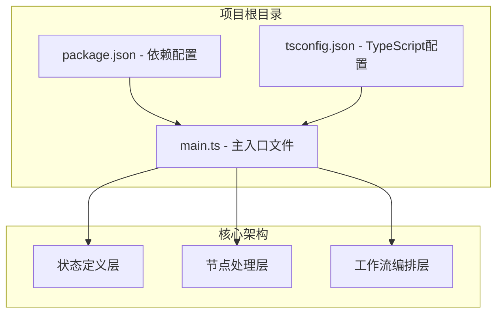
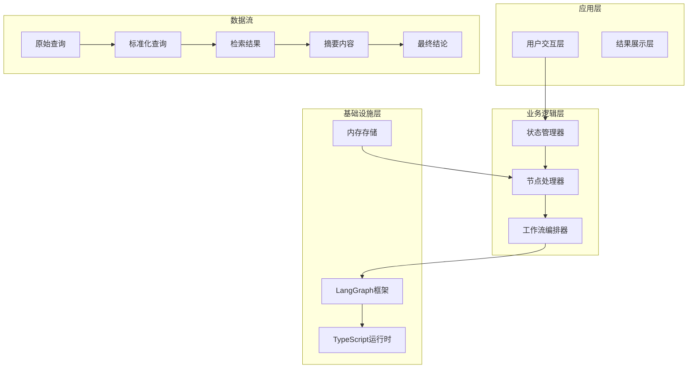
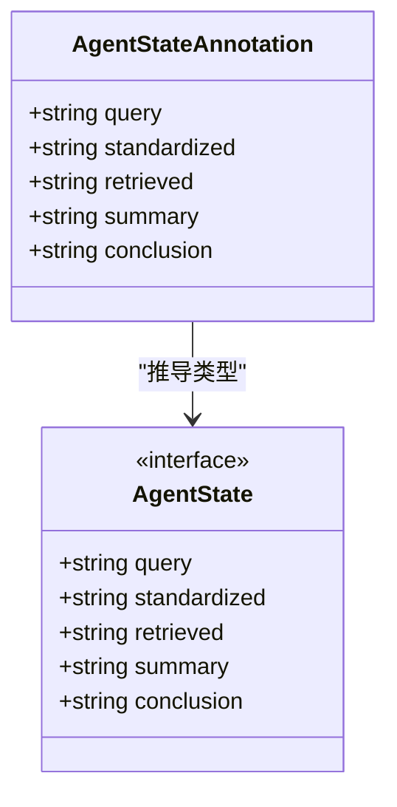
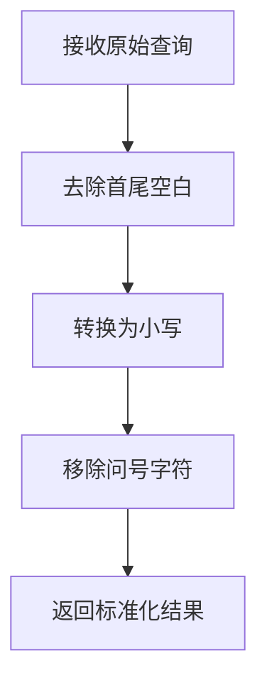
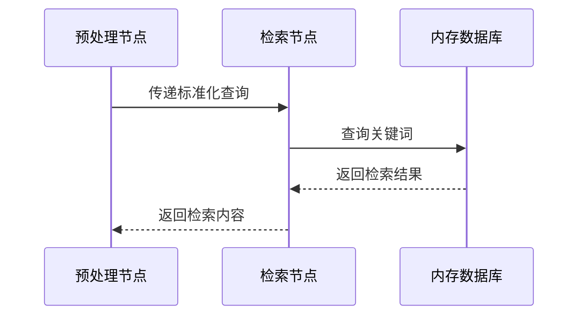
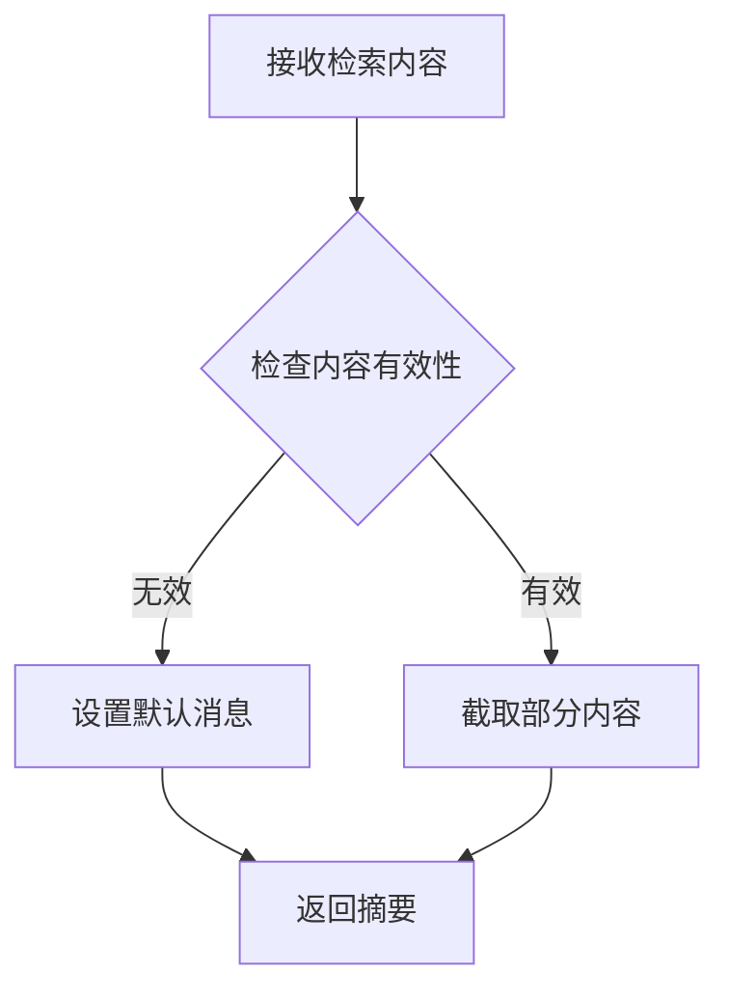
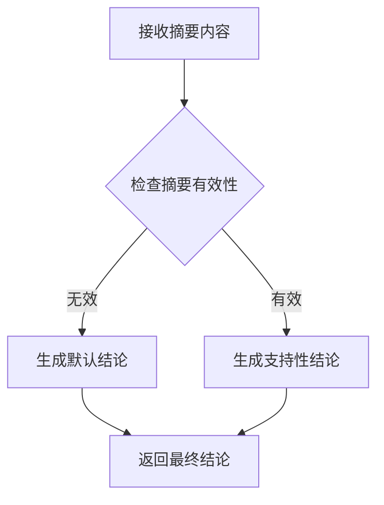
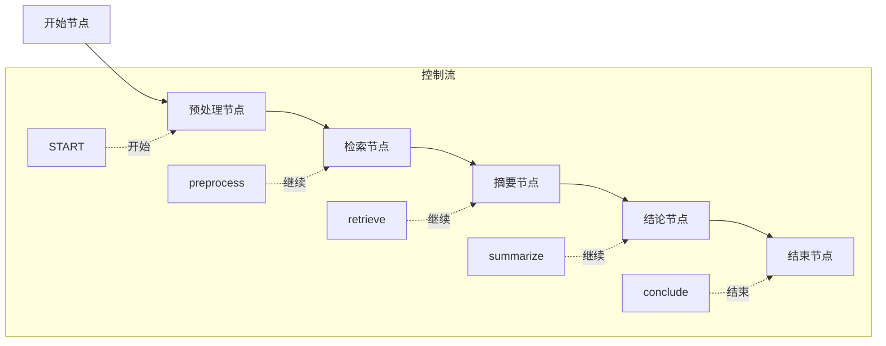

# 项目概述

<cite>
**本文档引用的文件**
- [main.ts](file://main.ts)
- [package.json](file://package.json)
- [tsconfig.json](file://tsconfig.json)
</cite>

## 目录
1. [项目简介](#项目简介)
2. [项目结构](#项目结构)
3. [核心组件](#核心组件)
4. [架构概览](#架构概览)
5. [详细组件分析](#详细组件分析)
6. [依赖关系分析](#依赖关系分析)
7. [性能考虑](#性能考虑)
8. [故障排除指南](#故障排除指南)
9. [结论](#结论)

## 项目简介

本项目是一个基于LangGraph框架的AI智能体复合系统演示项目，旨在向初学者展示如何从零开始构建复杂的多节点智能体工作流。该项目通过一个完整的端到端示例，演示了如何使用LangGraph的状态图编排能力来构建智能体工作流，涵盖了从数据预处理到最终结论生成的完整流程。

### 项目核心目标

- **教学导向**：为AI智能体开发初学者提供循序渐进的学习路径
- **实践验证**：通过实际代码示例验证LangGraph框架的强大功能
- **架构示范**：展示复合智能体系统的最佳实践模式
- **技术普及**：降低LangGraph框架的学习门槛，促进AI智能体技术的应用推广

### 技术特色

- **零基础入门**：从最简单的概念开始，逐步深入复杂场景
- **完整工作流**：涵盖数据预处理、知识检索、内容摘要、结论生成等环节
- **类型安全**：使用TypeScript确保代码质量和开发体验
- **模块化设计**：每个节点独立封装，便于理解和扩展

## 项目结构

该项目采用极简的单文件架构设计，所有核心逻辑都集中在主入口文件中，这种设计有利于初学者理解整个工作流的执行过程。



**图表来源**
- [main.ts:1-85](file://main.ts#L1-L85)
- [package.json:1-17](file://package.json#L1-L17)
- [tsconfig.json:1-114](file://tsconfig.json#L1-L114)

**章节来源**
- [main.ts:1-85](file://main.ts#L1-L85)
- [package.json:1-17](file://package.json#L1-L17)
- [tsconfig.json:1-114](file://tsconfig.json#L1-L114)

## 核心组件

项目的核心架构由三个主要组件构成，每个组件都有明确的职责分工：

### 状态管理组件

状态管理是整个智能体系统的基础，负责维护和传递工作流中的数据状态。项目使用LangGraph的`Annotation.Root`方法来定义强类型的状态结构。

### 节点处理组件

节点处理组件实现了具体的工作流程逻辑，每个节点负责处理特定的任务阶段。当前实现包含四个核心节点：
- 预处理节点：标准化用户输入
- 检索节点：模拟知识库查询
- 摘要节点：生成内容摘要
- 结论节点：生成最终结论

### 工作流编排组件

工作流编排组件负责定义节点之间的执行顺序和控制流程，使用有向图的方式描述整个工作流的拓扑结构。

**章节来源**
- [main.ts:3-13](file://main.ts#L3-L13)
- [main.ts:15-61](file://main.ts#L15-L61)
- [main.ts:63-76](file://main.ts#L63-L76)

## 架构概览

整个系统采用分层架构设计，从底层的状态定义到上层的工作流编排，形成了清晰的层次结构。



**图表来源**
- [main.ts:4-10](file://main.ts#L4-L10)
- [main.ts:15-61](file://main.ts#L15-L61)
- [main.ts:63-76](file://main.ts#L63-L76)

## 详细组件分析

### 状态管理系统

状态管理系统是整个智能体的核心，它定义了工作流中需要传递的所有数据结构。项目使用LangGraph推荐的`Annotation.Root`模式来创建类型安全的状态定义。



**图表来源**
- [main.ts:4-13](file://main.ts#L4-L13)

该状态定义包含了完整的智能体工作流生命周期所需的数据字段：
- `query`：原始用户输入
- `standardized`：标准化后的查询
- `retrieved`：检索到的知识内容
- `summary`：内容摘要
- `conclusion`：最终结论

**章节来源**
- [main.ts:4-13](file://main.ts#L4-L13)

### 节点处理系统

节点处理系统实现了智能体工作流的具体业务逻辑，每个节点都是独立的功能模块，具有明确的输入输出接口。

#### 预处理节点

预处理节点负责清理和标准化用户输入，确保后续处理的一致性和准确性。



**图表来源**
- [main.ts:16-21](file://main.ts#L16-L21)

#### 检索节点

检索节点模拟了知识库查询过程，使用内存中的简单数据库来存储和检索相关信息。



**图表来源**
- [main.ts:24-33](file://main.ts#L24-L33)

#### 摘要节点

摘要节点负责将检索到的长文本内容转换为简洁的摘要信息。



**图表来源**
- [main.ts:36-47](file://main.ts#L36-L47)

#### 结论节点

结论节点根据摘要内容生成最终的智能体响应。



**图表来源**
- [main.ts:50-61](file://main.ts#L50-L61)

**章节来源**
- [main.ts:15-61](file://main.ts#L15-L61)

### 工作流编排系统

工作流编排系统使用LangGraph的`StateGraph`类来定义节点之间的执行关系和控制流程。



**图表来源**
- [main.ts:63-76](file://main.ts#L63-L76)

该编排系统的特点：
- **线性流程**：严格按照预设顺序执行
- **类型安全**：编译时检查状态传递
- **可扩展性**：易于添加新的节点和流程分支

**章节来源**
- [main.ts:63-76](file://main.ts#L63-L76)

## 依赖关系分析

项目依赖关系相对简单，主要依赖于LangGraph框架来实现智能体工作流的核心功能。

```mermaid
graph TD
A[main.ts] --> B[@langchain/langgraph]
C[package.json] --> B
D[tsconfig.json] --> A
subgraph "外部依赖"
B
end
subgraph "内部模块"
A
C
D
end
subgraph "运行时环境"
E[Node.js]
F[TypeScript运行时]
end
B --> E
A --> F
F --> E
```

**图表来源**
- [package.json:13-15](file://package.json#L13-L15)
- [main.ts:1](file://main.ts#L1)

### 核心依赖分析

项目的主要依赖是`@langchain/langgraph`，这是一个专门用于构建智能体工作流的框架。该依赖提供了以下核心功能：

- **状态图编排**：支持复杂的多节点工作流
- **类型安全**：完整的TypeScript类型定义
- **异步处理**：内置的异步执行模型
- **错误处理**：完善的异常处理机制

**章节来源**
- [package.json:13-15](file://package.json#L13-L15)
- [main.ts:1](file://main.ts#L1)

## 性能考虑

虽然这是一个演示项目，但仍然需要考虑一些性能优化因素：

### 内存优化

- **状态最小化**：只在必要时保存状态数据
- **及时清理**：避免不必要的数据保留
- **批量处理**：对于大量数据可以考虑批处理策略

### 执行效率

- **异步优化**：利用LangGraph的异步特性提高并发处理能力
- **缓存策略**：对重复的检索操作实施缓存机制
- **资源管理**：合理管理内存和CPU资源使用

### 可扩展性

- **模块化设计**：保持节点的独立性便于扩展
- **配置驱动**：通过配置文件管理参数而非硬编码
- **插件架构**：支持第三方节点的集成

## 故障排除指南

### 常见问题及解决方案

#### 类型错误

**问题**：TypeScript编译时报类型错误
**原因**：状态类型定义不匹配或节点返回值不符合预期
**解决**：检查状态接口定义和节点函数的返回值类型

#### 运行时错误

**问题**：执行过程中出现运行时异常
**原因**：节点处理逻辑中的边界条件未正确处理
**解决**：添加适当的错误检查和异常处理机制

#### 性能问题

**问题**：工作流执行速度过慢
**原因**：节点处理逻辑过于复杂或存在不必要的计算
**解决**：优化算法实现，考虑引入缓存机制

**章节来源**
- [main.ts:16-61](file://main.ts#L16-L61)

## 结论

本项目成功展示了如何使用LangGraph框架构建一个完整的AI智能体复合系统。通过从零开始的实现过程，开发者可以深入理解智能体工作流的设计原理和实现技巧。

### 主要成就

- **教学价值**：为初学者提供了清晰的学习路径
- **实践意义**：验证了LangGraph框架的实际应用能力
- **架构示范**：展示了复合智能体系统的设计模式
- **技术普及**：降低了AI智能体技术的学习门槛

### 学习成果

通过本项目的学习，开发者可以掌握：
- LangGraph框架的基本使用方法
- 复合智能体系统的设计思路
- 状态管理和节点处理的最佳实践
- 工作流编排的实现技巧

### 发展方向

未来可以在现有基础上进一步扩展：
- 支持更复杂的分支和循环控制流
- 集成真实的AI模型和服务
- 实现更丰富的错误处理和恢复机制
- 添加监控和日志功能