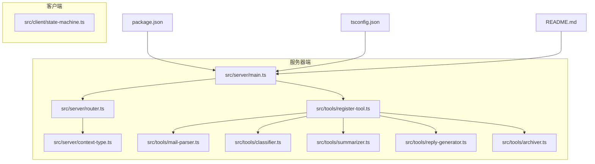
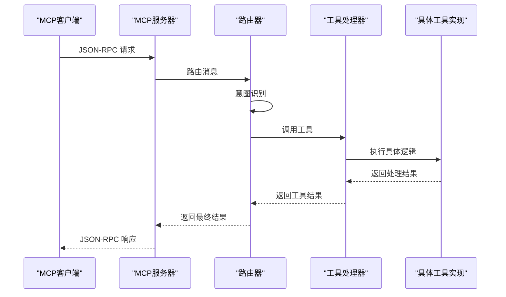
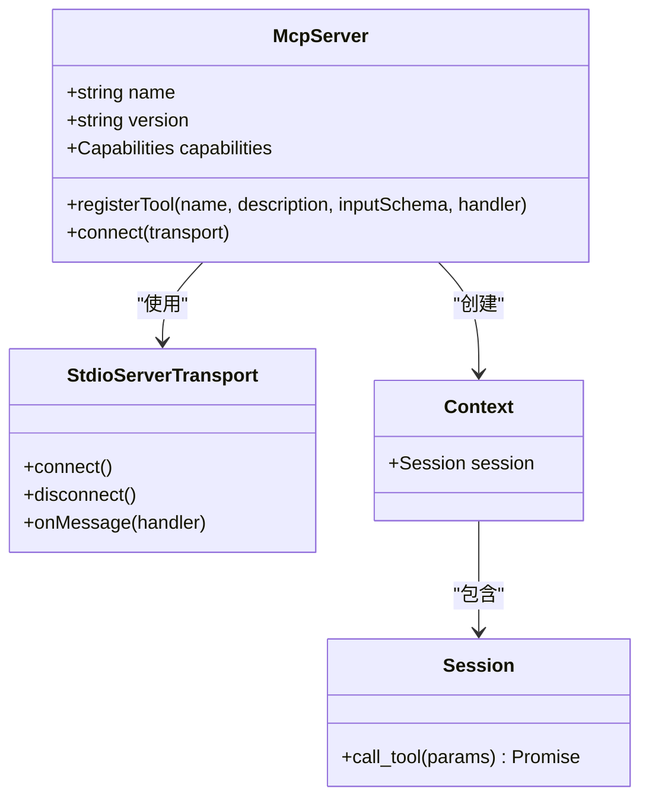
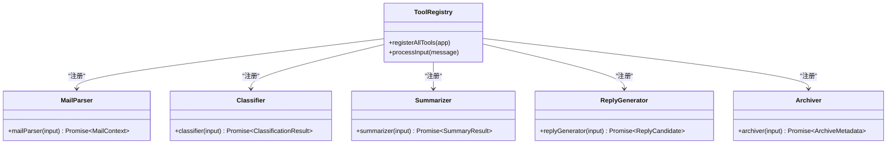
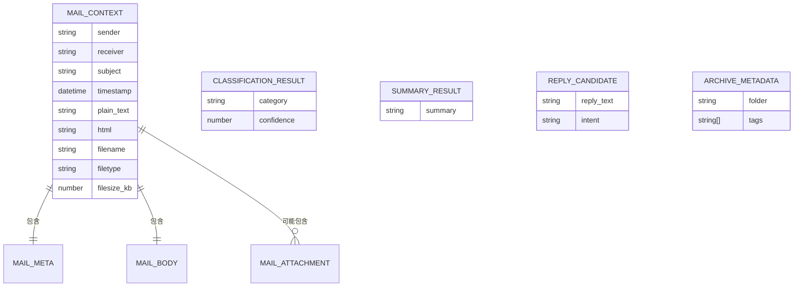

# API参考文档

<cite>
**本文档引用的文件**
- [README.md](file://README.md)
- [src/server/main.ts](file://src/server/main.ts)
- [src/server/router.ts](file://src/server/router.ts)
- [src/server/context-type.ts](file://src/server/context-type.ts)
- [src/tools/register-tool.ts](file://src/tools/register-tool.ts)
- [src/tools/mail-parser.ts](file://src/tools/mail-parser.ts)
- [src/tools/classifier.ts](file://src/tools/classifier.ts)
- [src/tools/summarizer.ts](file://src/tools/summarizer.ts)
- [src/tools/reply-generator.ts](file://src/tools/reply-generator.ts)
- [src/tools/archiver.ts](file://src/tools/archiver.ts)
- [src/client/state-machine.ts](file://src/client/state-machine.ts)
- [package.json](file://package.json)
- [tsconfig.json](file://tsconfig.json)
- [comparison.md](file://comparison.md)
</cite>

## 目录
1. [简介](#简介)
2. [项目结构](#项目结构)
3. [核心组件](#核心组件)
4. [架构概览](#架构概览)
5. [详细组件分析](#详细组件分析)
6. [依赖关系分析](#依赖关系分析)
7. [性能考虑](#性能考虑)
8. [故障排除指南](#故障排除指南)
9. [结论](#结论)
10. [附录](#附录)

## 简介

本项目是一个基于MCP（Model Context Protocol）协议的消息路由服务器，专门用于邮件处理任务的意图识别和任务分发。该服务器通过stdIO协议与MCP客户端（如Claude Desktop）通信，实现了智能的邮件处理工作流。

### 主要特性
- **MCP协议支持**：完全符合Model Context Protocol标准
- **多工具集成**：支持邮件解析、分类、摘要、回复生成和归档功能
- **智能路由**：基于意图识别的任务分发机制
- **类型安全**：使用TypeScript确保编译时类型检查
- **参数验证**：采用Zod进行运行时参数验证

## 项目结构



**图表来源**
- [src/server/main.ts:1-42](file://src/server/main.ts#L1-L42)
- [src/server/router.ts:1-67](file://src/server/router.ts#L1-L67)
- [src/tools/register-tool.ts:1-186](file://src/tools/register-tool.ts#L1-L186)

**章节来源**
- [README.md:88-97](file://README.md#L88-L97)
- [package.json:1-37](file://package.json#L1-L37)
- [tsconfig.json:1-30](file://tsconfig.json#L1-L30)

## 核心组件

### 服务器主入口
服务器主入口负责初始化MCP服务器实例、注册工具和建立stdIO传输连接。

### 路由器模块
路由器模块实现了智能的任务分发机制，根据用户输入内容自动识别意图并调用相应的处理工具。

### 工具注册中心
工具注册中心统一管理所有MCP工具的注册、参数验证和执行逻辑。

**章节来源**
- [src/server/main.ts:5-35](file://src/server/main.ts#L5-L35)
- [src/server/router.ts:24-63](file://src/server/router.ts#L24-L63)
- [src/tools/register-tool.ts:55-183](file://src/tools/register-tool.ts#L55-L183)

## 架构概览



**图表来源**
- [src/server/main.ts:6-34](file://src/server/main.ts#L6-L34)
- [src/server/router.ts:41-63](file://src/server/router.ts#L41-L63)
- [src/tools/register-tool.ts:55-71](file://src/tools/register-tool.ts#L55-L71)

## 详细组件分析

### MCP服务器架构



**图表来源**
- [src/server/main.ts:7-17](file://src/server/main.ts#L7-L17)
- [src/server/router.ts:15-22](file://src/server/router.ts#L15-L22)

### 工具注册系统



**图表来源**
- [src/tools/register-tool.ts:55-183](file://src/tools/register-tool.ts#L55-L183)
- [src/tools/mail-parser.ts:23-36](file://src/tools/mail-parser.ts#L23-L36)
- [src/tools/classifier.ts:23-44](file://src/tools/classifier.ts#L23-L44)

### 数据模型定义



**图表来源**
- [src/server/context-type.ts:11-54](file://src/server/context-type.ts#L11-L54)
- [src/server/context-type.ts:61-88](file://src/server/context-type.ts#L61-L88)
- [src/server/context-type.ts:95-100](file://src/server/context-type.ts#L95-L100)

## 依赖关系分析

```mermaid
graph LR
subgraph "外部依赖"
A[@modelcontextprotocol/sdk]
B[zod]
C[node]
end
subgraph "内部模块"
D[main.ts]
E[router.ts]
F[register-tool.ts]
G[context-type.ts]
end
subgraph "工具模块"
H[mail-parser.ts]
I[classifier.ts]
J[summarizer.ts]
K[reply-generator.ts]
L[archiver.ts]
end
A --> D
B --> F
C --> D
D --> E
D --> F
F --> G
F --> H
F --> I
F --> J
F --> K
F --> L
E --> G
```

**图表来源**
- [package.json:25-35](file://package.json#L25-L35)
- [src/server/main.ts:1-3](file://src/server/main.ts#L1-L3)
- [src/tools/register-tool.ts:6-16](file://src/tools/register-tool.ts#L6-L16)

**章节来源**
- [package.json:25-35](file://package.json#L25-L35)
- [src/server/main.ts:1-42](file://src/server/main.ts#L1-L42)

## 性能考虑

### 并发处理
- 服务器采用异步处理模型，支持并发工具调用
- 每个工具调用独立执行，互不阻塞
- 内存管理优化，避免长时间运行导致的内存泄漏

### 参数验证性能
- 使用Zod进行快速参数验证
- 编译时类型检查减少运行时错误
- 异常情况下的快速失败机制

### 日志记录
- 使用stderr输出系统日志
- 调试模式下提供详细的操作追踪
- 生产环境下保持精简的日志输出

## 故障排除指南

### 常见问题及解决方案

#### 问题：直接在终端输入无响应
**原因**：MCP服务器通过stdIO协议接收JSON-RPC消息，而非普通文本输入
**解决方案**：
- 使用MCP客户端（如Claude Desktop）进行交互
- 或使用MCP Inspector进行调试测试

#### 问题：工具调用失败
**检查清单**：
1. 确认工具名称正确（区分大小写）
2. 验证输入参数格式符合schema定义
3. 检查网络连接状态
4. 查看服务器日志输出

#### 问题：版本兼容性问题
**解决方案**：
- 确保MCP SDK版本兼容
- 检查JSON-RPC协议版本
- 验证客户端和服务端配置

**章节来源**
- [comparison.md:73-135](file://comparison.md#L73-L135)
- [README.md:111-124](file://README.md#L111-L124)

## 结论

本MCP路由服务器提供了完整的企业级邮件处理解决方案，具有以下优势：

1. **标准化协议**：完全符合MCP协议标准，确保与其他MCP客户端的兼容性
2. **模块化设计**：清晰的模块分离，便于维护和扩展
3. **类型安全**：完整的TypeScript类型定义，提供编译时安全保障
4. **智能路由**：基于意图识别的自动化任务分发机制
5. **易于集成**：标准化的API接口，便于第三方系统集成

## 附录

### API版本控制策略

#### 版本标识
- 服务器版本：1.0.0
- MCP协议版本：遵循@modelcontextprotocol/sdk标准
- 向后兼容性：保持API接口稳定，新增功能通过扩展实现

#### 版本升级指南
1. **主要版本升级**：破坏性变更，需要客户端适配
2. **次要版本升级**：新增功能，保持向后兼容
3. **补丁版本升级**：bug修复，无功能变更

### JSON-RPC协议实现

#### 消息格式
```json
{
  "jsonrpc": "2.0",
  "id": 1,
  "method": "tools/call",
  "params": {
    "name": "process_message",
    "arguments": {
      "message": "用户输入的消息"
    }
  }
}
```

#### 请求响应模式
- **请求**：客户端发送JSON-RPC消息
- **处理**：服务器解析消息并调用相应工具
- **响应**：服务器返回标准化的JSON-RPC响应

#### 错误处理机制
- **参数验证错误**：返回JSON-RPC错误码-32602
- **工具执行错误**：返回JSON-RPC错误码500
- **未知工具错误**：返回JSON-RPC错误码-32601

### 实际调用示例

#### 成功调用示例
```json
{
  "jsonrpc": "2.0",
  "id": 1,
  "method": "tools/call",
  "params": {
    "name": "process_message",
    "arguments": {
      "message": "帮我总结一下这封邮件"
    }
  }
}
```

#### 响应示例
```json
{
  "jsonrpc": "2.0",
  "id": 1,
  "result": {
    "content": [
      {
        "type": "text",
        "text": "处理结果内容"
      }
    ]
  }
}
```

### 错误码说明

| 错误码 | 错误类型 | 描述 |
|--------|----------|------|
| -32600 | 无效请求 | 请求格式不正确 |
| -32601 | 工具未找到 | 指定的工具不存在 |
| -32602 | 参数错误 | 参数格式或类型不正确 |
| -32603 | 内部错误 | 服务器内部异常 |
| 500 | 工具执行错误 | 工具执行过程中发生错误 |

### 最佳实践

1. **参数验证**：始终使用Zod schema进行参数验证
2. **错误处理**：实现完善的异常捕获和错误报告机制
3. **日志记录**：提供详细的操作日志，便于问题诊断
4. **性能监控**：监控工具执行时间和资源使用情况
5. **安全考虑**：验证输入数据，防止恶意攻击