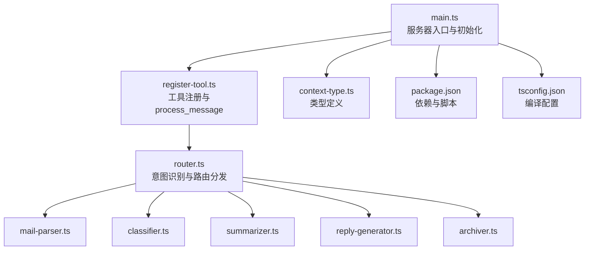
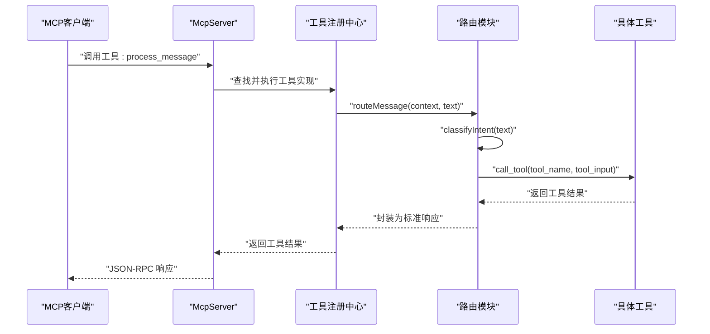
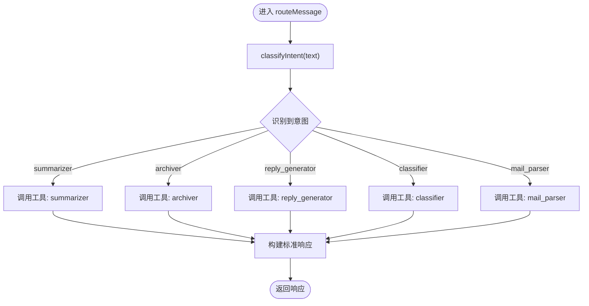
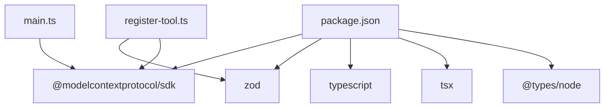

# MCP服务器API

<cite>
**本文引用的文件**
- [src/server/main.ts](file://src/server/main.ts)
- [src/server/router.ts](file://src/server/router.ts)
- [src/server/context-type.ts](file://src/server/context-type.ts)
- [src/tools/register-tool.ts](file://src/tools/register-tool.ts)
- [src/tools/mail-parser.ts](file://src/tools/mail-parser.ts)
- [src/tools/classifier.ts](file://src/tools/classifier.ts)
- [src/tools/summarizer.ts](file://src/tools/summarizer.ts)
- [src/tools/reply-generator.ts](file://src/tools/reply-generator.ts)
- [src/tools/archiver.ts](file://src/tools/archiver.ts)
- [package.json](file://package.json)
- [README.md](file://README.md)
- [tsconfig.json](file://tsconfig.json)
</cite>

## 目录
1. [简介](#简介)
2. [项目结构](#项目结构)
3. [核心组件](#核心组件)
4. [架构总览](#架构总览)
5. [详细组件分析](#详细组件分析)
6. [依赖关系分析](#依赖关系分析)
7. [性能考虑](#性能考虑)
8. [故障排查指南](#故障排查指南)
9. [结论](#结论)
10. [附录](#附录)

## 简介
本项目是一个基于 MCP（Model Context Protocol）协议的消息路由与工具分发服务器，面向 AI Agent（如 Claude Desktop）提供标准化的工具调用能力。其核心职责包括：
- 初始化 MCP 服务器并声明能力
- 注册一组工具（邮件解析、分类、摘要、回复生成、归档）
- 提供统一入口工具 process_message，负责意图识别与任务分发
- 通过 stdio 与 MCP 客户端通信，遵循 JSON-RPC 协议

本文件将详细说明服务器初始化配置、能力声明、工具注册流程；解释 process_message 的调用方式、参数格式与返回值结构；阐述路由系统的意图识别机制与任务分发流程；并给出 JSON-RPC 请求/响应示例、错误处理与调试方法。

## 项目结构
项目采用按功能模块划分的目录结构，核心文件如下：
- 服务器入口与初始化：src/server/main.ts
- 路由与意图识别：src/server/router.ts
- 工具注册与统一入口：src/tools/register-tool.ts
- 具体工具实现：src/tools/mail-parser.ts、src/tools/classifier.ts、src/tools/summarizer.ts、src/tools/reply-generator.ts、src/tools/archiver.ts
- 类型定义：src/server/context-type.ts
- 项目配置：package.json、tsconfig.json
- 说明文档：README.md

图表来源
- [src/server/main.ts:1-42](file://src/server/main.ts#L1-L42)
- [src/tools/register-tool.ts:55-183](file://src/tools/register-tool.ts#L55-L183)
- [src/server/router.ts:41-63](file://src/server/router.ts#L41-L63)
- [src/server/context-type.ts:1-101](file://src/server/context-type.ts#L1-L101)

章节来源
- [src/server/main.ts:1-42](file://src/server/main.ts#L1-L42)
- [src/server/router.ts:1-67](file://src/server/router.ts#L1-L67)
- [src/tools/register-tool.ts:1-186](file://src/tools/register-tool.ts#L1-L186)
- [src/server/context-type.ts:1-101](file://src/server/context-type.ts#L1-L101)
- [package.json:1-37](file://package.json#L1-L37)
- [tsconfig.json:1-30](file://tsconfig.json#L1-L30)

## 核心组件
- 服务器初始化与能力声明
  - 在入口文件中创建 McpServer 实例，设置服务器标识与能力声明（声明支持 tools 能力），随后通过 StdioServerTransport 进行连接。
  - 参考路径：[src/server/main.ts:6-35](file://src/server/main.ts#L6-L35)

- 工具注册与统一入口
  - 在 register-tool.ts 中注册多个工具，其中 process_message 作为统一入口，接收用户消息文本，内部委托给路由模块进行意图识别与任务分发。
  - 参考路径：[src/tools/register-tool.ts:55-71](file://src/tools/register-tool.ts#L55-L71)

- 路由与意图识别
  - router.ts 提供 classifyIntent 与 routeMessage。前者基于关键词匹配进行简单意图识别，后者将识别结果映射到具体工具并调用工具执行，最终封装为标准响应结构。
  - 参考路径：[src/server/router.ts:24-63](file://src/server/router.ts#L24-L63)

- 工具实现
  - 各工具均实现输入参数校验与返回值结构化，返回内容数组，类型为文本。
  - 参考路径：
    - [src/tools/mail-parser.ts:23-36](file://src/tools/mail-parser.ts#L23-L36)
    - [src/tools/classifier.ts:23-44](file://src/tools/classifier.ts#L23-L44)
    - [src/tools/summarizer.ts:23-34](file://src/tools/summarizer.ts#L23-L34)
    - [src/tools/reply-generator.ts:23-32](file://src/tools/reply-generator.ts#L23-L32)
    - [src/tools/archiver.ts:23-31](file://src/tools/archiver.ts#L23-L31)

章节来源
- [src/server/main.ts:6-35](file://src/server/main.ts#L6-L35)
- [src/tools/register-tool.ts:55-71](file://src/tools/register-tool.ts#L55-L71)
- [src/server/router.ts:24-63](file://src/server/router.ts#L24-L63)
- [src/tools/mail-parser.ts:23-36](file://src/tools/mail-parser.ts#L23-L36)
- [src/tools/classifier.ts:23-44](file://src/tools/classifier.ts#L23-L44)
- [src/tools/summarizer.ts:23-34](file://src/tools/summarizer.ts#L23-L34)
- [src/tools/reply-generator.ts:23-32](file://src/tools/reply-generator.ts#L23-L32)
- [src/tools/archiver.ts:23-31](file://src/tools/archiver.ts#L23-L31)

## 架构总览
下图展示了从 MCP 客户端发起调用到工具执行与返回的整体流程。

图表来源
- [src/server/main.ts:22-28](file://src/server/main.ts#L22-L28)
- [src/tools/register-tool.ts:55-71](file://src/tools/register-tool.ts#L55-L71)
- [src/server/router.ts:41-63](file://src/server/router.ts#L41-L63)

## 详细组件分析

### 组件A：process_message 工具
- 功能概述
  - 统一入口工具，接收用户消息文本，内部通过路由模块进行意图识别与任务分发，最终返回标准响应。
- 调用方式
  - 由 MCP 客户端调用工具名 process_message，传入参数对象包含 message 字段。
- 参数格式
  - message: string，用户输入的消息文本。
- 返回值结构
  - content: 文本内容数组，每个元素包含 type 与 text 字段。
- 错误处理
  - 若工具执行过程中出现异常，将由上层捕获并返回错误响应（参见“错误处理机制”）。
- 调用示例
  - 客户端调用示例（仅展示结构，不包含具体代码内容）：
    - 请求：{"method":"tools/call","params":{"name":"process_message","arguments":{"message":"用户输入文本"}}}
    - 响应：{"result":{"content":[{"type":"text","text":"工具返回内容"}]}}

章节来源
- [src/tools/register-tool.ts:55-71](file://src/tools/register-tool.ts#L55-L71)
- [src/server/router.ts:41-63](file://src/server/router.ts#L41-L63)

### 组件B：路由系统与意图识别
- 意图识别机制
  - 基于关键词匹配的简易规则，将用户输入映射到具体工具：
    - 包含“总结/概括” → summarizer
    - 包含“归档/标签” → archiver
    - 包含“回复/答复” → reply_generator
    - 包含“分类/是什么类型” → classifier
    - 默认 → mail_parser
- 任务分发流程
  - 路由器根据识别结果调用对应工具，等待工具返回后，封装为标准响应结构（包含 role、content、model、stopReason）。
- 关键类型
  - TextContent：包含 type 与 text
  - CreateMessageResult：标准响应结构
  - Context：包含 session.call_tool 接口
- 流程图

图表来源
- [src/server/router.ts:24-63](file://src/server/router.ts#L24-L63)

章节来源
- [src/server/router.ts:24-63](file://src/server/router.ts#L24-L63)

### 组件C：工具注册与能力声明
- 能力声明
  - 服务器在初始化时声明 capabilities.tools，表示支持工具调用能力。
- 工具注册
  - registerAllTools(app) 注册以下工具：
    - process_message：统一入口
    - mail_parser：解析邮件内容
    - classifier：邮件分类
    - summarizer：生成摘要
    - reply_generator：生成回复建议
    - archiver：生成归档建议
- 输入参数校验
  - 使用 Zod 对各工具输入进行校验，确保参数类型正确。
- 返回值结构
  - 所有工具返回 content 数组，元素为文本类型对象。

章节来源
- [src/server/main.ts:12-17](file://src/server/main.ts#L12-L17)
- [src/tools/register-tool.ts:55-183](file://src/tools/register-tool.ts#L55-L183)

### 组件D：具体工具实现
- 邮件解析器（mail_parser）
  - 输入：raw_text（原始邮件文本）
  - 输出：包含 meta（发件人、收件人、主题、时间戳）与 body（正文）的结构化对象
- 邮件分类器（classifier）
  - 输入：text（待分类文本）
  - 输出：category（分类类别）、confidence（置信度）
- 邮件摘要器（summarizer）
  - 输入：text（待摘要文本）
  - 输出：summary（摘要字符串）
- 回复生成器（reply_generator）
  - 输入：text（待回复文本）
  - 输出：reply_text（建议回复）、intent（意图）
- 邮件归档器（archiver）
  - 输入：text（待归档文本）
  - 输出：folder（归档文件夹）、tags（标签数组）

章节来源
- [src/tools/mail-parser.ts:23-36](file://src/tools/mail-parser.ts#L23-L36)
- [src/tools/classifier.ts:23-44](file://src/tools/classifier.ts#L23-L44)
- [src/tools/summarizer.ts:23-34](file://src/tools/summarizer.ts#L23-L34)
- [src/tools/reply-generator.ts:23-32](file://src/tools/reply-generator.ts#L23-L32)
- [src/tools/archiver.ts:23-31](file://src/tools/archiver.ts#L23-L31)

### 组件E：类型定义与数据模型
- 邮件上下文（MailContext）
  - meta：发件人、收件人、主题、时间戳
  - body：正文（plain_text、可选 html）
  - attachments：附件列表（可选）
- 分类结果（ClassificationResult）
  - category：类别
  - confidence：置信度
- 摘要结果（SummaryResult）
  - summary：摘要
- 回复候选（ReplyCandidate）
  - reply_text：建议回复
  - intent：意图（可选）
- 归档元数据（ArchiveMetadata）
  - folder：归档文件夹
  - tags：标签数组

章节来源
- [src/server/context-type.ts:11-54](file://src/server/context-type.ts#L11-L54)
- [src/server/context-type.ts:61-88](file://src/server/context-type.ts#L61-L88)
- [src/server/context-type.ts:95-100](file://src/server/context-type.ts#L95-L100)

## 依赖关系分析
- 运行时依赖
  - @modelcontextprotocol/sdk：MCP 协议实现与服务器框架
  - zod：参数校验
  - @langchain/core、@langchain/langgraph：链路与图计算（在当前实现中未直接使用，保留依赖）
- 开发依赖
  - typescript、tsx、@types/node：开发与运行时类型支持
- 项目脚本
  - build：TypeScript 编译
  - dev：使用 inspector 启动开发模式
  - start：运行 dist/main.js
  - watch：监听模式编译

图表来源
- [package.json:25-35](file://package.json#L25-L35)
- [src/server/main.ts:1-3](file://src/server/main.ts#L1-L3)
- [src/tools/register-tool.ts:6-16](file://src/tools/register-tool.ts#L6-L16)

章节来源
- [package.json:1-37](file://package.json#L1-L37)
- [tsconfig.json:1-30](file://tsconfig.json#L1-L30)

## 性能考虑
- 意图识别为纯内存关键词匹配，复杂度低，适合高频调用。
- 工具执行均为同步异步函数，建议避免在工具内执行阻塞操作。
- JSON 序列化/反序列化开销较小，主要瓶颈在工具内部处理逻辑。
- 建议：
  - 将工具内部的 IO 或网络请求放入异步队列，避免阻塞主线程。
  - 对大文本处理时，考虑分块或流式处理策略。

## 故障排查指南
- 服务器无法启动
  - 检查依赖安装与编译产物是否存在。
  - 查看 stderr 日志输出，定位错误位置。
- MCP 客户端无法发现服务器
  - 确认客户端配置指向正确的命令与工作目录。
  - 确保服务器通过 stdio 正常启动且保持进程存活。
- 调用 process_message 无响应
  - 确认客户端已正确调用工具名与参数结构。
  - 观察服务器日志，检查路由与工具执行是否报错。
- 工具参数校验失败
  - 检查输入字段类型与必填项是否满足 Zod 校验规则。
- 调试方法
  - 使用 inspector 启动开发模式，便于在客户端侧调试。
  - 在关键节点输出日志（stderr），便于追踪执行路径。

章节来源
- [README.md:107-124](file://README.md#L107-L124)
- [src/server/main.ts:25-34](file://src/server/main.ts#L25-L34)

## 结论
本项目以清晰的模块划分实现了 MCP 服务器的初始化、工具注册与统一入口，配合简易但实用的路由与意图识别机制，能够稳定地完成消息处理与任务分发。通过标准化的 JSON-RPC 响应结构与严格的参数校验，保证了与 MCP 客户端的兼容性与可靠性。后续可在工具内部引入更复杂的处理逻辑与缓存策略，以进一步提升性能与用户体验。

## 附录

### JSON-RPC 消息格式示例
- 请求（调用 process_message）
  - 方法：tools/call
  - 参数：{"name":"process_message","arguments":{"message":"用户输入文本"}}
- 响应（成功）
  - 结果：{"content":[{"type":"text","text":"工具返回内容"}]}
- 响应（错误）
  - 错误：{"code":..., "message":"错误描述"}

说明：以上为标准 JSON-RPC 结构示意，具体字段与错误码遵循 MCP 协议规范。

### 服务器初始化与配置
- 服务器标识与能力声明
  - name: "mail-agent"
  - version: "1.0.0"
  - capabilities.tools: {}
- 传输层
  - StdioServerTransport：通过 stdio 与客户端通信
- 运行脚本
  - dev：pnpm dev（使用 inspector）
  - start：pnpm start（运行 dist/main.js）
  - build：pnpm build（TypeScript 编译）

章节来源
- [src/server/main.ts:7-17](file://src/server/main.ts#L7-L17)
- [package.json:10-15](file://package.json#L10-L15)

### 支持的意图类型与工具映射
- summarizer：总结、概括
- archiver：归档、标签
- reply_generator：回复、答复
- classifier：分类、是什么类型
- mail_parser：默认邮件解析

章节来源
- [README.md:80-87](file://README.md#L80-L87)
- [src/server/router.ts:24-38](file://src/server/router.ts#L24-L38)