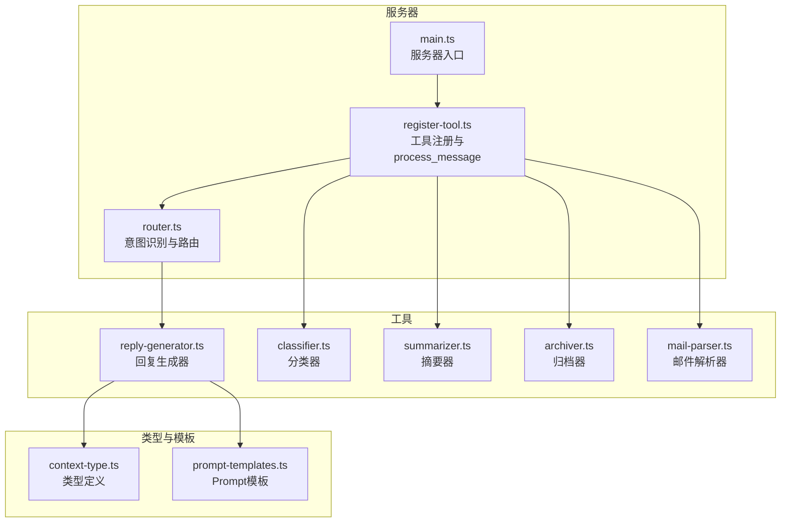
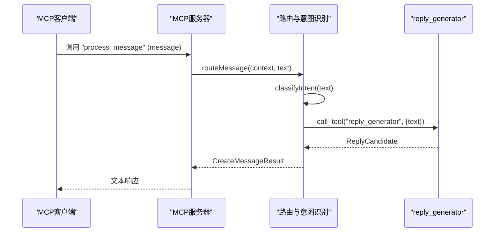
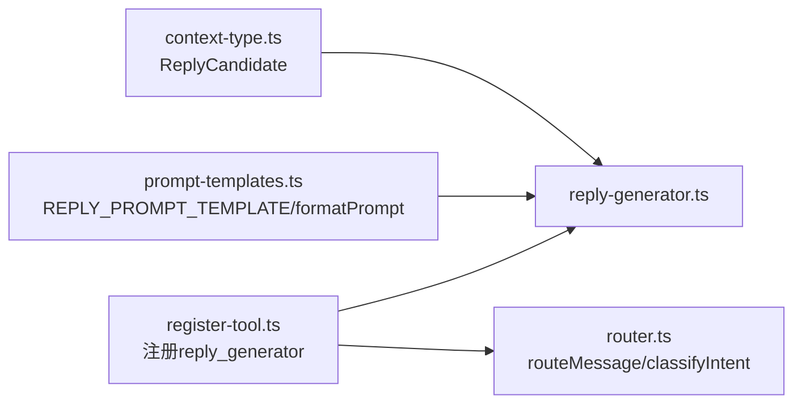
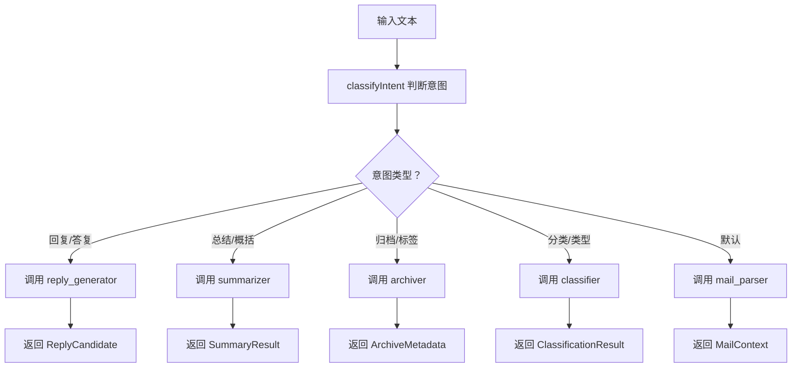

# 回复生成工具API

<cite>
**本文引用的文件**
- [reply-generator.ts](file://src/tools/reply-generator.ts)
- [prompt-templates.ts](file://src/server/prompt-templates.ts)
- [context-type.ts](file://src/server/context-type.ts)
- [register-tool.ts](file://src/tools/register-tool.ts)
- [router.ts](file://src/server/router.ts)
- [main.ts](file://src/server/main.ts)
- [classifier.ts](file://src/tools/classifier.ts)
- [summarizer.ts](file://src/tools/summarizer.ts)
- [archiver.ts](file://src/tools/archiver.ts)
- [mail-parser.ts](file://src/tools/mail-parser.ts)
- [context-chain.ts](file://src/client/context-chain.ts)
- [state-machine.ts](file://src/client/state-machine.ts)
- [README.md](file://README.md)
</cite>

## 目录
1. [简介](#简介)
2. [项目结构](#项目结构)
3. [核心组件](#核心组件)
4. [架构总览](#架构总览)
5. [详细组件分析](#详细组件分析)
6. [依赖关系分析](#依赖关系分析)
7. [性能考量](#性能考量)
8. [故障排查指南](#故障排查指南)
9. [结论](#结论)
10. [附录](#附录)

## 简介
本文件面向“回复生成工具”的API文档，聚焦于工具名“process_message”中的“reply_generator”。文档详细说明：
- 接口规范：输入参数、输出结构、调用方式
- 算法与模板机制：当前实现与可扩展点
- 输入参数格式：邮件上下文、语气要求、回复类型选择
- 输出结果格式：候选回复、意图字段、选择标准
- 场景示例：商务邮件、个人邮件等
- 质量控制与个性化定制
- 局限性与使用建议

## 项目结构
该仓库采用按功能模块划分的组织方式，核心围绕“MCP协议服务器 + 工具注册 + 路由分发 + 各类工具实现”展开。与回复生成相关的文件如下：
- 工具实现：reply-generator.ts
- 类型与上下文：context-type.ts
- Prompt模板与格式化：prompt-templates.ts
- 工具注册与对外API：register-tool.ts
- 路由与意图识别：router.ts
- 服务器入口：main.ts
- 其他工具（供对比与参考）：classifier.ts、summarizer.ts、archiver.ts、mail-parser.ts
- 客户端辅助（上下文链、状态机）：context-chain.ts、state-machine.ts

图表来源
- [main.ts:1-42](file://src/server/main.ts#L1-L42)
- [register-tool.ts:1-186](file://src/tools/register-tool.ts#L1-L186)
- [router.ts:1-67](file://src/server/router.ts#L1-L67)
- [reply-generator.ts:1-33](file://src/tools/reply-generator.ts#L1-L33)
- [context-type.ts:1-101](file://src/server/context-type.ts#L1-L101)
- [prompt-templates.ts:1-66](file://src/server/prompt-templates.ts#L1-L66)

章节来源
- [README.md:1-131](file://README.md#L1-L131)
- [main.ts:1-42](file://src/server/main.ts#L1-L42)
- [register-tool.ts:1-186](file://src/tools/register-tool.ts#L1-L186)
- [router.ts:1-67](file://src/server/router.ts#L1-L67)

## 核心组件
- 回复生成器（reply_generator）
  - 输入：text（待回复的邮件文本）
  - 输出：ReplyCandidate（reply_text + intent）
  - 实现：返回固定礼貌确认语句，并标记意图“确认”
- Prompt模板（prompt-templates.ts）
  - 提供REPLY_PROMPT_TEMPLATE等模板，支持formatPrompt变量替换
  - 当前reply_generator未直接使用模板，但类型与模板在同一模块便于扩展
- 类型定义（context-type.ts）
  - ReplyCandidate：定义回复候选的数据结构
- 工具注册（register-tool.ts）
  - 将reply_generator注册为MCP工具，暴露“process_message”入口
- 路由与意图识别（router.ts）
  - classifyIntent根据关键词判断意图，将“回复”相关请求路由至reply_generator

章节来源
- [reply-generator.ts:1-33](file://src/tools/reply-generator.ts#L1-L33)
- [prompt-templates.ts:1-66](file://src/server/prompt-templates.ts#L1-L66)
- [context-type.ts:78-88](file://src/server/context-type.ts#L78-L88)
- [register-tool.ts:140-160](file://src/tools/register-tool.ts#L140-L160)
- [router.ts:24-38](file://src/server/router.ts#L24-L38)

## 架构总览
“process_message”是MCP客户端（如Claude Desktop）调用的统一入口。其内部通过“意图识别”决定调用哪个具体工具。对于“回复”类请求，路由到reply_generator；对于“总结/分类/归档/解析”，分别路由到对应工具。

图表来源
- [register-tool.ts:37-53](file://src/tools/register-tool.ts#L37-L53)
- [router.ts:40-63](file://src/server/router.ts#L40-L63)
- [reply-generator.ts:23-32](file://src/tools/reply-generator.ts#L23-L32)

## 详细组件分析

### 回复生成器（reply_generator）接口规范
- 工具名：reply_generator
- 输入参数
  - text：string，待回复的邮件文本
- 输出结果
  - reply_text：string，建议的回复内容
  - intent：string，意图类型（例如“确认”）
- 调用方式
  - 通过MCP工具“process_message”触发，内部由路由根据关键词识别为“reply_generator”后调用
- 当前行为
  - 返回固定礼貌语句，意图标记为“确认”

章节来源
- [reply-generator.ts:11-14](file://src/tools/reply-generator.ts#L11-L14)
- [reply-generator.ts:23-32](file://src/tools/reply-generator.ts#L23-L32)
- [register-tool.ts:140-160](file://src/tools/register-tool.ts#L140-L160)
- [router.ts:24-38](file://src/server/router.ts#L24-L38)

### 算法与模板机制
- 现状
  - reply_generator当前为硬编码返回固定语句，不涉及外部LLM或模板渲染
- 模板与格式化
  - 存在REPLY_PROMPT_TEMPLATE与formatPrompt，可用于未来扩展为基于模板的回复生成
- 扩展建议
  - 在reply_generator中引入formatPrompt，将输入text注入模板
  - 引入外部模型调用（如通过MCP会话），将模板与输入拼接后提交给模型生成回复
  - 保留intent字段，结合模板增强意图识别与语气控制

章节来源
- [prompt-templates.ts:28-37](file://src/server/prompt-templates.ts#L28-L37)
- [prompt-templates.ts:56-65](file://src/server/prompt-templates.ts#L56-L65)
- [reply-generator.ts:23-32](file://src/tools/reply-generator.ts#L23-L32)

### 输入参数格式
- 基本要求
  - text：string，应为完整邮件正文或上下文片段
- 上下文与语气
  - 当前实现未显式解析邮件上下文（如发件人、主题、附件），也未区分语气（正式/非正式）
  - 若扩展，可在工具内部解析MailContext或在调用侧传入更多上下文字段
- 回复类型选择
  - 当前仅返回“确认”意图
  - 可通过模板与关键词映射实现多意图（如“拒绝”、“需跟进”、“感谢”）

章节来源
- [reply-generator.ts:11-14](file://src/tools/reply-generator.ts#L11-L14)
- [context-type.ts:47-54](file://src/server/context-type.ts#L47-L54)

### 输出结果格式与选择标准
- 结构
  - reply_text：string，建议回复
  - intent：string，意图类型（如“确认”）
- 选择标准
  - 当前为固定返回，无多候选排序
  - 可扩展为多候选生成与评分（如基于置信度、长度、关键词匹配度）

章节来源
- [context-type.ts:83-88](file://src/server/context-type.ts#L83-L88)
- [reply-generator.ts:28-31](file://src/tools/reply-generator.ts#L28-L31)

### 不同场景下的回复示例
- 商务邮件（正式）
  - 建议：使用更正式的模板与语气，intent可为“确认/需跟进/感谢”
  - 当前实现：固定礼貌语句，未体现场景差异
- 个人邮件（非正式）
  - 建议：模板可更口语化，intent可为“确认/稍后处理”
  - 当前实现：固定礼貌语句，未体现场景差异
- 注意：当前reply_generator未读取上下文或语气参数，无法按场景差异化输出

章节来源
- [prompt-templates.ts:28-37](file://src/server/prompt-templates.ts#L28-L37)
- [reply-generator.ts:23-32](file://src/tools/reply-generator.ts#L23-L32)

### 质量控制与个性化定制
- 质量控制
  - 固定回复可保证一致性，但缺乏灵活性
  - 建议：引入模板与模型调用，增加回复长度、关键词覆盖、语气匹配等质量指标
- 个性化定制
  - 可通过模板参数化（如称呼、称谓、结束语）实现个性化
  - 可通过intent与上下文动态调整回复风格

章节来源
- [prompt-templates.ts:56-65](file://src/server/prompt-templates.ts#L56-L65)
- [reply-generator.ts:23-32](file://src/tools/reply-generator.ts#L23-L32)

### 局限性与使用建议
- 局限性
  - 固定回复，无法根据上下文与语气变化
  - 未使用模板与模型，扩展空间有限
- 使用建议
  - 在调用侧传入更丰富的上下文（如MailContext），并在工具内解析
  - 引入模板与模型调用，实现多候选与意图识别
  - 通过intent字段配合UI展示多候选，供用户选择

章节来源
- [reply-generator.ts:23-32](file://src/tools/reply-generator.ts#L23-L32)
- [prompt-templates.ts:28-37](file://src/server/prompt-templates.ts#L28-L37)

## 依赖关系分析
- reply_generator依赖
  - 类型定义：ReplyCandidate（context-type.ts）
  - 模板与格式化：REPLY_PROMPT_TEMPLATE、formatPrompt（prompt-templates.ts）
- 路由与注册
  - register-tool.ts将reply_generator注册为MCP工具，并通过process_message统一入口调用
  - router.ts的classifyIntent将“回复”关键词路由到reply_generator

图表来源
- [reply-generator.ts:6](file://src/tools/reply-generator.ts#L6)
- [context-type.ts:83-88](file://src/server/context-type.ts#L83-L88)
- [prompt-templates.ts:28-37](file://src/server/prompt-templates.ts#L28-L37)
- [prompt-templates.ts:56-65](file://src/server/prompt-templates.ts#L56-L65)
- [register-tool.ts:140-160](file://src/tools/register-tool.ts#L140-L160)
- [router.ts:40-63](file://src/server/router.ts#L40-L63)

章节来源
- [reply-generator.ts:1-33](file://src/tools/reply-generator.ts#L1-L33)
- [context-type.ts:1-101](file://src/server/context-type.ts#L1-L101)
- [prompt-templates.ts:1-66](file://src/server/prompt-templates.ts#L1-L66)
- [register-tool.ts:1-186](file://src/tools/register-tool.ts#L1-L186)
- [router.ts:1-67](file://src/server/router.ts#L1-L67)

## 性能考量
- 当前实现为同步返回固定字符串，延迟极低
- 若引入模板与模型调用，需考虑：
  - 模板拼接与格式化的时间复杂度（O(n)）
  - 外部模型调用的网络延迟与并发限制
  - 缓存策略（如模板缓存、最近上下文快照）

章节来源
- [reply-generator.ts:23-32](file://src/tools/reply-generator.ts#L23-L32)
- [prompt-templates.ts:56-65](file://src/server/prompt-templates.ts#L56-L65)

## 故障排查指南
- 服务器未响应
  - 确认MCP客户端正确配置，服务器通过stdio连接
  - 查看stderr日志以定位问题
- “process_message”无效果
  - 确认输入文本包含“回复/答复”等关键词，以便路由到reply_generator
  - 检查工具注册是否成功
- 输出不符合预期
  - 当前为固定回复，若需个性化，需扩展模板与模型调用
  - 检查intent字段与UI展示逻辑

章节来源
- [README.md:73-78](file://README.md#L73-L78)
- [router.ts:24-38](file://src/server/router.ts#L24-L38)
- [register-tool.ts:140-160](file://src/tools/register-tool.ts#L140-L160)
- [main.ts:25-34](file://src/server/main.ts#L25-L34)

## 结论
- reply_generator当前为简化实现，适合快速确认类回复场景
- 通过引入模板与模型调用，可显著提升回复的多样性与个性化程度
- 建议在调用侧传递更丰富的上下文，并在工具侧解析与选择合适模板

## 附录

### API定义与调用流程
- 工具注册
  - 工具名：reply_generator
  - 输入：{ text: string }
  - 输出：{ reply_text: string, intent?: string }
- 统一入口
  - 工具名：process_message
  - 输入：{ message: string }
  - 内部路由：根据关键词识别意图，调用对应工具

章节来源
- [register-tool.ts:140-160](file://src/tools/register-tool.ts#L140-L160)
- [router.ts:24-38](file://src/server/router.ts#L24-L38)
- [reply-generator.ts:11-14](file://src/tools/reply-generator.ts#L11-L14)
- [reply-generator.ts:23-32](file://src/tools/reply-generator.ts#L23-L32)

### 关键流程图：意图识别与工具调用

图表来源
- [router.ts:24-38](file://src/server/router.ts#L24-L38)
- [register-tool.ts:140-160](file://src/tools/register-tool.ts#L140-L160)