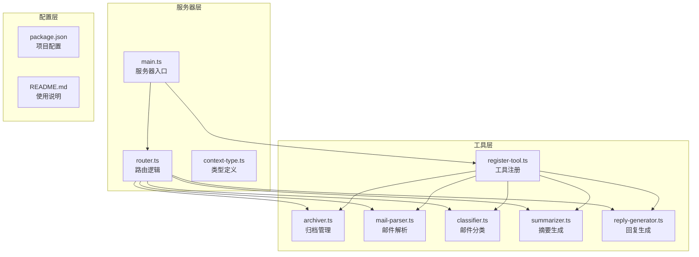
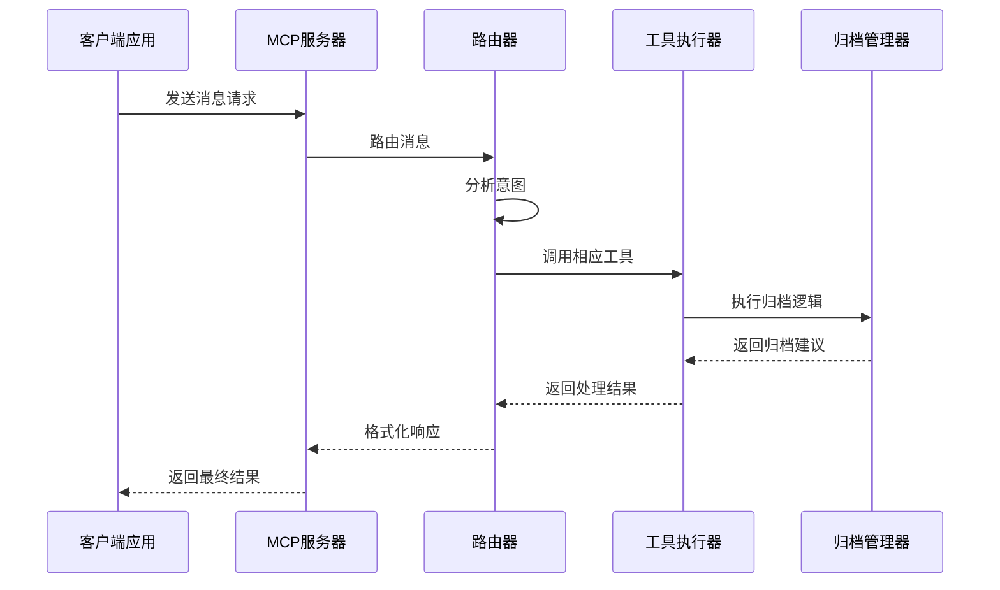
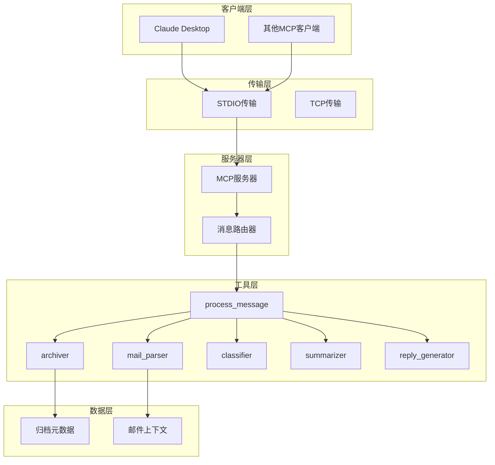
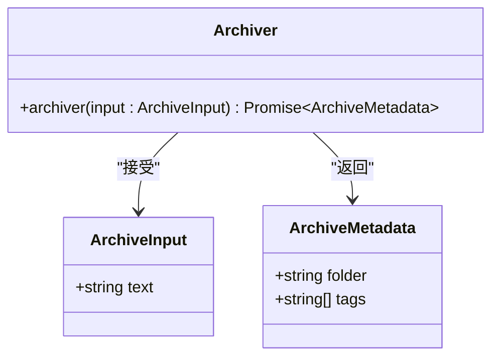
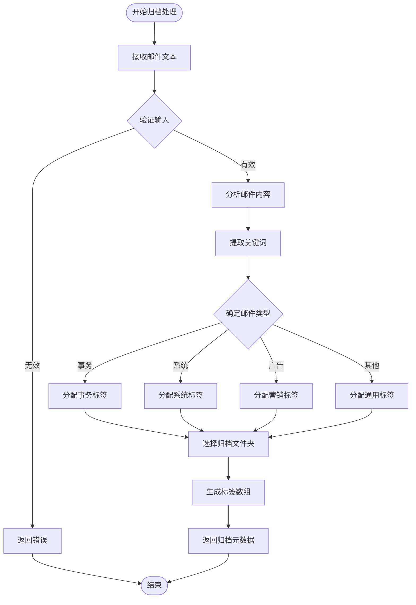
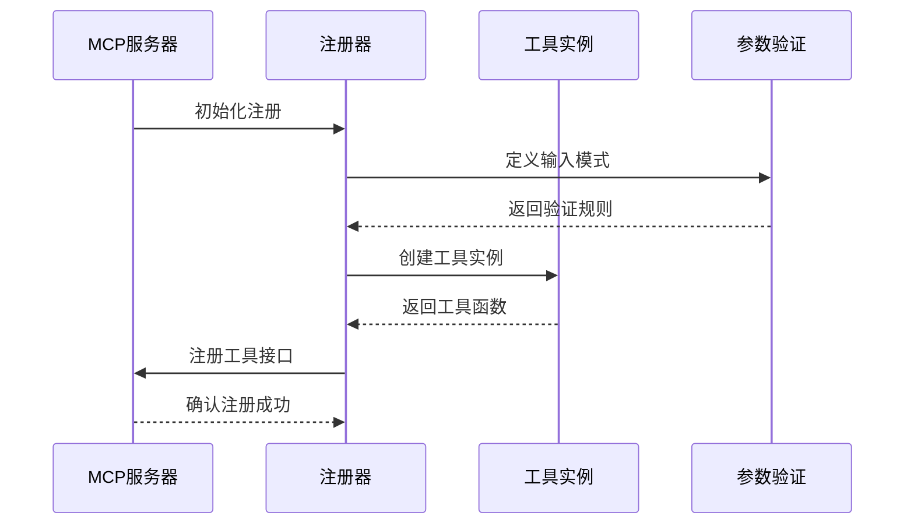
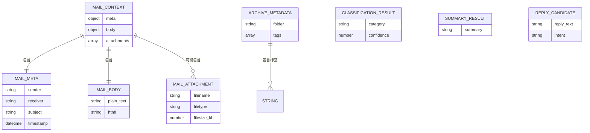
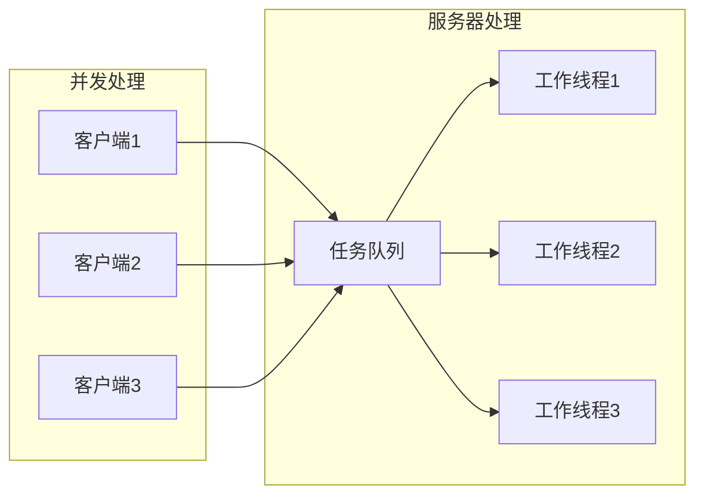

# 归档管理工具API

<cite>
**本文档引用的文件**
- [archiver.ts](file://src/tools/archiver.ts)
- [register-tool.ts](file://src/tools/register-tool.ts)
- [router.ts](file://src/server/router.ts)
- [context-type.ts](file://src/server/context-type.ts)
- [main.ts](file://src/server/main.ts)
- [mail-parser.ts](file://src/tools/mail-parser.ts)
- [classifier.ts](file://src/tools/classifier.ts)
- [summarizer.ts](file://src/tools/summarizer.ts)
- [reply-generator.ts](file://src/tools/reply-generator.ts)
- [README.md](file://README.md)
- [package.json](file://package.json)
</cite>

## 目录
1. [简介](#简介)
2. [项目结构](#项目结构)
3. [核心组件](#核心组件)
4. [架构概览](#架构概览)
5. [详细组件分析](#详细组件分析)
6. [依赖关系分析](#依赖关系分析)
7. [性能考虑](#性能考虑)
8. [故障排除指南](#故障排除指南)
9. [结论](#结论)
10. [附录](#附录)

## 简介

本项目是一个基于MCP协议的消息路由服务器，专门设计用于处理邮件相关的自动化任务。其中的归档管理工具是该系统的核心组件之一，负责为邮件内容生成智能的归档建议，包括文件夹推荐、标签分配和命名规则。

该工具集成了多种AI代理功能，包括邮件解析、分类、摘要生成、回复生成和归档管理，形成了一个完整的邮件处理生态系统。所有工具都遵循MCP协议标准，可以与Claude Desktop等MCP客户端无缝集成。

## 项目结构

该项目采用模块化的架构设计，主要分为以下几个核心部分：



**图表来源**
- [main.ts:1-42](file://src/server/main.ts#L1-L42)
- [router.ts:1-67](file://src/server/router.ts#L1-L67)
- [register-tool.ts:1-186](file://src/tools/register-tool.ts#L1-L186)

**章节来源**
- [main.ts:1-42](file://src/server/main.ts#L1-L42)
- [package.json:1-37](file://package.json#L1-L37)

## 核心组件

### 归档管理工具概述

归档管理工具是整个邮件处理系统的核心组件，负责为邮件内容生成智能的归档建议。该工具实现了MCP协议标准，提供了标准化的API接口，支持与其他AI代理工具的协同工作。

#### 主要功能特性

1. **智能归档建议生成**：基于邮件内容分析，自动生成合适的归档文件夹和标签
2. **标准化输出格式**：提供统一的归档元数据结构，便于系统集成
3. **可扩展性设计**：支持未来算法优化和自定义规则配置
4. **类型安全保证**：使用TypeScript确保编译时类型检查

#### 输入输出规范

| 组件 | 输入参数 | 输出结果 |
|------|----------|----------|
| 归档管理器 | `text: string` (邮件文本内容) | `ArchiveMetadata` (归档元数据) |
| 归档元数据 | 包含文件夹名称和标签数组 | 结构化归档信息 |

**章节来源**
- [archiver.ts:1-32](file://src/tools/archiver.ts#L1-L32)
- [context-type.ts:90-101](file://src/server/context-type.ts#L90-L101)

## 架构概览

该系统采用事件驱动的架构模式，通过MCP协议实现客户端-服务器通信。整体架构分为三层：



**图表来源**
- [register-tool.ts:38-53](file://src/tools/register-tool.ts#L38-L53)
- [router.ts:40-63](file://src/server/router.ts#L40-L63)

### 系统架构图



**图表来源**
- [main.ts:6-35](file://src/server/main.ts#L6-L35)
- [register-tool.ts:55-183](file://src/tools/register-tool.ts#L55-L183)

## 详细组件分析

### 归档管理器核心实现

归档管理器是系统中最核心的组件，负责处理邮件内容并生成相应的归档建议。其设计遵循单一职责原则，专注于归档逻辑的实现。

#### 接口定义



**图表来源**
- [archiver.ts:11-31](file://src/tools/archiver.ts#L11-L31)
- [context-type.ts:95-100](file://src/server/context-type.ts#L95-L100)

#### 核心算法流程

归档管理器采用简单的启发式算法来生成归档建议：



**图表来源**
- [archiver.ts:23-31](file://src/tools/archiver.ts#L23-L31)

#### 当前实现特点

目前的归档实现采用了固定的策略：
- **文件夹策略**：统一使用"事务归档"作为默认文件夹
- **标签策略**：固定返回预定义的标签数组
- **扩展点**：预留了算法优化的空间

**章节来源**
- [archiver.ts:1-32](file://src/tools/archiver.ts#L1-L32)

### 工具注册系统

工具注册系统负责将各个功能模块注册到MCP服务器中，提供统一的API接口。

#### 工具注册流程



**图表来源**
- [register-tool.ts:55-183](file://src/tools/register-tool.ts#L55-L183)

#### 支持的工具类型

系统当前支持以下工具类型：

| 工具名称 | 功能描述 | 输入参数 | 输出格式 |
|----------|----------|----------|----------|
| process_message | 消息处理和路由 | message: string | 文本内容 |
| mail_parser | 邮件解析 | raw_text: string | JSON结构化数据 |
| classifier | 邮件分类 | text: string | 分类结果 |
| summarizer | 邮件摘要 | text: string | 摘要内容 |
| reply_generator | 回复生成 | text: string | 回复建议 |
| archiver | 归档管理 | text: string | 归档元数据 |

**章节来源**
- [register-tool.ts:55-183](file://src/tools/register-tool.ts#L55-L183)

### 路由系统

路由系统是整个系统的大脑，负责分析用户输入并决定调用哪个工具。

#### 意图识别算法

```mermaid
flowchart TD
INPUT[用户输入文本] --> CHECK1{包含"总结"或"概括"?}
CHECK1 --> |是| SUMMARIZE[识别为summarizer]
CHECK1 --> |否| CHECK2{包含"归档"或"标签"?}
CHECK2 --> |是| ARCHIVE[识别为archiver]
CHECK2 --> |否| CHECK3{包含"回复"或"答复"?}
CHECK3 --> |是| REPLY[识别为reply_generator]
CHECK3 --> |否| CHECK4{包含"分类"或"类型"?}
CHECK4 --> |是| CLASSIFY[识别为classifier]
CHECK4 --> |否| DEFAULT[识别为mail_parser]
SUMMARIZE --> OUTPUT[返回工具名称]
ARCHIVE --> OUTPUT
REPLY --> OUTPUT
CLASSIFY --> OUTPUT
DEFAULT --> OUTPUT
```

**图表来源**
- [router.ts:24-38](file://src/server/router.ts#L24-L38)

**章节来源**
- [router.ts:1-67](file://src/server/router.ts#L1-L67)

### 数据模型

系统定义了完整的数据模型来确保各组件间的数据一致性。

#### 核心数据结构



**图表来源**
- [context-type.ts:11-100](file://src/server/context-type.ts#L11-L100)

**章节来源**
- [context-type.ts:1-101](file://src/server/context-type.ts#L1-L101)

## 依赖关系分析

系统采用模块化设计，各组件间的依赖关系清晰明确。

```mermaid
graph TB
subgraph "外部依赖"
MCP[@modelcontextprotocol/sdk<br/>MCP协议实现]
ZOD[zod<br/>参数验证]
LANGCHAIN[@langchain/core<br/>AI链路框架]
end
subgraph "内部模块"
MAIN[main.ts]
ROUTER[router.ts]
REGISTER[register-tool.ts]
ARCHIVER[archiver.ts]
PARSER[mail-parser.ts]
CLASSIFIER[classifier.ts]
SUMMARIZER[summarizer.ts]
REPLY[reply-generator.ts]
CONTEXT[context-type.ts]
end
MCP -.-> MAIN
ZOD -.-> REGISTER
LANGCHAIN -.-> MAIN
MAIN --> ROUTER
MAIN --> REGISTER
REGISTER --> ARCHIVER
REGISTER --> PARSER
REGISTER --> CLASSIFIER
REGISTER --> SUMMARIZER
REGISTER --> REPLY
ROUTER --> ARCHIVER
ROUTER --> PARSER
ROUTER --> CLASSIFIER
ROUTER --> SUMMARIZER
ROUTER --> REPLY
ARCHIVER --> CONTEXT
PARSER --> CONTEXT
CLASSIFIER --> CONTEXT
SUMMARIZER --> CONTEXT
REPLY --> CONTEXT
```

**图表来源**
- [package.json:25-35](file://package.json#L25-L35)
- [main.ts:1-42](file://src/server/main.ts#L1-L42)

### 关键依赖说明

| 依赖包 | 版本 | 用途 | 重要性 |
|--------|------|------|--------|
| @modelcontextprotocol/sdk | ^1.29.0 | MCP协议实现 | 核心依赖 |
| zod | ^4.3.6 | 参数验证 | 核心依赖 |
| @langchain/core | ^1.1.39 | AI链路框架 | 可选依赖 |
| @langchain/langgraph | ^1.2.8 | 图结构AI | 可选依赖 |

**章节来源**
- [package.json:25-35](file://package.json#L25-L35)

## 性能考虑

### 内存使用优化

系统采用异步处理模式，避免阻塞主线程：

1. **非阻塞I/O**：所有工具都使用async/await模式
2. **流式处理**：支持大文本内容的渐进式处理
3. **内存回收**：及时释放中间计算结果

### 并发处理能力



### 性能监控建议

1. **日志记录**：使用console.error输出关键性能指标
2. **超时控制**：为长时间运行的任务设置超时机制
3. **资源限制**：监控内存使用情况，防止内存泄漏

## 故障排除指南

### 常见问题及解决方案

#### 服务器启动问题

**问题**：服务器无法启动
**原因**：端口被占用或权限不足
**解决方案**：
1. 检查端口占用情况
2. 以管理员权限运行
3. 修改配置文件中的端口号

#### 工具调用失败

**问题**：工具调用返回错误
**排查步骤**：
1. 检查工具注册状态
2. 验证输入参数格式
3. 查看服务器日志

#### 意图识别错误

**问题**：工具调用不正确
**排查步骤**：
1. 检查用户输入文本
2. 验证关键词匹配规则
3. 更新路由逻辑

**章节来源**
- [README.md:111-124](file://README.md#L111-L124)

### 调试技巧

1. **启用详细日志**：使用console.error输出调试信息
2. **单元测试**：为每个工具编写独立的测试用例
3. **性能分析**：使用Node.js内置的性能分析工具

## 结论

本归档管理工具API提供了一个完整、可扩展的邮件处理解决方案。通过模块化的设计和标准化的接口，系统能够灵活地适应不同的业务需求。

### 主要优势

1. **标准化接口**：遵循MCP协议，易于集成
2. **类型安全**：使用TypeScript确保代码质量
3. **可扩展性**：支持自定义算法和规则
4. **模块化设计**：各组件职责明确，便于维护

### 发展方向

1. **算法优化**：实现更智能的归档建议算法
2. **配置管理**：支持动态配置归档规则
3. **多语言支持**：扩展对不同语言邮件的支持
4. **机器学习集成**：引入深度学习模型提升准确性

## 附录

### API参考

#### 归档管理器API

| 属性 | 类型 | 描述 | 必需 |
|------|------|------|------|
| text | string | 待归档的邮件文本内容 | 是 |

**返回值**：ArchiveMetadata对象

#### 归档元数据结构

| 属性 | 类型 | 描述 |
|------|------|------|
| folder | string | 归档文件夹名称 |
| tags | string[] | 归档标签数组 |

### 使用示例

#### 基本使用

```javascript
// 调用归档管理器
const result = await archiver({
  text: "这是一封重要的项目邮件，需要归档到事务归档文件夹"
});

console.log(result.folder); // 输出: 事务归档
console.log(result.tags);   // 输出: ["项目", "总结", "处理完毕"]
```

#### 在MCP环境中使用

```javascript
// 通过MCP服务器调用
const response = await mcpServer.callTool('archiver', {
  text: "邮件内容"
});

// 处理返回的归档建议
const archiveData = JSON.parse(response.content[0].text);
```

### 最佳实践

1. **输入验证**：始终验证邮件文本的有效性
2. **错误处理**：实现完善的异常处理机制
3. **日志记录**：记录关键操作和错误信息
4. **性能监控**：定期监控系统性能指标
5. **安全考虑**：过滤敏感信息，保护用户隐私

### 扩展指南

#### 自定义归档算法

```typescript
// 扩展归档管理器
export async function advancedArchiver(input: ArchiveInput): Promise<ArchiveMetadata> {
  // 实现自定义算法
  const folder = await generateFolderName(input.text);
  const tags = await generateTags(input.text);
  
  return {
    folder,
    tags
  };
}
```

#### 集成第三方服务

1. **云存储集成**：支持云端归档服务
2. **数据库集成**：记录归档历史
3. **搜索服务集成**：提供全文检索功能