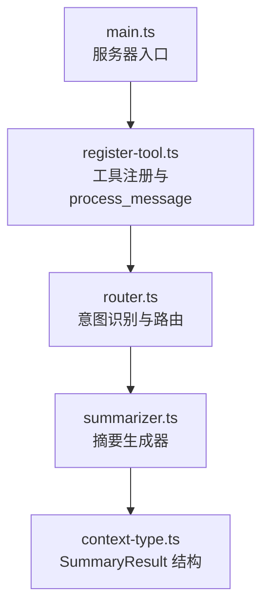
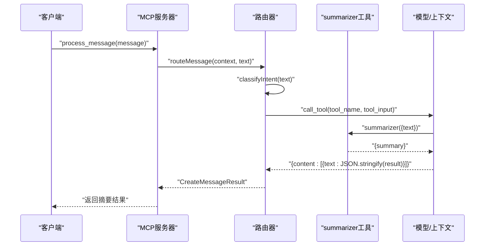
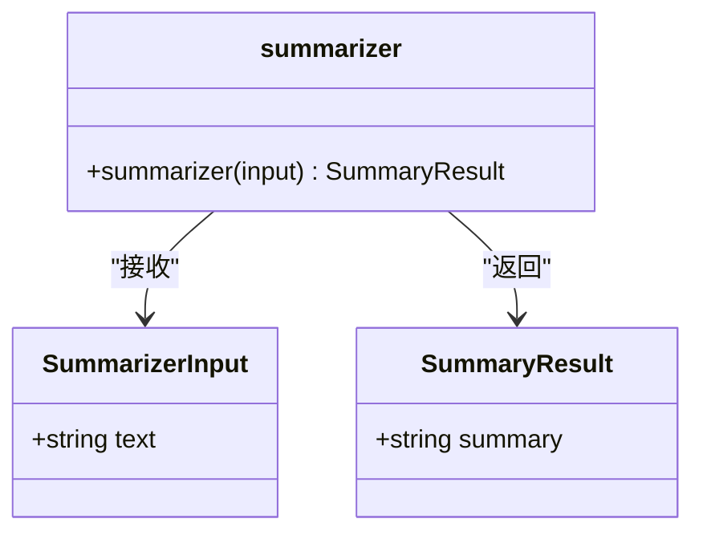
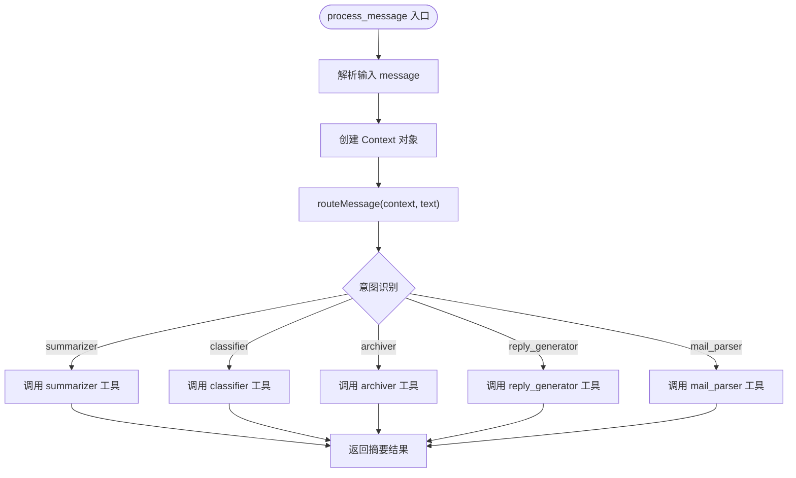
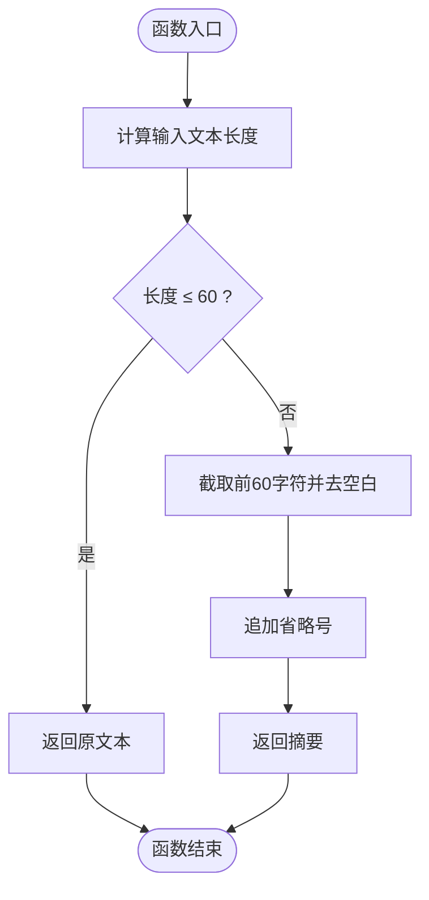
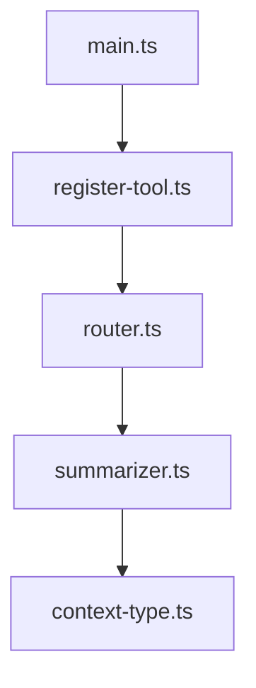

# 摘要生成工具API

<cite>
**本文引用的文件**
- [summarizer.ts](file://src/tools/summarizer.ts)
- [register-tool.ts](file://src/tools/register-tool.ts)
- [router.ts](file://src/server/router.ts)
- [context-type.ts](file://src/server/context-type.ts)
- [main.ts](file://src/server/main.ts)
- [README.md](file://README.md)
- [package.json](file://package.json)
</cite>

## 目录
1. [简介](#简介)
2. [项目结构](#项目结构)
3. [核心组件](#核心组件)
4. [架构总览](#架构总览)
5. [详细组件分析](#详细组件分析)
6. [依赖关系分析](#依赖关系分析)
7. [性能考量](#性能考量)
8. [故障排查指南](#故障排查指南)
9. [结论](#结论)
10. [附录](#附录)

## 简介
本文件为“摘要生成工具”的完整API文档，聚焦于process_message工具中的summarizer接口规范与实现细节。该工具基于MCP协议构建，负责对输入的邮件内容生成简短摘要（固定长度前缀+省略号），并以统一的结构化结果返回。文档涵盖接口定义、输入输出格式、处理流程、质量评估与优化建议，并提供典型场景示例与性能考量，帮助开发者快速集成与扩展。

## 项目结构
该项目采用模块化设计，围绕MCP服务器与一组工具（含summarizer）组织。核心目录与文件如下：
- server：MCP服务器入口与路由逻辑
- tools：各类工具实现（summarizer、mail-parser、classifier、reply-generator、archiver）
- server/context-type.ts：统一的数据模型与结果结构定义
- package.json：项目依赖与脚本配置

图表来源
- [main.ts:1-42](file://src/server/main.ts#L1-L42)
- [register-tool.ts:55-138](file://src/tools/register-tool.ts#L55-L138)
- [router.ts:40-63](file://src/server/router.ts#L40-L63)
- [summarizer.ts:23-34](file://src/tools/summarizer.ts#L23-L34)
- [context-type.ts:70-76](file://src/server/context-type.ts#L70-L76)

章节来源
- [README.md:88-97](file://README.md#L88-L97)
- [package.json:1-37](file://package.json#L1-L37)

## 核心组件
- 摘要生成器（summarizer）：接收文本输入，按固定长度截取并返回摘要结果。
- 工具注册（register-tool）：将summarizer注册为MCP工具，并定义其输入schema与调用流程。
- 路由器（router）：根据用户输入识别意图，将请求分发至对应工具（如summarizer）。
- 上下文类型（context-type）：定义统一的摘要结果结构（SummaryResult）。

章节来源
- [summarizer.ts:23-34](file://src/tools/summarizer.ts#L23-L34)
- [register-tool.ts:117-138](file://src/tools/register-tool.ts#L117-L138)
- [router.ts:24-38](file://src/server/router.ts#L24-L38)
- [context-type.ts:70-76](file://src/server/context-type.ts#L70-L76)

## 架构总览
MCP服务器启动后，通过Stdio传输层与客户端（如Claude Desktop）建立连接。客户端发送消息时，服务器先经路由识别意图，再调用相应工具执行具体任务。summarizer作为其中一个工具，负责对输入文本生成固定长度的摘要。

图表来源
- [main.ts:6-35](file://src/server/main.ts#L6-L35)
- [register-tool.ts:55-71](file://src/tools/register-tool.ts#L55-L71)
- [router.ts:40-63](file://src/server/router.ts#L40-L63)
- [summarizer.ts:23-34](file://src/tools/summarizer.ts#L23-L34)

## 详细组件分析

### 接口规范：summarizer
- 工具名称：summarizer
- 功能：对输入文本生成固定长度的摘要（前60个字符，超长则追加省略号）
- 输入参数：
  - text: string（必填，待摘要的邮件文本）
- 输出结果：
  - summary: string（生成的摘要内容）

图表来源
- [summarizer.ts:11-14](file://src/tools/summarizer.ts#L11-L14)
- [summarizer.ts:31-33](file://src/tools/summarizer.ts#L31-L33)
- [context-type.ts:70-76](file://src/server/context-type.ts#L70-L76)

章节来源
- [summarizer.ts:23-34](file://src/tools/summarizer.ts#L23-L34)
- [context-type.ts:70-76](file://src/server/context-type.ts#L70-L76)

### 工具注册与process_message
- register-tool.ts将summarizer注册为MCP工具，定义其输入schema与调用逻辑。
- process_message工具负责接收用户消息，创建上下文，调用路由器进行意图识别与任务分发，并最终返回工具结果。

图表来源
- [register-tool.ts:55-71](file://src/tools/register-tool.ts#L55-L71)
- [router.ts:40-63](file://src/server/router.ts#L40-L63)
- [register-tool.ts:117-138](file://src/tools/register-tool.ts#L117-L138)

章节来源
- [register-tool.ts:55-138](file://src/tools/register-tool.ts#L55-L138)
- [router.ts:24-38](file://src/server/router.ts#L24-L38)

### 摘要生成算法原理与处理流程
- 算法原理：简单截取策略
  - 若输入文本长度不超过阈值（60字符），直接返回原文本；
  - 若超过阈值，则截取前60个字符，去除首尾空白，末尾追加省略号。
- 处理流程：
  1) 接收输入文本；
  2) 计算长度并判断是否超过阈值；
  3) 截取并拼接省略号（如适用）；
  4) 封装为SummaryResult并返回。

图表来源
- [summarizer.ts:26-29](file://src/tools/summarizer.ts#L26-L29)
- [summarizer.ts:31-33](file://src/tools/summarizer.ts#L31-L33)

章节来源
- [summarizer.ts:23-34](file://src/tools/summarizer.ts#L23-L34)

### 输入参数格式与约束
- text字段：
  - 类型：string
  - 必填：是
  - 长度：无硬性上限，但摘要仅保留前60个字符
  - 复杂度：支持任意文本（中文、英文、数字、标点等）
- 兼容性：MCP工具通过Zod schema校验输入，确保传入参数符合规范。

章节来源
- [register-tool.ts:120-125](file://src/tools/register-tool.ts#L120-L125)
- [summarizer.ts:11-14](file://src/tools/summarizer.ts#L11-L14)

### 输出结果格式与关键信息
- 结构：SummaryResult
  - summary: string（摘要文本）
- 关键信息提取：
  - 该实现不进行语义抽取或关键词提取，仅提供长度受限的文本片段。
- 总结要点：
  - 适合快速预览与标题级摘要，不适合替代全文摘要或关键信息抽取。

章节来源
- [context-type.ts:70-76](file://src/server/context-type.ts#L70-L76)
- [summarizer.ts:31-33](file://src/tools/summarizer.ts#L31-L33)

### 摘要质量评估标准与优化建议
- 评估标准（定性）：
  - 可读性：是否能传达核心信息（当前实现不保证）
  - 长度控制：是否严格限制在60字符以内（当前实现满足）
  - 一致性：对相同输入是否产生稳定结果（当前实现满足）
  - 边界处理：空字符串、超长文本、纯空白文本的行为（当前实现满足）
- 优化建议：
  - 引入分词与句段边界识别，避免在词语中间截断；
  - 基于TF-IDF或TextRank提取关键词，优先保留关键短语；
  - 结合领域知识（邮件主题、正文结构）提升摘要代表性；
  - 提供多版本摘要（短、中、长）以适配不同场景；
  - 增加可配置阈值与截断策略（如保留完整句子）。

章节来源
- [summarizer.ts:26-29](file://src/tools/summarizer.ts#L26-L29)

### 示例与处理效果
- 示例1：短文本（≤60字符）
  - 输入：例如“会议纪要已整理完成，请审阅。”
  - 输出：原文本（未截断）
- 示例2：长文本（>60字符）
  - 输入：例如“关于本周项目进度的汇总报告，包括各模块完成情况、遇到的问题及解决方案，以及下周的工作计划，请查收附件并反馈意见。”
  - 输出：前60字符+省略号
- 示例3：超长文本（>100字符）
  - 输入：例如“请在本周五下班前提交季度财务报表，包含收入支出明细、预算执行情况、现金流预测及风险提示；逾期将影响下季度资金安排，请务必重视并按时完成。”
  - 输出：前60字符+省略号
- 示例4：空文本
  - 输入：空字符串
  - 输出：空字符串
- 示例5：纯空白文本
  - 输入：多个空格或制表符
  - 输出：去除空白后的空字符串

章节来源
- [summarizer.ts:26-29](file://src/tools/summarizer.ts#L26-L29)

### 性能考虑与资源消耗
- 时间复杂度：O(n)，其中n为输入文本长度（主要为字符串截取与拼接操作）
- 空间复杂度：O(n)，用于存储截取后的摘要
- 资源消耗：
  - CPU：极低（字符串操作）
  - 内存：极低（固定长度缓冲区）
- 并发与吞吐：
  - 由于实现简单，适合高并发场景；若后续引入复杂NLP模型，需评估GPU/CPU与内存占用
- 缓存与复用：
  - 可对相同输入进行缓存，减少重复计算（适用于重复摘要同一邮件）

章节来源
- [summarizer.ts:26-29](file://src/tools/summarizer.ts#L26-L29)

## 依赖关系分析
- 服务器与传输层：MCP服务器通过Stdio传输层与客户端通信。
- 工具注册：register-tool.ts集中注册所有工具，包括summarizer。
- 路由与意图识别：router.ts根据关键词识别意图并调用对应工具。
- 数据模型：context-type.ts统一定义SummaryResult结构，确保工具输出一致性。

图表来源
- [main.ts:1-42](file://src/server/main.ts#L1-L42)
- [register-tool.ts:55-138](file://src/tools/register-tool.ts#L55-L138)
- [router.ts:40-63](file://src/server/router.ts#L40-L63)
- [summarizer.ts:23-34](file://src/tools/summarizer.ts#L23-L34)
- [context-type.ts:70-76](file://src/server/context-type.ts#L70-L76)

章节来源
- [package.json:25-30](file://package.json#L25-L30)
- [README.md:125-131](file://README.md#L125-L131)

## 性能考量
- 当前实现为纯字符串处理，性能优异且资源占用极低。
- 若未来扩展为基于模型的摘要（如抽取式或生成式），需关注：
  - 模型加载与初始化成本
  - 推理延迟与并发限制
  - GPU/CPU与显存占用
- 建议：
  - 在工具层增加超时与重试机制
  - 对高频请求进行本地缓存
  - 使用流式处理或分块摘要以降低内存峰值

## 故障排查指南
- 症状：直接运行dev后无响应
  - 原因：MCP服务器非交互式，需通过客户端（如Claude Desktop）调用
  - 处理：配置客户端并发送消息触发process_message
- 症状：日志未显示
  - 原因：服务器日志输出到stderr
  - 处理：在客户端日志中查看或使用console.error输出
- 症状：summarizer结果不符合预期
  - 原因：当前实现仅截取前60字符，不进行语义抽取
  - 处理：按需扩展为关键词抽取或模型摘要

章节来源
- [README.md:113-124](file://README.md#L113-L124)
- [router.ts:25-38](file://src/server/router.ts#L25-L38)

## 结论
summarizer工具提供了简洁高效的摘要能力，适合快速预览与标题级摘要场景。其接口清晰、实现简单、性能优异。对于更复杂的摘要需求（如关键信息抽取、语义保留、多语言支持），建议在现有基础上引入NLP技术与可配置策略，以平衡准确性与效率。

## 附录
- 工具清单与用途概览
  - process_message：消息入口与任务分发
  - summarizer：文本摘要（前60字符）
  - mail_parser：邮件解析（元数据与正文）
  - classifier：邮件分类（事务通知、系统信息、广告推广、社交沟通）
  - reply_generator：标准回复建议
  - archiver：归档文件夹与标签建议

章节来源
- [README.md:80-87](file://README.md#L80-L87)
- [register-tool.ts:55-183](file://src/tools/register-tool.ts#L55-L183)