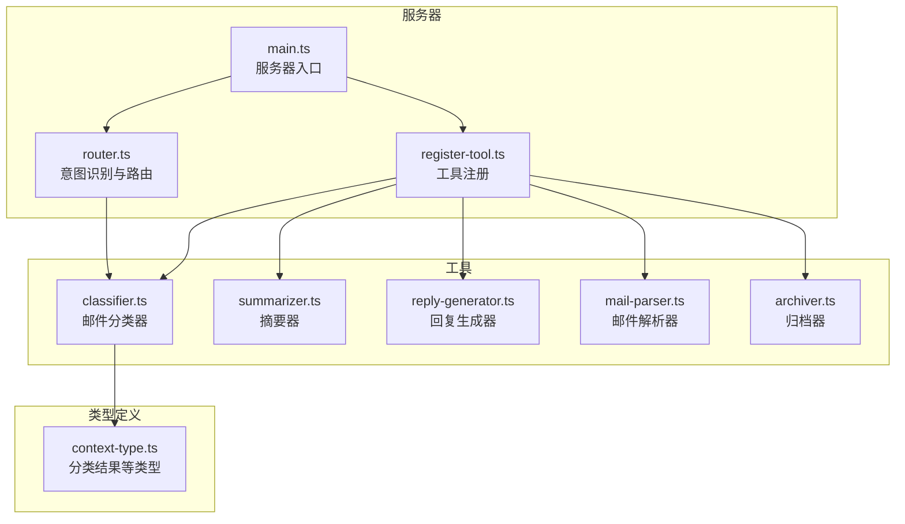
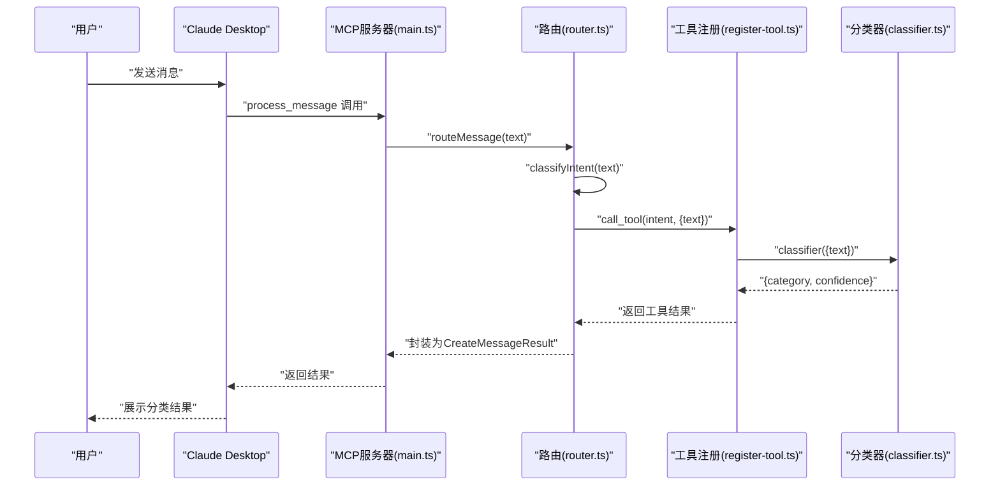
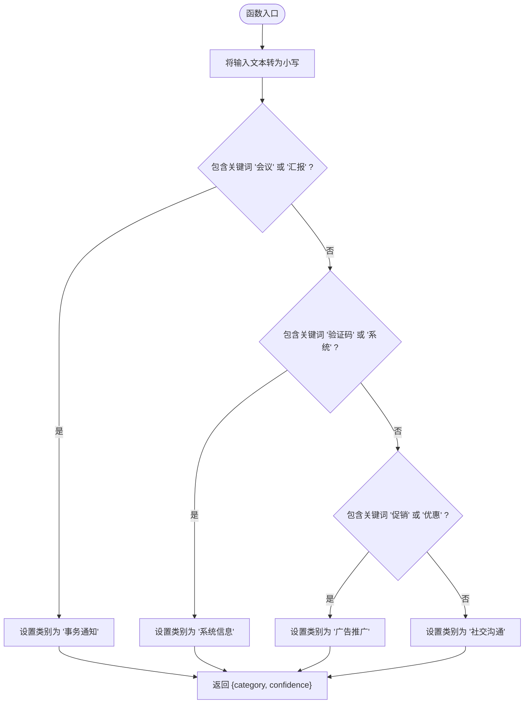
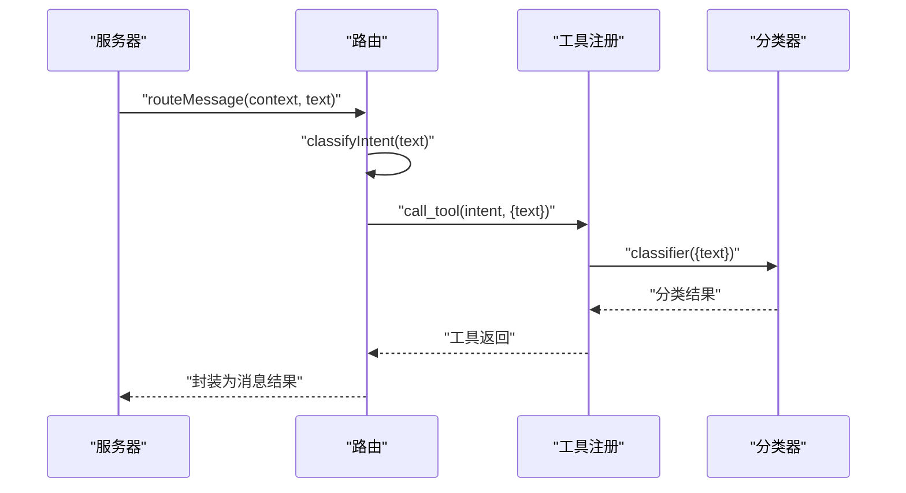
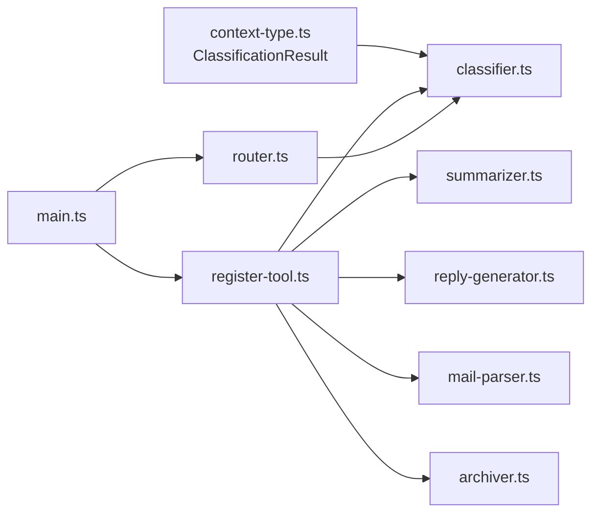

# 邮件分类工具API

<cite>
**本文引用的文件**
- [src/tools/classifier.ts](file://src/tools/classifier.ts)
- [src/server/context-type.ts](file://src/server/context-type.ts)
- [src/server/router.ts](file://src/server/router.ts)
- [src/tools/register-tool.ts](file://src/tools/register-tool.ts)
- [src/server/main.ts](file://src/server/main.ts)
- [README.md](file://README.md)
</cite>

## 目录
1. [简介](#简介)
2. [项目结构](#项目结构)
3. [核心组件](#核心组件)
4. [架构总览](#架构总览)
5. [详细组件分析](#详细组件分析)
6. [依赖关系分析](#依赖关系分析)
7. [性能考量](#性能考量)
8. [故障排查指南](#故障排查指南)
9. [结论](#结论)
10. [附录](#附录)

## 简介
本文件为“邮件分类工具”的详细API文档，聚焦于 process_message 工具中的 classifier 功能规范。该工具基于关键词匹配实现简易分类，支持将邮件内容归类为“事务通知”“系统信息”“广告推广”“社交沟通”四类，并返回分类标签与置信度。文档涵盖输入参数格式、输出结果结构、分类规则与算法原理、标准化输出格式、典型分类示例、准确性限制与改进建议等。

## 项目结构
该项目是一个基于 MCP 协议的消息路由服务器，负责接收用户消息，通过意图识别将请求分发至具体工具（如分类器、摘要器、回复生成器、邮件解析器、归档器）。其中，process_message 工具负责整体流程编排，classifier 工具负责邮件分类。

图表来源
- [src/server/main.ts:1-42](file://src/server/main.ts#L1-L42)
- [src/server/router.ts:1-67](file://src/server/router.ts#L1-L67)
- [src/tools/register-tool.ts:1-186](file://src/tools/register-tool.ts#L1-L186)
- [src/tools/classifier.ts:1-45](file://src/tools/classifier.ts#L1-L45)
- [src/server/context-type.ts:1-101](file://src/server/context-type.ts#L1-L101)

章节来源
- [README.md:80-97](file://README.md#L80-L97)
- [src/server/main.ts:1-42](file://src/server/main.ts#L1-L42)
- [src/server/router.ts:1-67](file://src/server/router.ts#L1-L67)
- [src/tools/register-tool.ts:1-186](file://src/tools/register-tool.ts#L1-L186)

## 核心组件
- process_message 工具：接收用户消息，通过路由识别意图并调用对应工具（含 classifier）。
- classifier 工具：对输入文本执行关键词匹配，返回分类标签与置信度。
- 类型定义：ClassificationResult 规范了分类输出的结构（category、confidence）。

章节来源
- [src/server/router.ts:40-63](file://src/server/router.ts#L40-L63)
- [src/tools/classifier.ts:16-44](file://src/tools/classifier.ts#L16-L44)
- [src/server/context-type.ts:56-66](file://src/server/context-type.ts#L56-L66)

## 架构总览
下图展示了从用户消息到分类结果的完整调用链路，以及 classifier 在其中的角色。

图表来源
- [src/server/main.ts:6-35](file://src/server/main.ts#L6-L35)
- [src/server/router.ts:40-63](file://src/server/router.ts#L40-L63)
- [src/tools/register-tool.ts:55-115](file://src/tools/register-tool.ts#L55-L115)
- [src/tools/classifier.ts:23-44](file://src/tools/classifier.ts#L23-L44)

## 详细组件分析

### classifier 工具 API
- 工具名称：classifier
- 描述：对邮件进行分类（事务通知、系统信息、广告推广、社交沟通）
- 输入参数
  - text: string（待分类的邮件文本）
- 输出结果
  - category: string（分类标签）
  - confidence: number（置信度）

图表来源
- [src/tools/classifier.ts:23-44](file://src/tools/classifier.ts#L23-L44)

章节来源
- [src/tools/classifier.ts:16-44](file://src/tools/classifier.ts#L16-L44)
- [src/server/context-type.ts:56-66](file://src/server/context-type.ts#L56-L66)

### process_message 工具与路由机制
- process_message 工具负责接收用户消息，通过 classifyIntent 判断意图，再调用对应工具（如 classifier）。
- 路由器根据关键词集合将用户输入映射到具体工具名，随后通过工具注册表调用相应实现。

图表来源
- [src/server/router.ts:24-38](file://src/server/router.ts#L24-L38)
- [src/server/router.ts:40-63](file://src/server/router.ts#L40-L63)
- [src/tools/register-tool.ts:55-115](file://src/tools/register-tool.ts#L55-L115)

章节来源
- [src/server/router.ts:24-38](file://src/server/router.ts#L24-L38)
- [src/server/router.ts:40-63](file://src/server/router.ts#L40-L63)
- [src/tools/register-tool.ts:55-115](file://src/tools/register-tool.ts#L55-L115)

### 输入参数与输出结果规范
- 输入参数
  - text: string（必填），表示待分类的邮件文本内容
- 输出结果
  - category: string（必填），取值范围为“事务通知”“系统信息”“广告推广”“社交沟通”
  - confidence: number（必填），当前实现固定为 0.9

章节来源
- [src/tools/classifier.ts:11-14](file://src/tools/classifier.ts#L11-L14)
- [src/tools/classifier.ts:40-43](file://src/tools/classifier.ts#L40-L43)
- [src/server/context-type.ts:61-66](file://src/server/context-type.ts#L61-L66)

### 分类规则与算法原理
- 算法类型：基于关键词的简单规则匹配
- 文本预处理：将输入文本统一转换为小写以提升匹配鲁棒性
- 分类规则
  - 若文本包含“会议”或“汇报”，分类为“事务通知”
  - 否则若包含“验证码”或“系统”，分类为“系统信息”
  - 否则若包含“促销”或“优惠”，分类为“广告推广”
  - 否则默认为“社交沟通”
- 置信度：当前实现固定返回 0.9

章节来源
- [src/tools/classifier.ts:23-44](file://src/tools/classifier.ts#L23-L44)

### 实际分类示例与常见场景
- 示例1：包含“会议”或“汇报”
  - 输入：某会议通知或工作汇报
  - 结果：category = “事务通知”，confidence = 0.9
- 示例2：包含“验证码”或“系统”
  - 输入：验证码短信或系统维护通知
  - 结果：category = “系统信息”，confidence = 0.9
- 示例3：包含“促销”或“优惠”
  - 输入：营销邮件或促销活动
  - 结果：category = “广告推广”，confidence = 0.9
- 示例4：不满足上述关键词
  - 输入：日常聊天或私人邮件
  - 结果：category = “社交沟通”，confidence = 0.9

章节来源
- [src/tools/classifier.ts:30-38](file://src/tools/classifier.ts#L30-L38)

### 工具注册与调用流程
- 服务器启动后，通过 registerAllTools 将各工具注册到 MCP 服务器
- process_message 工具定义了输入 schema（message: string），并在实现中调用 routeMessage
- classifier 工具同样定义了输入 schema（text: string），并在实现中调用分类逻辑

章节来源
- [src/server/main.ts:19-20](file://src/server/main.ts#L19-L20)
- [src/tools/register-tool.ts:55-115](file://src/tools/register-tool.ts#L55-L115)

## 依赖关系分析
- classifier 依赖于 ClassificationResult 类型定义，确保输出结构一致
- 路由器依赖于工具注册表，通过工具名动态调用对应实现
- process_message 通过路由将用户意图分发给具体工具（如 classifier）

图表来源
- [src/server/context-type.ts:56-66](file://src/server/context-type.ts#L56-L66)
- [src/tools/classifier.ts:6](file://src/tools/classifier.ts#L6)
- [src/tools/register-tool.ts:55-115](file://src/tools/register-tool.ts#L55-L115)
- [src/server/main.ts:19-20](file://src/server/main.ts#L19-L20)
- [src/server/router.ts:40-63](file://src/server/router.ts#L40-L63)

章节来源
- [src/server/context-type.ts:56-66](file://src/server/context-type.ts#L56-L66)
- [src/tools/classifier.ts:6](file://src/tools/classifier.ts#L6)
- [src/tools/register-tool.ts:55-115](file://src/tools/register-tool.ts#L55-L115)
- [src/server/main.ts:19-20](file://src/server/main.ts#L19-L20)
- [src/server/router.ts:40-63](file://src/server/router.ts#L40-L63)

## 性能考量
- 时间复杂度：关键词匹配为 O(n)（n 为关键词数量），对单条文本分类的时间开销极低
- 空间复杂度：仅使用常量级额外空间，适合高并发场景
- 可扩展性：当前实现为静态规则，可通过引入更复杂的 NLP 模型或词典扩展提升准确性

## 故障排查指南
- 无法通过 Claude Desktop 调用
  - 确认服务器已启动且监听 stdio；MCP 客户端已正确配置
  - 查看服务器日志（stderr 输出）以定位问题
- 分类结果不符合预期
  - 检查输入文本是否包含目标关键词
  - 调整关键词规则或引入更丰富的特征工程
- 置信度异常
  - 当前实现固定置信度为 0.9，如需动态置信度，可在规则匹配基础上增加相似度计算

章节来源
- [README.md:111-124](file://README.md#L111-L124)
- [src/server/main.ts:25-34](file://src/server/main.ts#L25-L34)
- [src/tools/classifier.ts:40-43](file://src/tools/classifier.ts#L40-L43)

## 结论
classifier 工具通过简单而高效的关键词匹配实现了邮件分类，具备快速、稳定的特性。其输出结构标准化，便于与其他工具协同工作。对于更复杂场景，建议引入机器学习模型、上下文感知与多模态特征，以进一步提升分类准确性与鲁棒性。

## 附录
- 支持的分类类别
  - 事务通知
  - 系统信息
  - 广告推广
  - 社交沟通
- 置信度说明
  - 当前实现固定为 0.9，后续可扩展为基于相似度或概率的动态置信度