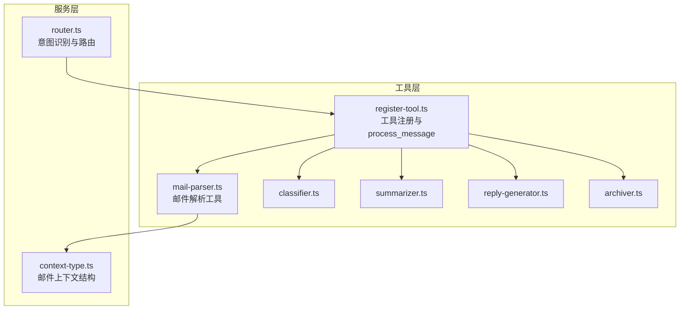
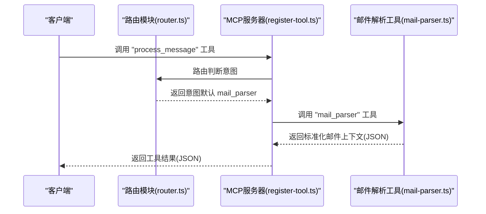
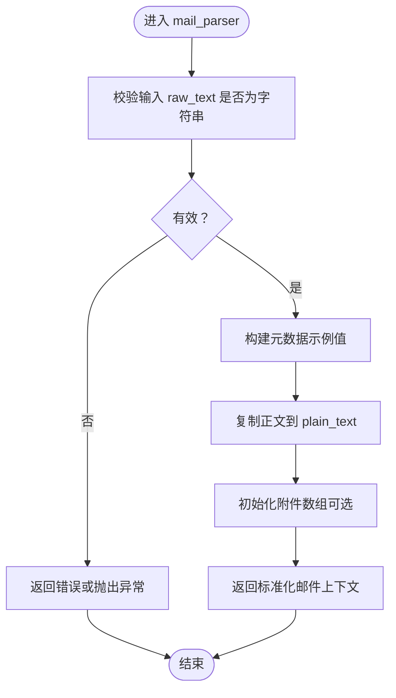
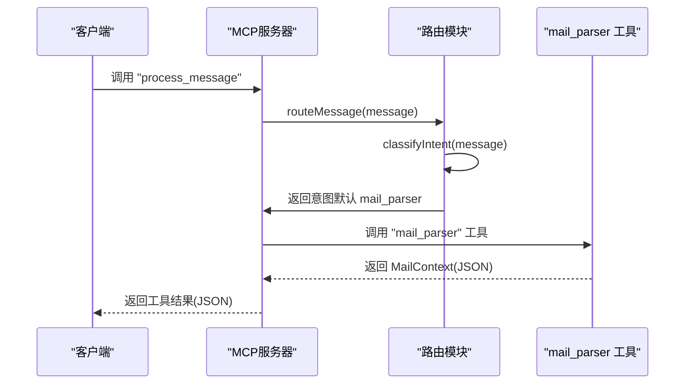
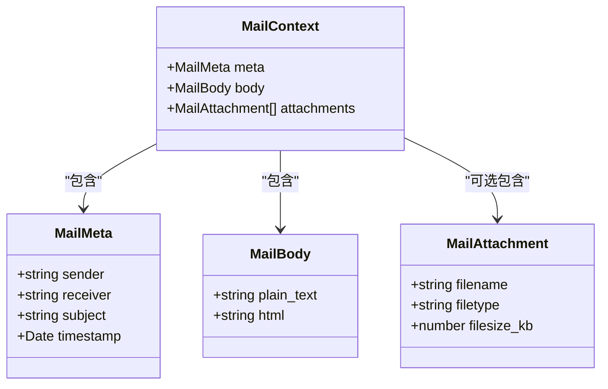
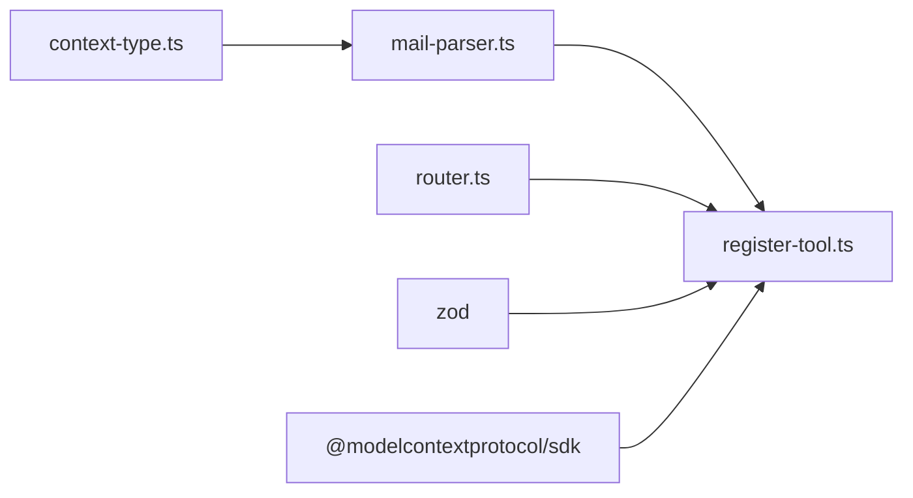

# 邮件解析工具API

<cite>
**本文引用的文件**
- [mail-parser.ts](file://src/tools/mail-parser.ts)
- [register-tool.ts](file://src/tools/register-tool.ts)
- [context-type.ts](file://src/server/context-type.ts)
- [router.ts](file://src/server/router.ts)
- [README.md](file://README.md)
- [package.json](file://package.json)
</cite>

## 目录
1. [简介](#简介)
2. [项目结构](#项目结构)
3. [核心组件](#核心组件)
4. [架构总览](#架构总览)
5. [详细组件分析](#详细组件分析)
6. [依赖关系分析](#依赖关系分析)
7. [性能考量](#性能考量)
8. [故障排查指南](#故障排查指南)
9. [结论](#结论)
10. [附录](#附录)

## 简介
本文件为“邮件解析工具”的完整API文档，聚焦于工具名“mail_parser”在process_message流程中的作用与接口规范。该工具负责将原始邮件文本解析为标准化的邮件上下文结构，包含元数据与正文内容，并以JSON形式返回给调用方。文档涵盖输入参数格式、输出结构、参数校验规则、错误处理机制、典型示例以及解析算法的限制与注意事项。

## 项目结构
该项目是一个基于MCP协议的消息路由服务器，支持多工具注册与分发，其中“mail_parser”是其中一个工具。核心目录与文件如下：
- src/tools/mail-parser.ts：邮件解析工具实现
- src/tools/register-tool.ts：MCP工具注册与process_message流程
- src/server/context-type.ts：邮件上下文与各工具输出结构定义
- src/server/router.ts：意图识别与工具路由
- README.md：项目说明与使用方式
- package.json：项目依赖与脚本

图表来源
- [mail-parser.ts:1-37](file://src/tools/mail-parser.ts#L1-L37)
- [register-tool.ts:55-93](file://src/tools/register-tool.ts#L55-L93)
- [context-type.ts:47-54](file://src/server/context-type.ts#L47-L54)
- [router.ts:41-63](file://src/server/router.ts#L41-L63)

章节来源
- [README.md:88-97](file://README.md#L88-L97)
- [package.json:10-15](file://package.json#L10-L15)

## 核心组件
- 邮件解析工具（mail_parser）
  - 输入：原始邮件文本（字符串）
  - 输出：标准化邮件上下文（包含元数据与正文）
  - 实现位置：[mail-parser.ts:23-36](file://src/tools/mail-parser.ts#L23-L36)
- 工具注册与process_message流程
  - 注册mail_parser工具，定义输入schema与返回结构
  - 实现位置：[register-tool.ts:74-93](file://src/tools/register-tool.ts#L74-L93)
- 邮件上下文结构
  - 元数据（sender、receiver、subject、timestamp）
  - 正文（plain_text、html可选）
  - 附件（filename、filetype、filesize_kb可选）
  - 实现位置：[context-type.ts:11-54](file://src/server/context-type.ts#L11-L54)

章节来源
- [mail-parser.ts:23-36](file://src/tools/mail-parser.ts#L23-L36)
- [register-tool.ts:74-93](file://src/tools/register-tool.ts#L74-L93)
- [context-type.ts:11-54](file://src/server/context-type.ts#L11-L54)

## 架构总览
下图展示了从process_message到mail_parser的调用链路与数据流。

图表来源
- [router.ts:41-63](file://src/server/router.ts#L41-L63)
- [register-tool.ts:74-93](file://src/tools/register-tool.ts#L74-L93)
- [mail-parser.ts:23-36](file://src/tools/mail-parser.ts#L23-L36)

## 详细组件分析

### 邮件解析工具（mail_parser）
- 工具名称：mail_parser
- 功能：将原始邮件文本解析为标准化邮件上下文
- 输入参数
  - raw_text: string（必填）
- 输出结构
  - meta.sender: string
  - meta.receiver: string
  - meta.subject: string
  - meta.timestamp: Date
  - body.plain_text: string
  - body.html: string（可选）
  - attachments: MailAttachment[]（可选）
- 实现要点
  - 当前为伪解析逻辑，仅填充示例值与原样复制正文
  - 可扩展为正则提取或结构化邮件头解析
- 错误处理
  - 当前未显式抛错；若raw_text为空或非字符串，将导致输出异常
  - 建议在上层增加参数校验与边界检查

图表来源
- [mail-parser.ts:23-36](file://src/tools/mail-parser.ts#L23-L36)
- [context-type.ts:47-54](file://src/server/context-type.ts#L47-L54)

章节来源
- [mail-parser.ts:11-36](file://src/tools/mail-parser.ts#L11-L36)
- [context-type.ts:11-54](file://src/server/context-type.ts#L11-L54)

### 工具注册与process_message流程
- 注册工具
  - 工具名：mail_parser
  - 描述：解析邮件内容，提取元数据和正文
  - 输入schema：raw_text（字符串）
  - 返回：content数组，元素为text类型，内容为JSON字符串
- process_message工具
  - 工具名：process_message
  - 描述：处理用户输入的消息并通过路由器进行任务分发
  - 输入schema：message（字符串）
  - 流程：调用routeMessage进行意图识别，默认返回mail_parser
- 路由逻辑
  - classifyIntent：根据关键词识别意图
  - routeMessage：调用对应工具并封装返回

图表来源
- [register-tool.ts:55-93](file://src/tools/register-tool.ts#L55-L93)
- [router.ts:25-63](file://src/server/router.ts#L25-L63)

章节来源
- [register-tool.ts:55-93](file://src/tools/register-tool.ts#L55-L93)
- [router.ts:25-63](file://src/server/router.ts#L25-L63)

### 邮件上下文结构
- MailMeta
  - sender: string
  - receiver: string
  - subject: string
  - timestamp: Date
- MailBody
  - plain_text: string
  - html: string（可选）
- MailAttachment
  - filename: string
  - filetype: string
  - filesize_kb: number
- MailContext
  - meta: MailMeta
  - body: MailBody
  - attachments: MailAttachment[]（可选）

图表来源
- [context-type.ts:11-54](file://src/server/context-type.ts#L11-L54)

章节来源
- [context-type.ts:11-54](file://src/server/context-type.ts#L11-L54)

## 依赖关系分析
- mail-parser.ts依赖server/context-type.ts提供的MailContext类型
- register-tool.ts注册mail_parser工具并调用mailParser
- router.ts提供classifyIntent与routeMessage，决定默认意图
- package.json声明MCP SDK与Zod等依赖

图表来源
- [mail-parser.ts:6](file://src/tools/mail-parser.ts#L6)
- [register-tool.ts:6-16](file://src/tools/register-tool.ts#L6-L16)
- [router.ts:1-5](file://src/server/router.ts#L1-L5)
- [package.json:25-29](file://package.json#L25-L29)

章节来源
- [mail-parser.ts:6](file://src/tools/mail-parser.ts#L6)
- [register-tool.ts:6-16](file://src/tools/register-tool.ts#L6-L16)
- [router.ts:1-5](file://src/server/router.ts#L1-L5)
- [package.json:25-29](file://package.json#L25-L29)

## 性能考量
- 当前mail_parser为伪实现，性能开销极低
- 若扩展为正则或结构化解析，需注意：
  - 正则复杂度控制，避免回溯风暴
  - 大文本解析时的内存占用与超时处理
  - 并发调用时的资源竞争与限流策略
- 建议在上层增加输入长度限制与超时保护

## 故障排查指南
- 症状：调用后无响应或报错
  - 排查：确认MCP客户端正确配置并连接；查看stderr日志
  - 参考：[README.md:111-123](file://README.md#L111-L123)
- 症状：输出结构异常
  - 排查：检查raw_text是否为字符串；确认mail_parser返回结构符合MailContext
  - 参考：[mail-parser.ts:23-36](file://src/tools/mail-parser.ts#L23-L36)
- 症状：HTML字段缺失
  - 说明：当前实现仅填充plain_text，HTML字段为可选
  - 参考：[context-type.ts:25-30](file://src/server/context-type.ts#L25-L30)

章节来源
- [README.md:111-123](file://README.md#L111-L123)
- [mail-parser.ts:23-36](file://src/tools/mail-parser.ts#L23-L36)
- [context-type.ts:25-30](file://src/server/context-type.ts#L25-L30)

## 结论
mail_parser工具目前提供了一个可扩展的邮件解析框架，其核心职责是将原始邮件文本转换为标准化的邮件上下文结构。当前实现为伪解析，适合在上层集成更复杂的解析逻辑。通过process_message与路由模块，系统实现了从用户消息到具体工具的自动化分发，便于后续扩展更多工具与能力。

## 附录

### API接口规范（mail_parser）
- 工具名：mail_parser
- 描述：解析邮件内容，提取元数据和正文
- 输入参数
  - raw_text: string（必填）
- 输出结构
  - meta.sender: string
  - meta.receiver: string
  - meta.subject: string
  - meta.timestamp: Date
  - body.plain_text: string
  - body.html: string（可选）
  - attachments: MailAttachment[]（可选）

章节来源
- [register-tool.ts:74-93](file://src/tools/register-tool.ts#L74-L93)
- [context-type.ts:11-54](file://src/server/context-type.ts#L11-L54)

### 参数验证规则
- raw_text必须为字符串类型
- 建议增加长度限制与空值检查
- 建议在上层使用Zod schema进行严格校验

章节来源
- [register-tool.ts:78-80](file://src/tools/register-tool.ts#L78-L80)

### 错误处理机制
- 当前未显式抛错；建议在上层捕获并统一处理
- 建议增加超时与重试策略
- 建议记录关键日志以便调试

章节来源
- [register-tool.ts:18-35](file://src/tools/register-tool.ts#L18-L35)

### 典型解析示例
- 输入：原始邮件文本（任意字符串）
- 输出：标准化邮件上下文（JSON字符串）
- 注意：当前实现会填充示例元数据与原样复制正文

章节来源
- [mail-parser.ts:23-36](file://src/tools/mail-parser.ts#L23-L36)

### 解析算法限制与注意事项
- 当前为伪解析，不包含真实邮件头解析
- 不支持HTML正文抽取与附件解析
- 建议后续扩展正则或第三方库以提升准确性
- 注意大文本与特殊字符的兼容性

章节来源
- [mail-parser.ts:18-19](file://src/tools/mail-parser.ts#L18-L19)