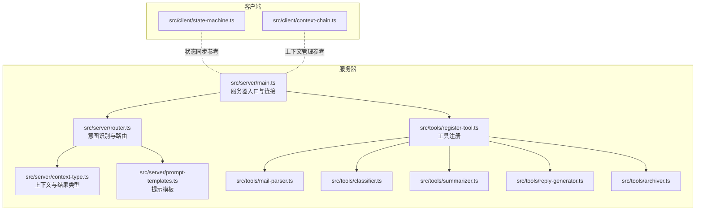
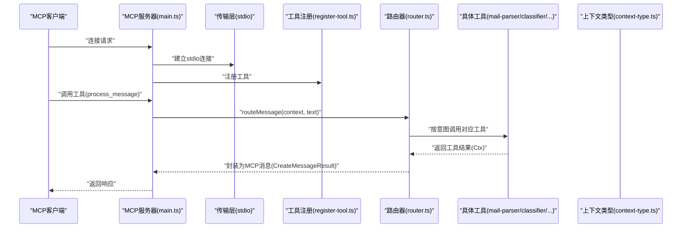
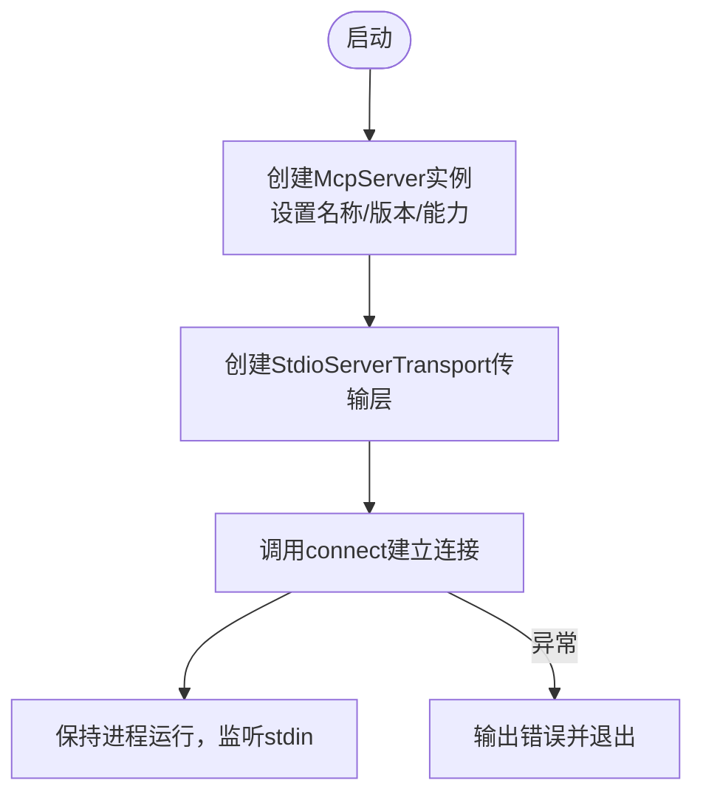
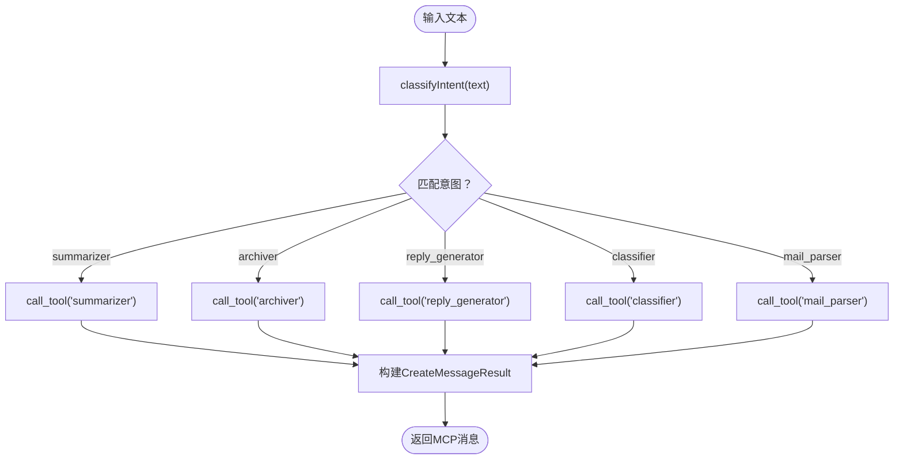
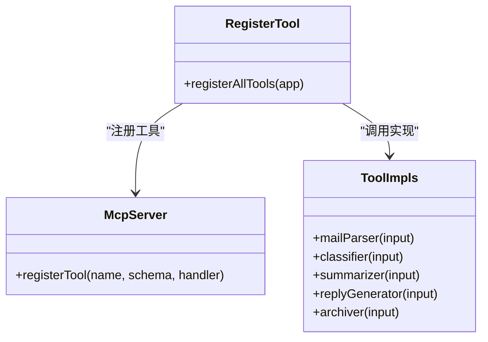
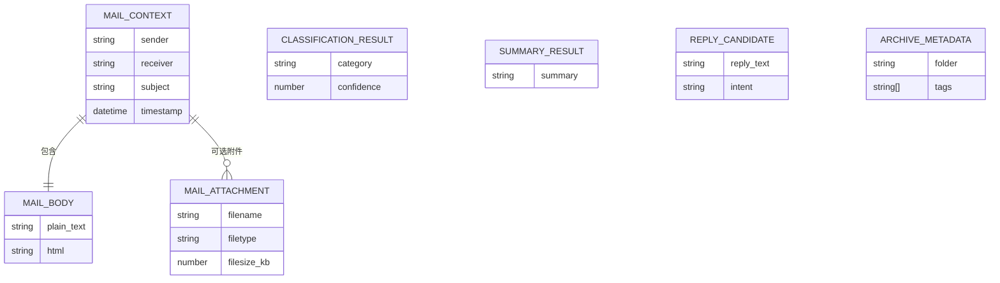
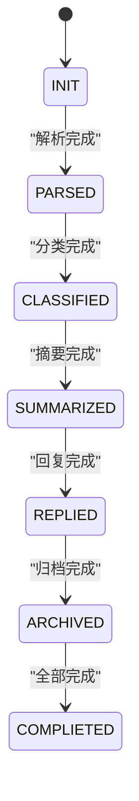
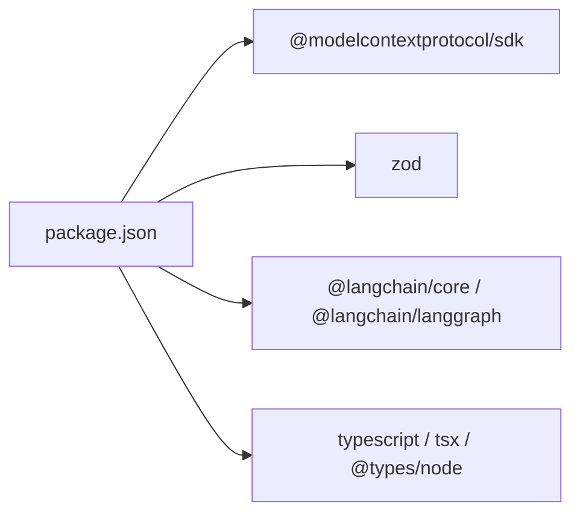

# MCP服务器核心

<cite>
**本文引用的文件**
- [src/server/main.ts](file://src/server/main.ts)
- [src/server/router.ts](file://src/server/router.ts)
- [src/server/context-type.ts](file://src/server/context-type.ts)
- [src/server/prompt-templates.ts](file://src/server/prompt-templates.ts)
- [src/tools/register-tool.ts](file://src/tools/register-tool.ts)
- [src/tools/mail-parser.ts](file://src/tools/mail-parser.ts)
- [src/tools/classifier.ts](file://src/tools/classifier.ts)
- [src/tools/summarizer.ts](file://src/tools/summarizer.ts)
- [src/tools/reply-generator.ts](file://src/tools/reply-generator.ts)
- [src/tools/archiver.ts](file://src/tools/archiver.ts)
- [src/client/state-machine.ts](file://src/client/state-machine.ts)
- [src/client/context-chain.ts](file://src/client/context-chain.ts)
- [package.json](file://package.json)
- [tsconfig.json](file://tsconfig.json)
- [README.md](file://README.md)
</cite>

## 目录
1. [简介](#简介)
2. [项目结构](#项目结构)
3. [核心组件](#核心组件)
4. [架构总览](#架构总览)
5. [详细组件分析](#详细组件分析)
6. [依赖分析](#依赖分析)
7. [性能考虑](#性能考虑)
8. [故障排查指南](#故障排查指南)
9. [结论](#结论)
10. [附录](#附录)

## 简介
本文件面向MCP（Model Context Protocol）服务器的实现与使用，聚焦于服务器初始化流程、JSON-RPC通信协议与stdio传输层、MCP协议集成（能力声明、工具注册与生命周期）、配置与启动参数、运行时行为、与MCP客户端的标准交互模式（消息格式、错误处理、状态同步），以及扩展与定制化实践（新增工具、性能优化）。该服务器以MCP SDK为基础，通过stdio与客户端建立连接，提供邮件处理相关的工具集，并以路由器对用户输入进行意图识别与任务分发。

## 项目结构
项目采用按功能模块划分的组织方式，核心目录与职责如下：
- src/server：服务器核心逻辑，包含入口、路由、上下文类型与提示模板
- src/tools：工具注册与具体工具实现（邮件解析、分类、摘要、回复生成、归档）
- src/client：客户端侧的状态机与上下文链（便于理解MCP交互中的状态流转与上下文管理）
- 其他根级配置：package.json（脚本、依赖）、tsconfig.json（编译配置）、README.md（使用说明）

图表来源
- [src/server/main.ts:1-42](file://src/server/main.ts#L1-L42)
- [src/server/router.ts:1-67](file://src/server/router.ts#L1-L67)
- [src/server/context-type.ts:1-101](file://src/server/context-type.ts#L1-L101)
- [src/server/prompt-templates.ts:1-66](file://src/server/prompt-templates.ts#L1-L66)
- [src/tools/register-tool.ts:1-186](file://src/tools/register-tool.ts#L1-L186)
- [src/tools/mail-parser.ts:1-37](file://src/tools/mail-parser.ts#L1-L37)
- [src/tools/classifier.ts:1-45](file://src/tools/classifier.ts#L1-L45)
- [src/tools/summarizer.ts:1-35](file://src/tools/summarizer.ts#L1-L35)
- [src/tools/reply-generator.ts:1-33](file://src/tools/reply-generator.ts#L1-L33)
- [src/tools/archiver.ts:1-32](file://src/tools/archiver.ts#L1-L32)
- [src/client/state-machine.ts:1-43](file://src/client/state-machine.ts#L1-L43)
- [src/client/context-chain.ts:1-35](file://src/client/context-chain.ts#L1-L35)

章节来源
- [README.md:88-97](file://README.md#L88-L97)
- [package.json:1-37](file://package.json#L1-L37)
- [tsconfig.json:1-30](file://tsconfig.json#L1-L30)

## 核心组件
- 服务器入口与连接
  - 初始化MCP服务器实例，声明名称与版本，声明能力（当前启用工具能力）
  - 创建stdio传输层并连接，保持进程运行
  - 错误捕获与退出码处理
- 路由器与意图识别
  - 将用户输入映射到具体工具（summarizer、archiver、reply_generator、classifier、mail_parser）
  - 统一输出结构，封装为MCP消息响应
- 工具注册与实现
  - 通过registerTool集中注册多个工具，每个工具定义输入schema与执行逻辑
  - 工具实现覆盖邮件解析、分类、摘要、回复生成、归档等场景
- 上下文类型与提示模板
  - 定义邮件、分类、摘要、回复、归档等结果的数据结构
  - 提供提示模板与格式化函数，便于扩展为外部LLM调用

章节来源
- [src/server/main.ts:6-35](file://src/server/main.ts#L6-L35)
- [src/server/router.ts:24-63](file://src/server/router.ts#L24-L63)
- [src/tools/register-tool.ts:55-183](file://src/tools/register-tool.ts#L55-L183)
- [src/server/context-type.ts:47-100](file://src/server/context-type.ts#L47-L100)
- [src/server/prompt-templates.ts:56-65](file://src/server/prompt-templates.ts#L56-L65)

## 架构总览
下图展示了MCP服务器从启动到工具执行的关键交互路径，包括能力声明、工具注册、消息路由与响应封装。

图表来源
- [src/server/main.ts:6-35](file://src/server/main.ts#L6-L35)
- [src/tools/register-tool.ts:55-183](file://src/tools/register-tool.ts#L55-L183)
- [src/server/router.ts:41-63](file://src/server/router.ts#L41-L63)
- [src/server/context-type.ts:47-100](file://src/server/context-type.ts#L47-L100)

## 详细组件分析

### 服务器初始化与连接流程
- 初始化MCP服务器：设置服务器元信息与能力声明（tools）
- 创建stdio传输层：StdioServerTransport负责与客户端的JSON-RPC通信
- 连接与运行：connect完成握手后保持进程，stderr输出系统状态
- 错误处理：异常时输出错误并以非零退出码终止

图表来源
- [src/server/main.ts:6-35](file://src/server/main.ts#L6-L35)

章节来源
- [src/server/main.ts:6-35](file://src/server/main.ts#L6-L35)

### 路由器与意图识别
- 输入：用户文本
- 判定：基于关键词的简易分类，映射到工具名
- 调用：通过session.call_tool调用对应工具
- 输出：统一封装为MCP消息结构（角色、内容、模型、停止原因）

图表来源
- [src/server/router.ts:24-63](file://src/server/router.ts#L24-L63)

章节来源
- [src/server/router.ts:24-63](file://src/server/router.ts#L24-L63)

### 工具注册与生命周期
- 工具注册：通过registerTool集中注册，每个工具包含描述、输入schema与实现
- 生命周期：工具在服务器运行期间常驻，按客户端请求动态调用
- 输入校验：使用Zod schema进行参数校验
- 输出格式：统一返回包含content数组的对象，元素为文本内容

图表来源
- [src/tools/register-tool.ts:55-183](file://src/tools/register-tool.ts#L55-L183)
- [src/tools/mail-parser.ts:23-36](file://src/tools/mail-parser.ts#L23-L36)
- [src/tools/classifier.ts:23-44](file://src/tools/classifier.ts#L23-L44)
- [src/tools/summarizer.ts:23-34](file://src/tools/summarizer.ts#L23-L34)
- [src/tools/reply-generator.ts:23-32](file://src/tools/reply-generator.ts#L23-L32)
- [src/tools/archiver.ts:23-31](file://src/tools/archiver.ts#L23-L31)

章节来源
- [src/tools/register-tool.ts:55-183](file://src/tools/register-tool.ts#L55-L183)

### 数据模型与提示模板
- 上下文类型：定义邮件元数据、正文、附件、分类、摘要、回复候选、归档元数据等结构
- 提示模板：为不同任务提供模板字符串与变量替换函数，便于扩展为外部LLM调用

图表来源
- [src/server/context-type.ts:47-100](file://src/server/context-type.ts#L47-L100)

章节来源
- [src/server/context-type.ts:1-101](file://src/server/context-type.ts#L1-L101)
- [src/server/prompt-templates.ts:5-65](file://src/server/prompt-templates.ts#L5-L65)

### 客户端状态与上下文管理（参考）
- 状态机：定义任务状态流转，便于在多轮交互中跟踪进度
- 上下文链：保存步骤与数据快照，支持恢复与查询

图表来源
- [src/client/state-machine.ts:1-43](file://src/client/state-machine.ts#L1-L43)

章节来源
- [src/client/context-chain.ts:1-35](file://src/client/context-chain.ts#L1-L35)
- [src/client/state-machine.ts:1-43](file://src/client/state-machine.ts#L1-L43)

## 依赖分析
- 运行时依赖
  - @modelcontextprotocol/sdk：MCP协议SDK，提供服务器框架与传输层
  - zod：参数schema校验
  - @langchain/*：可选的LLM/链路能力（当前工具为伪实现，便于扩展）
- 开发依赖
  - typescript、tsx、@types/node：开发与调试支持
- 构建与脚本
  - tsc：TypeScript编译
  - dev：使用inspector与tsx启动开发模式
  - start：直接运行源码入口
  - watch：监听模式

图表来源
- [package.json:25-35](file://package.json#L25-L35)

章节来源
- [package.json:1-37](file://package.json#L1-L37)
- [tsconfig.json:1-30](file://tsconfig.json#L1-L30)

## 性能考虑
- I/O与传输层
  - stdio传输层为阻塞式，建议避免在工具实现中执行长耗时同步操作；必要时拆分为异步任务或外部队列
- 工具执行
  - 当前工具为伪实现，建议在真实场景中引入缓存、并发限制与超时控制
  - 对大文本处理（摘要、分类）应考虑分块与流式处理
- 日志与可观测性
  - 使用stderr输出关键事件，便于客户端侧日志聚合与追踪
- 并发与资源
  - 在高并发场景下，建议引入连接池、限流与背压策略

## 故障排查指南
- 服务器未响应
  - 确认客户端正确配置并启动服务器；MCP服务器不提供交互式命令行输入
- 启动失败
  - 检查依赖安装与编译产物；查看stderr输出的错误信息
- 工具调用异常
  - 核对工具输入schema与客户端传参；检查工具实现与返回格式
- 日志定位
  - 服务器日志输出至stderr；可在客户端日志中查看

章节来源
- [README.md:113-124](file://README.md#L113-L124)
- [src/server/main.ts:31-34](file://src/server/main.ts#L31-L34)

## 结论
本MCP服务器以清晰的模块化设计实现了从初始化、连接、工具注册到消息路由与响应封装的完整链路。通过stdio传输层与MCP SDK，服务器能够稳定地与客户端协作。当前工具为伪实现，便于快速集成与扩展；建议在生产环境中引入外部LLM、缓存与限流机制，并完善错误处理与可观测性。

## 附录

### 配置与启动参数
- 启动方式
  - 开发模式：pnpm dev（使用inspector与tsx）
  - 生产模式：pnpm build → pnpm start
  - 监听模式：pnpm watch
- 客户端配置（Claude Desktop）
  - 在配置文件中添加mcpServers条目，指定命令、参数与工作目录
  - 重启客户端后生效

章节来源
- [README.md:15-34](file://README.md#L15-L34)
- [README.md:36-63](file://README.md#L36-L63)
- [package.json:10-15](file://package.json#L10-L15)

### 与MCP客户端的标准交互模式
- 连接建立：客户端通过stdio连接服务器，握手成功后进入消息循环
- 工具调用：客户端调用已注册工具（如process_message），服务器进行意图识别与路由
- 响应格式：统一封装为MCP消息结构，包含角色、内容、模型与停止原因
- 错误处理：异常时输出错误并以非零退出码终止，客户端可据此重试或提示

章节来源
- [src/server/main.ts:25-34](file://src/server/main.ts#L25-L34)
- [src/server/router.ts:41-63](file://src/server/router.ts#L41-L63)

### 扩展与定制化指导
- 新增工具
  - 在register-tool.ts中通过registerTool注册，定义输入schema与实现
  - 实现工具函数并返回符合上下文类型的结构
- 集成外部能力
  - 可在工具实现中接入LangChain或其他LLM服务，结合提示模板进行结构化输出
- 性能优化
  - 引入缓存、并发限制、超时控制与背压策略
  - 对大文本处理采用分块与流式方案
- 状态同步
  - 可参考客户端状态机与上下文链的设计，在服务器侧维护任务状态与上下文快照，提升复杂流程的可控性

章节来源
- [src/tools/register-tool.ts:55-183](file://src/tools/register-tool.ts#L55-L183)
- [src/server/prompt-templates.ts:5-65](file://src/server/prompt-templates.ts#L5-L65)
- [src/client/state-machine.ts:1-43](file://src/client/state-machine.ts#L1-L43)
- [src/client/context-chain.ts:1-35](file://src/client/context-chain.ts#L1-L35)