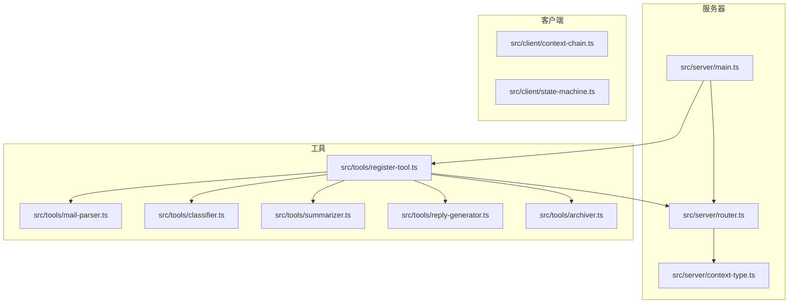
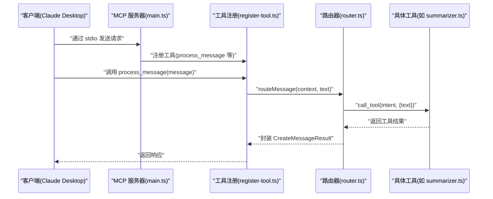
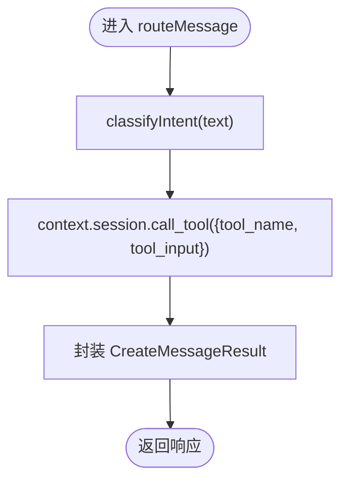
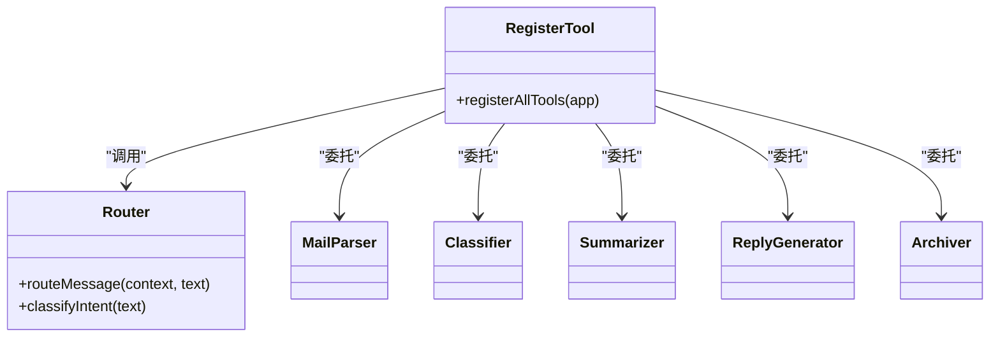
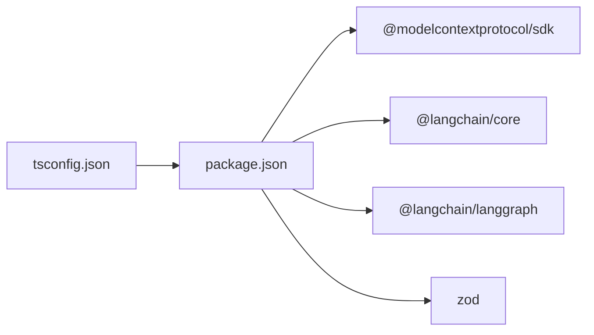

# 开发指南

<cite>
**本文引用的文件**
- [README.md](file://README.md)
- [package.json](file://package.json)
- [tsconfig.json](file://tsconfig.json)
- [src/server/main.ts](file://src/server/main.ts)
- [src/server/router.ts](file://src/server/router.ts)
- [src/server/context-type.ts](file://src/server/context-type.ts)
- [src/tools/register-tool.ts](file://src/tools/register-tool.ts)
- [src/tools/summarizer.ts](file://src/tools/summarizer.ts)
- [src/tools/classifier.ts](file://src/tools/classifier.ts)
- [src/tools/archiver.ts](file://src/tools/archiver.ts)
- [src/tools/reply-generator.ts](file://src/tools/reply-generator.ts)
- [src/tools/mail-parser.ts](file://src/tools/mail-parser.ts)
- [src/client/context-chain.ts](file://src/client/context-chain.ts)
- [src/client/state-machine.ts](file://src/client/state-machine.ts)
</cite>

## 目录
1. [简介](#简介)
2. [项目结构](#项目结构)
3. [核心组件](#核心组件)
4. [架构总览](#架构总览)
5. [详细组件分析](#详细组件分析)
6. [依赖分析](#依赖分析)
7. [性能考虑](#性能考虑)
8. [故障排查指南](#故障排查指南)
9. [结论](#结论)
10. [附录](#附录)

## 简介
本指南面向希望理解并扩展 MCP 路由服务器的开发者，目标是帮助你快速掌握项目结构、模块职责、工具开发流程、调试与测试策略、以及贡献规范。该服务器基于 MCP 协议，通过 stdio 与客户端（如 Claude Desktop）通信，负责消息意图识别与任务分发，并提供一组可扩展的工具集。

## 项目结构
项目采用按“职责”划分的目录组织方式：
- src/server：服务器核心逻辑，包括主入口、路由与上下文类型定义
- src/tools：工具注册与具体工具实现（邮件解析、分类、摘要、回复、归档）
- src/client：客户端侧的上下文链与状态机（便于理解端到端流程）

图表来源
- [src/server/main.ts:1-42](file://src/server/main.ts#L1-L42)
- [src/server/router.ts:1-67](file://src/server/router.ts#L1-L67)
- [src/server/context-type.ts:1-101](file://src/server/context-type.ts#L1-L101)
- [src/tools/register-tool.ts:1-186](file://src/tools/register-tool.ts#L1-L186)
- [src/tools/mail-parser.ts:1-37](file://src/tools/mail-parser.ts#L1-L37)
- [src/tools/classifier.ts:1-45](file://src/tools/classifier.ts#L1-L45)
- [src/tools/summarizer.ts:1-35](file://src/tools/summarizer.ts#L1-L35)
- [src/tools/reply-generator.ts:1-33](file://src/tools/reply-generator.ts#L1-L33)
- [src/tools/archiver.ts:1-32](file://src/tools/archiver.ts#L1-L32)
- [src/client/context-chain.ts:1-35](file://src/client/context-chain.ts#L1-L35)
- [src/client/state-machine.ts:1-43](file://src/client/state-machine.ts#L1-L43)

章节来源
- [README.md:88-97](file://README.md#L88-L97)
- [package.json:1-37](file://package.json#L1-L37)
- [tsconfig.json:1-30](file://tsconfig.json#L1-L30)

## 核心组件
- 服务器主入口：初始化 MCP 服务器、配置能力、建立 stdio 传输并保持进程存活
- 路由器：根据输入文本进行简易意图识别，调用对应工具并封装统一响应
- 工具注册中心：集中注册所有工具，提供输入校验与输出封装
- 工具实现：邮件解析、分类、摘要、回复、归档等
- 上下文类型：定义邮件元数据、正文、附件、分类、摘要、回复、归档等结构
- 客户端上下文链与状态机：辅助理解端到端流程与中间态管理

章节来源
- [src/server/main.ts:1-42](file://src/server/main.ts#L1-L42)
- [src/server/router.ts:1-67](file://src/server/router.ts#L1-L67)
- [src/server/context-type.ts:1-101](file://src/server/context-type.ts#L1-L101)
- [src/tools/register-tool.ts:1-186](file://src/tools/register-tool.ts#L1-L186)

## 架构总览
下图展示了 MCP 服务器从启动到工具执行的关键交互路径。

图表来源
- [src/server/main.ts:1-42](file://src/server/main.ts#L1-L42)
- [src/tools/register-tool.ts:55-71](file://src/tools/register-tool.ts#L55-L71)
- [src/server/router.ts:40-63](file://src/server/router.ts#L40-L63)
- [src/tools/summarizer.ts:23-34](file://src/tools/summarizer.ts#L23-L34)

## 详细组件分析

### 服务器主入口（main.ts）
- 职责：创建 MCP 服务器实例、声明能力、注册工具、建立 stdio 传输、保持进程运行
- 关键点：错误处理与致命异常捕获；stderr 输出用于日志与调试

章节来源
- [src/server/main.ts:1-42](file://src/server/main.ts#L1-L42)

### 路由器（router.ts）
- 职责：意图识别与任务分发
- 意图识别规则：基于关键词匹配，将输入映射到工具名
- 路由流程：调用工具 -> 汇聚结果 -> 统一封装为标准响应结构

图表来源
- [src/server/router.ts:24-63](file://src/server/router.ts#L24-L63)

章节来源
- [src/server/router.ts:1-67](file://src/server/router.ts#L1-L67)

### 工具注册中心（register-tool.ts）
- 职责：集中注册工具、定义输入 Schema、封装输出、桥接路由器与工具实现
- 工具清单：process_message、mail_parser、classifier、summarizer、reply_generator、archiver
- 输入校验：使用 Zod Schema 对输入进行约束
- 输出封装：统一为 MCP Content 结构

图表来源
- [src/tools/register-tool.ts:55-183](file://src/tools/register-tool.ts#L55-L183)
- [src/server/router.ts:40-63](file://src/server/router.ts#L40-L63)
- [src/tools/mail-parser.ts:23-36](file://src/tools/mail-parser.ts#L23-L36)
- [src/tools/classifier.ts:23-44](file://src/tools/classifier.ts#L23-L44)
- [src/tools/summarizer.ts:23-34](file://src/tools/summarizer.ts#L23-L34)
- [src/tools/reply-generator.ts:23-32](file://src/tools/reply-generator.ts#L23-L32)
- [src/tools/archiver.ts:23-31](file://src/tools/archiver.ts#L23-L31)

章节来源
- [src/tools/register-tool.ts:1-186](file://src/tools/register-tool.ts#L1-L186)

### 工具实现（mail-parser、classifier、summarizer、reply-generator、archiver）
- 邮件解析：提取元数据与正文，支持扩展附件字段
- 分类器：基于关键词匹配进行粗粒度分类
- 摘要器：截取固定长度文本作为摘要
- 回复生成器：生成标准化确认回复
- 归档器：给出归档文件夹与标签建议

章节来源
- [src/tools/mail-parser.ts:1-37](file://src/tools/mail-parser.ts#L1-L37)
- [src/tools/classifier.ts:1-45](file://src/tools/classifier.ts#L1-L45)
- [src/tools/summarizer.ts:1-35](file://src/tools/summarizer.ts#L1-L35)
- [src/tools/reply-generator.ts:1-33](file://src/tools/reply-generator.ts#L1-L33)
- [src/tools/archiver.ts:1-32](file://src/tools/archiver.ts#L1-L32)

### 上下文类型定义（context-type.ts）
- 邮件元数据、正文、附件
- 分类结果、摘要结果、回复候选、归档元数据
- 为工具与路由器提供统一的数据契约

章节来源
- [src/server/context-type.ts:1-101](file://src/server/context-type.ts#L1-L101)

### 客户端上下文链与状态机（context-chain.ts、state-machine.ts）
- 上下文链：保存步骤与数据快照，支持恢复
- 状态机：定义任务生命周期状态流转

章节来源
- [src/client/context-chain.ts:1-35](file://src/client/context-chain.ts#L1-L35)
- [src/client/state-machine.ts:1-43](file://src/client/state-machine.ts#L1-L43)

## 依赖分析
- 运行时依赖：MCP SDK、LangChain 核心与 LangGraph、Zod
- 开发依赖：TypeScript、tsx、Node 类型
- 构建与脚本：tsc、tsx、inspector

图表来源
- [package.json:25-35](file://package.json#L25-L35)
- [tsconfig.json:1-30](file://tsconfig.json#L1-L30)

章节来源
- [package.json:1-37](file://package.json#L1-L37)
- [tsconfig.json:1-30](file://tsconfig.json#L1-L30)

## 性能考虑
- 日志输出：使用 stderr 输出关键事件，便于在客户端日志中定位问题
- 输入校验：利用 Zod Schema 在入口处拦截非法输入，减少无效调用
- 工具实现：保持纯函数式与无副作用，避免不必要的 I/O
- 路由策略：当前为关键词匹配，复杂场景可引入模型推理或规则引擎以提升准确率与性能

## 故障排查指南
- 服务器未响应
  - 确认通过 MCP 客户端触发，而非直接在终端交互
  - 检查 stderr 日志输出
- 工具未生效
  - 核对工具名与输入 Schema 是否一致
  - 检查路由器意图识别是否命中目标工具
- 构建与运行
  - 使用提供的脚本进行开发、构建与启动
  - 开发模式下可借助 inspector 实时调试

章节来源
- [README.md:111-124](file://README.md#L111-L124)
- [src/server/main.ts:25-34](file://src/server/main.ts#L25-L34)
- [src/tools/register-tool.ts:55-71](file://src/tools/register-tool.ts#L55-L71)

## 结论
本指南提供了从项目结构到工具扩展、从调试到测试的完整开发路径。建议在新增工具时遵循统一的输入输出契约与错误处理规范，确保系统稳定性与可维护性。

## 附录

### 新工具开发全流程（从需求到测试）
- 需求分析
  - 明确输入、输出与业务边界
  - 定义数据结构（参考 context-type.ts）
- 设计与实现
  - 在 tools 目录新增实现文件
  - 编写输入校验 Schema
  - 实现工具函数并返回统一结构
- 注册与集成
  - 在 register-tool.ts 中注册工具，绑定名称、描述与 Schema
  - 在路由器中完善意图识别或新增分支
- 测试
  - 单元测试：针对工具函数进行断言
  - 集成测试：通过 MCP 服务器调用工具，验证端到端流程
  - 端到端测试：在客户端中发起真实请求，观察响应
- 文档与发布
  - 更新 README 与工具文档
  - 提交变更并走审查流程

章节来源
- [src/server/context-type.ts:1-101](file://src/server/context-type.ts#L1-L101)
- [src/tools/register-tool.ts:55-183](file://src/tools/register-tool.ts#L55-L183)
- [src/server/router.ts:24-38](file://src/server/router.ts#L24-L38)

### 调试技巧与开发工具
- 日志记录：使用 stderr 输出关键事件，便于在客户端日志中查看
- 错误追踪：在入口与工具中捕获异常并输出堆栈
- 性能分析：结合 inspector 与日志时间戳定位瓶颈
- 单元测试：对工具函数进行独立验证
- 集成测试：构造最小上下文调用工具，验证输入输出一致性

章节来源
- [src/server/main.ts:25-41](file://src/server/main.ts#L25-L41)
- [src/tools/register-tool.ts:18-35](file://src/tools/register-tool.ts#L18-L35)

### 测试策略与质量保证
- 单元测试：覆盖工具函数的核心分支与边界条件
- 集成测试：通过 MCP 服务器注册工具并调用，验证路由与工具协作
- 端到端测试：在客户端发起真实请求，验证从意图识别到工具执行的完整链路
- 质量门禁：在提交前确保通过构建与测试

章节来源
- [src/server/router.ts:40-63](file://src/server/router.ts#L40-L63)
- [src/tools/register-tool.ts:55-183](file://src/tools/register-tool.ts#L55-L183)

### 代码贡献指南
- 编码规范
  - 使用 TypeScript，严格类型约束
  - 工具函数保持纯函数风格，避免全局状态
  - 输入使用 Zod Schema 校验，输出统一封装
- 提交规范
  - 提交信息清晰描述变更目的与影响范围
  - 变更需附带测试用例或测试结论
- 审查流程
  - 提交 PR，至少一名维护者审查
  - 通过 CI 与本地测试后合并

章节来源
- [src/tools/register-tool.ts:55-183](file://src/tools/register-tool.ts#L55-L183)
- [tsconfig.json:1-30](file://tsconfig.json#L1-L30)