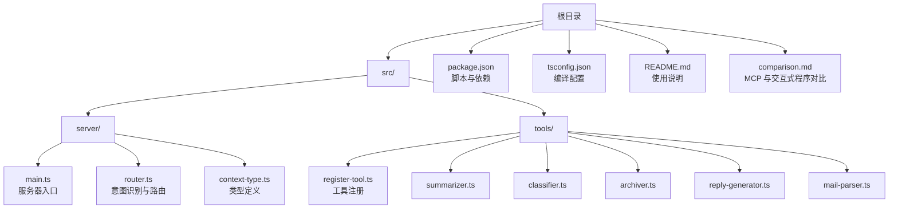
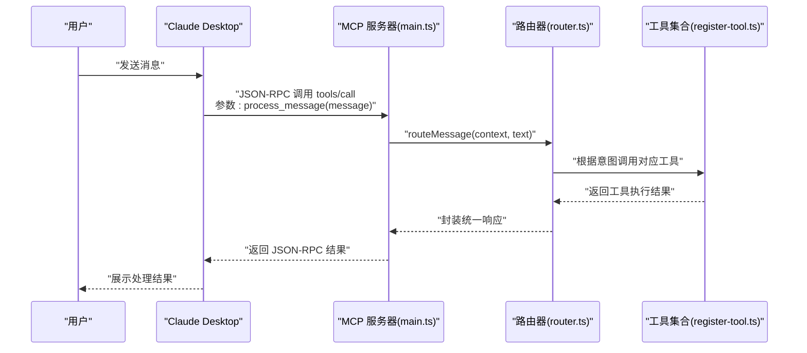
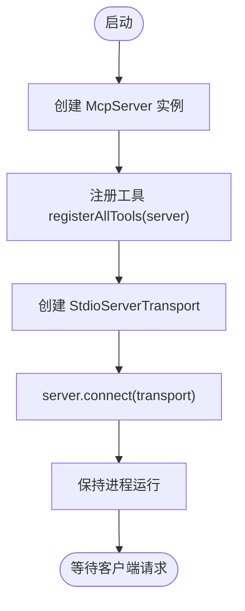
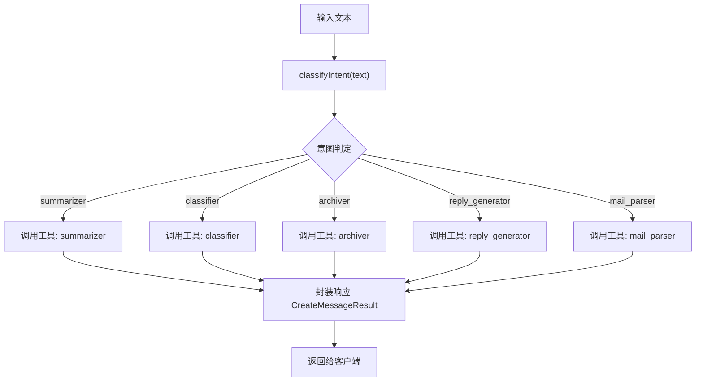
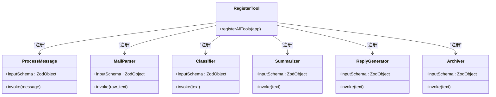
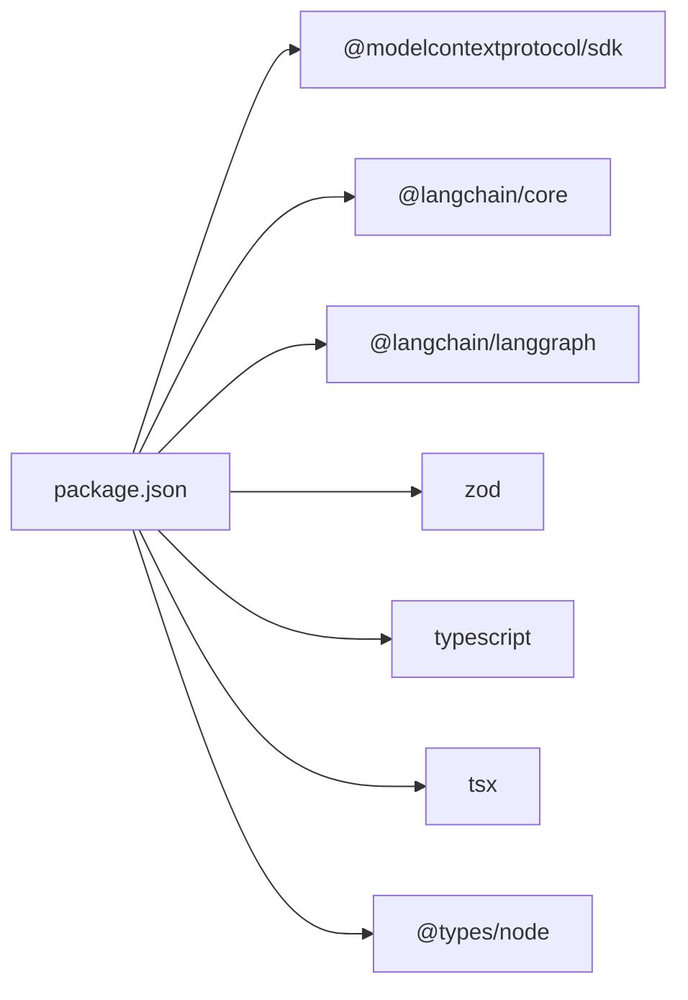

# 快速开始

<cite>
**本文引用的文件**
- [README.md](file://README.md)
- [package.json](file://package.json)
- [tsconfig.json](file://tsconfig.json)
- [src/server/main.ts](file://src/server/main.ts)
- [src/server/router.ts](file://src/server/router.ts)
- [src/server/context-type.ts](file://src/server/context-type.ts)
- [src/tools/register-tool.ts](file://src/tools/register-tool.ts)
- [src/tools/summarizer.ts](file://src/tools/summarizer.ts)
- [src/tools/classifier.ts](file://src/tools/classifier.ts)
- [src/tools/archiver.ts](file://src/tools/archiver.ts)
- [src/tools/reply-generator.ts](file://src/tools/reply-generator.ts)
- [src/tools/mail-parser.ts](file://src/tools/mail-parser.ts)
- [comparison.md](file://comparison.md)
</cite>

## 目录
1. [简介](#简介)
2. [项目结构](#项目结构)
3. [核心组件](#核心组件)
4. [架构总览](#架构总览)
5. [详细组件分析](#详细组件分析)
6. [依赖关系分析](#依赖关系分析)
7. [性能考虑](#性能考虑)
8. [故障排查指南](#故障排查指南)
9. [结论](#结论)
10. [附录](#附录)

## 简介
本指南面向首次接触 MCP 路由服务器的开发者，帮助你从零完成环境准备、安装依赖、开发模式运行，以及将服务器接入 Claude Desktop 的完整流程。文档还解释了“输入没用”的常见误解，并提供常见使用场景与示例对话，帮助你快速理解服务器的工作机制。

## 项目结构
该项目采用按功能模块划分的目录组织方式，核心入口位于服务器模块，工具模块集中于 tools 目录，类型定义集中在 server 目录。

图表来源
- [src/server/main.ts:1-42](file://src/server/main.ts#L1-L42)
- [src/server/router.ts:1-67](file://src/server/router.ts#L1-L67)
- [src/server/context-type.ts:1-101](file://src/server/context-type.ts#L1-L101)
- [src/tools/register-tool.ts:1-186](file://src/tools/register-tool.ts#L1-L186)
- [src/tools/summarizer.ts:1-35](file://src/tools/summarizer.ts#L1-L35)
- [src/tools/classifier.ts:1-45](file://src/tools/classifier.ts#L1-L45)
- [src/tools/archiver.ts:1-32](file://src/tools/archiver.ts#L1-L32)
- [src/tools/reply-generator.ts:1-33](file://src/tools/reply-generator.ts#L1-L33)
- [src/tools/mail-parser.ts:1-37](file://src/tools/mail-parser.ts#L1-L37)
- [package.json:1-37](file://package.json#L1-L37)
- [tsconfig.json:1-30](file://tsconfig.json#L1-L30)
- [README.md:88-97](file://README.md#L88-L97)
- [comparison.md:1-135](file://comparison.md#L1-L135)

章节来源
- [README.md:88-97](file://README.md#L88-L97)
- [package.json:1-37](file://package.json#L1-L37)
- [tsconfig.json:1-30](file://tsconfig.json#L1-L30)

## 核心组件
- 服务器入口：负责初始化 MCP 服务器、注册工具、建立 stdio 传输通道并保持进程存活。
- 路由器：根据用户输入识别意图，选择对应工具执行，并封装统一的响应结构。
- 工具注册器：集中注册所有可用工具（如邮件解析、分类、摘要、回复、归档），并暴露统一入口工具 process_message。
- 工具实现：各工具模块提供具体业务能力，返回标准化结构。
- 类型定义：统一的输入输出类型，确保工具间契约一致。

章节来源
- [src/server/main.ts:1-42](file://src/server/main.ts#L1-L42)
- [src/server/router.ts:1-67](file://src/server/router.ts#L1-L67)
- [src/tools/register-tool.ts:1-186](file://src/tools/register-tool.ts#L1-L186)
- [src/server/context-type.ts:1-101](file://src/server/context-type.ts#L1-L101)

## 架构总览
下图展示了从 Claude Desktop 到 MCP 服务器再到工具执行的整体流程。

图表来源
- [src/server/main.ts:1-42](file://src/server/main.ts#L1-L42)
- [src/server/router.ts:40-63](file://src/server/router.ts#L40-L63)
- [src/tools/register-tool.ts:55-183](file://src/tools/register-tool.ts#L55-L183)

## 详细组件分析

### 服务器入口（main.ts）
- 初始化 MCP 服务器并声明能力。
- 注册全部工具。
- 通过 stdio 传输层连接客户端。
- 保持进程运行，等待客户端请求。

图表来源
- [src/server/main.ts:6-35](file://src/server/main.ts#L6-L35)

章节来源
- [src/server/main.ts:1-42](file://src/server/main.ts#L1-L42)

### 路由器（router.ts）
- 将用户输入文本映射为意图类型（如 summarizer、classifier、archiver、reply_generator、mail_parser）。
- 调用工具执行具体任务。
- 统一封装响应结构，供客户端展示。

图表来源
- [src/server/router.ts:24-63](file://src/server/router.ts#L24-L63)

章节来源
- [src/server/router.ts:1-67](file://src/server/router.ts#L1-L67)

### 工具注册器（register-tool.ts）
- 注册统一入口工具 process_message，接收用户消息并交由路由器处理。
- 注册各具体工具（mail_parser、classifier、summarizer、reply_generator、archiver）。
- 使用 Zod 校验输入参数，保证调用契约。

图表来源
- [src/tools/register-tool.ts:55-183](file://src/tools/register-tool.ts#L55-L183)

章节来源
- [src/tools/register-tool.ts:1-186](file://src/tools/register-tool.ts#L1-L186)

### 典型工具实现
- 邮件解析器：提取元数据与正文，便于后续处理。
- 分类器：基于关键词匹配进行简单分类。
- 摘要器：截取固定长度文本作为摘要。
- 回复生成器：生成标准确认回复。
- 归档器：给出归档文件夹与标签建议。

章节来源
- [src/tools/mail-parser.ts:1-37](file://src/tools/mail-parser.ts#L1-L37)
- [src/tools/classifier.ts:1-45](file://src/tools/classifier.ts#L1-L45)
- [src/tools/summarizer.ts:1-35](file://src/tools/summarizer.ts#L1-L35)
- [src/tools/reply-generator.ts:1-33](file://src/tools/reply-generator.ts#L1-L33)
- [src/tools/archiver.ts:1-32](file://src/tools/archiver.ts#L1-L32)

## 依赖关系分析
- 运行时依赖：MCP SDK、LangChain（核心与 LangGraph）、Zod（参数校验）。
- 开发依赖：TypeScript、tsx（开发运行）、Node 类型声明。
- 编译配置：ESNext 模块、Bundler 解析、严格类型检查等。

图表来源
- [package.json:25-35](file://package.json#L25-L35)

章节来源
- [package.json:1-37](file://package.json#L1-L37)
- [tsconfig.json:1-30](file://tsconfig.json#L1-L30)

## 性能考虑
- 工具执行为同步阻塞，建议在工具内部避免长时间 IO；必要时引入异步与超时控制。
- 日志输出到 stderr，便于在客户端侧查看诊断信息。
- 生产构建使用 tsc 编译，开发使用 tsx 或 inspector 提升迭代效率。

## 故障排查指南
- “输入没用”问题
  - 原因：MCP 服务器通过 stdio 接收 JSON-RPC 请求，而非终端输入。直接在终端输入不会被识别。
  - 解决：通过 Claude Desktop 或 MCP Inspector 等客户端发起调用。
- 如何验证服务器
  - 使用 Claude Desktop：配置后在对话中发送消息，观察响应。
  - 使用 MCP Inspector：启动调试界面，可视化测试工具。
  - 手动发送 JSON-RPC：在另一个终端向服务器进程 stdin 写入 JSON-RPC 消息。
- 日志查看
  - 服务器日志输出到 stderr，可在 Claude Desktop 日志中查看。

章节来源
- [README.md:5-13](file://README.md#L5-L13)
- [README.md:111-124](file://README.md#L111-L124)
- [comparison.md:73-135](file://comparison.md#L73-L135)

## 结论
本指南覆盖了从环境准备、安装依赖、开发运行到与 Claude Desktop 集成的全流程。理解 MCP 服务器与交互式程序的本质差异，是正确使用与调试的关键。按照本文步骤，你将能够快速搭建并验证 MCP 路由服务器，顺利开展后续扩展与集成工作。

## 附录

### 环境准备与安装
- 安装依赖
  - 使用包管理器安装项目依赖。
- 开发模式运行
  - 启动开发服务器，支持热更新与调试。
- 构建与生产运行
  - 编译产物至 dist 目录，使用 start 脚本运行。

章节来源
- [README.md:17-34](file://README.md#L17-L34)
- [package.json:10-15](file://package.json#L10-L15)

### Claude Desktop 配置
- 手动配置
  - 打开配置文件（不同平台路径不同）。
  - 添加 mcpServers 条目，指定命令、参数与工作目录。
  - 重启 Claude Desktop。
- 使用配置文件
  - 将配置内容复制到目标配置文件中。

章节来源
- [README.md:36-63](file://README.md#L36-L63)

### 常见使用场景与示例对话
- 场景：总结邮件
  - 用户：帮我总结一下这封邮件
  - Claude：调用 process_message → 识别为 summarizer → 返回摘要结果
- 场景：邮件分类
  - 用户：请分类这封邮件
  - Claude：调用 process_message → 识别为 classifier → 返回分类结果
- 场景：生成回复
  - 用户：请生成一封确认回复
  - Claude：调用 process_message → 识别为 reply_generator → 返回回复建议
- 场景：归档建议
  - 用户：请为这封邮件生成归档建议
  - Claude：调用 process_message → 识别为 archiver → 返回文件夹与标签
- 场景：默认解析
  - 用户：解析这封邮件
  - Claude：调用 process_message → 识别为 mail_parser → 返回解析上下文

章节来源
- [README.md:73-87](file://README.md#L73-L87)

### 技术栈与类型说明
- 技术栈
  - MCP SDK、LangChain、Zod、TypeScript、Node.js
- 类型定义
  - 邮件元数据、正文、附件、分类结果、摘要结果、回复建议、归档元数据等

章节来源
- [README.md:125-131](file://README.md#L125-L131)
- [src/server/context-type.ts:1-101](file://src/server/context-type.ts#L1-L101)