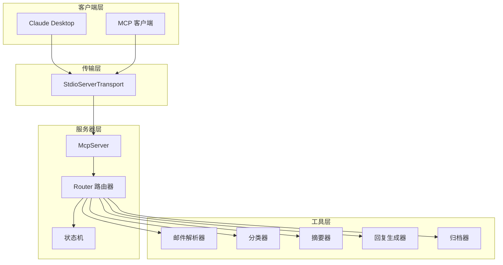
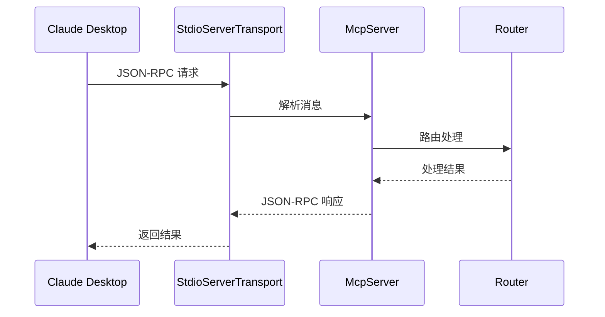
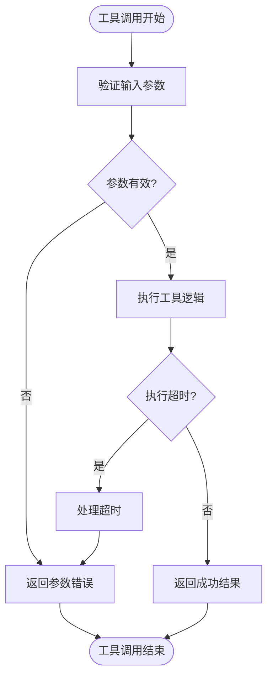
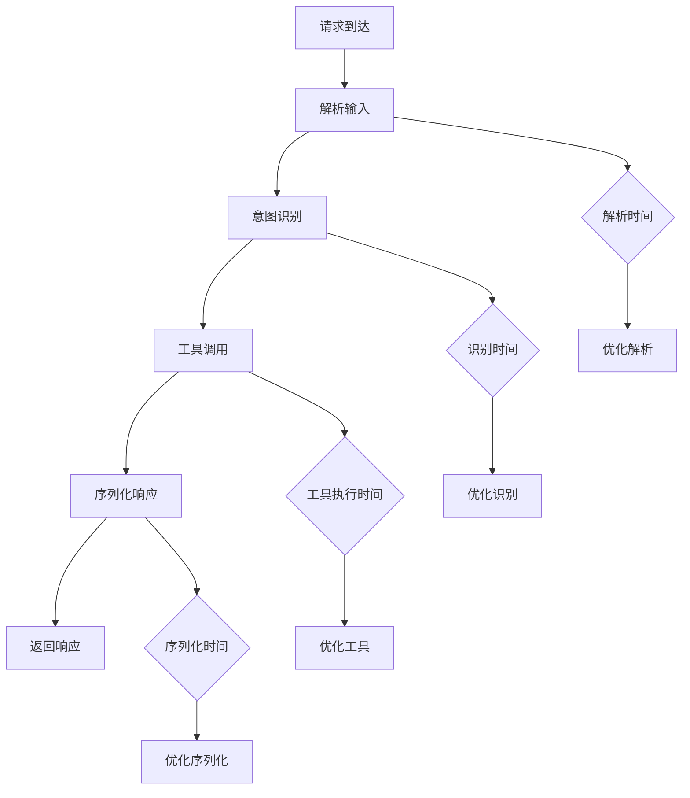
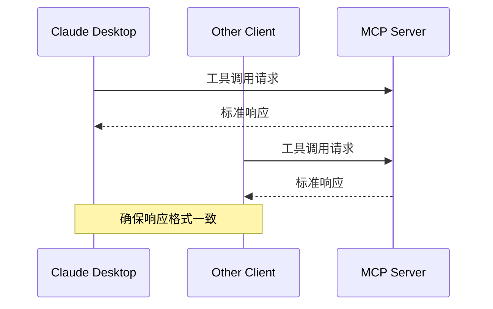
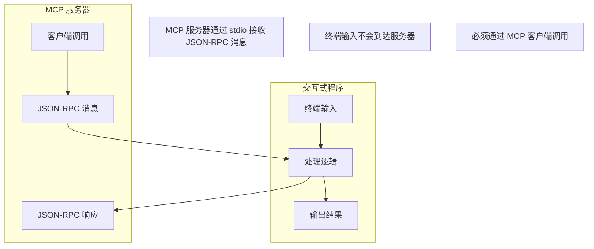

# 故障排除

<cite>
**本文引用的文件**
- [README.md](file://README.md)
- [comparison.md](file://comparison.md)
- [package.json](file://package.json)
- [src/server/main.ts](file://src/server/main.ts)
- [src/server/router.ts](file://src/server/router.ts)
- [src/server/context-type.ts](file://src/server/context-type.ts)
- [src/client/state-machine.ts](file://src/client/state-machine.ts)
- [src/tools/register-tool.ts](file://src/tools/register-tool.ts)
- [src/tools/mail-parser.ts](file://src/tools/mail-parser.ts)
- [src/tools/classifier.ts](file://src/tools/classifier.ts)
- [src/tools/summarizer.ts](file://src/tools/summarizer.ts)
- [src/tools/reply-generator.ts](file://src/tools/reply-generator.ts)
- [src/tools/archiver.ts](file://src/tools/archiver.ts)
</cite>

## 目录
1. [简介](#简介)
2. [服务器启动故障](#服务器启动故障)
3. [客户端连接问题](#客户端连接问题)
4. [工具调用异常](#工具调用异常)
5. [日志分析与诊断](#日志分析与诊断)
6. [性能问题排查](#性能问题排查)
7. [网络与传输问题](#网络与传输问题)
8. [兼容性问题](#兼容性问题)
9. [预防性维护](#预防性维护)
10. [社区支持与反馈](#社区支持与反馈)
11. [最佳实践](#最佳实践)

## 简介

MCP 路由服务器是一个基于 Model Context Protocol (MCP) 协议的消息路由服务器，专门用于邮件处理场景中的意图识别和任务分发。该服务器采用独特的架构设计，通过 stdio 协议与 MCP 客户端（如 Claude Desktop）通信，而非传统的交互式命令行界面。

### 核心架构特点



**图表来源**
- [src/server/main.ts:1-42](file://src/server/main.ts#L1-L42)
- [src/server/router.ts:40-63](file://src/server/router.ts#L40-L63)
- [src/tools/register-tool.ts:55-183](file://src/tools/register-tool.ts#L55-L183)

## 服务器启动故障

### 常见启动问题及解决方案

#### 1. 依赖安装失败

**问题表现**：
- `pnpm install` 执行时报错
- 无法找到模块依赖

**诊断步骤**：
1. 检查网络连接状态
2. 验证 pnpm 版本兼容性
3. 清理缓存并重新安装

**解决方案**：
```bash
# 清理缓存
pnpm store prune

# 重新安装依赖
pnpm install

# 或者使用 npm 验证
npm install
```

**章节来源**
- [package.json:25-30](file://package.json#L25-L30)

#### 2. 启动脚本执行错误

**问题表现**：
- `pnpm dev` 启动失败
- `pnpm start` 无法运行

**诊断步骤**：
1. 检查 TypeScript 编译状态
2. 验证 MCP Inspector 可用性
3. 确认 Node.js 版本兼容性

**解决方案**：
```bash
# 检查编译状态
pnpm build

# 使用 Inspector 启动
pnpm dev

# 或直接启动
pnpm start
```

**章节来源**
- [package.json:10-15](file://package.json#L10-L15)

#### 3. MCP 服务器初始化失败

**问题表现**：
- 服务器启动但立即退出
- 控制台显示连接错误

**诊断步骤**：
1. 检查 stdio 传输层初始化
2. 验证服务器能力配置
3. 确认工具注册状态

**解决方案**：
```typescript
// 检查服务器初始化
const server = new McpServer(
  {
    name: 'mail-agent',
    version: '1.0.0',
  },
  {
    capabilities: {
      tools: {},
    },
  }
);

// 验证传输层
const transport = new StdioServerTransport();

// 检查连接状态
try {
  await server.connect(transport);
  console.error('[系统已启动]');
} catch (error) {
  console.error('Server error:', error);
  process.exit(1);
}
```

**章节来源**
- [src/server/main.ts:6-35](file://src/server/main.ts#L6-L35)

## 客户端连接问题

### Claude Desktop 集成故障

#### 1. 配置文件路径错误

**问题表现**：
- Claude Desktop 无法找到 MCP 服务器
- 配置文件加载失败

**诊断步骤**：
1. 验证配置文件路径
2. 检查文件权限
3. 确认 JSON 格式正确性

**解决方案**：
```json
{
  "mcpServers": {
    "mcp-router-server": {
      "command": "pnpm",
      "args": ["dev"],
      "cwd": "/绝对路径/到/项目目录"
    }
  }
}
```

**章节来源**
- [README.md:40-56](file://README.md#L40-L56)

#### 2. 服务器未响应客户端请求

**问题表现**：
- Claude Desktop 显示连接超时
- 工具调用无响应

**诊断步骤**：
1. 检查服务器是否正在监听
2. 验证 stdio 传输层状态
3. 确认 MCP 协议版本兼容性

**解决方案**：


**图表来源**
- [src/server/main.ts:22-28](file://src/server/main.ts#L22-L28)
- [src/server/router.ts:40-63](file://src/server/router.ts#L40-L63)

**章节来源**
- [src/server/main.ts:22-35](file://src/server/main.ts#L22-L35)

#### 3. 输入格式不正确

**问题表现**：
- 服务器显示 JSON 解析错误
- 工具调用参数验证失败

**诊断步骤**：
1. 检查 JSON-RPC 消息格式
2. 验证参数类型和结构
3. 确认 Zod 验证规则

**解决方案**：
```typescript
// 正确的 JSON-RPC 格式
{
  "jsonrpc": "2.0",
  "id": 1,
  "method": "tools/call",
  "params": {
    "name": "process_message",
    "arguments": {
      "message": "测试消息"
    }
  }
}
```

**章节来源**
- [src/tools/register-tool.ts:57-71](file://src/tools/register-tool.ts#L57-L71)

## 工具调用异常

### 工具注册与调用故障

#### 1. 工具注册失败

**问题表现**：
- 工具无法在客户端中看到
- 调用时显示工具不存在

**诊断步骤**：
1. 检查工具注册函数调用
2. 验证工具描述和模式
3. 确认输入参数验证

**解决方案**：
```typescript
// 检查工具注册
const registerAllTools = (app: McpServer) => {
  // 确保所有工具都正确注册
  app.registerTool('process_message', {
    description: '处理用户输入的消息',
    inputSchema: z.object({
      message: z.string().describe('用户输入的消息文本'),
    }),
  }, async ({ message }) => {
    // 工具实现
  });
};
```

**章节来源**
- [src/tools/register-tool.ts:55-183](file://src/tools/register-tool.ts#L55-L183)

#### 2. 工具执行超时

**问题表现**：
- 工具调用响应缓慢
- 客户端显示超时错误

**诊断步骤**：
1. 检查异步操作执行时间
2. 验证工具内部逻辑复杂度
3. 确认外部依赖响应时间

**解决方案**：


**图表来源**
- [src/tools/summarizer.ts:23-34](file://src/tools/summarizer.ts#L23-L34)
- [src/tools/classifier.ts:23-44](file://src/tools/classifier.ts#L23-L44)

**章节来源**
- [src/tools/summarizer.ts:23-34](file://src/tools/summarizer.ts#L23-L34)

#### 3. 工具返回格式错误

**问题表现**：
- 客户端解析响应失败
- 内容类型不匹配

**诊断步骤**：
1. 检查返回内容结构
2. 验证 TextContent 类型
3. 确认 JSON 序列化

**解决方案**：
```typescript
// 确保正确的返回格式
return {
  content: [
    {
      type: 'text' as const,
      text: JSON.stringify(result, null, 2),
    },
  ],
};
```

**章节来源**
- [src/tools/register-tool.ts:82-92](file://src/tools/register-tool.ts#L82-L92)

## 日志分析与诊断

### 日志记录与问题定位

#### 1. 服务器日志配置

**问题表现**：
- 无法获取详细的错误信息
- 调试困难

**诊断步骤**：
1. 检查控制台输出重定向
2. 验证错误级别设置
3. 确认日志格式一致性

**解决方案**：
```typescript
// 使用标准错误输出进行日志记录
console.error('[系统已启动] 输入任意邮件内容开始处理');

// 意图识别日志
console.error('[意图识别]', text);

// 路由处理日志
console.error(`[路由判断] 当前意图: ${intent}`);

// 工具调用日志
console.error(`[路由结构] ${intent}`, response);
```

**章节来源**
- [src/server/main.ts:28-32](file://src/server/main.ts#L28-L32)
- [src/server/router.ts:25-53](file://src/server/router.ts#L25-L53)

#### 2. Claude Desktop 日志查看

**问题表现**：
- 无法查看服务器端日志
- 调试信息不可见

**诊断步骤**：
1. 查找 Claude Desktop 日志文件位置
2. 检查日志轮转配置
3. 验证日志级别设置

**解决方案**：
```bash
# macOS 日志路径
~/Library/Application Support/Claude/logs/

# Windows 日志路径
%APPDATA%\Claude\logs\

# 查看实时日志
tail -f ~/Library/Application\ Support/Claude/logs/
```

**章节来源**
- [README.md:107-123](file://README.md#L107-L123)

#### 3. MCP Inspector 调试

**问题表现**：
- 无法使用可视化调试工具
- Inspector 启动失败

**诊断步骤**：
1. 检查 Inspector 版本兼容性
2. 验证 MCP 协议支持
3. 确认浏览器兼容性

**解决方案**：
```bash
# 使用 MCP Inspector 启动
npx @modelcontextprotocol/inspector pnpm dev

# 或者直接启动
pnpm dev
```

**章节来源**
- [package.json:12](file://package.json#L12)

## 性能问题排查

### 性能监控与优化

#### 1. 内存使用监控

**问题表现**：
- 服务器内存持续增长
- 系统响应变慢

**诊断步骤**：
1. 监控进程内存使用情况
2. 检查内存泄漏点
3. 分析对象生命周期

**解决方案**：
```typescript
// 实现内存监控
function monitorMemory() {
  const usage = process.memoryUsage();
  console.error('内存使用:', {
    rss: `${Math.round(usage.rss / 1024 / 1024)}MB`,
    heapTotal: `${Math.round(usage.heapTotal / 1024 / 1024)}MB`,
    heapUsed: `${Math.round(usage.heapUsed / 1024 / 1024)}MB`,
  });
}

// 定期检查内存使用
setInterval(monitorMemory, 60000);
```

**章节来源**
- [src/server/main.ts:28](file://src/server/main.ts#L28)

#### 2. 响应时间优化

**问题表现**：
- 工具调用响应缓慢
- 用户体验不佳

**诊断步骤**：
1. 测量各阶段执行时间
2. 识别性能瓶颈
3. 优化算法复杂度

**解决方案**：


**图表来源**
- [src/server/router.ts:24-63](file://src/server/router.ts#L24-L63)

**章节来源**
- [src/server/router.ts:24-63](file://src/server/router.ts#L24-L63)

#### 3. 并发处理优化

**问题表现**：
- 高并发下性能下降
- 请求排队等待

**诊断步骤**：
1. 分析并发请求处理
2. 检查锁竞争情况
3. 评估异步操作效率

**解决方案**：
```typescript
// 实现并发控制
class ConcurrencyController {
  private maxConcurrent: number;
  private currentCount: number;
  
  constructor(maxConcurrent: number = 10) {
    this.maxConcurrent = maxConcurrent;
    this.currentCount = 0;
  }
  
  async acquire(): Promise<void> {
    while (this.currentCount >= this.maxConcurrent) {
      await this.sleep(10);
    }
    this.currentCount++;
  }
  
  release(): void {
    this.currentCount--;
  }
  
  private sleep(ms: number): Promise<void> {
    return new Promise(resolve => setTimeout(resolve, ms));
  }
}
```

**章节来源**
- [src/server/router.ts:40-63](file://src/server/router.ts#L40-L63)

## 网络与传输问题

### 传输层故障排查

#### 1. stdio 传输层问题

**问题表现**：
- JSON-RPC 消息解析失败
- 传输层连接中断

**诊断步骤**：
1. 检查 stdin/stdout 状态
2. 验证传输层缓冲区
3. 确认消息边界处理

**解决方案**：
```typescript
// 检查传输层状态
const transport = new StdioServerTransport();

// 监控传输层事件
transport.on('error', (error) => {
  console.error('传输层错误:', error);
});

transport.on('close', () => {
  console.error('传输层关闭');
});

// 确保进程保持活跃
process.stdin.resume();
```

**章节来源**
- [src/server/main.ts:22-31](file://src/server/main.ts#L22-L31)

#### 2. JSON-RPC 协议问题

**问题表现**：
- 消息格式不正确
- 参数验证失败

**诊断步骤**：
1. 验证 JSON-RPC 2.0 规范
2. 检查消息 ID 和方法名
3. 确认参数结构完整性

**解决方案**：
```typescript
// 实现 JSON-RPC 消息验证
function validateJsonRpcMessage(message: any): boolean {
  return (
    message && 
    message.jsonrpc === '2.0' &&
    typeof message.id === 'number' &&
    typeof message.method === 'string'
  );
}

// 检查工具调用参数
function validateToolArguments(params: any): boolean {
  return params && 
         typeof params.name === 'string' && 
         typeof params.arguments === 'object';
}
```

**章节来源**
- [src/tools/register-tool.ts:57-71](file://src/tools/register-tool.ts#L57-L71)

## 兼容性问题

### MCP 协议兼容性

#### 1. MCP 版本兼容性

**问题表现**：
- 与新版本 MCP 客户端不兼容
- 功能缺失或异常

**诊断步骤**：
1. 检查 MCP SDK 版本
2. 验证协议规范支持
3. 确认向后兼容性

**解决方案**：
```json
{
  "dependencies": {
    "@modelcontextprotocol/sdk": "^1.29.0"
  }
}
```

**章节来源**
- [package.json:28](file://package.json#L28)

#### 2. 客户端兼容性差异

**问题表现**：
- 不同 MCP 客户端行为差异
- 工具调用结果不一致

**诊断步骤**：
1. 测试多个 MCP 客户端
2. 检查客户端特定功能
3. 验证标准协议实现

**解决方案**：


**图表来源**
- [src/tools/register-tool.ts:55-183](file://src/tools/register-tool.ts#L55-L183)

**章节来源**
- [comparison.md:1-135](file://comparison.md#L1-L135)

#### 3. 交互模式差异

**问题表现**：
- 期望交互式输入但无响应
- 直接运行服务器无输入

**诊断步骤**：
1. 理解 MCP 服务器工作原理
2. 区分交互式程序与服务器程序
3. 验证输入方式正确性

**解决方案**：


**图表来源**
- [comparison.md:30-57](file://comparison.md#L30-L57)

**章节来源**
- [comparison.md:73-135](file://comparison.md#L73-L135)

## 预防性维护

### 系统维护与监控

#### 1. 定期健康检查

**维护计划**：
1. 每日检查服务器状态
2. 周期性性能基准测试
3. 月度依赖更新审查

**检查清单**：
- 服务器进程状态
- 内存使用率
- 磁盘空间
- 网络连接状态

#### 2. 配置管理

**配置备份策略**：
```bash
# 备份配置文件
cp claude_desktop_config.json claude_desktop_config.json.backup.$(date +%Y%m%d)

# 验证配置有效性
cat claude_desktop_config.json | jq .

# 检查依赖版本
npm outdated
```

#### 3. 版本升级流程

**升级步骤**：
1. 备份当前配置和数据
2. 更新依赖包版本
3. 运行集成测试
4. 部署到测试环境
5. 验证功能正常
6. 部署到生产环境

## 社区支持与反馈

### 支持资源与渠道

#### 1. 官方资源

**技术文档**：
- MCP 协议官方规范
- Model Context Protocol SDK 文档
- TypeScript 官方文档

**社区资源**：
- GitHub Issues 页面
- Stack Overflow MCP 标签
- Discord 社区讨论

#### 2. 问题反馈流程

**反馈模板**：
```
服务器版本: 
MCP 客户端: 
操作系统: 
重现步骤: 
预期结果: 
实际结果: 
日志片段: 
```

**章节来源**
- [README.md:125-131](file://README.md#L125-L131)

## 最佳实践

### 开发与部署最佳实践

#### 1. 代码质量保证

**开发规范**：
1. 使用 TypeScript 进行类型安全编程
2. 实现完整的单元测试
3. 遵循代码风格指南
4. 定期进行代码审查

**测试策略**：
```typescript
// 单元测试示例
describe('工具调用测试', () => {
  test('process_message 工具应正确处理输入', async () => {
    const result = await processInput("测试消息");
    expect(result).toHaveProperty('content');
  });
});
```

#### 2. 部署最佳实践

**生产环境配置**：
1. 使用环境变量管理配置
2. 实现日志轮转
3. 设置健康检查端点
4. 配置监控告警

**部署清单**：
```bash
# 构建生产版本
pnpm build

# 启动服务器
pnpm start

# 监控服务器状态
pm2 status
```

#### 3. 性能优化建议

**优化策略**：
1. 实现缓存机制
2. 优化数据库查询
3. 使用连接池
4. 实施异步处理
5. 监控关键指标

**监控指标**：
- 响应时间分布
- 错误率统计
- 资源使用率
- 用户活跃度

---

**故障排除指南完成**

本指南涵盖了 MCP 路由服务器从启动到运行的全生命周期问题排查方法。通过系统化的诊断流程和针对性的解决方案，用户可以快速定位和解决大部分常见问题。建议在日常使用中建立定期检查和维护机制，确保系统的稳定性和可靠性。