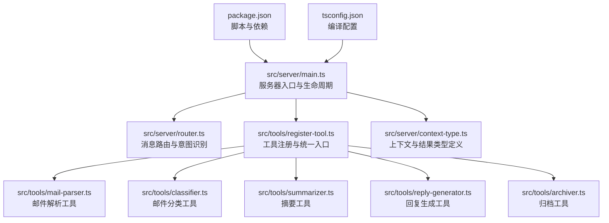
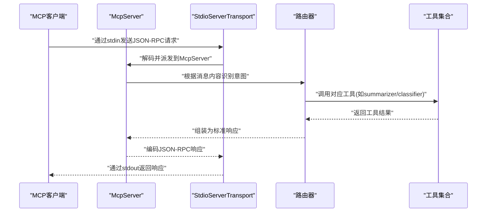
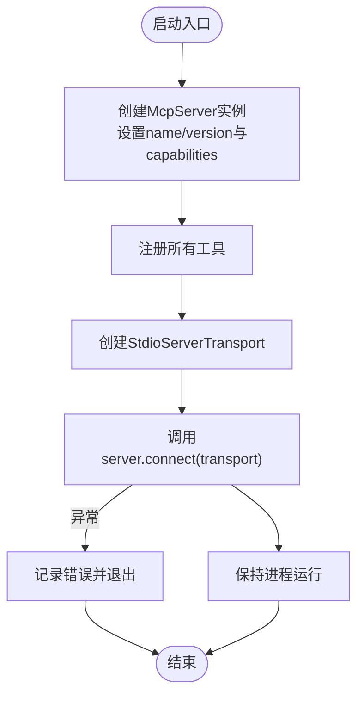
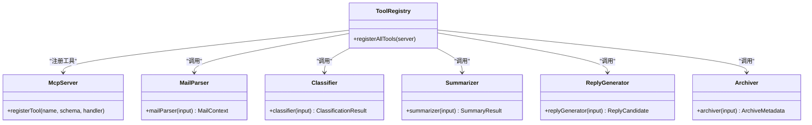
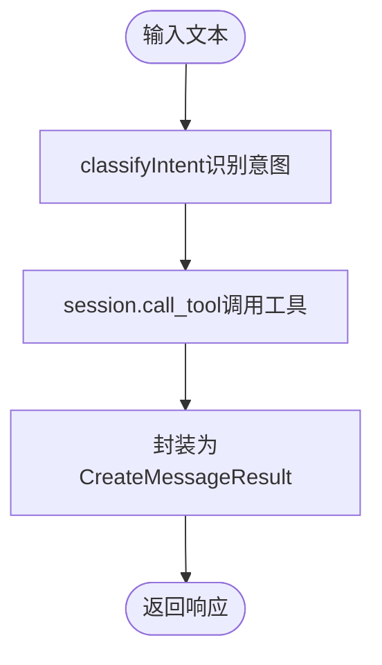
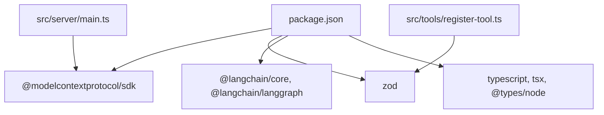

# MCP服务器核心

<cite>
**本文引用的文件**
- [src/server/main.ts](file://src/server/main.ts)
- [src/server/router.ts](file://src/server/router.ts)
- [src/server/context-type.ts](file://src/server/context-type.ts)
- [src/tools/register-tool.ts](file://src/tools/register-tool.ts)
- [src/tools/mail-parser.ts](file://src/tools/mail-parser.ts)
- [src/tools/classifier.ts](file://src/tools/classifier.ts)
- [src/tools/summarizer.ts](file://src/tools/summarizer.ts)
- [src/tools/reply-generator.ts](file://src/tools/reply-generator.ts)
- [src/tools/archiver.ts](file://src/tools/archiver.ts)
- [package.json](file://package.json)
- [tsconfig.json](file://tsconfig.json)
- [README.md](file://README.md)
- [comparison.md](file://comparison.md)
</cite>

## 目录
1. [简介](#简介)
2. [项目结构](#项目结构)
3. [核心组件](#核心组件)
4. [架构总览](#架构总览)
5. [详细组件分析](#详细组件分析)
6. [依赖关系分析](#依赖关系分析)
7. [性能考量](#性能考量)
8. [故障排查指南](#故障排查指南)
9. [结论](#结论)
10. [附录](#附录)

## 简介
本文件面向MCP服务器核心组件，围绕McpServer初始化、能力声明与配置、服务器生命周期（启动、连接、传输层）、StdioServerTransport作用与实现原理、工具注册机制与能力发现过程进行系统化说明，并提供配置参数说明、错误处理策略与性能优化建议。文档同时给出最佳实践的代码片段路径，帮助读者快速落地。

## 项目结构
该项目采用按功能域划分的组织方式，核心入口位于服务器模块，工具注册与具体工具实现分别位于独立模块，便于扩展与维护。

图表来源
- [src/server/main.ts:1-42](file://src/server/main.ts#L1-L42)
- [src/server/router.ts:1-67](file://src/server/router.ts#L1-L67)
- [src/tools/register-tool.ts:1-186](file://src/tools/register-tool.ts#L1-L186)
- [src/server/context-type.ts:1-101](file://src/server/context-type.ts#L1-L101)
- [package.json:1-37](file://package.json#L1-L37)
- [tsconfig.json:1-30](file://tsconfig.json#L1-L30)

章节来源
- [src/server/main.ts:1-42](file://src/server/main.ts#L1-L42)
- [src/server/router.ts:1-67](file://src/server/router.ts#L1-L67)
- [src/tools/register-tool.ts:1-186](file://src/tools/register-tool.ts#L1-L186)
- [src/server/context-type.ts:1-101](file://src/server/context-type.ts#L1-L101)
- [package.json:1-37](file://package.json#L1-L37)
- [tsconfig.json:1-30](file://tsconfig.json#L1-L30)

## 核心组件
- McpServer实例：负责承载能力声明、工具注册与消息循环。
- StdioServerTransport：基于标准IO的传输层，负责与MCP客户端通过JSON-RPC协议通信。
- 工具注册器：集中注册各业务工具，提供输入校验与输出封装。
- 路由器：根据用户输入识别意图，动态调用对应工具。
- 上下文类型：统一定义邮件解析、分类、摘要、回复、归档等结果的数据结构。

章节来源
- [src/server/main.ts:6-35](file://src/server/main.ts#L6-L35)
- [src/tools/register-tool.ts:55-183](file://src/tools/register-tool.ts#L55-L183)
- [src/server/router.ts:24-63](file://src/server/router.ts#L24-L63)
- [src/server/context-type.ts:11-100](file://src/server/context-type.ts#L11-L100)

## 架构总览
下图展示了MCP服务器从启动到工具执行的端到端流程，涵盖初始化、连接、消息分发与响应返回。

图表来源
- [src/server/main.ts:22-28](file://src/server/main.ts#L22-L28)
- [src/server/router.ts:41-63](file://src/server/router.ts#L41-L63)
- [src/tools/register-tool.ts:55-183](file://src/tools/register-tool.ts#L55-L183)

## 详细组件分析

### McpServer初始化与生命周期
- 初始化阶段
  - 创建McpServer实例，传入标识信息（name/version）与能力声明（capabilities.tools为空对象表示启用工具能力）。
  - 注册全部工具，完成能力发现与暴露。
  - 创建StdioServerTransport并调用connect完成与客户端的连接绑定。
  - 保持进程运行，等待客户端请求。
- 错误处理
  - 启动与连接阶段捕获异常并输出错误日志，随后退出进程，避免静默失败。
- 最佳实践
  - 将能力声明与工具注册分离，便于扩展与测试。
  - 使用try/catch包裹connect，确保异常可诊断。
  - 保持进程常驻，避免因stdin占用导致的提前退出。

图表来源
- [src/server/main.ts:6-35](file://src/server/main.ts#L6-L35)

章节来源
- [src/server/main.ts:6-35](file://src/server/main.ts#L6-L35)

### 能力声明与配置选项
- 标识信息
  - name：服务器名称，用于客户端识别与展示。
  - version：服务器版本，便于兼容性管理。
- 能力声明
  - capabilities.tools：声明支持工具能力；当前示例为空对象，表示启用工具能力。
- 配置建议
  - 若未来扩展其他能力（如提示词、资源访问），可在capabilities下新增对应字段。
  - 通过包名与版本管理SDK依赖，确保与客户端版本兼容。

章节来源
- [src/server/main.ts:7-17](file://src/server/main.ts#L7-L17)
- [package.json:25-30](file://package.json#L25-L30)

### StdioServerTransport的作用与实现原理
- 作用
  - 作为MCP协议的传输层，监听标准输入以接收客户端发送的JSON-RPC消息，同时通过标准输出返回响应。
  - 与McpServer解耦，便于替换为其他传输方式（如WebSocket/TCP）。
- 实现要点
  - 传输层接管stdin，因此直接在终端输入文本不会被服务器接收，必须通过MCP客户端发送JSON-RPC消息。
  - 传输层负责消息的读取、解析与编码，McpServer专注于业务逻辑与工具调度。
- 使用建议
  - 开发调试时可通过MCP Inspector或客户端直接触发工具调用，避免直接在终端输入。
  - 生产部署时确保客户端正确配置命令与工作目录，保证服务器可被稳定唤起。

章节来源
- [src/server/main.ts:22-28](file://src/server/main.ts#L22-L28)
- [README.md:5-13](file://README.md#L5-L13)
- [comparison.md:30-57](file://comparison.md#L30-L57)

### 工具注册机制与能力发现
- 注册流程
  - 在register-tool中集中注册各工具，每个工具提供描述、输入Schema与实现函数。
  - 使用Zod对输入进行严格校验，保障工具调用的健壮性。
  - 工具实现返回标准化内容结构，便于上层路由器与客户端消费。
- 能力发现
  - 通过McpServer的工具注册接口完成能力声明，客户端可查询可用工具列表。
  - 工具名称与描述构成客户端侧的“工具清单”，用于引导用户选择。
- 典型工具
  - process_message：统一入口，委派给路由器进行意图识别与任务分发。
  - mail_parser：解析邮件元数据与正文。
  - classifier：基于关键词的邮件分类。
  - summarizer：生成摘要。
  - reply_generator：生成标准回复建议。
  - archiver：生成归档建议（文件夹与标签）。

图表来源
- [src/tools/register-tool.ts:55-183](file://src/tools/register-tool.ts#L55-L183)
- [src/tools/mail-parser.ts:23-36](file://src/tools/mail-parser.ts#L23-L36)
- [src/tools/classifier.ts:23-44](file://src/tools/classifier.ts#L23-L44)
- [src/tools/summarizer.ts:23-34](file://src/tools/summarizer.ts#L23-L34)
- [src/tools/reply-generator.ts:23-32](file://src/tools/reply-generator.ts#L23-L32)
- [src/tools/archiver.ts:23-31](file://src/tools/archiver.ts#L23-L31)

章节来源
- [src/tools/register-tool.ts:55-183](file://src/tools/register-tool.ts#L55-L183)

### 路由器与意图识别
- 功能概述
  - classifyIntent：根据输入文本的关键字映射到具体工具名称。
  - routeMessage：调用session.call_tool执行工具，并将结果包装为标准响应结构。
- 数据模型
  - Context：提供call_tool方法，用于在路由层内调用工具。
  - CreateMessageResult：统一的响应结构，包含角色、内容、模型与停止原因。
- 最佳实践
  - 将意图识别规则集中管理，便于扩展与迭代。
  - 在路由层仅做“分发”，不包含业务逻辑，保持职责单一。

图表来源
- [src/server/router.ts:24-63](file://src/server/router.ts#L24-L63)
- [src/server/context-type.ts:7-13](file://src/server/context-type.ts#L7-L13)

章节来源
- [src/server/router.ts:24-63](file://src/server/router.ts#L24-L63)
- [src/server/context-type.ts:7-13](file://src/server/context-type.ts#L7-L13)

### 工具实现要点
- 输入校验
  - 使用Zod定义输入Schema，确保客户端传递的参数符合预期。
- 输出封装
  - 工具统一返回包含type与text的content数组，便于客户端渲染。
- 可扩展性
  - 新增工具时，只需在register-tool中追加注册项，并在router中补充意图映射。

章节来源
- [src/tools/register-tool.ts:74-93](file://src/tools/register-tool.ts#L74-L93)
- [src/tools/register-tool.ts:95-115](file://src/tools/register-tool.ts#L95-L115)
- [src/tools/register-tool.ts:117-138](file://src/tools/register-tool.ts#L117-L138)
- [src/tools/register-tool.ts:140-160](file://src/tools/register-tool.ts#L140-L160)
- [src/tools/register-tool.ts:162-182](file://src/tools/register-tool.ts#L162-L182)

## 依赖关系分析
- 运行时依赖
  - @modelcontextprotocol/sdk：提供McpServer与StdioServerTransport等核心能力。
  - zod：参数Schema校验。
  - @langchain/*：可选的链路能力（当前示例未直接使用）。
- 开发依赖
  - typescript、tsx、@types/node：开发与调试支持。
- 构建与脚本
  - build/start/watch/dev：构建、启动与监听脚本，配合Inspector进行调试。

图表来源
- [package.json:25-35](file://package.json#L25-L35)
- [src/server/main.ts:1-3](file://src/server/main.ts#L1-L3)
- [src/tools/register-tool.ts:6-7](file://src/tools/register-tool.ts#L6-L7)

章节来源
- [package.json:1-37](file://package.json#L1-L37)
- [tsconfig.json:1-30](file://tsconfig.json#L1-L30)

## 性能考量
- I/O与并发
  - 传输层基于标准IO，适合单进程同步处理；若需要高并发，可考虑引入事件循环或异步队列。
- 序列化与网络
  - JSON-RPC消息体积与序列化开销可控；避免在content中传递超大文本，必要时采用外部存储+引用。
- 工具执行
  - 将CPU密集型任务（如复杂NLP）拆分为独立子进程或异步任务，避免阻塞主线程。
- 内存与GC
  - 合理释放中间对象，避免长生命周期持有大对象；定期监控内存占用。
- 编译与打包
  - 使用tsconfig合理配置输出目录与模块解析，减少冷启动时间。

## 故障排查指南
- 为什么直接在终端输入没反应？
  - 因为StdioServerTransport接管了stdin，用于接收JSON-RPC消息；请通过MCP客户端（如Claude Desktop）发送消息。
- 如何验证服务器是否正常？
  - 使用MCP Inspector或在客户端中发起工具调用，观察响应。
- 如何查看日志？
  - 服务器日志输出到stderr，可在客户端日志中查看。
- 启动时报错如何处理？
  - 捕获异常并记录错误信息，检查依赖安装与配置文件路径是否正确。

章节来源
- [README.md:5-13](file://README.md#L5-L13)
- [README.md:111-123](file://README.md#L111-L123)
- [src/server/main.ts:31-34](file://src/server/main.ts#L31-L34)

## 结论
本项目以清晰的模块划分实现了MCP服务器的核心能力：通过McpServer承载能力与工具，StdioServerTransport完成与客户端的JSON-RPC通信，路由器负责意图识别与任务分发，工具注册器集中管理工具的输入校验与输出封装。遵循本文提供的最佳实践，可快速扩展新工具、提升稳定性与可观测性，并在生产环境中获得良好的性能表现。

## 附录

### 服务器配置参数说明
- 标识信息
  - name：服务器名称（字符串）
  - version：服务器版本（字符串）
- 能力声明
  - capabilities.tools：工具能力开关（对象）
- 传输层
  - StdioServerTransport：基于标准IO的传输层（无需额外配置）

章节来源
- [src/server/main.ts:7-17](file://src/server/main.ts#L7-L17)

### 代码示例路径（最佳实践）
- 服务器初始化与连接
  - [src/server/main.ts:6-35](file://src/server/main.ts#L6-L35)
- 工具注册与输入校验
  - [src/tools/register-tool.ts:55-183](file://src/tools/register-tool.ts#L55-L183)
- 路由器意图识别与分发
  - [src/server/router.ts:24-63](file://src/server/router.ts#L24-L63)
- 工具实现模板（邮件解析/分类/摘要/回复/归档）
  - [src/tools/mail-parser.ts:23-36](file://src/tools/mail-parser.ts#L23-L36)
  - [src/tools/classifier.ts:23-44](file://src/tools/classifier.ts#L23-L44)
  - [src/tools/summarizer.ts:23-34](file://src/tools/summarizer.ts#L23-L34)
  - [src/tools/reply-generator.ts:23-32](file://src/tools/reply-generator.ts#L23-L32)
  - [src/tools/archiver.ts:23-31](file://src/tools/archiver.ts#L23-L31)
- 上下文类型定义
  - [src/server/context-type.ts:11-100](file://src/server/context-type.ts#L11-L100)