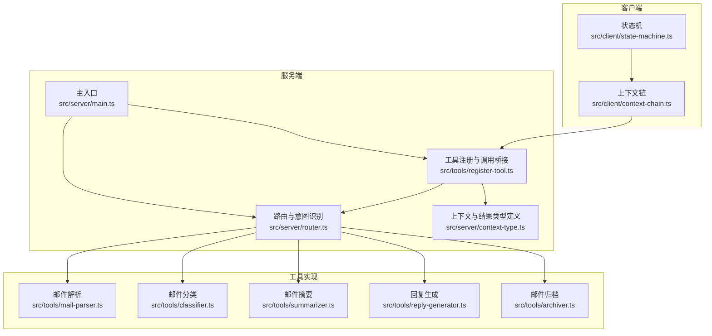
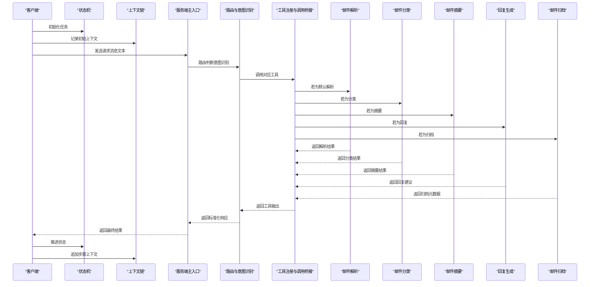
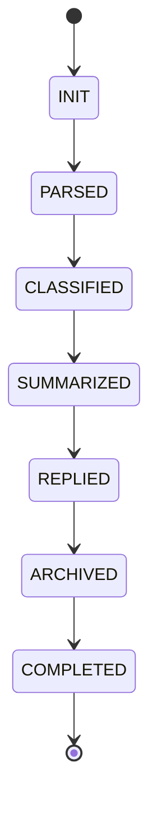
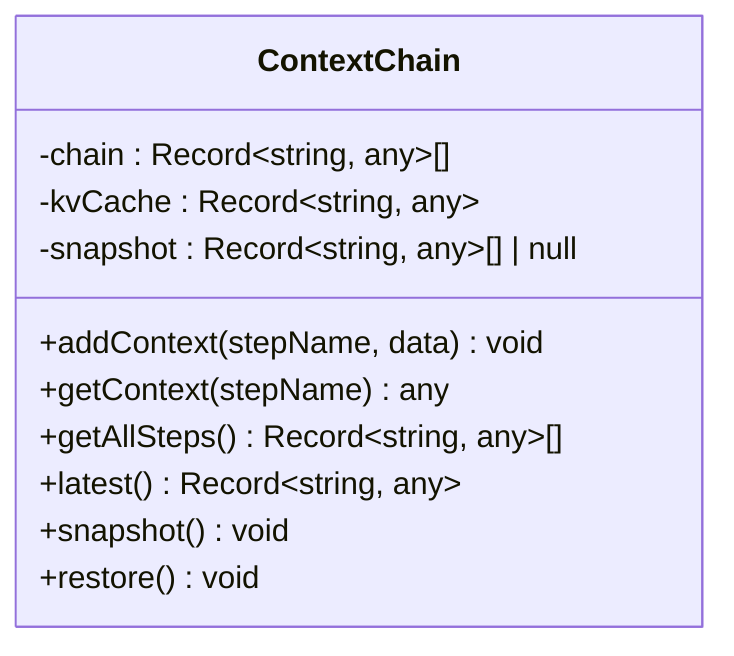
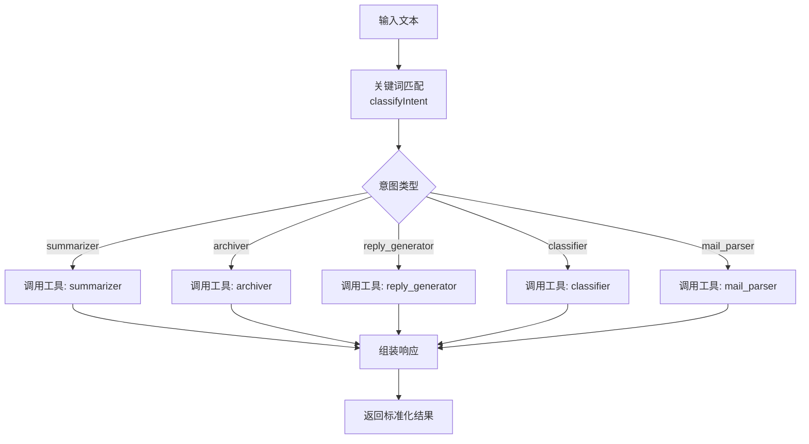
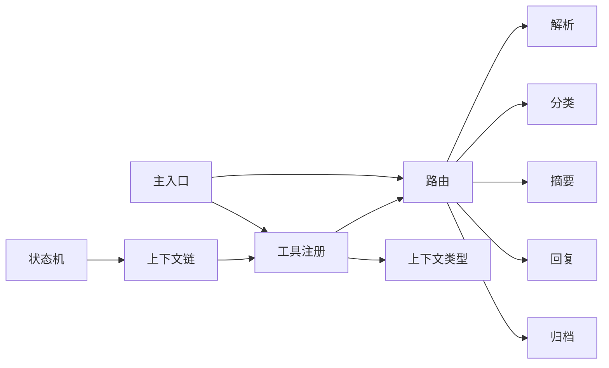

# 客户端组件

<cite>
**本文引用的文件**
- [src/client/state-machine.ts](file://src/client/state-machine.ts)
- [src/client/context-chain.ts](file://src/client/context-chain.ts)
- [src/server/main.ts](file://src/server/main.ts)
- [src/server/router.ts](file://src/server/router.ts)
- [src/server/context-type.ts](file://src/server/context-type.ts)
- [src/tools/register-tool.ts](file://src/tools/register-tool.ts)
- [src/tools/classifier.ts](file://src/tools/classifier.ts)
- [src/tools/summarizer.ts](file://src/tools/summarizer.ts)
- [src/tools/archiver.ts](file://src/tools/archiver.ts)
- [src/tools/mail-parser.ts](file://src/tools/mail-parser.ts)
- [src/tools/reply-generator.ts](file://src/tools/reply-generator.ts)
- [package.json](file://package.json)
- [README.md](file://README.md)
</cite>

## 目录
1. [简介](#简介)
2. [项目结构](#项目结构)
3. [核心组件](#核心组件)
4. [架构总览](#架构总览)
5. [详细组件分析](#详细组件分析)
6. [依赖关系分析](#依赖关系分析)
7. [性能考虑](#性能考虑)
8. [故障排查指南](#故障排查指南)
9. [结论](#结论)
10. [附录](#附录)

## 简介
本文件面向MCP客户端组件的架构文档，聚焦以下目标：
- 深入解释状态机模式的实现与状态转换逻辑
- 详细说明ContextChain的设计原理与上下文管理机制
- 阐述客户端与服务器的交互模式（请求发送、响应接收、状态同步）
- 解释执行历史记录与缓存机制的实现
- 提供客户端配置选项、内存管理与性能优化策略
- 给出状态机图表与上下文链数据流示例

本项目采用MCP协议，通过stdio传输与客户端（如Claude Desktop）交互；服务端以工具注册的方式提供“意图识别+任务分发”能力，并调用具体工具完成邮件处理任务。

## 项目结构
该项目采用按功能模块划分的目录结构，客户端侧包含状态机与上下文链两个核心组件；服务端包含主入口、路由与工具注册等模块；工具模块提供邮件解析、分类、摘要、回复生成、归档等能力。

图表来源
- [src/client/state-machine.ts:1-43](file://src/client/state-machine.ts#L1-L43)
- [src/client/context-chain.ts:1-35](file://src/client/context-chain.ts#L1-L35)
- [src/server/main.ts:1-42](file://src/server/main.ts#L1-L42)
- [src/server/router.ts:1-67](file://src/server/router.ts#L1-L67)
- [src/server/context-type.ts:1-101](file://src/server/context-type.ts#L1-L101)
- [src/tools/register-tool.ts:1-186](file://src/tools/register-tool.ts#L1-L186)

章节来源
- [README.md:88-97](file://README.md#L88-L97)
- [package.json:1-37](file://package.json#L1-L37)

## 核心组件
- 状态机StateMachine：定义任务生命周期的状态集合与顺序转换规则，提供重置与终止判定能力。
- 上下文链ContextChain：维护步骤级上下文的历史链表、键值缓存、快照与恢复能力，支持按步骤检索最新上下文。

章节来源
- [src/client/state-machine.ts:1-43](file://src/client/state-machine.ts#L1-L43)
- [src/client/context-chain.ts:1-35](file://src/client/context-chain.ts#L1-L35)

## 架构总览
客户端与服务端通过MCP协议经由stdio传输进行交互。客户端侧负责状态推进与上下文管理；服务端侧负责意图识别与工具分发，工具实现具体业务逻辑。

图表来源
- [src/server/main.ts:6-35](file://src/server/main.ts#L6-L35)
- [src/server/router.ts:41-63](file://src/server/router.ts#L41-L63)
- [src/tools/register-tool.ts:38-53](file://src/tools/register-tool.ts#L38-L53)
- [src/tools/mail-parser.ts:23-36](file://src/tools/mail-parser.ts#L23-L36)
- [src/tools/classifier.ts:23-44](file://src/tools/classifier.ts#L23-L44)
- [src/tools/summarizer.ts:23-34](file://src/tools/summarizer.ts#L23-L34)
- [src/tools/reply-generator.ts:23-32](file://src/tools/reply-generator.ts#L23-L32)
- [src/tools/archiver.ts:23-31](file://src/tools/archiver.ts#L23-L31)

## 详细组件分析

### 状态机StateMachine
- 设计要点
  - 使用枚举定义任务状态序列：INIT → PARSED → CLASSIFIED → SUMMARIZED → REPLIED → ARCHIVED → COMPLETED。
  - next()方法按顺序推进状态；isTerminal()用于判断是否到达终止态；reset()用于回到INIT。
- 状态转换流程
  - 严格线性顺序，无回退或分支，适合串行处理流程。
- 错误处理
  - 未显式抛错；若外部调用顺序异常，可能停留在非预期状态，需在上层逻辑中校验状态前置条件。
- 性能特性
  - O(1)状态推进；常量空间存储当前状态。

图表来源
- [src/client/state-machine.ts:1-43](file://src/client/state-machine.ts#L1-L43)

章节来源
- [src/client/state-machine.ts:11-40](file://src/client/state-machine.ts#L11-L40)

### 上下文链ContextChain
- 设计要点
  - 内部维护三类数据结构：
    - chain：步骤级上下文数组，保存(step, data)对，支持顺序遍历与最新项访问。
    - kvCache：按步骤名索引的缓存，便于快速检索。
    - snapshot：快照备份，支持恢复到最近一次快照。
  - 关键方法：
    - addContext(stepName, data)：追加步骤上下文并更新缓存。
    - getContext(stepName)：按步骤名检索缓存。
    - getAllSteps()/latest()：获取全量步骤或最新一步。
    - snapshot()/restore()：创建快照与恢复。
- 数据流与复杂度
  - addContext：O(1)追加与O(k)缓存重建（k为步骤数），适合频繁读写场景。
  - getContext：O(1)平均查找。
  - snapshot/restore：基于结构化克隆，时间复杂度与当前链长度成正比。
- 内存管理
  - 链表增长导致内存占用上升；可通过限制最大步骤数或周期性清理过期步骤降低内存压力。
  - 快照会额外占用内存，建议在关键节点创建快照，避免频繁快照。

图表来源
- [src/client/context-chain.ts:1-35](file://src/client/context-chain.ts#L1-L35)

章节来源
- [src/client/context-chain.ts:1-35](file://src/client/context-chain.ts#L1-L35)

### 服务端主入口与路由
- 主入口
  - 创建McpServer实例，注册工具，建立stdio传输，保持进程运行。
- 路由与意图识别
  - 根据输入文本进行关键词匹配，确定意图（summarizer、archiver、reply_generator、classifier、mail_parser）。
  - 通过session.call_tool调用对应工具，组装标准化响应。
- 工具注册与调用桥接
  - registerAllTools集中注册各工具，统一输入schema与输出格式。
  - process_message作为入口工具，封装上下文创建与路由调用。

图表来源
- [src/server/router.ts:24-63](file://src/server/router.ts#L24-L63)
- [src/tools/register-tool.ts:55-71](file://src/tools/register-tool.ts#L55-L71)

章节来源
- [src/server/main.ts:6-35](file://src/server/main.ts#L6-L35)
- [src/server/router.ts:41-63](file://src/server/router.ts#L41-L63)
- [src/tools/register-tool.ts:55-71](file://src/tools/register-tool.ts#L55-L71)

### 工具实现概览
- 邮件解析：提取元数据与正文，返回结构化上下文。
- 邮件分类：基于关键词匹配进行粗粒度分类。
- 邮件摘要：截取前若干字符作为摘要。
- 回复生成：生成标准确认回复与意图标记。
- 邮件归档：给出归档文件夹与标签建议。

章节来源
- [src/tools/mail-parser.ts:23-36](file://src/tools/mail-parser.ts#L23-L36)
- [src/tools/classifier.ts:23-44](file://src/tools/classifier.ts#L23-L44)
- [src/tools/summarizer.ts:23-34](file://src/tools/summarizer.ts#L23-L34)
- [src/tools/reply-generator.ts:23-32](file://src/tools/reply-generator.ts#L23-L32)
- [src/tools/archiver.ts:23-31](file://src/tools/archiver.ts#L23-L31)

## 依赖关系分析
- 客户端组件
  - 状态机与上下文链为纯TS实现，无外部依赖。
- 服务端组件
  - 依赖MCP SDK与Zod进行协议对接与参数校验。
  - 工具注册模块依赖各工具实现与上下文类型定义。
- 交互路径
  - 客户端通过状态机推进任务，通过上下文链记录步骤与结果；服务端通过路由识别意图并调用工具，最终返回标准化响应。

图表来源
- [src/client/state-machine.ts:1-43](file://src/client/state-machine.ts#L1-L43)
- [src/client/context-chain.ts:1-35](file://src/client/context-chain.ts#L1-L35)
- [src/server/main.ts:1-42](file://src/server/main.ts#L1-L42)
- [src/server/router.ts:1-67](file://src/server/router.ts#L1-L67)
- [src/server/context-type.ts:1-101](file://src/server/context-type.ts#L1-L101)
- [src/tools/register-tool.ts:1-186](file://src/tools/register-tool.ts#L1-L186)

章节来源
- [package.json:25-35](file://package.json#L25-L35)

## 性能考虑
- 状态机
  - 线性状态推进，CPU开销极低；建议在高频任务中避免重复推进或越界调用。
- 上下文链
  - addContext/getContext为O(1)，但快照/恢复涉及结构化克隆，应控制快照频率与链长度。
  - 建议：
    - 限制最大步骤数，定期清理旧步骤。
    - 在关键节点（如COMPLETED）创建快照，避免频繁快照。
    - 对大对象上下文进行浅拷贝或延迟加载，减少内存峰值。
- 路由与工具
  - 路由中的关键词匹配为O(n)字符串搜索，建议：
    - 将关键词预处理为小写集合，使用哈希查找提升速度。
    - 对常见意图进行缓存命中，避免重复计算。
  - 工具实现多为轻量逻辑，注意I/O与网络调用的异步并发控制。

[本节为通用性能建议，不直接分析具体文件，故无章节来源]

## 故障排查指南
- MCP服务器无法交互
  - 确认已在客户端（如Claude Desktop）正确配置MCP服务器命令与工作目录。
  - 参考README中的配置说明与常见问题解答。
- 服务器启动失败
  - 检查依赖安装与Node版本；查看stderr输出的日志定位错误。
- 工具调用异常
  - 确认process_message输入schema与工具注册一致；检查工具实现是否返回标准化内容。
- 上下文链内存增长
  - 检查快照与链长度策略；必要时在COMPLETED后清理历史步骤。

章节来源
- [README.md:36-72](file://README.md#L36-L72)
- [README.md:111-124](file://README.md#L111-L124)
- [src/server/main.ts:25-34](file://src/server/main.ts#L25-L34)

## 结论
本客户端组件通过状态机与上下文链实现了清晰的任务生命周期管理与步骤级上下文追踪。服务端通过路由与工具注册形成可扩展的意图识别与任务分发体系。整体架构简洁、职责明确，具备良好的可维护性与扩展性。建议在高并发场景下结合快照策略与链长度限制，进一步优化内存与性能表现。

[本节为总结性内容，不直接分析具体文件，故无章节来源]

## 附录

### 客户端配置选项
- 运行脚本
  - 开发模式：pnpm dev
  - 生产构建：pnpm build && pnpm start
  - 监听模式：pnpm watch
- MCP客户端集成
  - 在客户端配置文件中添加MCP服务器命令与工作目录，确保服务器随客户端启动。

章节来源
- [package.json:10-14](file://package.json#L10-L14)
- [README.md:36-62](file://README.md#L36-L62)

### 上下文链数据流示例
- 典型流程
  - 初始化：addContext("INIT", 初始输入)
  - 步骤1：addContext("PARSED", 解析结果)
  - 步骤2：addContext("CLASSIFIED", 分类结果)
  - 步骤3：addContext("SUMMARIZED", 摘要结果)
  - 步骤4：addContext("REPLIED", 回复建议)
  - 步骤5：addContext("ARCHIVED", 归档元数据)
  - 终止：isTerminal()返回true
- 快照与恢复
  - 在关键节点调用snapshot()保存当前链
  - 出现异常时调用restore()恢复到快照状态

章节来源
- [src/client/context-chain.ts:6-33](file://src/client/context-chain.ts#L6-L33)
- [src/client/state-machine.ts:17-39](file://src/client/state-machine.ts#L17-L39)