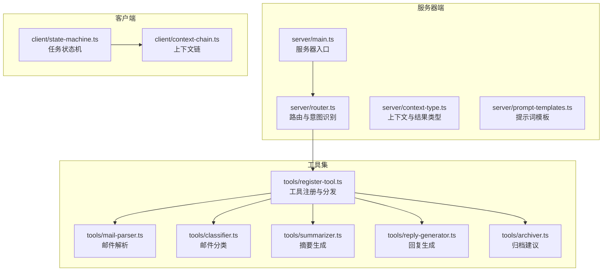
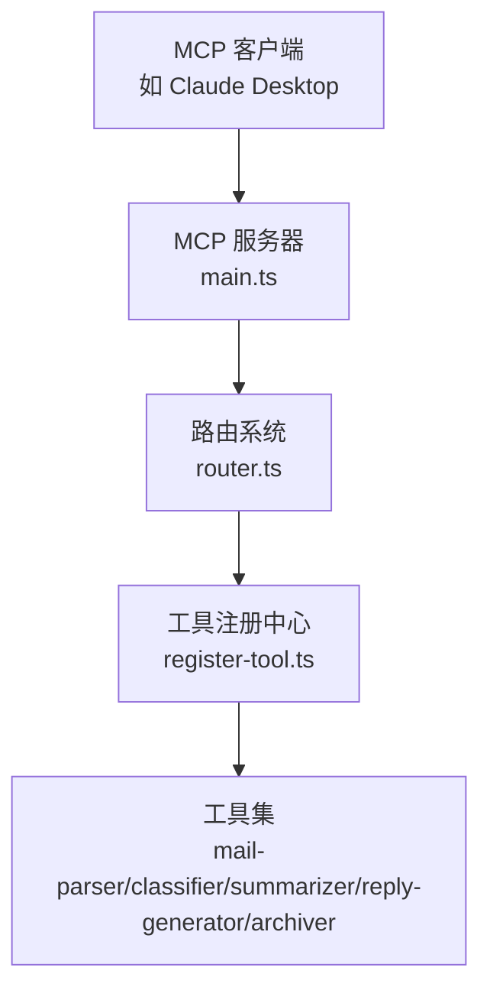
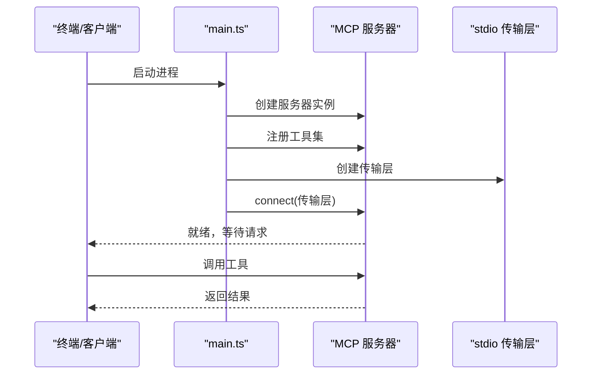
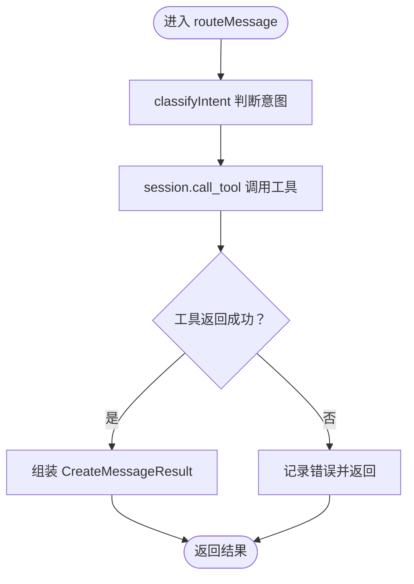
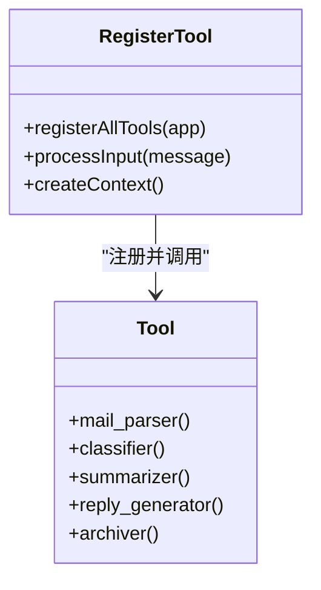
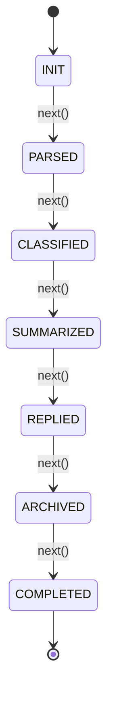
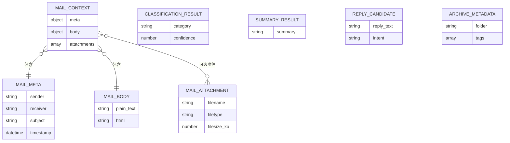
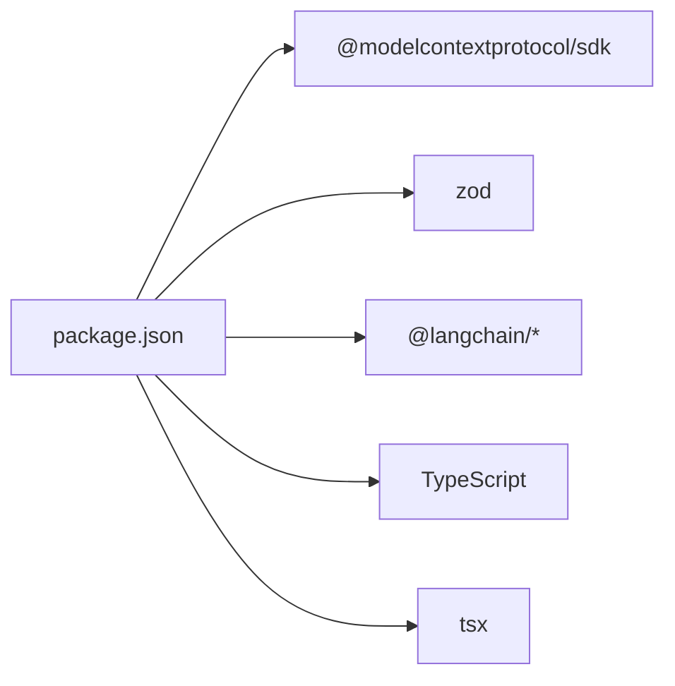

# 架构设计

<cite>
**本文引用的文件**
- [src/server/main.ts](file://src/server/main.ts)
- [src/server/router.ts](file://src/server/router.ts)
- [src/server/context-type.ts](file://src/server/context-type.ts)
- [src/server/prompt-templates.ts](file://src/server/prompt-templates.ts)
- [src/client/state-machine.ts](file://src/client/state-machine.ts)
- [src/client/context-chain.ts](file://src/client/context-chain.ts)
- [src/tools/register-tool.ts](file://src/tools/register-tool.ts)
- [src/tools/mail-parser.ts](file://src/tools/mail-parser.ts)
- [src/tools/classifier.ts](file://src/tools/classifier.ts)
- [src/tools/summarizer.ts](file://src/tools/summarizer.ts)
- [src/tools/reply-generator.ts](file://src/tools/reply-generator.ts)
- [src/tools/archiver.ts](file://src/tools/archiver.ts)
- [package.json](file://package.json)
- [README.md](file://README.md)
</cite>

## 目录
1. [简介](#简介)
2. [项目结构](#项目结构)
3. [核心组件](#核心组件)
4. [架构总览](#架构总览)
5. [详细组件分析](#详细组件分析)
6. [依赖分析](#依赖分析)
7. [性能考虑](#性能考虑)
8. [故障排查指南](#故障排查指南)
9. [结论](#结论)
10. [附录](#附录)

## 简介
本项目是一个基于 MCP（Model Context Protocol）协议的消息路由服务器，负责接收来自 MCP 客户端（如 Claude Desktop）的消息请求，通过内置的意图识别与路由机制，将请求分发至相应的工具（工具集包括邮件解析、分类、摘要、回复生成、归档等），最终将处理结果以标准格式返回给客户端。系统采用分层架构与模块化设计，核心模块包括服务器初始化、路由系统、工具注册与执行、客户端状态管理与上下文链等。

## 项目结构
项目采用按功能域划分的模块化组织方式，主要目录与文件如下：
- server：服务器核心逻辑，包含入口、路由、上下文类型与提示词模板
- client：客户端侧的状态机与上下文链，用于任务状态推进与步骤缓存
- tools：工具注册与具体工具实现，统一通过 MCP SDK 注册为可调用工具
- package.json：项目依赖与脚本配置

**图表来源**
- [src/server/main.ts:1-42](file://src/server/main.ts#L1-L42)
- [src/server/router.ts:1-67](file://src/server/router.ts#L1-L67)
- [src/server/context-type.ts:1-101](file://src/server/context-type.ts#L1-L101)
- [src/server/prompt-templates.ts:1-66](file://src/server/prompt-templates.ts#L1-L66)
- [src/tools/register-tool.ts:1-186](file://src/tools/register-tool.ts#L1-L186)
- [src/tools/mail-parser.ts:1-37](file://src/tools/mail-parser.ts#L1-L37)
- [src/tools/classifier.ts:1-45](file://src/tools/classifier.ts#L1-L45)
- [src/tools/summarizer.ts:1-35](file://src/tools/summarizer.ts#L1-L35)
- [src/tools/reply-generator.ts:1-33](file://src/tools/reply-generator.ts#L1-L33)
- [src/tools/archiver.ts:1-32](file://src/tools/archiver.ts#L1-L32)
- [src/client/state-machine.ts:1-43](file://src/client/state-machine.ts#L1-L43)
- [src/client/context-chain.ts:1-35](file://src/client/context-chain.ts#L1-L35)

**章节来源**
- [README.md:88-97](file://README.md#L88-L97)
- [package.json:1-37](file://package.json#L1-L37)

## 核心组件
- 服务器入口与传输层：负责创建 MCP 服务器实例、注册工具、建立 stdio 传输通道并保持进程常驻
- 路由系统：对用户输入进行意图识别，选择对应工具并调用执行
- 工具注册与分发：集中注册各工具，提供统一的输入校验与结果封装
- 工具实现：邮件解析、分类、摘要、回复生成、归档建议等
- 客户端状态管理：任务状态机与上下文链，支持步骤推进、快照与回滚
- 上下文与类型：定义邮件、分类、摘要、回复、归档等结构化数据模型
- 提示词模板：为后续扩展 LLM 驱动的任务提供可插拔的提示词模板与格式化工具

**章节来源**
- [src/server/main.ts:5-41](file://src/server/main.ts#L5-L41)
- [src/server/router.ts:24-63](file://src/server/router.ts#L24-L63)
- [src/tools/register-tool.ts:55-183](file://src/tools/register-tool.ts#L55-L183)
- [src/client/state-machine.ts:11-40](file://src/client/state-machine.ts#L11-L40)
- [src/client/context-chain.ts:1-35](file://src/client/context-chain.ts#L1-L35)
- [src/server/context-type.ts:6-101](file://src/server/context-type.ts#L6-L101)
- [src/server/prompt-templates.ts:5-65](file://src/server/prompt-templates.ts#L5-L65)

## 架构总览
系统采用“服务器-工具-客户端”三层协作模式：
- 服务器层：MCP 服务器负责生命周期管理、工具注册、消息路由
- 工具层：具体业务工具实现，遵循统一输入/输出规范
- 客户端层：状态机与上下文链，驱动任务流程与数据缓存

**图表来源**
- [src/server/main.ts:6-34](file://src/server/main.ts#L6-L34)
- [src/server/router.ts:40-63](file://src/server/router.ts#L40-L63)
- [src/tools/register-tool.ts:55-183](file://src/tools/register-tool.ts#L55-L183)

## 详细组件分析

### 服务器初始化与生命周期
- 创建 MCP 服务器实例，声明能力（工具能力）
- 注册工具集
- 建立 stdio 传输层并连接
- 保持进程运行，等待客户端请求

**图表来源**
- [src/server/main.ts:6-34](file://src/server/main.ts#L6-L34)

**章节来源**
- [src/server/main.ts:6-34](file://src/server/main.ts#L6-L34)

### 路由系统与意图识别
- 输入文本经由简易规则进行意图识别，映射到工具名
- 调用 session.call_tool 执行对应工具
- 统一封装为标准消息结构返回

**图表来源**
- [src/server/router.ts:40-63](file://src/server/router.ts#L40-L63)

**章节来源**
- [src/server/router.ts:24-63](file://src/server/router.ts#L24-L63)

### 工具注册与分发
- 统一注册工具：process_message（入口）、mail_parser、classifier、summarizer、reply_generator、archiver
- 使用 Zod 校验输入参数
- 将工具执行结果封装为标准内容数组

**图表来源**
- [src/tools/register-tool.ts:55-183](file://src/tools/register-tool.ts#L55-L183)
- [src/tools/mail-parser.ts:23-36](file://src/tools/mail-parser.ts#L23-L36)
- [src/tools/classifier.ts:23-44](file://src/tools/classifier.ts#L23-L44)
- [src/tools/summarizer.ts:23-34](file://src/tools/summarizer.ts#L23-L34)
- [src/tools/reply-generator.ts:23-32](file://src/tools/reply-generator.ts#L23-L32)
- [src/tools/archiver.ts:23-31](file://src/tools/archiver.ts#L23-L31)

**章节来源**
- [src/tools/register-tool.ts:55-183](file://src/tools/register-tool.ts#L55-L183)

### 客户端状态管理与上下文链
- 任务状态机：定义 INIT、PARSED、CLASSIFIED、SUMMARIZED、REPLIED、ARCHIVED、COMPLETED 状态，支持 next、isTerminal、reset
- 上下文链：维护步骤链表、键值缓存、快照与恢复

**图表来源**
- [src/client/state-machine.ts:11-40](file://src/client/state-machine.ts#L11-L40)

**章节来源**
- [src/client/state-machine.ts:1-43](file://src/client/state-machine.ts#L1-L43)
- [src/client/context-chain.ts:1-35](file://src/client/context-chain.ts#L1-L35)

### 数据模型与类型定义
- 邮件上下文：meta（发件人、收件人、主题、时间戳）、body（纯文本、HTML）、attachments（可选）
- 分类结果：category（类别）、confidence（置信度）
- 摘要结果：summary（摘要）
- 回复候选：reply_text（建议回复）、intent（意图）
- 归档元数据：folder（文件夹）、tags（标签）

**图表来源**
- [src/server/context-type.ts:11-54](file://src/server/context-type.ts#L11-L54)
- [src/server/context-type.ts:61-66](file://src/server/context-type.ts#L61-L66)
- [src/server/context-type.ts:73-76](file://src/server/context-type.ts#L73-L76)
- [src/server/context-type.ts:83-88](file://src/server/context-type.ts#L83-L88)
- [src/server/context-type.ts:95-100](file://src/server/context-type.ts#L95-L100)

**章节来源**
- [src/server/context-type.ts:6-101](file://src/server/context-type.ts#L6-L101)

### 提示词模板与可扩展性
- 提供摘要、分类、回复、归档的提示词模板
- 提供格式化工具，便于后续接入 LLM 驱动的任务

**章节来源**
- [src/server/prompt-templates.ts:5-65](file://src/server/prompt-templates.ts#L5-L65)

## 依赖分析
- 运行时依赖：@modelcontextprotocol/sdk（MCP 协议实现）、zod（参数校验）、@langchain/*（可选扩展）
- 开发依赖：TypeScript、tsx、Node 类型定义
- 关键外部接口：MCP 服务器、stdio 传输、工具注册与调用

**图表来源**
- [package.json:25-35](file://package.json#L25-L35)

**章节来源**
- [package.json:1-37](file://package.json#L1-L37)

## 性能考虑
- 工具执行为同步阻塞调用，建议在工具内部引入异步与并发控制，避免长耗时操作阻塞服务器
- 路由与工具调用应尽量减少不必要的日志输出，降低 I/O 压力
- 对于大文本处理，建议在工具层增加分片与流式处理策略
- 可通过提示词模板与 LLM 集成时，合理设置超时与重试策略

## 故障排查指南
- 服务器未响应：确认 MCP 客户端正确配置并连接 stdio 传输
- 工具未找到：检查工具注册是否成功，工具名与调用名一致
- 输入校验失败：检查客户端传入参数是否符合 Zod 规范
- 日志定位：服务器日志输出到 stderr，可在客户端日志中查看

**章节来源**
- [README.md:111-124](file://README.md#L111-L124)
- [src/server/main.ts:25-34](file://src/server/main.ts#L25-L34)

## 结论
本项目通过清晰的分层与模块化设计，实现了 MCP 协议下的消息路由与工具分发。路由系统以意图识别为核心，结合工具注册中心完成任务分发；客户端侧的状态机与上下文链提供了任务流程与数据缓存能力。未来可进一步扩展为 LLM 驱动的任务执行，并引入更完善的错误处理与性能优化策略。

## 附录
- 快速开始与配置参考见项目自述文件
- 工具清单与意图类型详见自述文件“支持的意图类型”

**章节来源**
- [README.md:15-86](file://README.md#L15-L86)