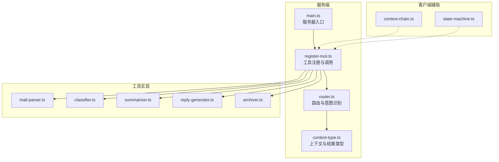
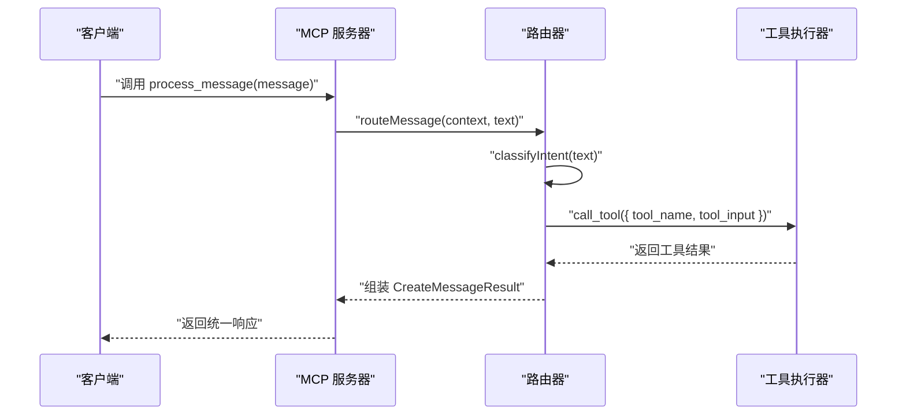
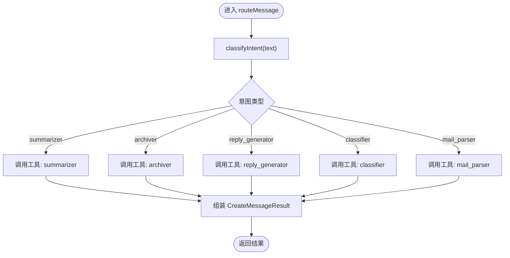
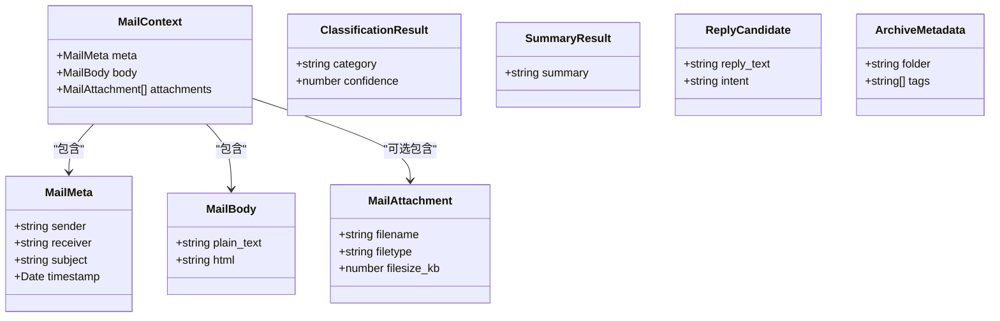
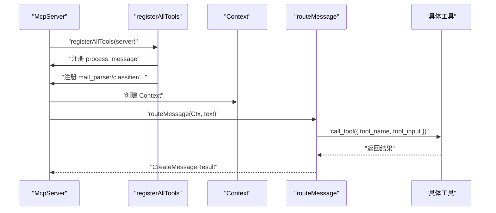
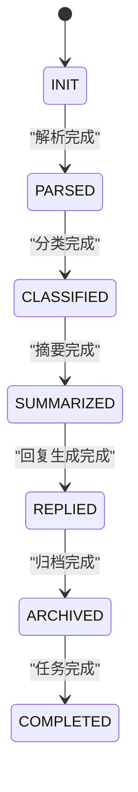
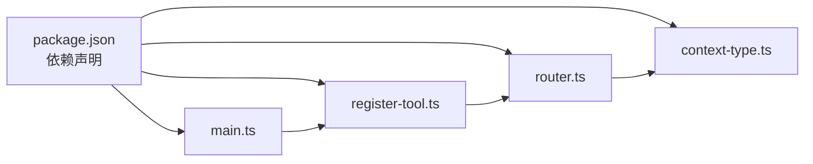
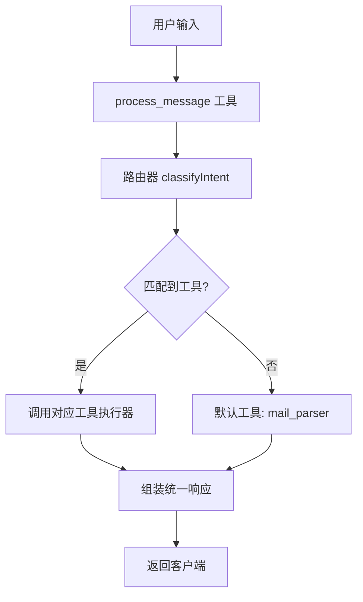

# 路由系统

<cite>
**本文引用的文件**
- [src/server/router.ts](file://src/server/router.ts)
- [src/server/context-type.ts](file://src/server/context-type.ts)
- [src/client/context-chain.ts](file://src/client/context-chain.ts)
- [src/client/state-machine.ts](file://src/client/state-machine.ts)
- [src/server/main.ts](file://src/server/main.ts)
- [src/tools/register-tool.ts](file://src/tools/register-tool.ts)
- [src/tools/classifier.ts](file://src/tools/classifier.ts)
- [src/tools/summarizer.ts](file://src/tools/summarizer.ts)
- [src/tools/archiver.ts](file://src/tools/archiver.ts)
- [src/tools/reply-generator.ts](file://src/tools/reply-generator.ts)
- [src/tools/mail-parser.ts](file://src/tools/mail-parser.ts)
- [package.json](file://package.json)
- [README.md](file://README.md)
</cite>

## 目录
1. [简介](#简介)
2. [项目结构](#项目结构)
3. [核心组件](#核心组件)
4. [架构总览](#架构总览)
5. [详细组件分析](#详细组件分析)
6. [依赖关系分析](#依赖关系分析)
7. [性能考量](#性能考量)
8. [故障排查指南](#故障排查指南)
9. [结论](#结论)
10. [附录](#附录)

## 简介
本项目是一个基于 MCP（Model Context Protocol）协议的消息路由服务器，负责对用户输入进行意图识别，并将任务分发给相应的工具执行器（如邮件解析、分类、摘要、回复生成、归档）。系统采用“路由器 + 工具注册 + 上下文类型”的设计，通过简单的关键词匹配实现意图识别，同时提供可扩展的数据模型与状态机支持，便于后续接入更复杂的自然语言理解与多轮对话能力。

## 项目结构
- 服务端入口与路由
  - 服务器入口：[src/server/main.ts](file://src/server/main.ts)
  - 路由器与类型：[src/server/router.ts](file://src/server/router.ts)，[src/server/context-type.ts](file://src/server/context-type.ts)
- 客户端辅助
  - 上下文链：[src/client/context-chain.ts](file://src/client/context-chain.ts)
  - 状态机：[src/client/state-machine.ts](file://src/client/state-machine.ts)
- 工具注册与实现
  - 工具注册：[src/tools/register-tool.ts](file://src/tools/register-tool.ts)
  - 工具实现：邮件解析、分类、摘要、回复生成、归档
- 其他
  - 包配置：[package.json](file://package.json)
  - 说明文档：[README.md](file://README.md)

图表来源
- [src/server/main.ts:1-42](file://src/server/main.ts#L1-L42)
- [src/server/router.ts:1-67](file://src/server/router.ts#L1-L67)
- [src/server/context-type.ts:1-101](file://src/server/context-type.ts#L1-L101)
- [src/tools/register-tool.ts:1-186](file://src/tools/register-tool.ts#L1-L186)
- [src/tools/mail-parser.ts:1-37](file://src/tools/mail-parser.ts#L1-L37)
- [src/tools/classifier.ts:1-45](file://src/tools/classifier.ts#L1-L45)
- [src/tools/summarizer.ts:1-35](file://src/tools/summarizer.ts#L1-L35)
- [src/tools/reply-generator.ts:1-33](file://src/tools/reply-generator.ts#L1-L33)
- [src/tools/archiver.ts:1-32](file://src/tools/archiver.ts#L1-L32)
- [src/client/context-chain.ts:1-35](file://src/client/context-chain.ts#L1-L35)
- [src/client/state-machine.ts:1-43](file://src/client/state-machine.ts#L1-L43)

章节来源
- [src/server/main.ts:1-42](file://src/server/main.ts#L1-L42)
- [src/server/router.ts:1-67](file://src/server/router.ts#L1-L67)
- [src/server/context-type.ts:1-101](file://src/server/context-type.ts#L1-L101)
- [src/tools/register-tool.ts:1-186](file://src/tools/register-tool.ts#L1-L186)
- [src/client/context-chain.ts:1-35](file://src/client/context-chain.ts#L1-L35)
- [src/client/state-machine.ts:1-43](file://src/client/state-machine.ts#L1-L43)
- [README.md:1-131](file://README.md#L1-L131)

## 核心组件
- 路由器与意图识别
  - 简易意图识别函数：根据输入文本中的关键词映射到工具名（summarizer、archiver、reply_generator、classifier、mail_parser）。
  - 路由主函数：接收上下文与文本，调用工具执行器，组装统一的返回结构。
- 上下文类型系统
  - 邮件上下文：包含元数据、正文、附件等字段。
  - 结果类型：分类结果、摘要结果、回复候选、归档元数据等。
- 工具注册与调用
  - 统一注册 process_message 工具，内部委托路由器进行分发。
  - 各工具实现独立的输入/输出结构，保证类型安全与可扩展性。
- 客户端辅助
  - 上下文链：记录步骤与缓存，支持快照与恢复。
  - 状态机：定义任务生命周期状态流转。

章节来源
- [src/server/router.ts:24-67](file://src/server/router.ts#L24-L67)
- [src/server/context-type.ts:11-101](file://src/server/context-type.ts#L11-L101)
- [src/tools/register-tool.ts:37-71](file://src/tools/register-tool.ts#L37-L71)
- [src/client/context-chain.ts:1-35](file://src/client/context-chain.ts#L1-L35)
- [src/client/state-machine.ts:1-43](file://src/client/state-machine.ts#L1-L43)

## 架构总览
系统以 MCP 服务器为核心，通过 stdio 与客户端（如 Claude Desktop）交互。客户端发起消息后，服务器注册的 process_message 工具被调用，路由器对输入进行意图识别，再调用对应工具执行器，最终将统一格式的结果返回给客户端。

图表来源
- [src/server/router.ts:40-67](file://src/server/router.ts#L40-L67)
- [src/tools/register-tool.ts:37-71](file://src/tools/register-tool.ts#L37-L71)
- [src/server/main.ts:1-42](file://src/server/main.ts#L1-L42)

## 详细组件分析

### 路由器与意图识别
- 意图识别逻辑
  - 关键词匹配规则：根据输入文本中是否包含特定关键词，映射到不同的工具名。
  - 日志输出：在识别与路由过程中输出调试信息，便于追踪。
- 路由主流程
  - 接收上下文与文本，调用工具执行器，组装统一的 CreateMessageResult 返回结构。
  - 返回结构包含角色、内容（文本）、模型名与停止原因，满足 MCP 规范。

图表来源
- [src/server/router.ts:24-67](file://src/server/router.ts#L24-L67)

章节来源
- [src/server/router.ts:24-67](file://src/server/router.ts#L24-L67)

### 上下文类型系统
- 邮件上下文（MailContext）
  - 元数据（发件人、收件人、主题、时间戳）
  - 正文（纯文本、可选 HTML）
  - 附件（名称、类型、大小）
- 结果类型
  - 分类结果（类别、置信度）
  - 摘要结果（摘要文本）
  - 回复候选（回复文本、意图）
  - 归档元数据（文件夹、标签）

图表来源
- [src/server/context-type.ts:11-101](file://src/server/context-type.ts#L11-L101)

章节来源
- [src/server/context-type.ts:11-101](file://src/server/context-type.ts#L11-L101)

### 工具注册与调用
- 工具注册
  - 注册 process_message 工具：接收用户消息，委托路由器进行分发。
  - 注册各具体工具：mail_parser、classifier、summarizer、reply_generator、archiver。
- 调用上下文
  - 提供模拟的 Context 实现，内部封装 call_tool，便于在本地或测试环境中运行。
- 输入/输出结构
  - 使用 Zod Schema 进行输入校验，工具返回统一的文本内容数组。

图表来源
- [src/tools/register-tool.ts:55-183](file://src/tools/register-tool.ts#L55-L183)
- [src/server/router.ts:15-22](file://src/server/router.ts#L15-L22)

章节来源
- [src/tools/register-tool.ts:18-71](file://src/tools/register-tool.ts#L18-L71)
- [src/server/router.ts:15-22](file://src/server/router.ts#L15-L22)

### 客户端辅助组件
- 上下文链（ContextChain）
  - 记录步骤与数据，支持按步骤检索、获取最新一步、快照与恢复。
  - 内部使用结构化克隆，确保数据隔离与可恢复性。
- 状态机（StateMachine）
  - 定义任务生命周期状态：INIT → PARSED → CLASSIFIED → SUMMARIZED → REPLIED → ARCHIVED → COMPLETED。
  - 提供状态推进、终止判断与重置功能。

图表来源
- [src/client/state-machine.ts:1-43](file://src/client/state-machine.ts#L1-L43)

章节来源
- [src/client/context-chain.ts:1-35](file://src/client/context-chain.ts#L1-L35)
- [src/client/state-machine.ts:1-43](file://src/client/state-machine.ts#L1-L43)

### 工具实现概览
- 邮件解析器：从原始文本提取元数据与正文，返回 MailContext。
- 分类器：基于关键词匹配进行简单分类，返回类别与置信度。
- 摘要器：截取前若干字符作为摘要。
- 回复生成器：生成标准确认回复及意图标签。
- 归档器：生成归档文件夹与标签建议。

章节来源
- [src/tools/mail-parser.ts:23-36](file://src/tools/mail-parser.ts#L23-L36)
- [src/tools/classifier.ts:23-44](file://src/tools/classifier.ts#L23-L44)
- [src/tools/summarizer.ts:23-34](file://src/tools/summarizer.ts#L23-L34)
- [src/tools/reply-generator.ts:23-32](file://src/tools/reply-generator.ts#L23-L32)
- [src/tools/archiver.ts:23-31](file://src/tools/archiver.ts#L23-L31)

## 依赖关系分析
- 运行时依赖
  - MCP SDK：提供服务器框架与 stdio 传输层。
  - Zod：参数校验与类型约束。
  - LangChain（可选）：为后续复杂推理与多模态扩展预留。
- 项目内模块耦合
  - 路由器依赖上下文类型与工具调用接口。
  - 工具注册模块依赖各工具实现与路由器。
  - 客户端辅助模块与工具注册模块松耦合，便于独立演进。

图表来源
- [package.json:25-35](file://package.json#L25-L35)
- [src/server/main.ts:1-42](file://src/server/main.ts#L1-L42)
- [src/tools/register-tool.ts:1-186](file://src/tools/register-tool.ts#L1-L186)
- [src/server/router.ts:1-67](file://src/server/router.ts#L1-L67)
- [src/server/context-type.ts:1-101](file://src/server/context-type.ts#L1-L101)

章节来源
- [package.json:25-35](file://package.json#L25-L35)
- [src/server/main.ts:1-42](file://src/server/main.ts#L1-L42)
- [src/tools/register-tool.ts:1-186](file://src/tools/register-tool.ts#L1-L186)
- [src/server/router.ts:1-67](file://src/server/router.ts#L1-L67)
- [src/server/context-type.ts:1-101](file://src/server/context-type.ts#L1-L101)

## 性能考量
- 意图识别
  - 当前为线性关键词匹配，时间复杂度近似 O(k)（k 为关键词数量），空间复杂度 O(1)。可通过预编译正则或引入轻量 NLP 模型提升准确率与鲁棒性。
- 工具调用
  - 工具执行器均为同步/异步函数，建议在工具内部增加超时控制与并发限制，避免阻塞路由主流程。
- 上下文与状态
  - 上下文链与状态机仅在客户端侧使用，建议在服务端通过会话 ID 或消息 ID 维护上下文，避免内存膨胀。
- 日志与可观测性
  - 路由器与工具均输出调试日志，建议在生产环境统一收集到日志系统，设置采样与级别阈值。
- 并发与吞吐
  - MCP 服务器默认串行处理请求，若需高并发，可在工具层引入队列与限流策略，或拆分为多个实例。

## 故障排查指南
- 服务器未响应
  - 确认 MCP 客户端（如 Claude Desktop）正确配置了服务器命令与工作目录。
  - 在开发模式下，服务器通过 stdio 等待客户端连接；直接输入不会触发处理。
- 工具未找到
  - 确保已在工具注册模块中注册目标工具名（如 summarizer、classifier 等）。
- 输入无效
  - 使用 Zod 校验失败会导致工具调用异常，检查输入 Schema 与客户端传参。
- 日志定位
  - 服务器日志输出到标准错误，可在客户端日志中查看路由与工具执行过程。
- 异常处理
  - 路由器与工具均未显式 try/catch，建议在工具实现中包裹 try/catch 并返回标准化错误结构，便于上层统一处理。

章节来源
- [README.md:111-124](file://README.md#L111-L124)
- [src/server/router.ts:40-67](file://src/server/router.ts#L40-L67)
- [src/tools/register-tool.ts:37-71](file://src/tools/register-tool.ts#L37-L71)

## 结论
该路由系统以简洁的关键词匹配实现了基础的意图识别与任务分发，配合统一的上下文类型与工具注册机制，具备良好的可扩展性。未来可在以下方面进一步增强：
- 引入更强大的 NLU 模块与提示模板，提升意图识别准确性。
- 增加路由中间件与缓存层，优化重复请求与热点路径。
- 扩展状态机与上下文链，支持多轮对话与复杂流程编排。
- 加强错误处理与可观测性，完善监控与告警体系。

## 附录

### 路由配置选项与扩展性建议
- 配置项
  - 意图关键词表：集中管理，支持动态更新与热加载。
  - 工具超时与重试：为每个工具设置超时与最大重试次数。
  - 日志级别与采样：区分开发/生产环境的日志策略。
- 扩展点
  - 新增工具：遵循现有输入/输出结构，注册到工具注册模块。
  - 多模态输入：在路由器中扩展对图片/语音等输入的预处理。
  - 流式输出：在工具返回结构中支持增量输出，改善用户体验。

### 工作流程图（概念）

[此图为概念流程，不直接映射具体源码文件]