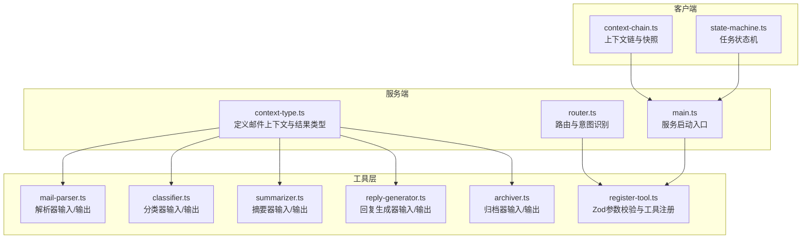
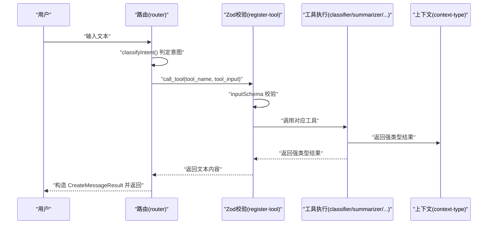
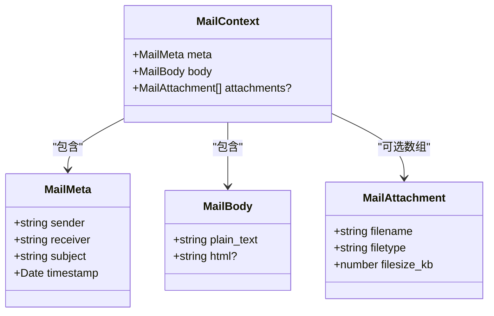
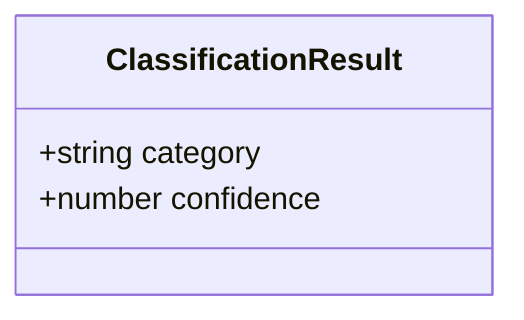
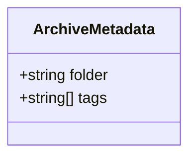
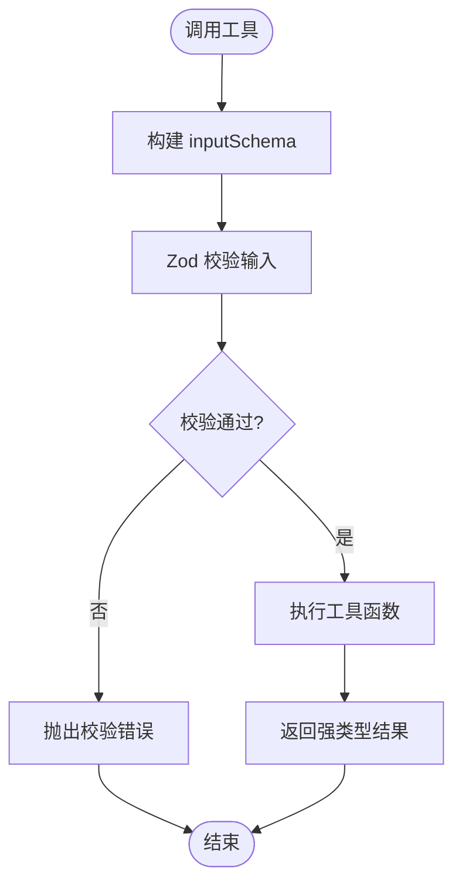
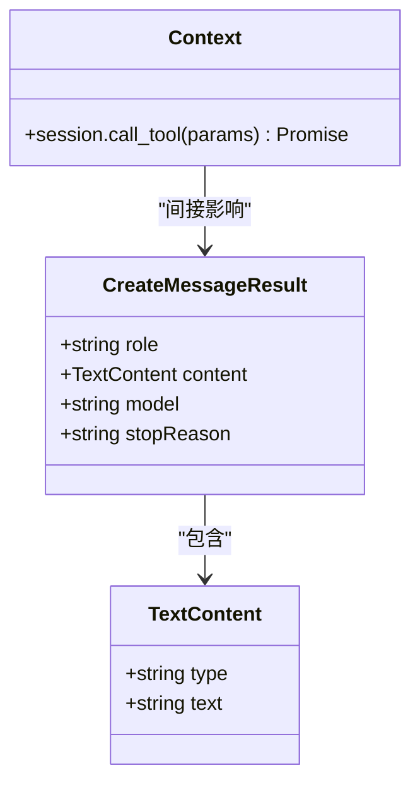
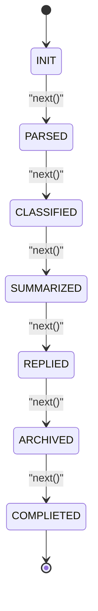
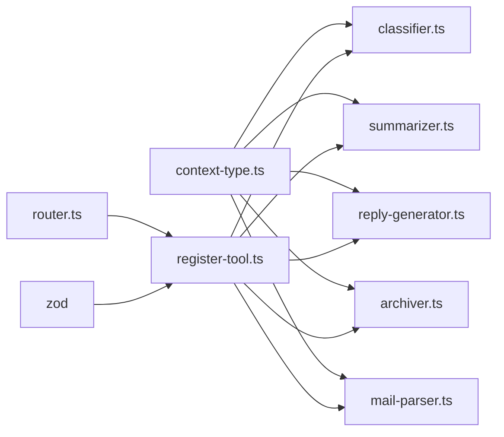

# 类型系统设计

<cite>
**本文引用的文件**
- [src/server/context-type.ts](file://src/server/context-type.ts)
- [src/tools/classifier.ts](file://src/tools/classifier.ts)
- [src/tools/summarizer.ts](file://src/tools/summarizer.ts)
- [src/tools/reply-generator.ts](file://src/tools/reply-generator.ts)
- [src/tools/archiver.ts](file://src/tools/archiver.ts)
- [src/tools/mail-parser.ts](file://src/tools/mail-parser.ts)
- [src/tools/register-tool.ts](file://src/tools/register-tool.ts)
- [src/server/router.ts](file://src/server/router.ts)
- [src/client/context-chain.ts](file://src/client/context-chain.ts)
- [src/client/state-machine.ts](file://src/client/state-machine.ts)
- [src/server/main.ts](file://src/server/main.ts)
- [package.json](file://package.json)
- [tsconfig.json](file://tsconfig.json)
</cite>

## 目录
1. [引言](#引言)
2. [项目结构](#项目结构)
3. [核心组件](#核心组件)
4. [架构总览](#架构总览)
5. [详细组件分析](#详细组件分析)
6. [依赖分析](#依赖分析)
7. [性能考虑](#性能考虑)
8. [故障排查指南](#故障排查指南)
9. [结论](#结论)
10. [附录](#附录)

## 引言
本文件系统性梳理本项目的 TypeScript 类型系统设计，重点覆盖以下方面：
- 邮件上下文类型、分类结果类型、摘要结果类型、回复候选类型、归档元数据类型的设计理念与约束
- 接口设计、泛型使用与类型推导的最佳实践
- Zod 验证库在参数校验中的集成方式与参数验证机制
- 类型扩展与自定义的指导（新增类型与修改既有类型的方法）
- 类型系统的性能考量与优化策略

本项目采用严格的 TypeScript 配置与模块化类型定义，结合 Zod 在工具注册阶段进行输入参数的结构化校验，确保端到端的类型安全与运行时健壮性。

## 项目结构
项目采用按功能域划分的目录组织方式，类型系统贯穿服务端、客户端与工具层：
- 服务端：定义核心业务类型与路由逻辑
- 客户端：状态机与上下文链管理
- 工具层：具体业务工具与其输入输出类型

图表来源
- [src/server/context-type.ts:1-101](file://src/server/context-type.ts#L1-L101)
- [src/server/router.ts:1-67](file://src/server/router.ts#L1-L67)
- [src/server/main.ts:1-42](file://src/server/main.ts#L1-L42)
- [src/client/context-chain.ts:1-35](file://src/client/context-chain.ts#L1-L35)
- [src/client/state-machine.ts:1-43](file://src/client/state-machine.ts#L1-L43)
- [src/tools/mail-parser.ts:1-37](file://src/tools/mail-parser.ts#L1-L37)
- [src/tools/classifier.ts:1-45](file://src/tools/classifier.ts#L1-L45)
- [src/tools/summarizer.ts:1-35](file://src/tools/summarizer.ts#L1-L35)
- [src/tools/reply-generator.ts:1-33](file://src/tools/reply-generator.ts#L1-L33)
- [src/tools/archiver.ts:1-32](file://src/tools/archiver.ts#L1-L32)
- [src/tools/register-tool.ts:1-186](file://src/tools/register-tool.ts#L1-L186)

章节来源
- [src/server/context-type.ts:1-101](file://src/server/context-type.ts#L1-L101)
- [src/server/router.ts:1-67](file://src/server/router.ts#L1-L67)
- [src/server/main.ts:1-42](file://src/server/main.ts#L1-L42)
- [src/client/context-chain.ts:1-35](file://src/client/context-chain.ts#L1-L35)
- [src/client/state-machine.ts:1-43](file://src/client/state-machine.ts#L1-L43)
- [src/tools/mail-parser.ts:1-37](file://src/tools/mail-parser.ts#L1-L37)
- [src/tools/classifier.ts:1-45](file://src/tools/classifier.ts#L1-L45)
- [src/tools/summarizer.ts:1-35](file://src/tools/summarizer.ts#L1-L35)
- [src/tools/reply-generator.ts:1-33](file://src/tools/reply-generator.ts#L1-L33)
- [src/tools/archiver.ts:1-32](file://src/tools/archiver.ts#L1-L32)
- [src/tools/register-tool.ts:1-186](file://src/tools/register-tool.ts#L1-L186)

## 核心组件
本节聚焦类型系统的核心构件及其职责边界，强调强类型约束与类型安全保证。

- 邮件上下文类型
  - MailMeta：封装发件人、收件人、主题与时间戳等元信息
  - MailBody：封装纯文本正文与可选 HTML 正文
  - MailAttachment：封装附件名、类型与大小
  - MailContext：聚合上述三者，形成完整邮件上下文；附件字段为可选数组

- 分类结果类型
  - ClassificationResult：包含类别字符串与置信度数值，用于表达分类输出

- 摘要结果类型
  - SummaryResult：包含生成的摘要字符串

- 回复候选类型
  - ReplyCandidate：包含建议回复文本与可选意图标签

- 归档元数据类型
  - ArchiveMetadata：包含归档文件夹名与标签数组

这些类型均采用只读属性与明确的可选字段标记，确保调用方在编译期即可获知字段存在性与类型约束，降低运行时错误概率。

章节来源
- [src/server/context-type.ts:11-101](file://src/server/context-type.ts#L11-L101)

## 架构总览
下图展示类型系统在端到端流程中的角色：从消息输入经由路由与意图识别，到工具注册阶段的参数校验，再到各工具执行与结果返回。

图表来源
- [src/server/router.ts:24-63](file://src/server/router.ts#L24-L63)
- [src/tools/register-tool.ts:61-71](file://src/tools/register-tool.ts#L61-L71)
- [src/tools/register-tool.ts:96-115](file://src/tools/register-tool.ts#L96-L115)
- [src/tools/register-tool.ts:118-138](file://src/tools/register-tool.ts#L118-L138)
- [src/tools/register-tool.ts:141-160](file://src/tools/register-tool.ts#L141-L160)
- [src/tools/register-tool.ts:163-182](file://src/tools/register-tool.ts#L163-L182)
- [src/server/context-type.ts:61-101](file://src/server/context-type.ts#L61-L101)

## 详细组件分析

### 邮件上下文类型体系
- 设计要点
  - 使用独立接口分别描述元数据、正文与附件，提升可维护性与可扩展性
  - 通过可选数组与可选字段表达“零到多”与“可能缺失”的语义
  - 将日期类型统一为 Date，确保时间处理一致性

图表来源
- [src/server/context-type.ts:11-54](file://src/server/context-type.ts#L11-L54)

章节来源
- [src/server/context-type.ts:11-54](file://src/server/context-type.ts#L11-L54)

### 分类结果类型
- 设计要点
  - 结果对象仅包含必要字段，避免冗余
  - 置信度采用数值类型，便于后续阈值判定与排序

图表来源
- [src/server/context-type.ts:61-66](file://src/server/context-type.ts#L61-L66)

章节来源
- [src/server/context-type.ts:61-66](file://src/server/context-type.ts#L61-L66)
- [src/tools/classifier.ts:11-44](file://src/tools/classifier.ts#L11-L44)

### 摘要结果类型
- 设计要点
  - 摘要字符串作为唯一输出字段，简化下游消费

图表来源
- [src/server/context-type.ts:73-76](file://src/server/context-type.ts#L73-L76)

章节来源
- [src/server/context-type.ts:73-76](file://src/server/context-type.ts#L73-L76)
- [src/tools/summarizer.ts:11-34](file://src/tools/summarizer.ts#L11-L34)

### 回复候选类型
- 设计要点
  - 回复文本为必填，意图标签为可选，满足不同场景下的意图标注需求

图表来源
- [src/server/context-type.ts:83-88](file://src/server/context-type.ts#L83-L88)

章节来源
- [src/server/context-type.ts:83-88](file://src/server/context-type.ts#L83-L88)
- [src/tools/reply-generator.ts:11-32](file://src/tools/reply-generator.ts#L11-L32)

### 归档元数据类型
- 设计要点
  - 文件夹名与标签数组构成归档建议的核心结构，标签采用字符串数组便于扩展

图表来源
- [src/server/context-type.ts:95-100](file://src/server/context-type.ts#L95-L100)

章节来源
- [src/server/context-type.ts:95-100](file://src/server/context-type.ts#L95-L100)
- [src/tools/archiver.ts:11-31](file://src/tools/archiver.ts#L11-L31)

### 工具输入/输出类型与 Zod 参数校验
- 工具输入类型
  - 每个工具均定义对应的输入接口，确保调用方传参结构清晰
- Zod 校验集成
  - 在工具注册阶段使用 z.object 定义 inputSchema，自动完成参数结构与类型校验
  - 校验失败时可提前抛出错误，避免进入工具执行阶段

图表来源
- [src/tools/register-tool.ts:61-71](file://src/tools/register-tool.ts#L61-L71)
- [src/tools/register-tool.ts:96-115](file://src/tools/register-tool.ts#L96-L115)
- [src/tools/register-tool.ts:118-138](file://src/tools/register-tool.ts#L118-L138)
- [src/tools/register-tool.ts:141-160](file://src/tools/register-tool.ts#L141-L160)
- [src/tools/register-tool.ts:163-182](file://src/tools/register-tool.ts#L163-L182)

章节来源
- [src/tools/register-tool.ts:61-71](file://src/tools/register-tool.ts#L61-L71)
- [src/tools/register-tool.ts:96-115](file://src/tools/register-tool.ts#L96-L115)
- [src/tools/register-tool.ts:118-138](file://src/tools/register-tool.ts#L118-L138)
- [src/tools/register-tool.ts:141-160](file://src/tools/register-tool.ts#L141-L160)
- [src/tools/register-tool.ts:163-182](file://src/tools/register-tool.ts#L163-L182)

### 路由与意图识别类型
- TextContent：描述文本内容的结构化载体
- CreateMessageResult：封装助手角色、文本内容、模型与停止原因
- Context：抽象会话调用工具的能力，支持异步工具调用

图表来源
- [src/server/router.ts:2-13](file://src/server/router.ts#L2-L13)
- [src/server/router.ts:41-63](file://src/server/router.ts#L41-L63)

章节来源
- [src/server/router.ts:2-13](file://src/server/router.ts#L2-L13)
- [src/server/router.ts:41-63](file://src/server/router.ts#L41-L63)

### 客户端上下文链与状态机
- 上下文链（ContextChain）
  - 维护步骤序列、键值缓存与快照恢复，所有字段使用 any 类型以保留灵活性，但建议在上层配合强类型接口使用
- 状态机（StateMachine）
  - 使用枚举定义任务状态流转，提供 next、isTerminal、reset 等方法，确保状态变更的确定性

图表来源
- [src/client/state-machine.ts:1-40](file://src/client/state-machine.ts#L1-L40)

章节来源
- [src/client/context-chain.ts:1-35](file://src/client/context-chain.ts#L1-L35)
- [src/client/state-machine.ts:1-43](file://src/client/state-machine.ts#L1-L43)

## 依赖分析
- 内部依赖
  - 工具层依赖服务端的 context-type.ts 提供统一的类型契约
  - 路由与工具注册共同依赖工具层函数签名，形成稳定的接口边界
- 外部依赖
  - Zod：用于工具输入的结构化校验
  - MCP SDK：提供服务端框架与类型支撑

图表来源
- [src/server/context-type.ts:11-101](file://src/server/context-type.ts#L11-L101)
- [src/tools/mail-parser.ts:1-37](file://src/tools/mail-parser.ts#L1-37)
- [src/tools/classifier.ts:1-45](file://src/tools/classifier.ts#L1-45)
- [src/tools/summarizer.ts:1-35](file://src/tools/summarizer.ts#L1-35)
- [src/tools/reply-generator.ts:1-33](file://src/tools/reply-generator.ts#L1-33)
- [src/tools/archiver.ts:1-32](file://src/tools/archiver.ts#L1-32)
- [src/server/router.ts:1-67](file://src/server/router.ts#L1-67)
- [src/tools/register-tool.ts:1-186](file://src/tools/register-tool.ts#L1-186)

章节来源
- [src/server/context-type.ts:11-101](file://src/server/context-type.ts#L11-L101)
- [src/tools/register-tool.ts:1-186](file://src/tools/register-tool.ts#L1-186)
- [package.json:25-30](file://package.json#L25-L30)

## 性能考虑
- 编译期优化
  - 启用严格模式与一致的模块解析策略，减少运行时类型检查开销
  - 使用精确的类型注解与字面量类型（如 type 字段），提升编译器推断效率
- 运行时优化
  - 工具输入使用 Zod 校验，尽早失败，避免无效计算
  - 对大文本摘要与分类逻辑采用轻量实现，避免不必要的复杂度
- 内存与序列化
  - 上下文链使用结构化克隆进行快照，注意大对象的复制成本；建议在关键路径限制快照频率
  - 工具返回统一为 JSON 字符串化，减少复杂对象传递带来的内存压力

章节来源
- [tsconfig.json:11-20](file://tsconfig.json#L11-L20)
- [src/tools/register-tool.ts:61-71](file://src/tools/register-tool.ts#L61-L71)
- [src/client/context-chain.ts:7-33](file://src/client/context-chain.ts#L7-L33)

## 故障排查指南
- 类型不匹配
  - 若出现编译错误，优先检查工具输入接口与实现是否一致，确保字段名与类型完全匹配
- Zod 校验失败
  - 检查 inputSchema 的字段定义与调用方传参是否一致；必要时调整 schema 或调用方参数
- 运行时异常
  - 关注路由与工具执行的错误日志，定位具体工具与输入参数
- 状态机问题
  - 确认状态流转顺序与终端状态判断逻辑，避免状态卡死

章节来源
- [src/tools/register-tool.ts:61-71](file://src/tools/register-tool.ts#L61-L71)
- [src/server/router.ts:41-63](file://src/server/router.ts#L41-L63)
- [src/client/state-machine.ts:17-35](file://src/client/state-machine.ts#L17-L35)

## 结论
本项目的类型系统通过清晰的接口拆分、严格的输入校验与一致的输出契约，实现了从路由到工具执行的全链路类型安全。建议在扩展新类型时遵循“单一职责、最小暴露、可选字段明确”的原则，并在工具注册阶段同步完善 Zod 校验，以保障类型安全与运行稳定性。

## 附录

### 类型扩展与自定义指南
- 新增类型
  - 在服务端 context-type.ts 中定义新的接口，确保字段命名与语义清晰
  - 在对应工具的输入/输出接口中引用该类型，保持调用契约一致
- 修改既有类型
  - 优先采用可选字段或联合类型，避免破坏现有调用方
  - 如必须破坏性变更，先在分支中演进，再逐步替换调用方
- 泛型与类型推导
  - 对于工具输入/输出，尽量使用字面量类型与联合类型，提升推导精度
  - 在需要跨工具复用的场景引入泛型接口，但需控制复杂度

章节来源
- [src/server/context-type.ts:11-101](file://src/server/context-type.ts#L11-L101)
- [src/tools/register-tool.ts:61-71](file://src/tools/register-tool.ts#L61-L71)