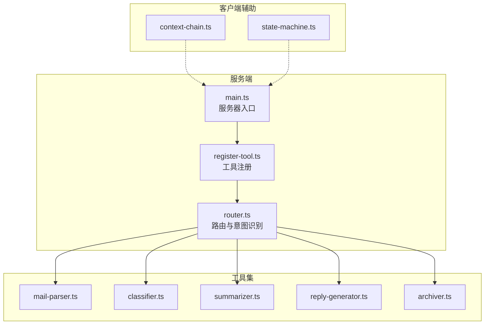
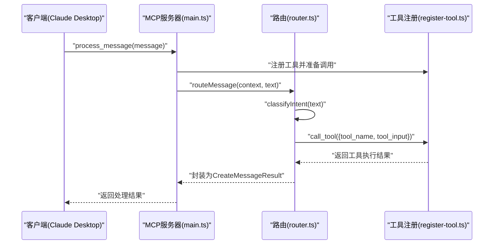
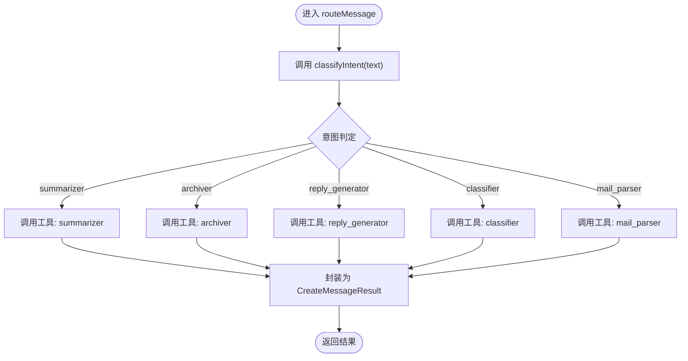
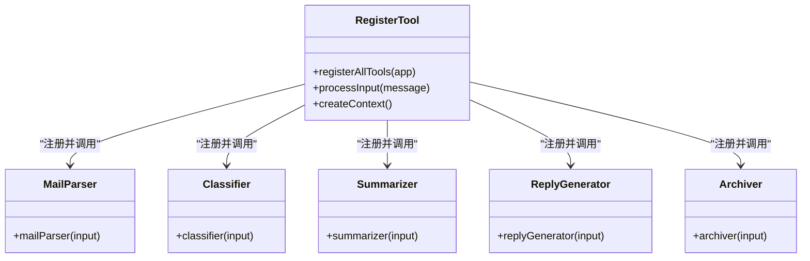
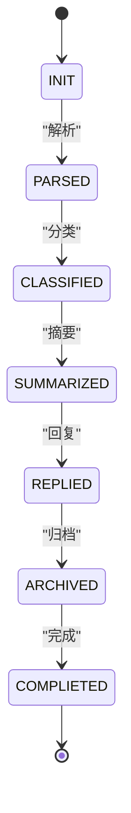
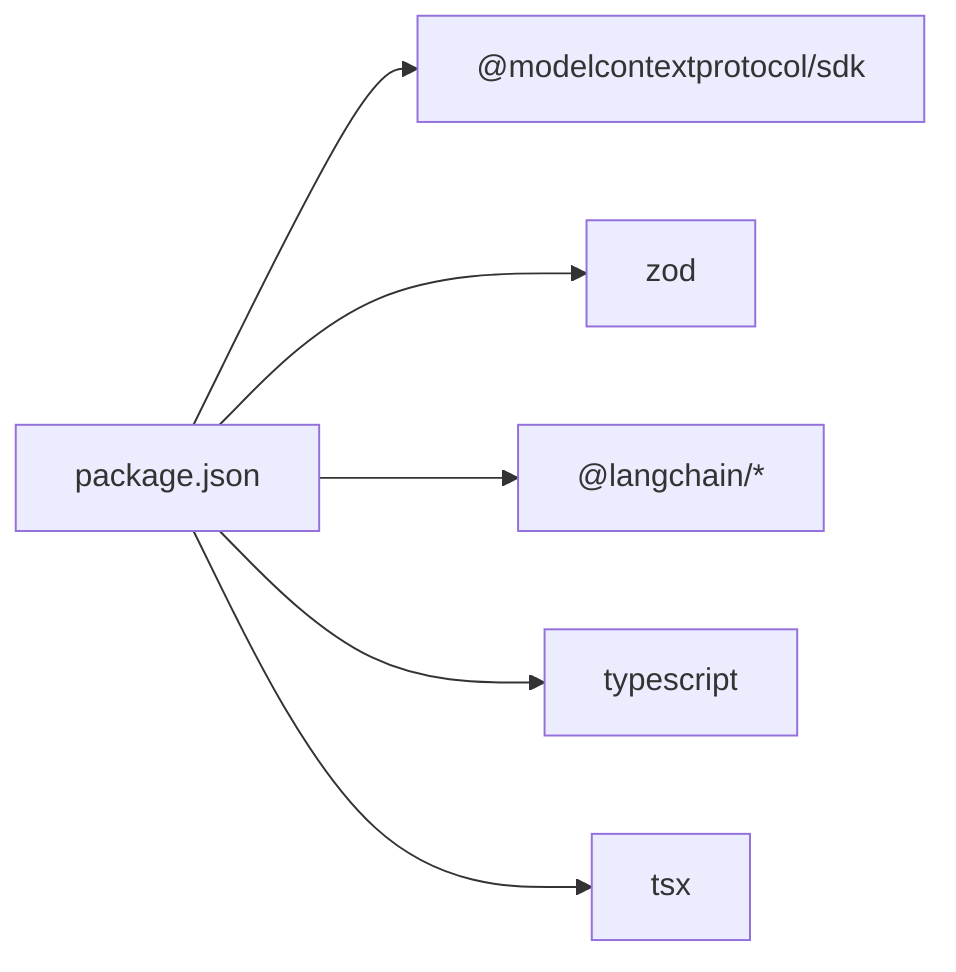

# 路由系统

<cite>
**本文引用的文件**
- [src/server/router.ts](file://src/server/router.ts)
- [src/server/main.ts](file://src/server/main.ts)
- [src/server/context-type.ts](file://src/server/context-type.ts)
- [src/tools/register-tool.ts](file://src/tools/register-tool.ts)
- [src/client/context-chain.ts](file://src/client/context-chain.ts)
- [src/client/state-machine.ts](file://src/client/state-machine.ts)
- [src/tools/classifier.ts](file://src/tools/classifier.ts)
- [src/tools/summarizer.ts](file://src/tools/summarizer.ts)
- [src/tools/reply-generator.ts](file://src/tools/reply-generator.ts)
- [src/tools/archiver.ts](file://src/tools/archiver.ts)
- [src/tools/mail-parser.ts](file://src/tools/mail-parser.ts)
- [package.json](file://package.json)
- [README.md](file://README.md)
</cite>

## 目录
1. [简介](#简介)
2. [项目结构](#项目结构)
3. [核心组件](#核心组件)
4. [架构总览](#架构总览)
5. [详细组件分析](#详细组件分析)
6. [依赖关系分析](#依赖关系分析)
7. [性能考虑](#性能考虑)
8. [故障排查指南](#故障排查指南)
9. [结论](#结论)
10. [附录](#附录)

## 简介
本路由系统基于 MCP（Model Context Protocol）协议构建，负责对用户输入进行意图识别，并将任务分发至相应的工具执行器（如邮件解析、分类、摘要、回复生成、归档等）。系统采用“简易意图识别 + 工具注册 + 路由分发”的设计，具备清晰的扩展点，便于添加新的意图与工具。

## 项目结构
- 服务端入口与路由：server/main.ts、server/router.ts
- 工具注册与调用：tools/register-tool.ts
- 工具实现：tools/mail-parser.ts、tools/classifier.ts、tools/summarizer.ts、tools/reply-generator.ts、tools/archiver.ts
- 上下文与状态机：client/context-chain.ts、client/state-machine.ts
- 类型定义：server/context-type.ts
- 项目配置与说明：package.json、README.md

图表来源
- [src/server/main.ts:1-42](file://src/server/main.ts#L1-L42)
- [src/server/router.ts:1-67](file://src/server/router.ts#L1-L67)
- [src/tools/register-tool.ts:1-186](file://src/tools/register-tool.ts#L1-L186)
- [src/tools/mail-parser.ts:1-37](file://src/tools/mail-parser.ts#L1-L37)
- [src/tools/classifier.ts:1-45](file://src/tools/classifier.ts#L1-L45)
- [src/tools/summarizer.ts:1-35](file://src/tools/summarizer.ts#L1-L35)
- [src/tools/reply-generator.ts:1-33](file://src/tools/reply-generator.ts#L1-L33)
- [src/tools/archiver.ts:1-32](file://src/tools/archiver.ts#L1-L32)
- [src/client/context-chain.ts:1-35](file://src/client/context-chain.ts#L1-L35)
- [src/client/state-machine.ts:1-43](file://src/client/state-machine.ts#L1-L43)

章节来源
- [src/server/main.ts:1-42](file://src/server/main.ts#L1-L42)
- [src/server/router.ts:1-67](file://src/server/router.ts#L1-L67)
- [src/tools/register-tool.ts:1-186](file://src/tools/register-tool.ts#L1-L186)
- [README.md:88-97](file://README.md#L88-L97)

## 核心组件
- 路由与意图识别：在 router.ts 中实现，负责将用户输入映射到具体意图，并调用对应工具。
- 工具注册与调用：在 register-tool.ts 中完成，注册多个工具并在运行时按意图调用。
- 工具实现：各工具模块独立实现其业务逻辑，统一返回标准化结果。
- 上下文链与状态机：在 client 目录中提供上下文缓存与状态流转，支持流程控制与回滚。
- 类型定义：在 context-type.ts 中定义邮件、分类、摘要、回复、归档等结构体，确保跨模块一致的数据契约。

章节来源
- [src/server/router.ts:24-67](file://src/server/router.ts#L24-L67)
- [src/tools/register-tool.ts:55-183](file://src/tools/register-tool.ts#L55-L183)
- [src/client/context-chain.ts:1-35](file://src/client/context-chain.ts#L1-L35)
- [src/client/state-machine.ts:1-43](file://src/client/state-machine.ts#L1-L43)
- [src/server/context-type.ts:1-101](file://src/server/context-type.ts#L1-L101)

## 架构总览
系统以 MCP 服务器为核心，通过 stdio 与客户端（如 Claude Desktop）通信。客户端发起消息后，服务器经由路由模块识别意图，再调用相应工具执行器，最终将结果返回给客户端。

图表来源
- [src/server/main.ts:6-35](file://src/server/main.ts#L6-L35)
- [src/server/router.ts:40-63](file://src/server/router.ts#L40-L63)
- [src/tools/register-tool.ts:37-53](file://src/tools/register-tool.ts#L37-L53)

## 详细组件分析

### 路由与意图识别（router.ts）
- 简易意图识别：根据输入文本的关键字匹配，将消息归类为若干预定义意图（如总结、归档、回复、分类、默认解析）。
- 路由主流程：调用上下文中的工具调用接口，传入意图名与输入参数，然后将工具返回的结果封装为标准消息结构。
- 日志输出：在关键节点输出调试信息，便于定位问题。

图表来源
- [src/server/router.ts:24-67](file://src/server/router.ts#L24-L67)

章节来源
- [src/server/router.ts:24-67](file://src/server/router.ts#L24-L67)

### 工具注册与调用（register-tool.ts）
- 工具注册：通过 MCP SDK 将各工具注册为可被客户端调用的服务，每个工具具有描述与输入参数校验。
- 进程入口：processInput 将用户输入转换为上下文并交由路由处理；createContext 提供工具调用的模拟实现。
- 工具清单：包含邮件解析、分类、摘要、回复生成、归档等工具。

图表来源
- [src/tools/register-tool.ts:55-183](file://src/tools/register-tool.ts#L55-L183)
- [src/tools/mail-parser.ts:23-36](file://src/tools/mail-parser.ts#L23-L36)
- [src/tools/classifier.ts:23-44](file://src/tools/classifier.ts#L23-L44)
- [src/tools/summarizer.ts:23-34](file://src/tools/summarizer.ts#L23-L34)
- [src/tools/reply-generator.ts:23-32](file://src/tools/reply-generator.ts#L23-L32)
- [src/tools/archiver.ts:23-31](file://src/tools/archiver.ts#L23-L31)

章节来源
- [src/tools/register-tool.ts:55-183](file://src/tools/register-tool.ts#L55-L183)

### 工具实现概览
- 邮件解析器：将原始文本解析为包含元数据、正文的结构化上下文。
- 分类器：基于关键词匹配进行简单分类，并给出置信度。
- 摘要器：截取固定长度作为摘要。
- 回复生成器：生成标准确认回复及意图标签。
- 归档器：生成归档文件夹与标签建议。

章节来源
- [src/tools/mail-parser.ts:1-37](file://src/tools/mail-parser.ts#L1-L37)
- [src/tools/classifier.ts:1-45](file://src/tools/classifier.ts#L1-L45)
- [src/tools/summarizer.ts:1-35](file://src/tools/summarizer.ts#L1-L35)
- [src/tools/reply-generator.ts:1-33](file://src/tools/reply-generator.ts#L1-L33)
- [src/tools/archiver.ts:1-32](file://src/tools/archiver.ts#L1-L32)

### 客户端上下文与状态机（client）
- 上下文链：维护步骤链、键值缓存、快照与恢复，便于流程记录与回滚。
- 状态机：定义任务处理的状态流转，从初始化到完成，支持重置与终止判断。

图表来源
- [src/client/state-machine.ts:1-43](file://src/client/state-machine.ts#L1-L43)

章节来源
- [src/client/context-chain.ts:1-35](file://src/client/context-chain.ts#L1-L35)
- [src/client/state-machine.ts:1-43](file://src/client/state-machine.ts#L1-L43)

### 类型定义（server/context-type.ts）
- 邮件上下文：包含元数据、正文与附件。
- 分类结果：类别与置信度。
- 摘要结果：摘要文本。
- 回复建议：建议回复与意图标签。
- 归档元数据：归档文件夹与标签数组。

章节来源
- [src/server/context-type.ts:1-101](file://src/server/context-type.ts#L1-L101)

## 依赖关系分析
- 运行时依赖：MCP SDK、Zod（参数校验）、LangChain（可选，用于更复杂的推理与流式处理）。
- 开发依赖：TypeScript、tsx（开发与热重载）、Node 类型声明。
- 项目脚本：构建、开发模式、监听模式、启动。

图表来源
- [package.json:25-35](file://package.json#L25-L35)

章节来源
- [package.json:1-37](file://package.json#L1-L37)

## 性能考虑
- 意图识别复杂度：当前为关键字匹配，时间复杂度近似 O(k)，k 为关键词数量；空间复杂度 O(1)。
- 工具调用：同步等待工具执行，整体吞吐受限于最慢工具的耗时。
- 日志输出：使用 stderr 输出，避免阻塞标准输出；在高并发场景建议引入异步日志或采样。
- 可扩展性：可通过引入 LangGraph 或 LangChain 实现更复杂的规则引擎与动态调整能力。

## 故障排查指南
- 服务器未响应：确认客户端正确配置 MCP 服务器，MCP 服务器非交互式，需由客户端触发。
- 无日志输出：检查 stderr 输出位置，或在代码中使用 console.error 输出调试信息。
- 工具未注册：确认 registerAllTools 已在 main.ts 中调用。
- 意图识别不准确：调整 router.ts 中的关键词匹配逻辑或引入更复杂的 NLP 模块。
- 结果格式异常：核对工具返回结构与 router.ts 的封装逻辑是否一致。

章节来源
- [README.md:111-124](file://README.md#L111-L124)
- [src/server/main.ts:25-34](file://src/server/main.ts#L25-L34)
- [src/server/router.ts:40-67](file://src/server/router.ts#L40-L67)

## 结论
该路由系统以简洁的意图识别与工具注册机制实现了消息到任务的高效分发。通过清晰的类型定义与模块化设计，系统易于扩展与维护。未来可在规则引擎、NLP 模块、动态优先级与负载均衡方面进一步增强，以满足更复杂的业务场景。

## 附录

### 路由配置与使用说明
- 快速开始：安装依赖、开发模式运行、构建与启动。
- 客户端配置：在 Claude Desktop 中配置 MCP 服务器命令与工作目录。
- 使用方式：在客户端发送消息，服务器自动识别意图并返回处理结果。
- 示例对话：展示从用户输入到工具执行与结果返回的完整流程。

章节来源
- [README.md:15-78](file://README.md#L15-L78)

### 自定义规则与工具扩展
- 新增意图：在 router.ts 的 classifyIntent 中添加新的关键字匹配分支。
- 新增工具：在 tools 目录新增工具模块，并在 register-tool.ts 中注册。
- 修改现有规则：调整关键词集合或引入更复杂的分类逻辑（如机器学习模型）。
- 动态调整：结合 LangGraph/LangChain 实现规则引擎与动态策略更新。

章节来源
- [src/server/router.ts:24-38](file://src/server/router.ts#L24-L38)
- [src/tools/register-tool.ts:55-183](file://src/tools/register-tool.ts#L55-L183)

### 错误处理与异常恢复
- 服务器启动异常：捕获错误并退出进程，便于快速定位问题。
- 工具调用异常：当前示例返回模拟结果，实际部署应捕获异常并返回标准化错误信息。
- 上下文与状态：利用上下文链与状态机进行流程记录与回滚，提升系统鲁棒性。

章节来源
- [src/server/main.ts:25-34](file://src/server/main.ts#L25-L34)
- [src/client/context-chain.ts:23-33](file://src/client/context-chain.ts#L23-L33)
- [src/client/state-machine.ts:17-31](file://src/client/state-machine.ts#L17-L31)

### 性能监控与调试工具
- 日志输出：使用 console.error 输出关键路径日志，便于在客户端日志中查看。
- 开发模式：使用 pnpm dev 与监听模式 pnpm watch 提升开发效率。
- MCP Inspector：通过脚本启动 MCP Inspector，辅助调试与可视化。

章节来源
- [README.md:107-109](file://README.md#L107-L109)
- [package.json:10-14](file://package.json#L10-L14)