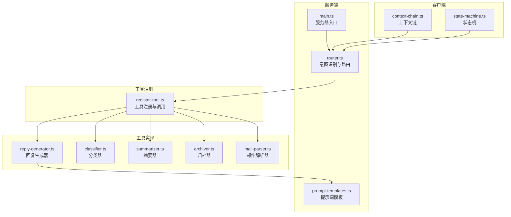
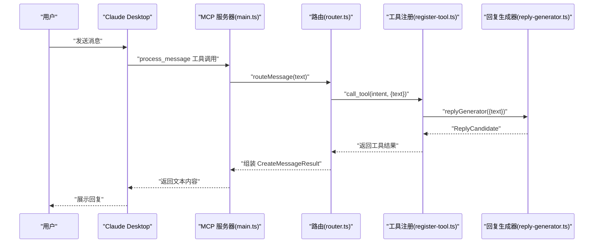
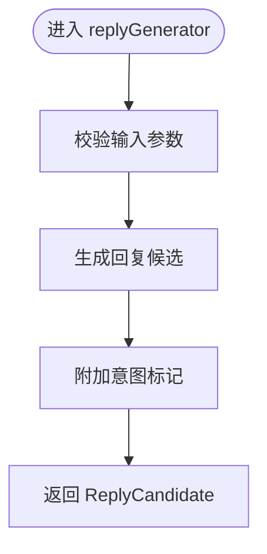
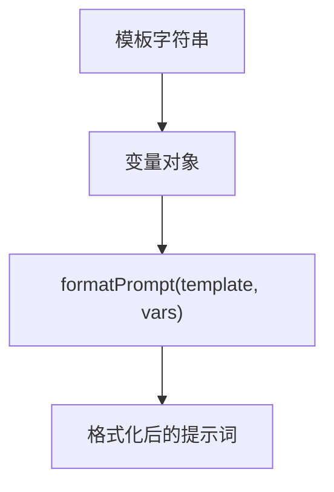
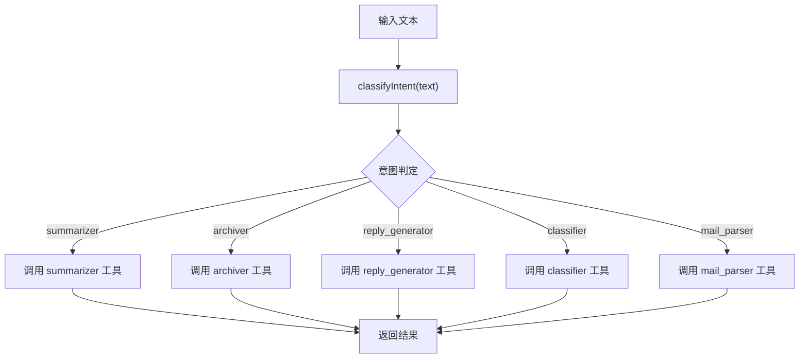
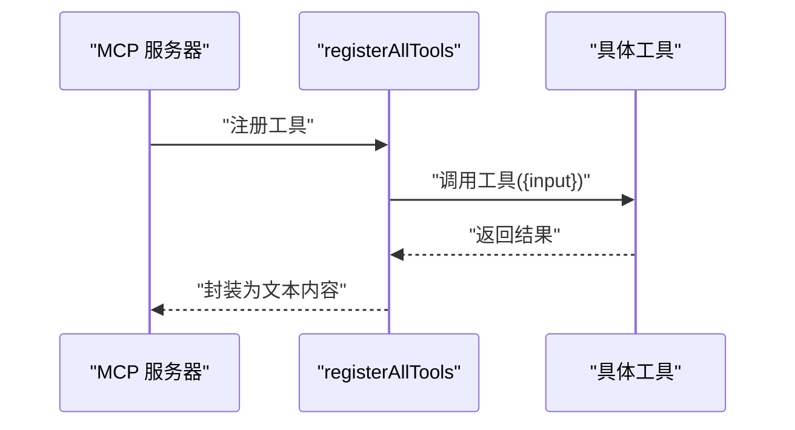
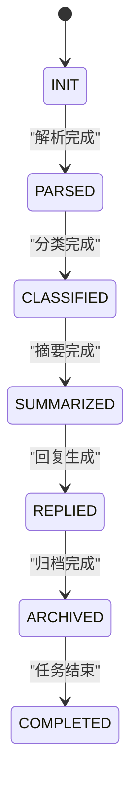
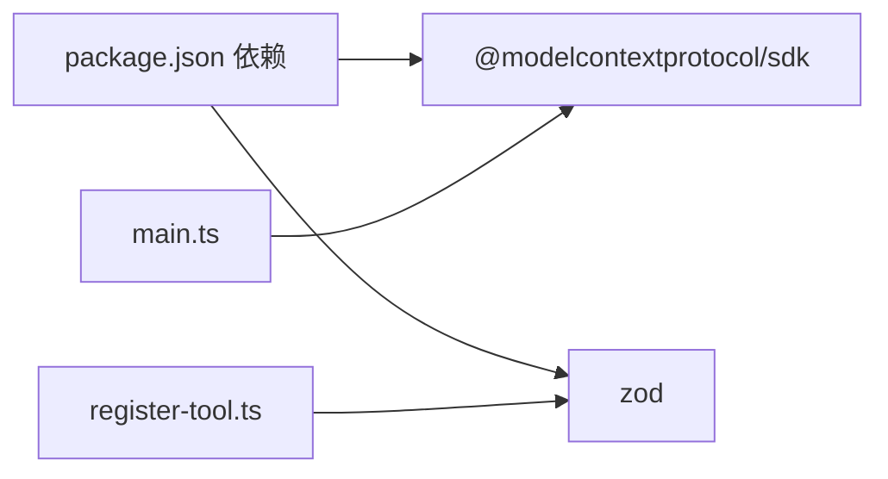

# 回复生成器

<cite>
**本文引用的文件**
- [src/tools/reply-generator.ts](file://src/tools/reply-generator.ts)
- [src/server/prompt-templates.ts](file://src/server/prompt-templates.ts)
- [src/server/context-type.ts](file://src/server/context-type.ts)
- [src/server/router.ts](file://src/server/router.ts)
- [src/tools/register-tool.ts](file://src/tools/register-tool.ts)
- [src/server/main.ts](file://src/server/main.ts)
- [src/client/context-chain.ts](file://src/client/context-chain.ts)
- [src/client/state-machine.ts](file://src/client/state-machine.ts)
- [src/tools/classifier.ts](file://src/tools/classifier.ts)
- [src/tools/summarizer.ts](file://src/tools/summarizer.ts)
- [src/tools/archiver.ts](file://src/tools/archiver.ts)
- [src/tools/mail-parser.ts](file://src/tools/mail-parser.ts)
- [README.md](file://README.md)
- [package.json](file://package.json)
</cite>

## 目录
1. [简介](#简介)
2. [项目结构](#项目结构)
3. [核心组件](#核心组件)
4. [架构总览](#架构总览)
5. [详细组件分析](#详细组件分析)
6. [依赖分析](#依赖分析)
7. [性能考虑](#性能考虑)
8. [故障排查指南](#故障排查指南)
9. [结论](#结论)
10. [附录](#附录)

## 简介
本文件围绕“回复生成器”工具展开，系统性说明其在整体邮件处理流水线中的定位、模板系统与生成算法、语义理解与模板选择、个性化定制能力、回复类型分类与模板库、质量评估与反馈机制、上下文保持与一致性保障，以及不当回复的处理策略与人工干预流程。当前仓库提供了基于 MCP 协议的路由与工具注册框架，回复生成器作为其中的一个工具被统一管理与调用。

## 项目结构
该项目采用模块化组织，核心目录与职责如下：
- src/server：服务端入口、路由与提示词模板
- src/tools：各功能工具（分类、摘要、归档、回复生成、邮件解析等）
- src/client：上下文链与状态机（用于流程编排与回溯）
- README.md 与 package.json：项目说明与依赖配置

图表来源
- [src/server/main.ts:1-42](file://src/server/main.ts#L1-L42)
- [src/server/router.ts:1-67](file://src/server/router.ts#L1-L67)
- [src/server/prompt-templates.ts:1-66](file://src/server/prompt-templates.ts#L1-L66)
- [src/tools/register-tool.ts:1-186](file://src/tools/register-tool.ts#L1-L186)
- [src/tools/reply-generator.ts:1-33](file://src/tools/reply-generator.ts#L1-L33)
- [src/tools/classifier.ts:1-45](file://src/tools/classifier.ts#L1-L45)
- [src/tools/summarizer.ts:1-35](file://src/tools/summarizer.ts#L1-L35)
- [src/tools/archiver.ts:1-32](file://src/tools/archiver.ts#L1-L32)
- [src/tools/mail-parser.ts:1-37](file://src/tools/mail-parser.ts#L1-L37)
- [src/client/context-chain.ts:1-35](file://src/client/context-chain.ts#L1-L35)
- [src/client/state-machine.ts:1-43](file://src/client/state-machine.ts#L1-L43)

章节来源
- [README.md:88-97](file://README.md#L88-L97)
- [package.json:1-37](file://package.json#L1-L37)

## 核心组件
- 回复生成器（reply-generator）：接收待回复文本，返回标准化的回复候选与意图标记。当前实现为固定模板回复，便于演示与扩展。
- 提示词模板（prompt-templates）：集中定义摘要、分类、回复构造、归档等模板，并提供格式化函数以注入变量。
- 上下文类型（context-type）：定义邮件元数据、正文、附件、分类结果、摘要结果、回复候选、归档元数据等结构。
- 路由与意图识别（router）：根据用户输入关键字识别意图，调用对应工具。
- 工具注册（register-tool）：将各工具注册到 MCP 服务器，暴露统一的工具接口。
- 客户端上下文链与状态机（client/context-chain.ts, client/state-machine.ts）：用于保存步骤上下文、快照恢复与状态流转，支撑多步流程的一致性与可回溯。

章节来源
- [src/tools/reply-generator.ts:1-33](file://src/tools/reply-generator.ts#L1-L33)
- [src/server/prompt-templates.ts:1-66](file://src/server/prompt-templates.ts#L1-L66)
- [src/server/context-type.ts:1-101](file://src/server/context-type.ts#L1-L101)
- [src/server/router.ts:1-67](file://src/server/router.ts#L1-L67)
- [src/tools/register-tool.ts:1-186](file://src/tools/register-tool.ts#L1-L186)
- [src/client/context-chain.ts:1-35](file://src/client/context-chain.ts#L1-L35)
- [src/client/state-machine.ts:1-43](file://src/client/state-machine.ts#L1-L43)

## 架构总览
下图展示从用户输入到工具执行与结果返回的整体流程，突出回复生成器在路由与工具注册中的位置。

图表来源
- [src/server/main.ts:1-42](file://src/server/main.ts#L1-L42)
- [src/server/router.ts:40-63](file://src/server/router.ts#L40-L63)
- [src/tools/register-tool.ts:55-182](file://src/tools/register-tool.ts#L55-L182)
- [src/tools/reply-generator.ts:23-32](file://src/tools/reply-generator.ts#L23-L32)

## 详细组件分析

### 回复生成器（reply-generator）
- 角色与职责：接收待回复文本，生成标准化回复候选与意图标记；当前实现为固定模板回复，便于演示与扩展。
- 数据模型：依赖 ReplyCandidate 结构，包含回复文本与意图字段。
- 扩展方向：可接入提示词模板与大模型推理，实现更丰富的语义理解与个性化定制。

图表来源
- [src/tools/reply-generator.ts:23-32](file://src/tools/reply-generator.ts#L23-L32)
- [src/server/context-type.ts:83-88](file://src/server/context-type.ts#L83-L88)

章节来源
- [src/tools/reply-generator.ts:1-33](file://src/tools/reply-generator.ts#L1-L33)
- [src/server/context-type.ts:78-88](file://src/server/context-type.ts#L78-L88)

### 提示词模板系统（prompt-templates）
- 组件构成：摘要、分类、回复构造、归档四类模板，以及通用格式化函数。
- 使用方式：在工具内部通过格式化函数将变量注入模板，形成最终提示词。
- 与回复生成器的关系：回复生成器可复用该模板系统，以提升回复的规范性与一致性。

图表来源
- [src/server/prompt-templates.ts:56-65](file://src/server/prompt-templates.ts#L56-L65)
- [src/server/prompt-templates.ts:28-37](file://src/server/prompt-templates.ts#L28-L37)

章节来源
- [src/server/prompt-templates.ts:1-66](file://src/server/prompt-templates.ts#L1-L66)

### 路由与意图识别（router）
- 功能：根据输入文本中的关键词识别意图（summarizer、archiver、reply_generator、classifier、mail_parser），并调用相应工具。
- 关键点：路由函数与简易意图识别函数共同决定工具分发逻辑。

图表来源
- [src/server/router.ts:24-38](file://src/server/router.ts#L24-L38)
- [src/server/router.ts:40-63](file://src/server/router.ts#L40-L63)

章节来源
- [src/server/router.ts:1-67](file://src/server/router.ts#L1-L67)

### 工具注册与调用（register-tool）
- 功能：将各工具注册到 MCP 服务器，提供统一的输入校验与调用封装。
- 关键点：工具注册时声明描述与输入模式，调用时返回标准化文本内容。

图表来源
- [src/tools/register-tool.ts:55-182](file://src/tools/register-tool.ts#L55-L182)

章节来源
- [src/tools/register-tool.ts:1-186](file://src/tools/register-tool.ts#L1-L186)

### 上下文链与状态机（client）
- 上下文链：按步骤保存上下文数据，支持快照与恢复，便于多步流程的回溯与一致性维护。
- 状态机：定义任务状态流转（INIT→PARSED→CLASSIFIED→SUMMARIZED→REPLIED→ARCHIVED→COMPLETED），用于流程编排与终止条件判断。

图表来源
- [src/client/state-machine.ts:11-40](file://src/client/state-machine.ts#L11-L40)

章节来源
- [src/client/context-chain.ts:1-35](file://src/client/context-chain.ts#L1-L35)
- [src/client/state-machine.ts:1-43](file://src/client/state-machine.ts#L1-L43)

### 其他工具（辅助理解）
- 分类器（classifier）：基于关键词匹配进行简单分类，返回类别与置信度。
- 摘要器（summarizer）：简单截取前若干字符作为摘要。
- 归档器（archiver）：生成归档文件夹与标签建议。
- 邮件解析器（mail-parser）：伪解析逻辑，返回基础邮件上下文。

章节来源
- [src/tools/classifier.ts:1-45](file://src/tools/classifier.ts#L1-L45)
- [src/tools/summarizer.ts:1-35](file://src/tools/summarizer.ts#L1-L35)
- [src/tools/archiver.ts:1-32](file://src/tools/archiver.ts#L1-L32)
- [src/tools/mail-parser.ts:1-37](file://src/tools/mail-parser.ts#L1-L37)

## 依赖分析
- 服务器入口依赖 MCP SDK 与 stdio 传输层，负责连接客户端与工具。
- 工具注册依赖 Zod 进行输入校验，确保工具调用的健壮性。
- 工具间通过路由与工具注册解耦，便于扩展与替换。

图表来源
- [package.json:25-30](file://package.json#L25-L30)
- [src/server/main.ts:1-42](file://src/server/main.ts#L1-L42)
- [src/tools/register-tool.ts:6-16](file://src/tools/register-tool.ts#L6-L16)

章节来源
- [package.json:1-37](file://package.json#L1-L37)

## 性能考虑
- 工具调用链路短、无复杂计算，主要瓶颈在外部模型推理与 I/O。建议：
  - 在工具内部缓存热点模板与上下文，减少重复格式化与查询。
  - 对长文本进行分块处理与流式输出，降低一次性内存占用。
  - 使用异步并发控制，避免工具堆积导致延迟放大。
  - 对路由与意图识别进行轻量化优化，减少不必要的字符串扫描。

## 故障排查指南
- 服务器未响应
  - 确认 MCP 客户端（如 Claude Desktop）正确配置并连接。
  - 查看服务器日志输出，关注路由与工具调用过程中的错误信息。
- 工具未触发
  - 检查输入文本是否包含路由识别的关键字。
  - 确认工具已在注册表中正确注册且名称一致。
- 回复质量不佳
  - 当前回复生成器为固定模板，建议接入更丰富的提示词模板与模型推理。
  - 引入上下文链与状态机，结合历史对话与任务状态提升一致性。
- 不当或不合适回复
  - 建立“敏感词过滤+人工审核”的两级机制：自动过滤低风险问题，高风险问题转人工。
  - 在工具注册层增加“人工干预开关”，在异常情况下阻断自动化输出并提示人工介入。

章节来源
- [README.md:111-124](file://README.md#L111-L124)
- [src/server/router.ts:24-38](file://src/server/router.ts#L24-L38)
- [src/tools/register-tool.ts:55-182](file://src/tools/register-tool.ts#L55-L182)

## 结论
回复生成器作为邮件处理流水线中的关键节点，当前实现简洁稳定，适合作为演示与扩展的基础。通过引入提示词模板系统、上下文链与状态机、以及完善的质量评估与人工干预机制，可显著提升回复的语义理解能力、个性化程度与一致性保障，满足更复杂的业务场景需求。

## 附录

### 回复类型分类与模板库
- 分类维度（参考分类器）：事务通知、系统信息、广告推广、社交沟通
- 模板库（参考提示词模板）：摘要、分类、回复构造、归档
- 回复候选结构（参考上下文类型）：包含回复文本与意图字段

章节来源
- [src/tools/classifier.ts:23-44](file://src/tools/classifier.ts#L23-L44)
- [src/server/prompt-templates.ts:6-48](file://src/server/prompt-templates.ts#L6-L48)
- [src/server/context-type.ts:83-88](file://src/server/context-type.ts#L83-L88)

### 回复质量评估与反馈机制
- 质量评估指标（建议）：准确性、相关性、礼貌度、完整性、一致性
- 反馈收集机制（建议）：在客户端展示“有用/无用”按钮，记录用户反馈与上下文，定期回放与重评分

### 上下文保持与一致性保证
- 使用上下文链保存每一步的中间结果与上下文，必要时进行快照与恢复
- 使用状态机确保流程顺序与终止条件，避免状态漂移

章节来源
- [src/client/context-chain.ts:19-33](file://src/client/context-chain.ts#L19-L33)
- [src/client/state-machine.ts:17-35](file://src/client/state-machine.ts#L17-L35)