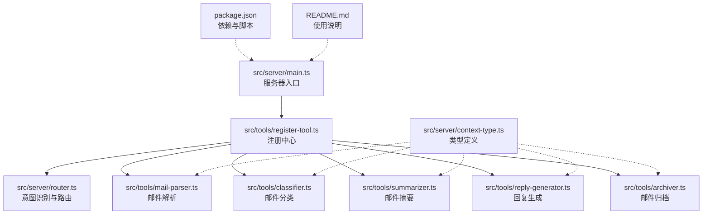
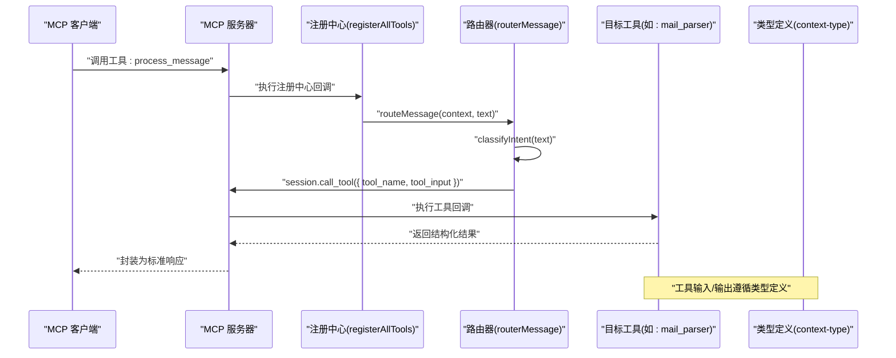
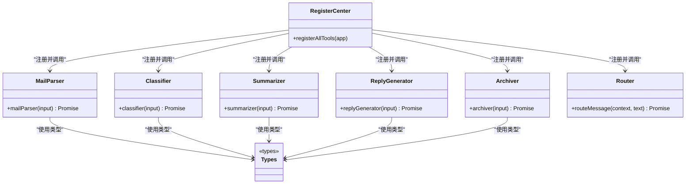
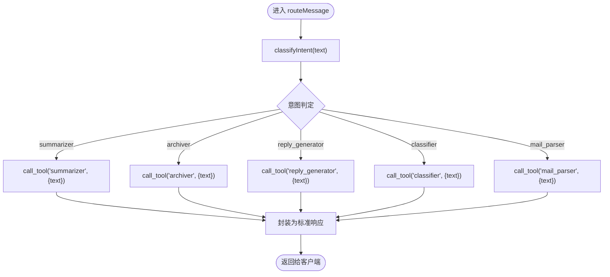
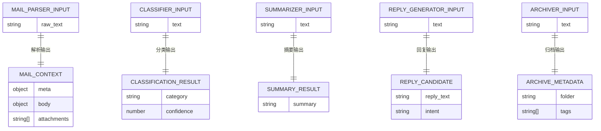
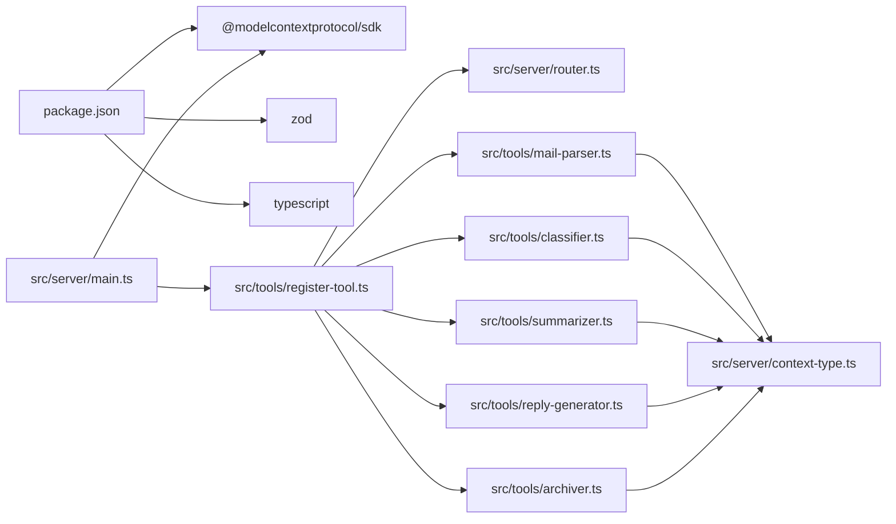

# 工具注册中心

<cite>
**本文引用的文件**
- [src/server/main.ts](file://src/server/main.ts)
- [src/tools/register-tool.ts](file://src/tools/register-tool.ts)
- [src/server/router.ts](file://src/server/router.ts)
- [src/server/context-type.ts](file://src/server/context-type.ts)
- [src/tools/mail-parser.ts](file://src/tools/mail-parser.ts)
- [src/tools/classifier.ts](file://src/tools/classifier.ts)
- [src/tools/summarizer.ts](file://src/tools/summarizer.ts)
- [src/tools/reply-generator.ts](file://src/tools/reply-generator.ts)
- [src/tools/archiver.ts](file://src/tools/archiver.ts)
- [package.json](file://package.json)
- [README.md](file://README.md)
</cite>

## 目录
1. [简介](#简介)
2. [项目结构](#项目结构)
3. [核心组件](#核心组件)
4. [架构总览](#架构总览)
5. [详细组件分析](#详细组件分析)
6. [依赖关系分析](#依赖关系分析)
7. [性能考虑](#性能考虑)
8. [故障排查指南](#故障排查指南)
9. [结论](#结论)
10. [附录](#附录)

## 简介
本项目是一个基于 MCP（Model Context Protocol）协议的消息路由与工具注册中心，负责：
- 在启动时集中注册多个工具（邮件解析、分类、摘要、回复生成、归档等）
- 通过意图识别将用户输入路由到对应工具
- 使用 Zod Schema 对工具输入进行强类型校验
- 提供清晰的生命周期管理与错误处理策略

该文档聚焦“工具注册中心”的设计与实现，重点剖析 registerAllTools 函数的架构、工具发现与注册流程、输入参数验证、工具回调实现、工具间依赖与调用链路，并给出扩展新工具的实践指南与调试技巧。

## 项目结构
项目采用按功能模块划分的目录组织方式，核心入口位于服务器侧，工具注册与具体工具实现分别位于 tools 与 server 目录中。

图表来源
- [src/server/main.ts:1-42](file://src/server/main.ts#L1-L42)
- [src/tools/register-tool.ts:1-186](file://src/tools/register-tool.ts#L1-L186)
- [src/server/router.ts:1-67](file://src/server/router.ts#L1-L67)
- [src/server/context-type.ts:1-101](file://src/server/context-type.ts#L1-L101)
- [src/tools/mail-parser.ts:1-37](file://src/tools/mail-parser.ts#L1-L37)
- [src/tools/classifier.ts:1-45](file://src/tools/classifier.ts#L1-L45)
- [src/tools/summarizer.ts:1-35](file://src/tools/summarizer.ts#L1-L35)
- [src/tools/reply-generator.ts:1-33](file://src/tools/reply-generator.ts#L1-L33)
- [src/tools/archiver.ts:1-32](file://src/tools/archiver.ts#L1-L32)
- [package.json:1-37](file://package.json#L1-L37)
- [README.md:1-131](file://README.md#L1-L131)

章节来源
- [src/server/main.ts:1-42](file://src/server/main.ts#L1-L42)
- [README.md:88-97](file://README.md#L88-L97)

## 核心组件
- 服务器入口：初始化 MCP 服务器、连接传输层、注册工具、保持进程运行。
- 注册中心：统一注册所有工具，提供描述信息、输入 Schema、回调函数。
- 路由器：根据用户输入进行意图识别，调用对应工具并封装返回。
- 工具集合：邮件解析、分类、摘要、回复生成、归档等独立工具模块。
- 类型系统：统一定义邮件上下文、分类、摘要、回复候选、归档元数据等类型。

章节来源
- [src/server/main.ts:1-42](file://src/server/main.ts#L1-L42)
- [src/tools/register-tool.ts:55-183](file://src/tools/register-tool.ts#L55-L183)
- [src/server/router.ts:24-63](file://src/server/router.ts#L24-L63)
- [src/server/context-type.ts:1-101](file://src/server/context-type.ts#L1-L101)

## 架构总览
下图展示了从服务器启动到工具执行的完整调用链路，以及工具注册中心与各工具模块之间的关系。

图表来源
- [src/server/main.ts:6-35](file://src/server/main.ts#L6-L35)
- [src/tools/register-tool.ts:55-71](file://src/tools/register-tool.ts#L55-L71)
- [src/server/router.ts:41-63](file://src/server/router.ts#L41-L63)
- [src/server/context-type.ts:1-101](file://src/server/context-type.ts#L1-L101)

## 详细组件分析

### 注册中心：registerAllTools 设计与实现
- 组件职责
  - 统一注册所有可用工具，提供描述信息与输入 Schema，绑定回调函数。
  - 通过 Zod Schema 实现输入参数的强类型校验，确保工具调用的安全性与一致性。
  - 将工具注册到 MCP 服务器实例上，供客户端调用。

- 工具注册流程
  - 逐个调用 app.registerTool(toolName, metadata, callback) 完成注册。
  - metadata 包含 description 与 inputSchema；callback 接收标准化输入并返回标准响应。
  - 每个工具的回调内部再调用对应工具模块的实现函数。

- 生命周期管理
  - 服务器启动时完成一次性注册；工具回调在每次被调用时执行。
  - 服务器通过 Stdio 传输层与客户端通信，保持进程常驻。

- 关键实现要点
  - 输入 Schema 使用 Zod 定义，保证参数合法性与文档化。
  - 工具回调返回值统一为包含 content 数组的标准结构。
  - 注册中心内嵌一个“消息处理”工具，用于接收用户输入并触发路由。

章节来源
- [src/tools/register-tool.ts:55-183](file://src/tools/register-tool.ts#L55-L183)
- [src/server/main.ts:19-20](file://src/server/main.ts#L19-L20)

#### registerAllTools 类图

图表来源
- [src/tools/register-tool.ts:55-183](file://src/tools/register-tool.ts#L55-L183)
- [src/tools/mail-parser.ts:23-36](file://src/tools/mail-parser.ts#L23-L36)
- [src/tools/classifier.ts:23-44](file://src/tools/classifier.ts#L23-L44)
- [src/tools/summarizer.ts:23-34](file://src/tools/summarizer.ts#L23-L34)
- [src/tools/reply-generator.ts:23-32](file://src/tools/reply-generator.ts#L23-L32)
- [src/tools/archiver.ts:23-31](file://src/tools/archiver.ts#L23-L31)
- [src/server/context-type.ts:1-101](file://src/server/context-type.ts#L1-L101)

### 意图识别与路由
- 功能概述
  - classifyIntent 根据关键词判断用户意图，返回对应工具名。
  - routeMessage 接收用户输入与上下文，调用 session.call_tool 并封装标准响应。

- 关键点
  - 通过 console.error 输出调试信息，便于在客户端日志中定位问题。
  - 路由器本身不执行业务逻辑，仅负责分发与封装。

章节来源
- [src/server/router.ts:24-63](file://src/server/router.ts#L24-L63)

#### 路由流程图

图表来源
- [src/server/router.ts:41-63](file://src/server/router.ts#L41-L63)

### 工具实现概览
- 邮件解析器：从原始文本提取元数据与正文，返回 MailContext。
- 邮件分类器：基于关键词匹配进行简单分类，返回 ClassificationResult。
- 邮件摘要器：截取前若干字符作为摘要，返回 SummaryResult。
- 回复生成器：生成标准确认回复，返回 ReplyCandidate。
- 邮件归档器：生成归档文件夹与标签建议，返回 ArchiveMetadata。

章节来源
- [src/tools/mail-parser.ts:1-37](file://src/tools/mail-parser.ts#L1-L37)
- [src/tools/classifier.ts:1-45](file://src/tools/classifier.ts#L1-L45)
- [src/tools/summarizer.ts:1-35](file://src/tools/summarizer.ts#L1-L35)
- [src/tools/reply-generator.ts:1-33](file://src/tools/reply-generator.ts#L1-L33)
- [src/tools/archiver.ts:1-32](file://src/tools/archiver.ts#L1-L32)

#### 工具输入/输出类型关系

图表来源
- [src/server/context-type.ts:47-100](file://src/server/context-type.ts#L47-L100)
- [src/tools/mail-parser.ts:23-36](file://src/tools/mail-parser.ts#L23-L36)
- [src/tools/classifier.ts:23-44](file://src/tools/classifier.ts#L23-L44)
- [src/tools/summarizer.ts:23-34](file://src/tools/summarizer.ts#L23-L34)
- [src/tools/reply-generator.ts:23-32](file://src/tools/reply-generator.ts#L23-L32)
- [src/tools/archiver.ts:23-31](file://src/tools/archiver.ts#L23-L31)

### 工具注册与回调实现细节
- 注册项示例（以“邮件解析器”为例）
  - 工具名：mail_parser
  - 描述：解析邮件内容，提取元数据和正文
  - 输入 Schema：raw_text 字符串
  - 回调：调用 mailParser，将结果序列化后放入 content 数组返回
- 其他工具同理，均遵循统一的输入/输出规范与 Schema 校验

章节来源
- [src/tools/register-tool.ts:73-93](file://src/tools/register-tool.ts#L73-L93)
- [src/tools/register-tool.ts:117-138](file://src/tools/register-tool.ts#L117-L138)
- [src/tools/register-tool.ts:140-160](file://src/tools/register-tool.ts#L140-L160)
- [src/tools/register-tool.ts:162-182](file://src/tools/register-tool.ts#L162-L182)

## 依赖关系分析
- 外部依赖
  - @modelcontextprotocol/sdk：MCP 服务器与传输层
  - zod：输入参数 Schema 校验
  - TypeScript：类型安全与编译
- 内部依赖
  - register-tool.ts 依赖各工具模块与 router.ts
  - 各工具模块依赖 server/context-type.ts 的类型定义
  - main.ts 依赖 register-tool.ts 与 @modelcontextprotocol/sdk

图表来源
- [package.json:25-30](file://package.json#L25-L30)
- [src/server/main.ts:1-3](file://src/server/main.ts#L1-L3)
- [src/tools/register-tool.ts:6-16](file://src/tools/register-tool.ts#L6-L16)
- [src/server/context-type.ts:1-101](file://src/server/context-type.ts#L1-L101)

章节来源
- [package.json:1-37](file://package.json#L1-L37)
- [src/server/main.ts:1-42](file://src/server/main.ts#L1-L42)
- [src/tools/register-tool.ts:1-186](file://src/tools/register-tool.ts#L1-L186)

## 性能考虑
- 工具回调均为异步函数，避免阻塞 MCP 服务器主线程。
- 输入 Schema 校验在回调入口处完成，减少无效调用带来的开销。
- 路由器仅做轻量级意图判断与分发，不引入复杂计算。
- 建议
  - 对耗时工具（如网络请求、大模型调用）应进一步异步化与缓存化。
  - 在工具内部对重复输入进行去重与缓存，降低重复计算成本。

## 故障排查指南
- 常见问题
  - 直接运行 dev 后无响应：MCP 服务器非交互式，需通过客户端（如 Claude Desktop）调用。
  - 工具未生效：检查是否在服务器启动时正确调用 registerAllTools。
  - 输入校验失败：确认客户端传入的参数名与类型与 Zod Schema 一致。
- 调试技巧
  - 利用 console.error 输出中间状态（如意图识别、路由判断、工具返回），在客户端日志中查看。
  - 在工具回调中打印输入参数与返回值，快速定位异常。
  - 使用最小化输入复现问题，逐步缩小范围。

章节来源
- [README.md:113-124](file://README.md#L113-L124)
- [src/server/router.ts:25-63](file://src/server/router.ts#L25-L63)
- [src/tools/register-tool.ts:128-129](file://src/tools/register-tool.ts#L128-L129)

## 结论
本工具注册中心通过统一的注册接口、严格的输入校验与清晰的路由分发，实现了可扩展、可维护的工具体系。registerAllTools 作为核心枢纽，将工具发现、注册、生命周期管理与错误处理有机整合，既满足当前五类工具的业务需求，也为后续扩展提供了稳定基座。

## 附录

### 工具扩展指南：新增一个工具
- 步骤
  1) 在 tools 目录新增工具模块，导出异步函数与输入/输出类型定义。
  2) 在 register-tool.ts 中导入该模块，并调用 app.registerTool 注册。
  3) 在 router.ts 中完善 classifyIntent，使新工具可被路由命中。
  4) 在 context-type.ts 中补充必要的类型定义（如需）。
  5) 在 main.ts 启动时确保 registerAllTools 已被调用。
- 注意事项
  - 输入 Schema 必须与工具函数签名一致，避免运行时报错。
  - 工具回调返回值必须包含 content 数组，元素为文本内容对象。
  - 为工具编写简短描述与字段说明，提升可读性与可维护性。

章节来源
- [src/tools/register-tool.ts:55-183](file://src/tools/register-tool.ts#L55-L183)
- [src/server/router.ts:24-38](file://src/server/router.ts#L24-L38)
- [src/server/context-type.ts:1-101](file://src/server/context-type.ts#L1-L101)
- [src/server/main.ts:19-20](file://src/server/main.ts#L19-L20)