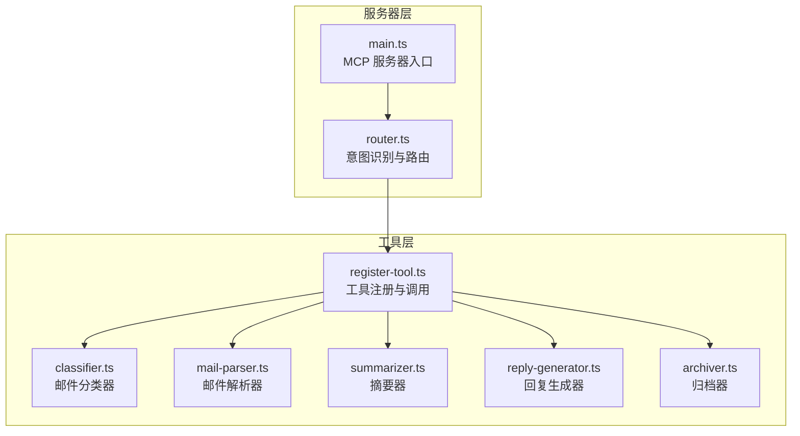
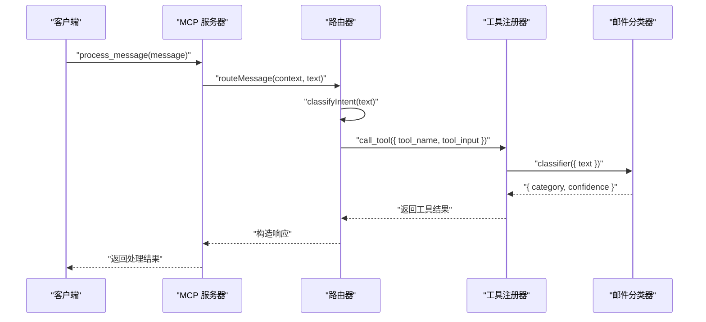
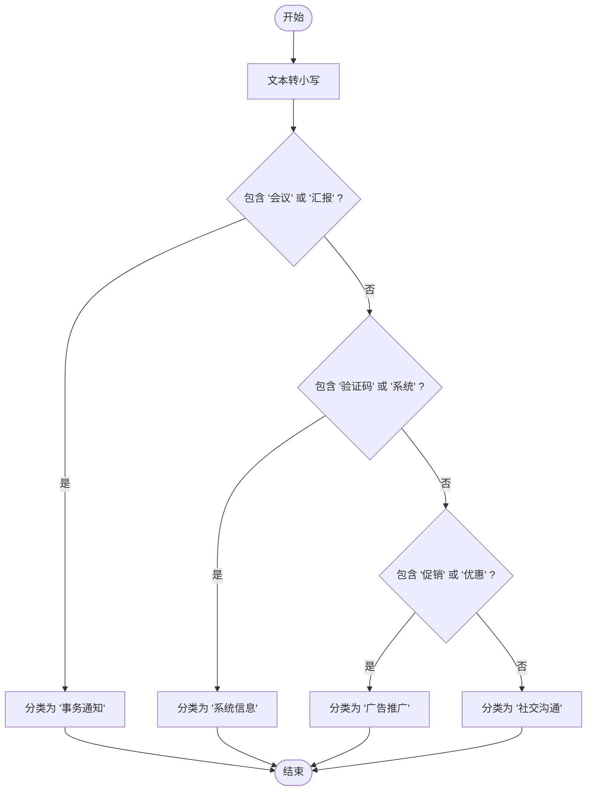
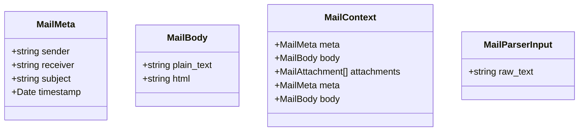
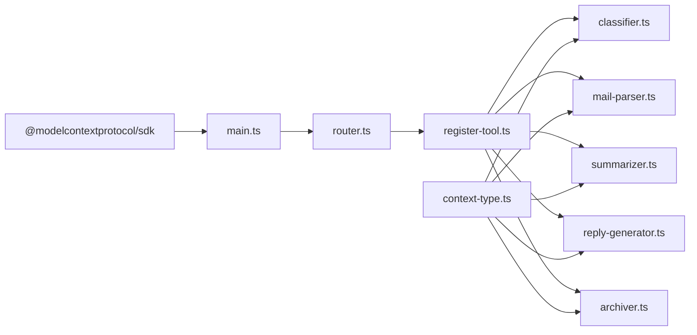

# 邮件分类器

<cite>
**本文引用的文件**
- [src/server/main.ts](file://src/server/main.ts)
- [src/server/router.ts](file://src/server/router.ts)
- [src/server/context-type.ts](file://src/server/context-type.ts)
- [src/tools/register-tool.ts](file://src/tools/register-tool.ts)
- [src/tools/classifier.ts](file://src/tools/classifier.ts)
- [src/tools/mail-parser.ts](file://src/tools/mail-parser.ts)
- [src/tools/summarizer.ts](file://src/tools/summarizer.ts)
- [src/tools/reply-generator.ts](file://src/tools/reply-generator.ts)
- [src/tools/archiver.ts](file://src/tools/archiver.ts)
- [README.md](file://README.md)
- [package.json](file://package.json)
</cite>

## 目录
1. [简介](#简介)
2. [项目结构](#项目结构)
3. [核心组件](#核心组件)
4. [架构总览](#架构总览)
5. [详细组件分析](#详细组件分析)
6. [依赖关系分析](#依赖关系分析)
7. [性能考量](#性能考量)
8. [故障排查指南](#故障排查指南)
9. [结论](#结论)
10. [附录](#附录)

## 简介
本项目是一个基于 MCP（Model Context Protocol）协议的消息路由与工具服务器，支持对用户输入进行意图识别与任务分发。其中“邮件分类器”是该系统中的一个工具，负责对邮件文本进行分类，当前采用基于关键词匹配的规则引擎实现，将邮件分为四类：事务通知、系统信息、广告推广、社交沟通。该项目还提供了邮件解析、摘要生成、回复建议、归档建议等配套工具，形成一套完整的邮件处理工具链。

## 项目结构
项目采用按功能模块划分的组织方式，核心目录如下：
- src/server：MCP 服务器主入口与路由逻辑
- src/tools：各类工具实现（分类器、解析器、摘要器、回复生成器、归档器）
- 根目录：README 文档与构建配置

图表来源
- [src/server/main.ts:1-42](file://src/server/main.ts#L1-L42)
- [src/server/router.ts:1-67](file://src/server/router.ts#L1-L67)
- [src/tools/register-tool.ts:1-186](file://src/tools/register-tool.ts#L1-L186)
- [src/tools/classifier.ts:1-45](file://src/tools/classifier.ts#L1-L45)
- [src/tools/mail-parser.ts:1-37](file://src/tools/mail-parser.ts#L1-L37)
- [src/tools/summarizer.ts:1-35](file://src/tools/summarizer.ts#L1-L35)
- [src/tools/reply-generator.ts:1-33](file://src/tools/reply-generator.ts#L1-L33)
- [src/tools/archiver.ts:1-32](file://src/tools/archiver.ts#L1-L32)

章节来源
- [README.md:88-97](file://README.md#L88-L97)
- [package.json:10-15](file://package.json#L10-L15)

## 核心组件
- 邮件分类器（classifier）：基于关键词匹配的规则引擎，将输入文本映射到四类之一，并给出固定置信度。
- 邮件解析器（mail-parser）：将原始邮件文本解析为结构化的邮件上下文（元数据、正文等），当前为伪实现，可扩展为正则或结构化解析。
- 摘要器（summarizer）：对文本进行截断摘要，超过长度阈值时添加省略号。
- 回复生成器（reply-generator）：生成标准确认回复及意图标签。
- 归档器（archiver）：为邮件生成归档文件夹与标签建议。
- 路由器（router）：根据用户输入识别意图，动态调用对应工具。
- 工具注册器（register-tool）：在 MCP 服务器上注册上述工具，并定义输入参数与描述。
- 上下文类型定义（context-type）：统一定义邮件上下文、分类结果、摘要结果、回复候选、归档元数据等结构。

章节来源
- [src/tools/classifier.ts:16-44](file://src/tools/classifier.ts#L16-L44)
- [src/tools/mail-parser.ts:16-36](file://src/tools/mail-parser.ts#L16-L36)
- [src/tools/summarizer.ts:16-34](file://src/tools/summarizer.ts#L16-L34)
- [src/tools/reply-generator.ts:16-32](file://src/tools/reply-generator.ts#L16-L32)
- [src/tools/archiver.ts:16-31](file://src/tools/archiver.ts#L16-L31)
- [src/server/router.ts:24-63](file://src/server/router.ts#L24-L63)
- [src/tools/register-tool.ts:55-183](file://src/tools/register-tool.ts#L55-L183)
- [src/server/context-type.ts:8-101](file://src/server/context-type.ts#L8-L101)

## 架构总览
系统以 MCP 服务器为核心，通过 stdio 与客户端（如 Claude Desktop）通信。用户输入经由路由器进行意图识别，随后调用相应工具执行具体任务。分类器作为工具之一，接收文本输入，返回分类结果与置信度。

图表来源
- [src/server/main.ts:6-35](file://src/server/main.ts#L6-L35)
- [src/server/router.ts:40-63](file://src/server/router.ts#L40-L63)
- [src/tools/register-tool.ts:37-53](file://src/tools/register-tool.ts#L37-L53)
- [src/tools/classifier.ts:23-44](file://src/tools/classifier.ts#L23-L44)

## 详细组件分析

### 邮件分类器（规则引擎）
- 实现原理
  - 将输入文本转为小写后进行关键词匹配。
  - 匹配规则：
    - 包含“会议”或“汇报” → 事务通知
    - 包含“验证码”或“系统” → 系统信息
    - 包含“促销”或“优惠” → 广告推广
    - 其他 → 社交沟通
  - 返回固定置信度（0.9）。

- 数据结构与复杂度
  - 时间复杂度：O(n)，n 为关键词数量；每次匹配为 O(m)（m 为文本长度），整体近似 O(k·m)。
  - 空间复杂度：O(1)（不考虑输入存储）。

- 错误处理与边界情况
  - 不区分大小写，避免大小写导致的误判。
  - 关键词覆盖不足时可能出现误判，建议通过多关键词组合与优先级调整提升鲁棒性。

- 可扩展性
  - 可替换为基于机器学习的分类模型（例如使用 LangChain 或本地模型），以提高准确性。
  - 可引入停用词过滤、词干提取、TF-IDF 或词向量相似度等特征工程。

图表来源
- [src/tools/classifier.ts:23-44](file://src/tools/classifier.ts#L23-L44)

章节来源
- [src/tools/classifier.ts:16-44](file://src/tools/classifier.ts#L16-L44)

### 邮件解析器（mail-parser）
- 功能概述
  - 将原始邮件文本解析为结构化上下文，包含元数据（发件人、收件人、主题、时间戳）与正文（纯文本/HTML）。
  - 当前为伪实现，返回固定示例数据，便于演示与后续扩展。

- 可扩展方向
  - 引入正则表达式提取邮件头字段（Subject、From、To、Date）。
  - 解析 MIME 结构，提取 HTML 正文与附件信息。
  - 结合自然语言处理提取关键实体（如会议主题、验证码数字等）。

图表来源
- [src/server/context-type.ts:11-54](file://src/server/context-type.ts#L11-L54)
- [src/tools/mail-parser.ts:11-36](file://src/tools/mail-parser.ts#L11-L36)

章节来源
- [src/server/context-type.ts:8-54](file://src/server/context-type.ts#L8-L54)
- [src/tools/mail-parser.ts:16-36](file://src/tools/mail-parser.ts#L16-L36)

### 摘要器（summarizer）
- 功能概述
  - 截取文本前 60 字符作为摘要，超出部分添加省略号。
  - 返回结构化摘要结果。

- 复杂度
  - 时间复杂度：O(n)，n 为截取长度。
  - 空间复杂度：O(n)（返回字符串）。

章节来源
- [src/tools/summarizer.ts:16-34](file://src/tools/summarizer.ts#L16-L34)

### 回复生成器（reply-generator）
- 功能概述
  - 生成标准确认回复文本与意图标签（如“确认”）。
  - 可扩展为基于模板与上下文的动态回复生成。

章节来源
- [src/tools/reply-generator.ts:16-32](file://src/tools/reply-generator.ts#L16-L32)

### 归档器（archiver）
- 功能概述
  - 为邮件生成归档文件夹名称与标签建议（如“事务归档”、“项目”、“总结”、“处理完毕”）。
  - 可结合分类结果与正文内容动态生成更合理的归档策略。

章节来源
- [src/tools/archiver.ts:16-31](file://src/tools/archiver.ts#L16-L31)

### 路由器（router）
- 功能概述
  - 基于关键词识别用户意图，将输入路由到对应工具：
    - “总结/概括” → summarizer
    - “归档/标签” → archiver
    - “回复/答复” → reply_generator
    - “分类/是什么类型” → classifier
    - 其他 → mail_parser
  - 调用工具后封装为标准响应结构。

- 日志与调试
  - 在关键节点输出日志，便于定位问题与验证流程。

章节来源
- [src/server/router.ts:24-63](file://src/server/router.ts#L24-L63)

### 工具注册器（register-tool）
- 功能概述
  - 在 MCP 服务器上注册多个工具，定义输入参数与描述。
  - 提供统一的工具调用接口，支持 process_message、mail_parser、classifier、summarizer、reply_generator、archiver 等。

- 输入参数与描述
  - 每个工具均使用 Zod 定义输入 Schema，确保参数校验与文档化。

章节来源
- [src/tools/register-tool.ts:55-183](file://src/tools/register-tool.ts#L55-L183)

## 依赖关系分析
- 服务器层依赖 MCP SDK 与 stdio 传输层，负责与客户端建立连接并分发消息。
- 工具层通过注册器集中管理，统一暴露给路由器调用。
- 上下文类型定义贯穿各模块，保证数据结构一致性。

图表来源
- [src/server/main.ts:1-35](file://src/server/main.ts#L1-L35)
- [src/server/router.ts:1-67](file://src/server/router.ts#L1-L67)
- [src/tools/register-tool.ts:1-186](file://src/tools/register-tool.ts#L1-L186)
- [src/server/context-type.ts:1-101](file://src/server/context-type.ts#L1-L101)

章节来源
- [package.json:25-30](file://package.json#L25-L30)

## 性能考量
- 规则引擎的关键词匹配为线性扫描，适合中小规模文本；对于大规模邮件流，建议：
  - 缓存常见关键词集合，减少重复构建。
  - 使用前缀树（Trie）或正则预编译优化匹配性能。
  - 引入并行处理与批量化，降低延迟。
- 置信度固定为 0.9，若后续接入机器学习模型，应提供概率分布与置信区间估计，便于动态阈值调整。
- 日志输出到 stderr，建议在生产环境中配合日志聚合系统进行监控与分析。

## 故障排查指南
- 服务器未响应
  - 确认 MCP 客户端（如 Claude Desktop）正确配置并连接。
  - 查看 stderr 日志，关注“系统已启动”提示与路由日志。
- 分类结果不符合预期
  - 检查输入文本是否包含预期关键词，或尝试增加更多关键词以覆盖更多场景。
  - 若关键词不足，考虑引入机器学习模型或特征工程。
- 工具调用失败
  - 确认工具名称与输入参数一致，参考注册器中的描述与 Schema。
  - 检查路由器的意图识别逻辑，必要时扩展关键词集。
- 解析器返回固定示例
  - 当前为伪实现，需扩展正则或结构化解析逻辑，以适配真实邮件格式。

章节来源
- [README.md:111-124](file://README.md#L111-L124)
- [src/server/router.ts:24-38](file://src/server/router.ts#L24-L38)
- [src/tools/register-tool.ts:55-183](file://src/tools/register-tool.ts#L55-L183)
- [src/tools/mail-parser.ts:23-36](file://src/tools/mail-parser.ts#L23-L36)

## 结论
本项目提供了一个可扩展的邮件处理工具链，其中邮件分类器采用简单而高效的规则引擎实现，满足基础分类需求。随着业务复杂度提升，建议逐步引入机器学习模型与特征工程，同时完善训练数据收集、评估指标与持续更新机制，以提升分类准确性与稳定性。配套工具（解析、摘要、回复、归档）可进一步增强自动化能力，形成完整的邮件智能处理体系。

## 附录

### 分类类别定义与判断逻辑
- 事务通知：包含“会议”或“汇报”
- 系统信息：包含“验证码”或“系统”
- 广告推广：包含“促销”或“优惠”
- 社交沟通：默认类别

章节来源
- [src/tools/classifier.ts:30-38](file://src/tools/classifier.ts#L30-L38)

### 训练数据要求与更新机制（建议）
- 训练数据要求
  - 多样化样本：覆盖不同语言风格、邮件来源与主题。
  - 标注质量：确保每条样本的类别标注准确且一致。
  - 关键词扩展：收集高频关键词与短语，构建关键词库。
- 更新机制
  - 定期评估：使用准确率、召回率、F1 分数等指标评估模型性能。
  - 在线学习：对误分类样本进行人工校正并回流训练。
  - A/B 测试：对比规则引擎与机器学习模型的效果，择优部署。

### 分类准确性评估方法（建议）
- 指标选择：准确率、精确率、召回率、F1 分数、混淆矩阵。
- 数据集划分：训练集、验证集、测试集，避免数据泄露。
- 交叉验证：K 折交叉验证以稳定评估结果。
- 混淆分析：针对误分类样本进行根因分析，优化关键词与规则。

### 分类错误诊断与修正方法（建议）
- 误判案例收集：记录“社交沟通”被误判为其他类别的邮件。
- 关键词补全：根据误判样本补充关键词，提升覆盖率。
- 规则细化：引入优先级与互斥规则，避免冲突。
- 模型替代：当规则引擎无法满足需求时，引入轻量级模型进行替代。