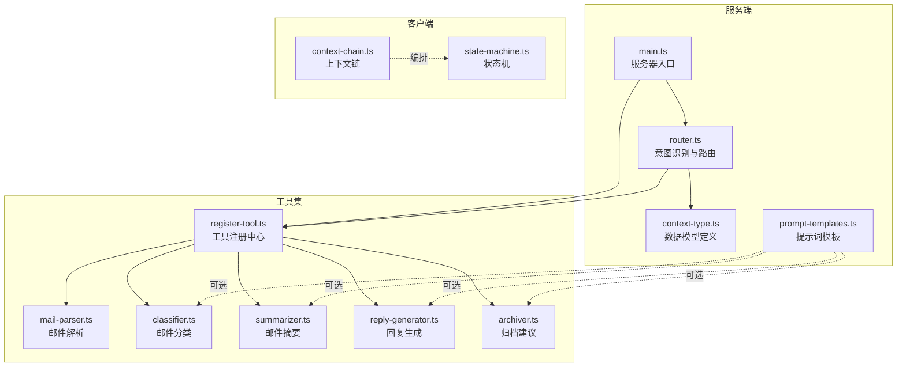
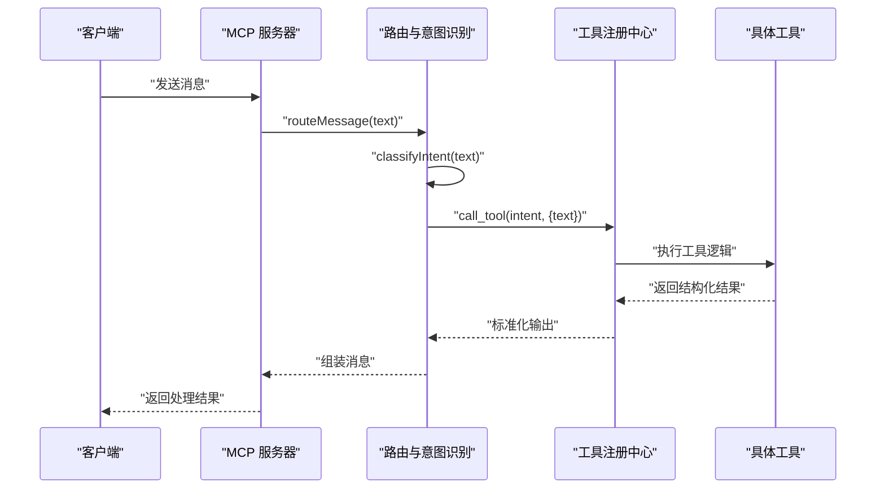
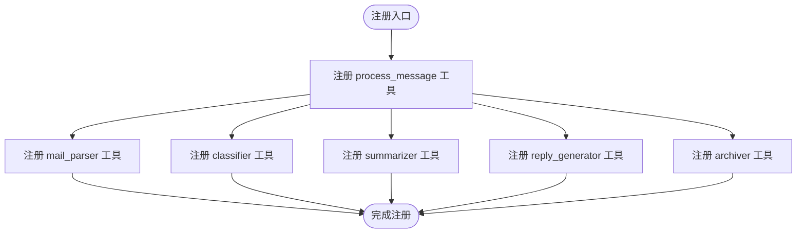
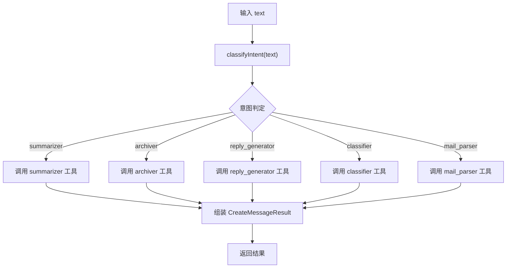
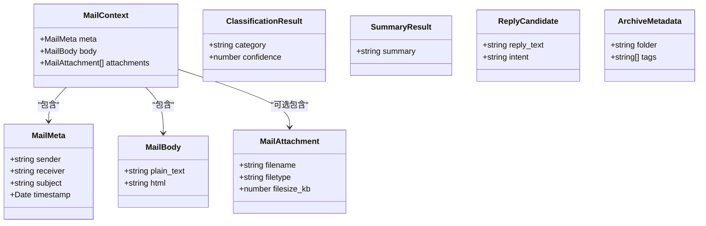
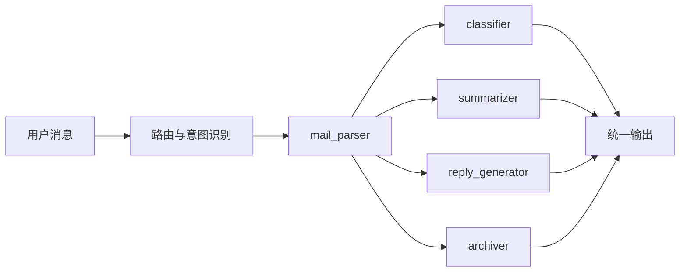
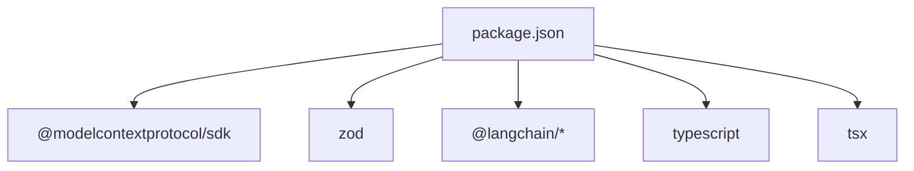

# 邮件处理工具集

<cite>
**本文引用的文件**
- [register-tool.ts](file://src/tools/register-tool.ts)
- [mail-parser.ts](file://src/tools/mail-parser.ts)
- [classifier.ts](file://src/tools/classifier.ts)
- [summarizer.ts](file://src/tools/summarizer.ts)
- [reply-generator.ts](file://src/tools/reply-generator.ts)
- [archiver.ts](file://src/tools/archiver.ts)
- [router.ts](file://src/server/router.ts)
- [context-type.ts](file://src/server/context-type.ts)
- [main.ts](file://src/server/main.ts)
- [prompt-templates.ts](file://src/server/prompt-templates.ts)
- [context-chain.ts](file://src/client/context-chain.ts)
- [state-machine.ts](file://src/client/state-machine.ts)
- [package.json](file://package.json)
- [README.md](file://README.md)
</cite>

## 目录
1. [简介](#简介)
2. [项目结构](#项目结构)
3. [核心组件](#核心组件)
4. [架构总览](#架构总览)
5. [详细组件分析](#详细组件分析)
6. [依赖分析](#依赖分析)
7. [性能考虑](#性能考虑)
8. [故障排查指南](#故障排查指南)
9. [结论](#结论)
10. [附录](#附录)

## 简介
本项目是一个基于 MCP（Model Context Protocol）协议的消息路由与邮件处理工具集。其核心目标是通过“意图识别 + 工具分发”的方式，将用户的自然语言指令转化为具体的邮件处理动作，如解析、分类、摘要、回复生成与归档建议等。系统采用模块化的工具注册中心设计，支持工具的动态发现、加载与生命周期管理；同时提供清晰的工具 API 规范、参数校验与错误处理策略，便于扩展新的邮件处理工具。

## 项目结构
项目采用按功能域划分的目录组织方式，核心目录与职责如下：
- src/server：服务端入口与路由逻辑，负责 MCP 服务器初始化、工具注册与消息路由
- src/tools：具体工具实现，每个工具独立封装，统一通过注册中心集中暴露
- src/client：可选的客户端侧状态机与上下文链，用于演示多步流程编排
- 根目录：构建脚本、依赖声明与使用说明

图表来源
- [main.ts:1-42](file://src/server/main.ts#L1-L42)
- [register-tool.ts:1-186](file://src/tools/register-tool.ts#L1-L186)
- [router.ts:1-67](file://src/server/router.ts#L1-L67)
- [context-type.ts:1-101](file://src/server/context-type.ts#L1-L101)
- [prompt-templates.ts:1-66](file://src/server/prompt-templates.ts#L1-L66)
- [context-chain.ts:1-35](file://src/client/context-chain.ts#L1-L35)
- [state-machine.ts:1-43](file://src/client/state-machine.ts#L1-L43)

章节来源
- [README.md:88-97](file://README.md#L88-L97)
- [package.json:1-37](file://package.json#L1-L37)

## 核心组件
- 工具注册中心：集中注册与暴露所有工具，提供统一的输入参数校验（Zod）、输出格式标准化与生命周期钩子（可扩展）
- 意图识别与路由：根据用户输入识别任务意图，将请求转发至对应工具执行
- 工具实现：每个工具独立实现，遵循统一的数据模型与返回格式
- 客户端编排（可选）：通过上下文链与状态机实现多步流程的中间态保存与恢复

章节来源
- [register-tool.ts:55-183](file://src/tools/register-tool.ts#L55-L183)
- [router.ts:24-63](file://src/server/router.ts#L24-L63)
- [context-chain.ts:1-35](file://src/client/context-chain.ts#L1-L35)
- [state-machine.ts:1-43](file://src/client/state-machine.ts#L1-L43)

## 架构总览
系统以 MCP 服务器为核心，通过 stdio 与客户端（如 Claude Desktop）通信。客户端发送消息后，服务器先进行意图识别，再将请求分发给具体工具执行，最终将结果以统一格式返回。

图表来源
- [main.ts:6-35](file://src/server/main.ts#L6-L35)
- [router.ts:41-63](file://src/server/router.ts#L41-L63)
- [register-tool.ts:38-53](file://src/tools/register-tool.ts#L38-L53)

## 详细组件分析

### 工具注册中心（register-tool.ts）
- 设计要点
  - 统一注册：通过 registerTool 将各工具以名称、描述与输入模式暴露给 MCP 客户端
  - 参数校验：使用 Zod 对输入进行严格校验，确保工具调用的健壮性
  - 生命周期：提供工具调用的包装函数，便于未来接入日志、缓存、重试等横切能力
  - 结果标准化：统一将工具输出封装为文本内容，便于上层路由与客户端展示
- 关键流程
  - process_message：对外暴露的入口工具，负责接收用户消息并触发路由
  - 各工具注册：mail_parser、classifier、summarizer、reply_generator、archiver
- 错误处理
  - 当前实现未显式抛错，工具内部异常将导致调用失败；建议在工具包装层增加 try/catch 并返回结构化错误

图表来源
- [register-tool.ts:55-183](file://src/tools/register-tool.ts#L55-L183)

章节来源
- [register-tool.ts:55-183](file://src/tools/register-tool.ts#L55-L183)

### 意图识别与路由（router.ts）
- 功能特性
  - 基于关键词的简易意图识别，覆盖“总结/概括”、“归档/标签”、“回复/答复”、“分类/是什么类型”、“默认解析”
  - 将识别出的意图映射为工具名，并通过 session.call_tool 调用对应工具
  - 统一输出格式，包含角色、内容、模型与停止原因
- 输入参数
  - text：用户输入的自然语言文本
- 输出格式
  - CreateMessageResult：标准化消息结构，content 为文本内容
- 使用场景
  - 将自然语言指令转换为具体工具调用，降低前端复杂度

图表来源
- [router.ts:24-63](file://src/server/router.ts#L24-L63)

章节来源
- [router.ts:24-63](file://src/server/router.ts#L24-L63)

### 数据模型与类型（context-type.ts）
- 邮件上下文（MailContext）
  - 元数据（sender、receiver、subject、timestamp）
  - 正文（plain_text、html）
  - 附件（可选）
- 分类结果（ClassificationResult）
  - category：邮件类别
  - confidence：置信度
- 摘要结果（SummaryResult）
  - summary：摘要文本
- 回复建议（ReplyCandidate）
  - reply_text：建议回复
  - intent：意图类型（可选）
- 归档元数据（ArchiveMetadata）
  - folder：归档文件夹
  - tags：标签数组

图表来源
- [context-type.ts:11-100](file://src/server/context-type.ts#L11-L100)

章节来源
- [context-type.ts:11-100](file://src/server/context-type.ts#L11-L100)

### 工具 API 规范与实现

#### 邮件解析器（mail-parser.ts）
- 功能特性
  - 将原始邮件文本解析为结构化邮件上下文
  - 提供元数据与正文字段，便于下游工具使用
- 输入参数
  - raw_text：原始邮件文本
- 输出格式
  - MailContext：包含 meta 与 body
- 使用场景
  - 作为邮件处理流水线的起点，为分类、摘要、回复与归档提供基础数据

章节来源
- [mail-parser.ts:23-36](file://src/tools/mail-parser.ts#L23-L36)

#### 邮件分类器（classifier.ts）
- 功能特性
  - 基于关键词匹配进行简单分类
  - 支持“事务通知、系统信息、广告推广、社交沟通”
- 输入参数
  - text：待分类的邮件文本
- 输出格式
  - ClassificationResult：category 与 confidence
- 使用场景
  - 自动化邮件分类与后续流程选择

章节来源
- [classifier.ts:23-44](file://src/tools/classifier.ts#L23-L44)

#### 邮件摘要器（summarizer.ts）
- 功能特性
  - 截取前若干字符作为摘要，超过长度时添加省略号
- 输入参数
  - text：待摘要的邮件文本
- 输出格式
  - SummaryResult：summary
- 使用场景
  - 快速概览邮件内容，辅助决策与归档

章节来源
- [summarizer.ts:23-34](file://src/tools/summarizer.ts#L23-L34)

#### 回复生成器（reply-generator.ts）
- 功能特性
  - 生成标准的确认回复语句
- 输入参数
  - text：待回复的邮件文本
- 输出格式
  - ReplyCandidate：reply_text 与 intent
- 使用场景
  - 自动生成礼貌且正式的确认回复

章节来源
- [reply-generator.ts:23-32](file://src/tools/reply-generator.ts#L23-L32)

#### 邮件归档器（archiver.ts）
- 功能特性
  - 生成归档文件夹与标签建议
- 输入参数
  - text：待归档的邮件文本
- 输出格式
  - ArchiveMetadata：folder 与 tags
- 使用场景
  - 辅助用户建立邮件归档体系，提升检索效率

章节来源
- [archiver.ts:23-31](file://src/tools/archiver.ts#L23-L31)

### 工具间协作与数据流转
- 流程概述
  - 客户端发送消息 → 服务器路由 → 意图识别 → 工具执行 → 结果返回
- 数据流
  - mail_parser 产出 MailContext，供 classifier、summarizer、reply_generator、archiver 使用
  - 各工具输出标准化文本，由路由统一组装为消息返回
- 状态与上下文（可选）
  - 客户端侧可通过上下文链保存每一步结果，状态机驱动流程推进

图表来源
- [router.ts:41-63](file://src/server/router.ts#L41-L63)
- [register-tool.ts:82-181](file://src/tools/register-tool.ts#L82-L181)

## 依赖分析
- 运行时依赖
  - @modelcontextprotocol/sdk：MCP 协议实现与服务器框架
  - zod：参数校验
  - @langchain/*：可选的提示词模板与链路编排（当前工具实现未直接使用）
- 开发依赖
  - typescript、tsx：开发与热重载
- 项目脚本
  - dev：开发模式（带 inspector）
  - start/build/watch：构建与监听

图表来源
- [package.json:25-35](file://package.json#L25-L35)

章节来源
- [package.json:10-15](file://package.json#L10-L15)
- [package.json:25-35](file://package.json#L25-L35)

## 性能考虑
- 工具执行
  - 当前工具均为同步/异步轻量计算，建议在工具包装层引入超时控制与并发限制
- 参数校验
  - 使用 Zod 在入口处快速失败，减少无效调用成本
- 日志与可观测性
  - 利用服务器日志输出关键节点（意图识别、工具调用、结果组装），便于定位性能瓶颈
- 扩展建议
  - 对高频工具引入本地缓存（如基于输入指纹的 KV 缓存）
  - 对长文本处理工具（如摘要、分类）考虑分块与增量处理策略

## 故障排查指南
- 服务器无法启动
  - 检查 MCP 服务器初始化与 stdio 传输层连接是否成功
  - 查看 stderr 输出的错误信息
- 工具无响应
  - 确认客户端已正确配置 MCP 服务器（命令、参数、工作目录）
  - 在路由与工具调用处增加日志，确认意图识别与工具名映射是否正确
- 参数校验失败
  - 检查客户端传入的参数是否满足 Zod schema
  - 在注册中心包装层捕获并返回结构化错误信息
- 结果格式异常
  - 确保工具返回内容符合统一格式（文本内容数组）

章节来源
- [main.ts:25-34](file://src/server/main.ts#L25-L34)
- [register-tool.ts:65-71](file://src/tools/register-tool.ts#L65-L71)
- [README.md:111-124](file://README.md#L111-L124)

## 结论
本项目通过“意图识别 + 工具注册中心”的架构，实现了邮件处理工具的模块化与可扩展性。工具 API 规范明确、参数校验严谨、输出格式统一，便于在 MCP 生态中与其他客户端集成。建议在未来增强工具包装层的错误处理、可观测性与缓存策略，以进一步提升稳定性与性能。

## 附录

### 工具扩展指南
- 新增工具步骤
  - 在 tools 目录新增工具文件，导出异步函数与输入/输出类型
  - 在注册中心中通过 registerTool 注册工具，定义描述与输入 schema
  - 在路由中为新意图添加识别规则（如需）
  - 在客户端侧（如需）更新状态机与上下文链以承载新步骤
- 最佳实践
  - 输入参数使用 Zod 明确约束，输出统一为文本内容
  - 工具内部处理异常时，向上抛出或在包装层捕获并返回结构化错误
  - 对长耗时操作引入超时与重试策略

章节来源
- [register-tool.ts:55-183](file://src/tools/register-tool.ts#L55-L183)
- [router.ts:24-38](file://src/server/router.ts#L24-L38)
- [context-type.ts:11-100](file://src/server/context-type.ts#L11-L100)

### 客户端编排示例（可选）
- 上下文链：保存每一步的中间结果，支持快照与恢复
- 状态机：驱动流程从解析到归档的顺序推进，避免状态错乱

章节来源
- [context-chain.ts:1-35](file://src/client/context-chain.ts#L1-L35)
- [state-machine.ts:1-43](file://src/client/state-machine.ts#L1-L43)