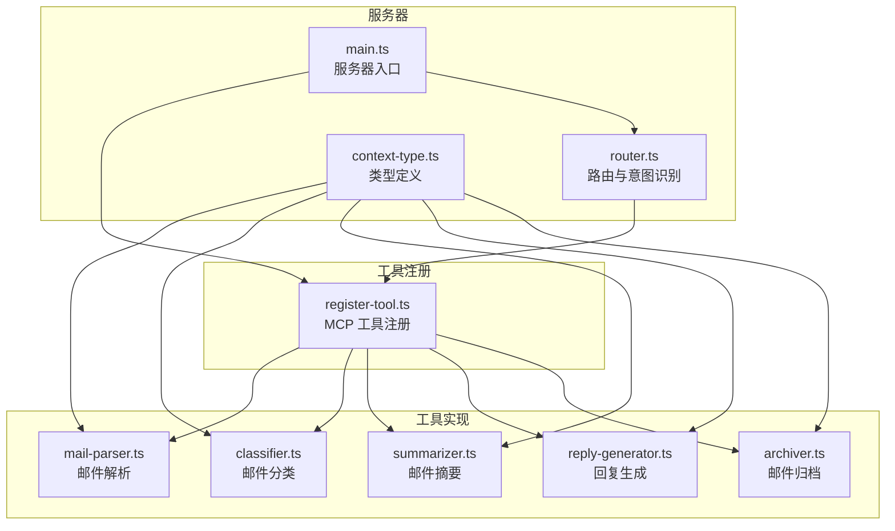
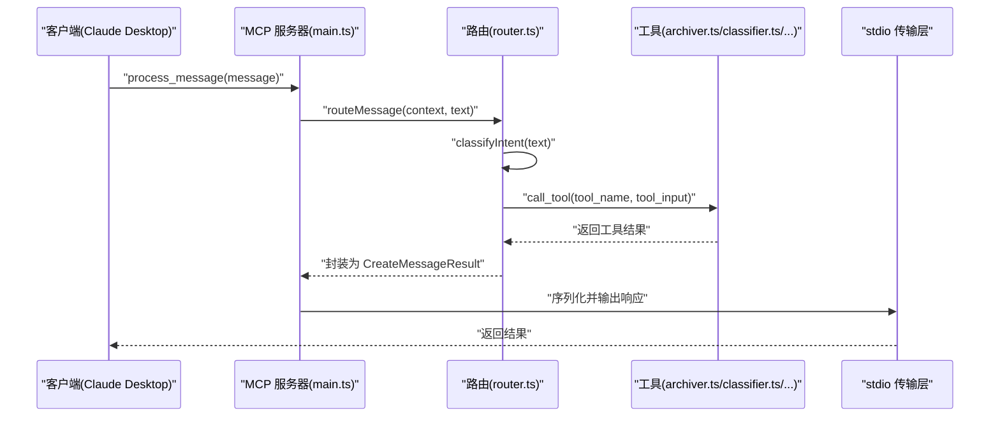
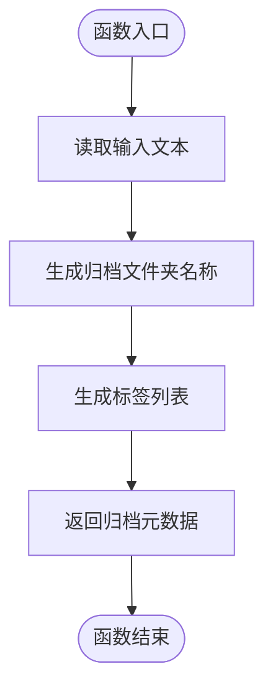
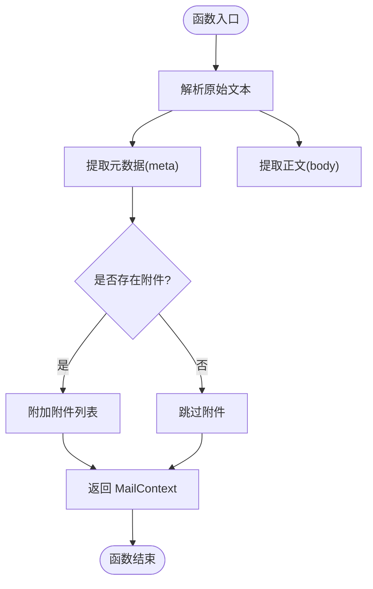
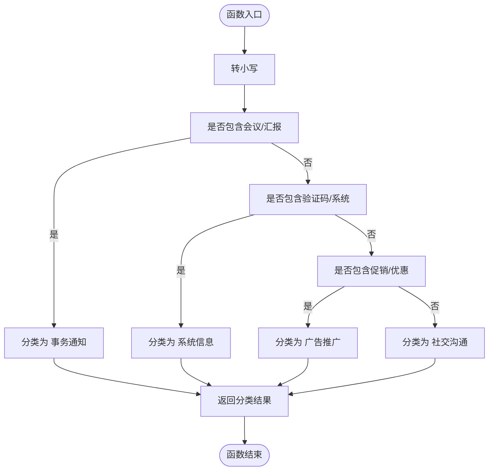
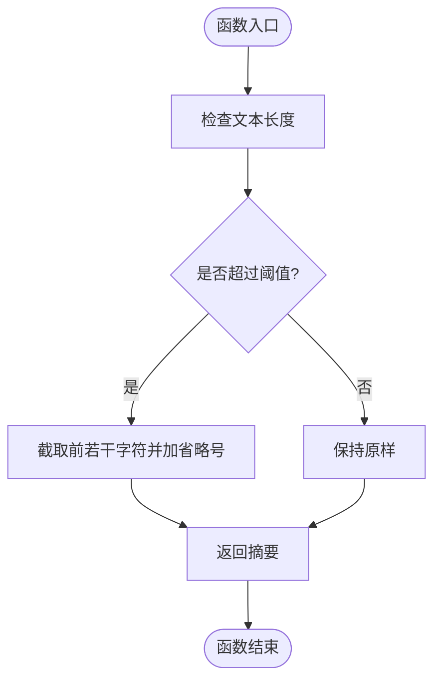
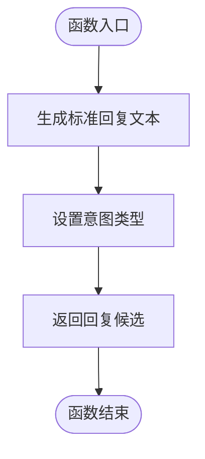
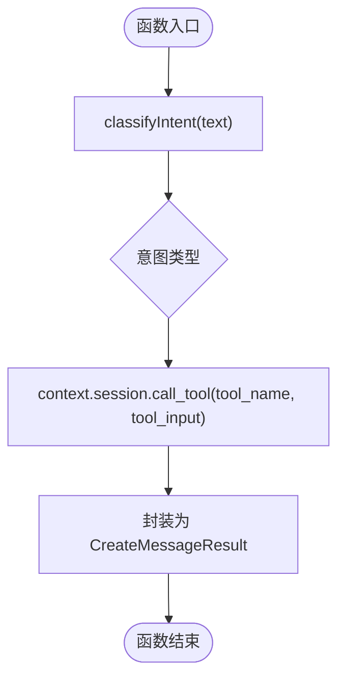
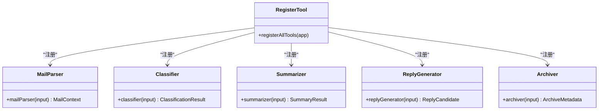
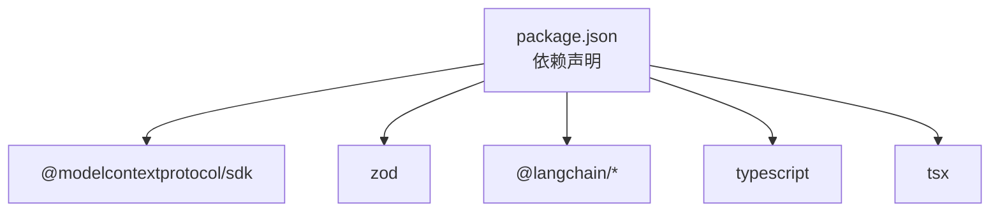

# 邮件归档器

<cite>
**本文引用的文件**
- [src/server/main.ts](file://src/server/main.ts)
- [src/server/router.ts](file://src/server/router.ts)
- [src/server/context-type.ts](file://src/server/context-type.ts)
- [src/tools/register-tool.ts](file://src/tools/register-tool.ts)
- [src/tools/archiver.ts](file://src/tools/archiver.ts)
- [src/tools/classifier.ts](file://src/tools/classifier.ts)
- [src/tools/mail-parser.ts](file://src/tools/mail-parser.ts)
- [src/tools/summarizer.ts](file://src/tools/summarizer.ts)
- [src/tools/reply-generator.ts](file://src/tools/reply-generator.ts)
- [README.md](file://README.md)
- [package.json](file://package.json)
</cite>

## 目录
1. [简介](#简介)
2. [项目结构](#项目结构)
3. [核心组件](#核心组件)
4. [架构总览](#架构总览)
5. [详细组件分析](#详细组件分析)
6. [依赖关系分析](#依赖关系分析)
7. [性能考虑](#性能考虑)
8. [故障排除指南](#故障排除指南)
9. [结论](#结论)
10. [附录](#附录)

## 简介
本项目是一个基于 MCP（Model Context Protocol）协议的邮件处理工具集，围绕“邮件归档器”为核心能力，提供邮件解析、分类、摘要、回复生成以及归档建议等工具。归档器负责为邮件生成归档文件夹名称与标签建议，便于后续自动化归档与检索。该工具集通过路由模块识别用户意图，将请求分发至对应工具执行，并通过 MCP 服务器与客户端（如 Claude Desktop）进行交互。

## 项目结构
项目采用按功能模块划分的目录结构，核心文件如下：
- 服务器入口与传输层：src/server/main.ts
- 路由与意图识别：src/server/router.ts
- 类型定义：src/server/context-type.ts
- 工具注册与 MCP 服务：src/tools/register-tool.ts
- 工具实现：src/tools/mail-parser.ts、src/tools/classifier.ts、src/tools/summarizer.ts、src/tools/reply-generator.ts、src/tools/archiver.ts
- 文档与配置：README.md、package.json

图表来源
- [src/server/main.ts:1-42](file://src/server/main.ts#L1-L42)
- [src/server/router.ts:1-67](file://src/server/router.ts#L1-L67)
- [src/server/context-type.ts:1-101](file://src/server/context-type.ts#L1-L101)
- [src/tools/register-tool.ts:1-186](file://src/tools/register-tool.ts#L1-L186)
- [src/tools/mail-parser.ts:1-37](file://src/tools/mail-parser.ts#L1-L37)
- [src/tools/classifier.ts:1-45](file://src/tools/classifier.ts#L1-L45)
- [src/tools/summarizer.ts:1-35](file://src/tools/summarizer.ts#L1-L35)
- [src/tools/reply-generator.ts:1-33](file://src/tools/reply-generator.ts#L1-L33)
- [src/tools/archiver.ts:1-32](file://src/tools/archiver.ts#L1-L32)

章节来源
- [README.md:88-97](file://README.md#L88-L97)
- [package.json:1-37](file://package.json#L1-L37)

## 核心组件
- 邮件解析器：从原始邮件文本中提取元数据与正文，支持扩展为结构化解析。
- 邮件分类器：基于关键词匹配进行简单分类，返回类别与置信度。
- 邮件摘要器：截取前若干字符生成摘要。
- 回复生成器：生成标准确认回复与意图标记。
- 邮件归档器：为邮件生成归档文件夹名称与标签建议。
- 路由器：根据用户输入识别意图，分发到对应工具。
- MCP 工具注册：将各工具注册为 MCP 服务，供客户端调用。

章节来源
- [src/tools/mail-parser.ts:16-36](file://src/tools/mail-parser.ts#L16-L36)
- [src/tools/classifier.ts:16-44](file://src/tools/classifier.ts#L16-L44)
- [src/tools/summarizer.ts:16-34](file://src/tools/summarizer.ts#L16-L34)
- [src/tools/reply-generator.ts:16-32](file://src/tools/reply-generator.ts#L16-L32)
- [src/tools/archiver.ts:16-31](file://src/tools/archiver.ts#L16-L31)
- [src/server/router.ts:24-63](file://src/server/router.ts#L24-L63)
- [src/tools/register-tool.ts:55-183](file://src/tools/register-tool.ts#L55-L183)

## 架构总览
系统以 MCP 服务器为核心，通过 stdio 与客户端通信。用户输入经由路由模块识别意图后，分发到具体工具执行，工具返回结果再由服务器封装为标准响应。

图表来源
- [src/server/main.ts:6-35](file://src/server/main.ts#L6-L35)
- [src/server/router.ts:40-63](file://src/server/router.ts#L40-L63)
- [src/tools/register-tool.ts:55-183](file://src/tools/register-tool.ts#L55-L183)
- [src/tools/archiver.ts:23-31](file://src/tools/archiver.ts#L23-L31)
- [src/tools/classifier.ts:23-44](file://src/tools/classifier.ts#L23-L44)

## 详细组件分析

### 邮件归档器（Archiver）
- 功能概述：接收邮件文本输入，生成归档文件夹名称与标签建议。
- 输入参数：text（待归档的文本内容）
- 输出结构：ArchiveMetadata（包含 folder 与 tags）
- 当前实现：固定返回预设的文件夹名称与标签集合，便于演示与扩展。
- 可扩展点：可结合邮件主题、发件人、分类结果、时间戳等元数据动态生成文件夹路径与标签；支持多语言与本地化规则；引入模板引擎与规则配置。

图表来源
- [src/tools/archiver.ts:23-31](file://src/tools/archiver.ts#L23-L31)

章节来源
- [src/tools/archiver.ts:11-31](file://src/tools/archiver.ts#L11-L31)
- [src/server/context-type.ts:95-100](file://src/server/context-type.ts#L95-L100)

### 邮件解析器（Mail Parser）
- 功能概述：从原始邮件文本中提取元数据与正文，当前为伪解析，可扩展为正则或结构化解析。
- 输入参数：raw_text（原始邮件文本）
- 输出结构：MailContext（包含 meta、body、attachments）
- 当前实现：返回默认的发件人、收件人、主题与时间戳，正文为原始文本。
- 可扩展点：解析邮件头字段（发件人、收件人、主题、日期）、正文（纯文本/HTML）、附件信息；支持多编码与国际化。

图表来源
- [src/tools/mail-parser.ts:23-36](file://src/tools/mail-parser.ts#L23-L36)
- [src/server/context-type.ts:47-54](file://src/server/context-type.ts#L47-L54)

章节来源
- [src/tools/mail-parser.ts:16-36](file://src/tools/mail-parser.ts#L16-L36)
- [src/server/context-type.ts:8-54](file://src/server/context-type.ts#L8-L54)

### 邮件分类器（Classifier）
- 功能概述：基于关键词匹配进行简单分类，返回类别与置信度。
- 输入参数：text（待分类的文本内容）
- 输出结构：ClassificationResult（category、confidence）
- 当前实现：根据包含的关键词集合进行分类，置信度固定为较高值。
- 可扩展点：引入机器学习模型或规则引擎；支持多关键词权重、模糊匹配、黑名单过滤；动态更新分类词典。

图表来源
- [src/tools/classifier.ts:23-44](file://src/tools/classifier.ts#L23-L44)

章节来源
- [src/tools/classifier.ts:16-44](file://src/tools/classifier.ts#L16-L44)
- [src/server/context-type.ts:61-66](file://src/server/context-type.ts#L61-L66)

### 邮件摘要器（Summarizer）
- 功能概述：截取前若干字符生成摘要，超过长度时添加省略号。
- 输入参数：text（待摘要的文本内容）
- 输出结构：SummaryResult（summary）
- 当前实现：固定长度阈值，简单截取与拼接。
- 可扩展点：基于语义抽取、关键句提取、停用词过滤；支持多语言摘要与自适应长度。

图表来源
- [src/tools/summarizer.ts:23-34](file://src/tools/summarizer.ts#L23-L34)

章节来源
- [src/tools/summarizer.ts:16-34](file://src/tools/summarizer.ts#L16-L34)
- [src/server/context-type.ts:73-76](file://src/server/context-type.ts#L73-L76)

### 回复生成器（Reply Generator）
- 功能概述：生成标准的确认回复，并标注意图类型。
- 输入参数：text（待回复的文本内容）
- 输出结构：ReplyCandidate（reply_text、intent）
- 当前实现：固定回复文本与意图标记。
- 可扩展点：基于上下文生成个性化回复；引入模板与变量替换；意图识别与多轮对话状态管理。

图表来源
- [src/tools/reply-generator.ts:23-32](file://src/tools/reply-generator.ts#L23-L32)

章节来源
- [src/tools/reply-generator.ts:16-32](file://src/tools/reply-generator.ts#L16-L32)
- [src/server/context-type.ts:83-88](file://src/server/context-type.ts#L83-L88)

### 路由器与意图识别（Router）
- 功能概述：根据用户输入识别意图，分发到对应工具执行。
- 关键函数：classifyIntent（关键词匹配）、routeMessage（路由分发）。
- 当前实现：基于关键词集合判断意图类型，调用 MCP 工具并封装响应。
- 可扩展点：引入 NLU 模型、意图槽位抽取、多轮对话状态；支持优先级与回退策略。

图表来源
- [src/server/router.ts:24-63](file://src/server/router.ts#L24-L63)

章节来源
- [src/server/router.ts:24-63](file://src/server/router.ts#L24-L63)

### MCP 工具注册（Register Tool）
- 功能概述：将各工具注册为 MCP 服务，定义输入参数与描述，供客户端调用。
- 工具清单：process_message、mail_parser、classifier、summarizer、reply_generator、archiver。
- 当前实现：每个工具定义输入 Schema 与处理逻辑，统一返回文本内容。
- 可扩展点：增加工具生命周期钩子、批量处理、并发控制与超时管理。

图表来源
- [src/tools/register-tool.ts:55-183](file://src/tools/register-tool.ts#L55-L183)

章节来源
- [src/tools/register-tool.ts:55-183](file://src/tools/register-tool.ts#L55-L183)

## 依赖关系分析
- 运行时依赖：@modelcontextprotocol/sdk（MCP 协议）、zod（参数校验）、LangChain（可选，用于增强能力）。
- 开发依赖：TypeScript、tsx（开发与调试）、Node.js 类型声明。
- 组件耦合：工具间低耦合，通过路由与 MCP 服务解耦；类型定义集中于 context-type.ts，确保一致性。

图表来源
- [package.json:25-35](file://package.json#L25-L35)

章节来源
- [package.json:1-37](file://package.json#L1-L37)

## 性能考虑
- 异步处理：工具均采用异步函数，避免阻塞事件循环。
- 轻量解析：当前解析与分类为轻量逻辑，适合快速迭代；复杂场景建议引入缓存与批处理。
- 日志输出：使用 stderr 输出日志，便于在客户端日志中定位问题。
- 并发与超时：可在工具注册层增加并发限制与超时控制，防止资源耗尽。
- 内存管理：长文本处理时注意内存占用，必要时采用流式处理或分块处理。

## 故障排除指南
- 服务器未响应
  - 确认已通过 MCP 客户端（如 Claude Desktop）调用，而非直接在终端交互。
  - 检查服务器启动日志与 stdio 传输是否建立成功。
- 工具调用失败
  - 检查输入参数是否符合 Schema 定义。
  - 查看工具内部异常与返回结构，确认是否正确封装为文本内容。
- 意图识别不准确
  - 调整关键词集合或引入更精确的 NLU 模型。
  - 在路由层增加日志记录与回退策略。
- 归档结果不符合预期
  - 当前归档器返回固定值，建议扩展为基于元数据与规则的动态生成。
  - 引入配置文件与模板引擎，支持多语言与本地化规则。

章节来源
- [README.md:111-124](file://README.md#L111-L124)
- [src/server/main.ts:25-34](file://src/server/main.ts#L25-L34)
- [src/server/router.ts:24-63](file://src/server/router.ts#L24-L63)
- [src/tools/register-tool.ts:55-183](file://src/tools/register-tool.ts#L55-L183)

## 结论
本项目提供了完整的邮件处理工具集，其中归档器作为核心能力之一，当前以固定策略返回归档文件夹与标签建议。通过扩展解析、分类、摘要与回复生成等工具，结合更完善的路由与意图识别，可构建出高效、可维护的邮件自动化处理系统。建议在生产环境中引入更丰富的规则与模型，完善错误处理与监控体系，以提升稳定性与用户体验。

## 附录
- 安装与运行
  - 安装依赖：使用包管理器安装项目依赖。
  - 开发模式：启动 MCP 服务器并监听 stdio。
  - 生产模式：构建后运行 dist/main.js。
- 集成方式
  - 通过 MCP 客户端（如 Claude Desktop）配置命令与参数，自动启动服务器并与之通信。
- 归档策略与建议算法
  - 文件夹命名规则：可基于分类结果、时间范围、发件人域或主题关键字生成层级化路径。
  - 标签分类：结合分类器结果与关键词提取，形成多维标签体系。
  - 存储位置推荐：建议采用时间+分类+发件人维度的目录结构，便于检索与备份。
- 元数据提取与组织
  - 元数据来源：邮件头字段、正文关键词、附件信息。
  - 组织方式：以 JSON 或结构化数据库存储，支持全文索引与标签索引。
- 效率优化与空间管理
  - 缓存热点数据（如分类词典、常用模板）。
  - 批量处理与并发控制，避免资源争用。
  - 压缩与去重策略，减少存储占用。
- 同步机制
  - 通过 MCP 协议的 stdio 通道进行同步/异步交互，工具执行完成后统一返回结果。
- 错误处理与恢复
  - 工具层捕获异常并返回结构化错误信息。
  - 路由层记录日志并提供回退策略（如默认解析或通用分类）。
  - 服务器层统一处理致命错误并优雅退出。