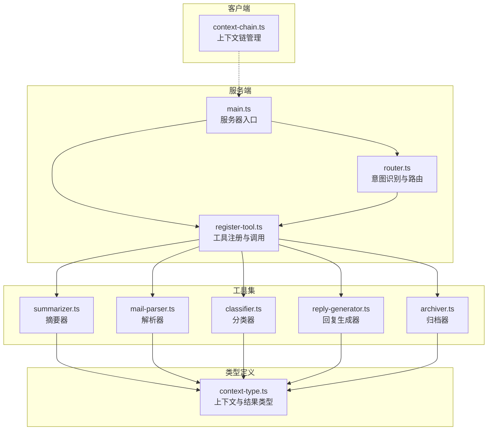
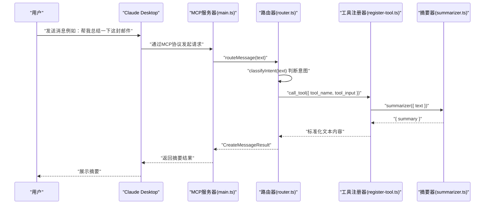
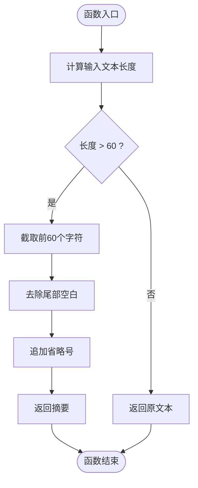
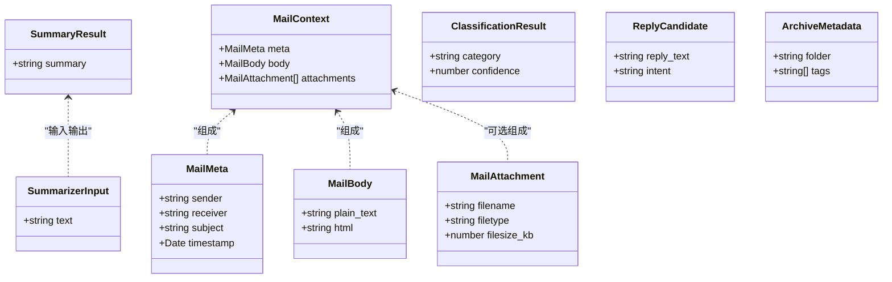
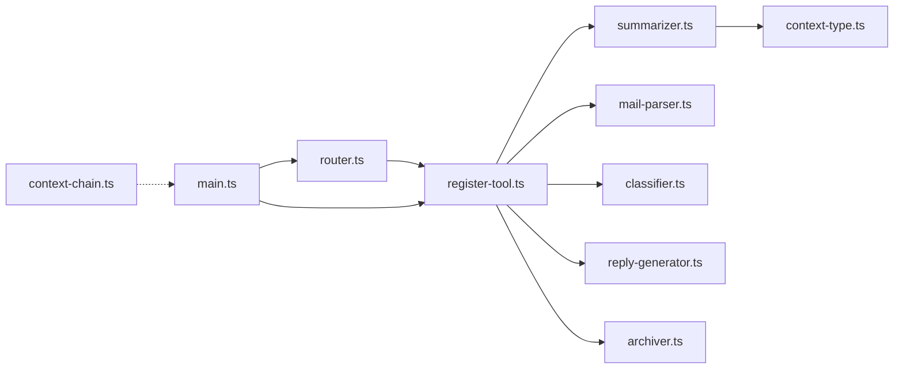

# 邮件摘要器

<cite>
**本文引用的文件**
- [summarizer.ts](file://src/tools/summarizer.ts)
- [context-type.ts](file://src/server/context-type.ts)
- [register-tool.ts](file://src/tools/register-tool.ts)
- [router.ts](file://src/server/router.ts)
- [main.ts](file://src/server/main.ts)
- [context-chain.ts](file://src/client/context-chain.ts)
- [mail-parser.ts](file://src/tools/mail-parser.ts)
- [classifier.ts](file://src/tools/classifier.ts)
- [reply-generator.ts](file://src/tools/reply-generator.ts)
- [archiver.ts](file://src/tools/archiver.ts)
- [README.md](file://README.md)
- [package.json](file://package.json)
</cite>

## 目录
1. [简介](#简介)
2. [项目结构](#项目结构)
3. [核心组件](#核心组件)
4. [架构总览](#架构总览)
5. [详细组件分析](#详细组件分析)
6. [依赖关系分析](#依赖关系分析)
7. [性能考量](#性能考量)
8. [故障排查指南](#故障排查指南)
9. [结论](#结论)
10. [附录](#附录)

## 简介
本文件面向“邮件摘要器”工具，围绕其摘要生成算法、关键信息提取、句子评分与长度控制机制展开深入说明；同时给出摘要长度限制（前60个字符）的实现与优化策略、摘要质量评估标准与人工审核流程、性能与内存优化建议，以及摘要不准确时的问题分析与改进方向。该工具位于基于 MCP 协议的 AI Agent 服务器中，负责将用户输入映射到具体工具执行，并以结构化结果返回给客户端。

## 项目结构
该项目采用模块化的工具化设计，核心目录与职责如下：
- src/server：服务端入口与路由逻辑，负责意图识别、工具注册与消息分发
- src/tools：各类工具实现，包括邮件解析、分类、摘要、回复生成、归档等
- src/client：客户端侧上下文链管理，支持步骤记录、快照与恢复
- 根目录：README 文档、包配置与构建脚本

图表来源
- [main.ts:1-42](file://src/server/main.ts#L1-L42)
- [router.ts:1-67](file://src/server/router.ts#L1-L67)
- [register-tool.ts:1-186](file://src/tools/register-tool.ts#L1-L186)
- [summarizer.ts:1-35](file://src/tools/summarizer.ts#L1-L35)
- [context-type.ts:1-101](file://src/server/context-type.ts#L1-L101)
- [context-chain.ts:1-35](file://src/client/context-chain.ts#L1-L35)

章节来源
- [README.md:1-131](file://README.md#L1-L131)
- [package.json:1-37](file://package.json#L1-L37)

## 核心组件
- 摘要器（Summarizer）：实现“前60个字符”的简单截断策略，超长则追加省略号，短则原样返回。该实现简洁高效，适合快速摘要场景。
- 路由器（Router）：根据用户输入中的关键词进行意图识别，将请求分发至对应工具（summarizer、classifier、reply_generator、archiver、mail_parser）。
- 工具注册器（register-tool）：统一注册各工具，定义输入参数校验（Zod），并将工具调用结果标准化为文本内容返回。
- 上下文类型（context-type）：定义邮件上下文、分类结果、摘要结果、回复候选、归档元数据等结构，确保跨模块的数据契约一致。
- 客户端上下文链（context-chain）：维护步骤链、键值缓存与快照恢复，便于调试与回放。

章节来源
- [summarizer.ts:16-34](file://src/tools/summarizer.ts#L16-L34)
- [router.ts:24-63](file://src/server/router.ts#L24-L63)
- [register-tool.ts:55-183](file://src/tools/register-tool.ts#L55-L183)
- [context-type.ts:68-88](file://src/server/context-type.ts#L68-L88)
- [context-chain.ts:1-35](file://src/client/context-chain.ts#L1-L35)

## 架构总览
下图展示了从用户输入到工具执行与结果返回的完整流程，重点体现摘要器在其中的位置与职责。

图表来源
- [main.ts:6-35](file://src/server/main.ts#L6-L35)
- [router.ts:40-63](file://src/server/router.ts#L40-L63)
- [register-tool.ts:117-138](file://src/tools/register-tool.ts#L117-L138)
- [summarizer.ts:23-34](file://src/tools/summarizer.ts#L23-L34)

## 详细组件分析

### 摘要器（Summarizer）算法与实现
- 输入参数：包含待摘要的纯文本字段
- 输出结果：包含生成摘要的结构化对象
- 算法流程：
  1) 计算输入文本长度
  2) 若长度大于阈值（60），则截取前60个字符，去除尾部空白后追加省略号
  3) 若长度不大于阈值，则直接返回原文本
  4) 将摘要封装为摘要结果对象并返回

图表来源
- [summarizer.ts:23-34](file://src/tools/summarizer.ts#L23-L34)

章节来源
- [summarizer.ts:16-34](file://src/tools/summarizer.ts#L16-L34)
- [context-type.ts:70-76](file://src/server/context-type.ts#L70-L76)

### 关键信息提取与句子评分机制
当前摘要器采用“固定长度截断”的启发式策略，未实现基于语义或句法的评分与选择机制。若需提升摘要质量，可考虑以下扩展：
- 关键词权重：对出现频率高、语义重要性高的词汇赋予更高权重
- 句子边界检测：按句号、问号等标点切分句子，优先保留首句与末句
- TF-IDF 或 BERT 等模型打分：对候选句子进行语义重要性排序
- 动态长度控制：根据文本长度自适应调整截断阈值，保证摘要长度在合理区间内

上述方案属于概念性扩展，不绑定具体源码实现。

### 长度控制与优化策略
- 固定阈值（60）：实现简单、性能优异，适合快速摘要与低延迟场景
- 优化建议：
  - 字符计数与截断：使用代码级的字符串截取与空白处理，避免额外依赖
  - 内存占用：仅在必要时复制字符串，避免重复拷贝
  - 编码兼容：注意多字节字符（如 emoji）可能影响视觉长度与字节长度的差异，建议在上层统一编码处理后再截断

章节来源
- [summarizer.ts:26-29](file://src/tools/summarizer.ts#L26-L29)

### 摘要质量评估标准
- 准确性：摘要是否覆盖邮件核心要点，是否存在事实性错误
- 完整性：是否保留关键信息（如主题、时间、行动项等）
- 清晰度：语言是否简洁明了，避免歧义
- 一致性：与原文风格、语气是否一致
- 适用性：是否满足用户预期（如快速浏览、快速决策）

### 人工审核流程
- 审核节点：在关键业务场景（如重要邮件、合规要求）中引入人工复核
- 流程建议：
  - 自动摘要生成后，将摘要与原文一同提交审核
  - 审核人员依据评估标准进行评分与标注
  - 对不准确或不合适的摘要进行修正，并记录原因
  - 建立反馈闭环，将人工修正样本用于后续模型或规则迭代

### 与其他工具的协作
- 路由器根据用户输入关键词识别意图，将请求分发至摘要器
- 工具注册器负责参数校验与结果标准化，确保摘要器输出符合统一格式
- 其他工具（分类、回复生成、归档、解析）与摘要器共享相同的类型定义与调用规范

图表来源
- [context-type.ts:68-101](file://src/server/context-type.ts#L68-L101)
- [summarizer.ts:11-14](file://src/tools/summarizer.ts#L11-L14)

章节来源
- [router.ts:24-38](file://src/server/router.ts#L24-L38)
- [register-tool.ts:117-138](file://src/tools/register-tool.ts#L117-L138)
- [context-type.ts:68-101](file://src/server/context-type.ts#L68-L101)

## 依赖关系分析
- 摘要器依赖上下文类型定义（SummaryResult），确保输出结构一致
- 工具注册器统一注册摘要器，定义输入参数校验与结果标准化
- 路由器负责意图识别与工具调用，形成“意图识别 → 工具执行 → 结果返回”的闭环
- 客户端上下文链用于记录与恢复步骤，便于调试与回放

图表来源
- [summarizer.ts:6](file://src/tools/summarizer.ts#L6)
- [register-tool.ts:9-14](file://src/tools/register-tool.ts#L9-L14)
- [router.ts:16-22](file://src/server/router.ts#L16-L22)
- [main.ts:1-42](file://src/server/main.ts#L1-L42)
- [context-chain.ts:1-35](file://src/client/context-chain.ts#L1-L35)

章节来源
- [register-tool.ts:55-183](file://src/tools/register-tool.ts#L55-L183)
- [router.ts:40-63](file://src/server/router.ts#L40-L63)
- [main.ts:6-35](file://src/server/main.ts#L6-L35)

## 性能考量
- 时间复杂度：摘要器为 O(n) 的字符串截断操作，n 为输入文本长度；当 n > 60 时，截断成本极低
- 空间复杂度：仅创建少量中间变量（截取片段、省略号拼接），空间开销与输入长度线性相关
- 内存优化建议：
  - 避免不必要的字符串复制，尽量在原字符串上进行截取
  - 对超长文本，可在上层进行预处理（如先提取正文、去除多余空白），降低摘要器负担
  - 在批量处理场景中，考虑流式处理与并发控制，避免阻塞主线程
- I/O 与网络：服务器通过 stdio 与客户端通信，注意日志输出与错误处理的异步特性，避免阻塞

章节来源
- [summarizer.ts:23-34](file://src/tools/summarizer.ts#L23-L34)
- [main.ts:22-34](file://src/server/main.ts#L22-L34)

## 故障排查指南
- 服务器未响应
  - 确认已通过 MCP 客户端（如 Claude Desktop）发起请求，而非直接在终端交互
  - 检查服务器日志输出位置（stderr），在客户端日志中查看
- 工具未被识别
  - 确认用户输入包含关键词（如“总结”、“概括”等），以便路由器正确识别意图
  - 检查工具注册是否成功，以及输入参数是否符合 Zod 校验
- 摘要不符合预期
  - 当前实现为固定长度截断，若需更高质量摘要，可参考“摘要质量评估标准”与“改进方向”
- 日志与调试
  - 服务器会在关键路径输出日志，便于定位问题
  - 客户端上下文链支持快照与恢复，可用于重现问题

章节来源
- [README.md:64-124](file://README.md#L64-L124)
- [router.ts:24-38](file://src/server/router.ts#L24-L38)
- [register-tool.ts:117-138](file://src/tools/register-tool.ts#L117-L138)
- [main.ts:25-34](file://src/server/main.ts#L25-L34)

## 结论
当前邮件摘要器采用“前60个字符截断”的简单策略，具备实现简洁、性能优异的特点，适用于快速摘要与低延迟场景。对于更高质量的摘要需求，建议引入基于语义的评分与选择机制，并结合动态长度控制与人工审核流程，持续提升准确性与适用性。同时，保持与路由器、工具注册器及类型定义的一致性，有助于整体系统的稳定性与可维护性。

## 附录
- 快速开始与配置：参见根目录 README，了解如何安装依赖、启动开发模式与配置客户端
- 技术栈：MCP SDK、TypeScript、Zod、Node.js

章节来源
- [README.md:15-34](file://README.md#L15-L34)
- [README.md:125-131](file://README.md#L125-L131)
- [package.json:25-35](file://package.json#L25-L35)