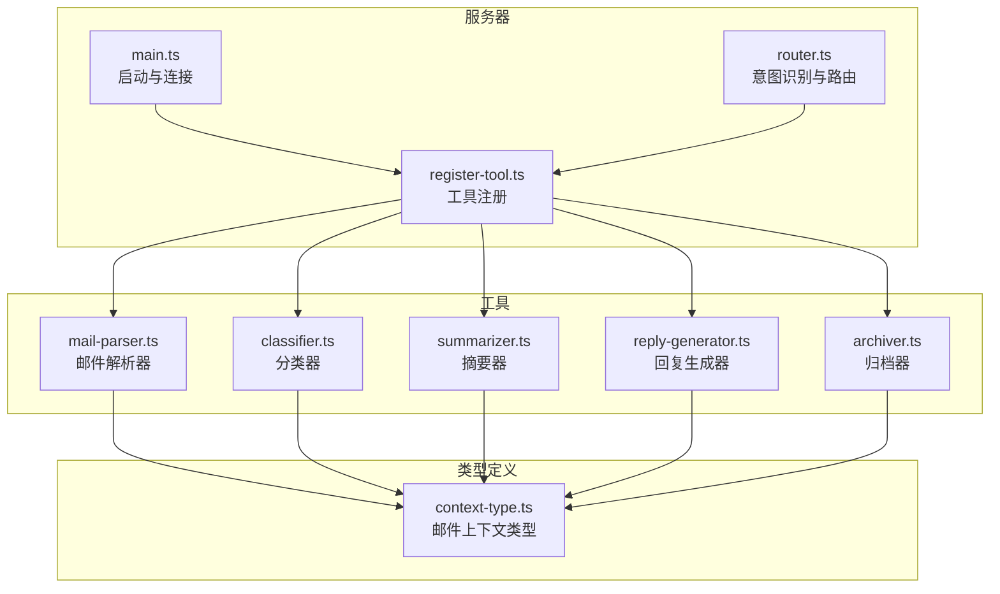
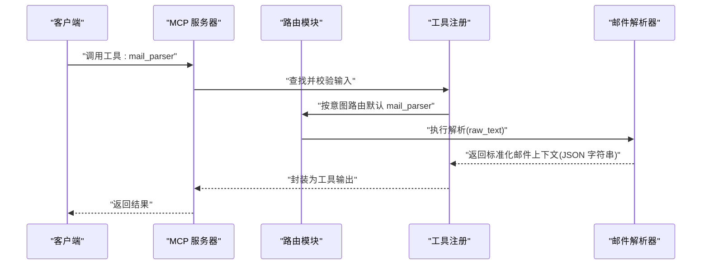
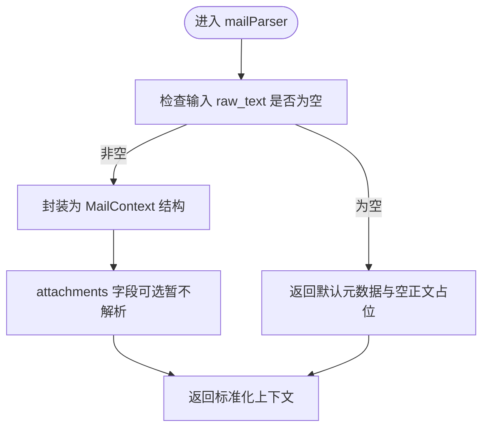
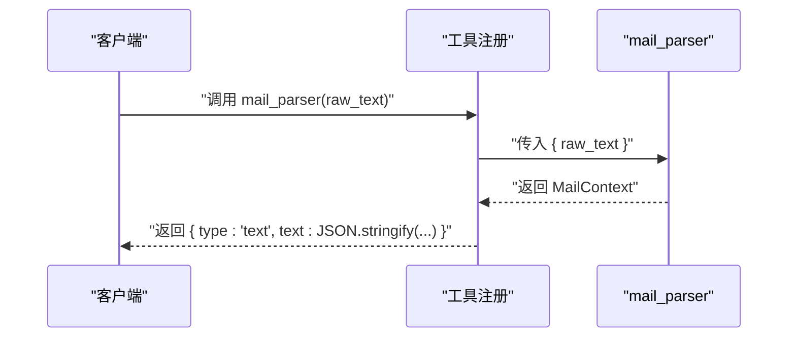
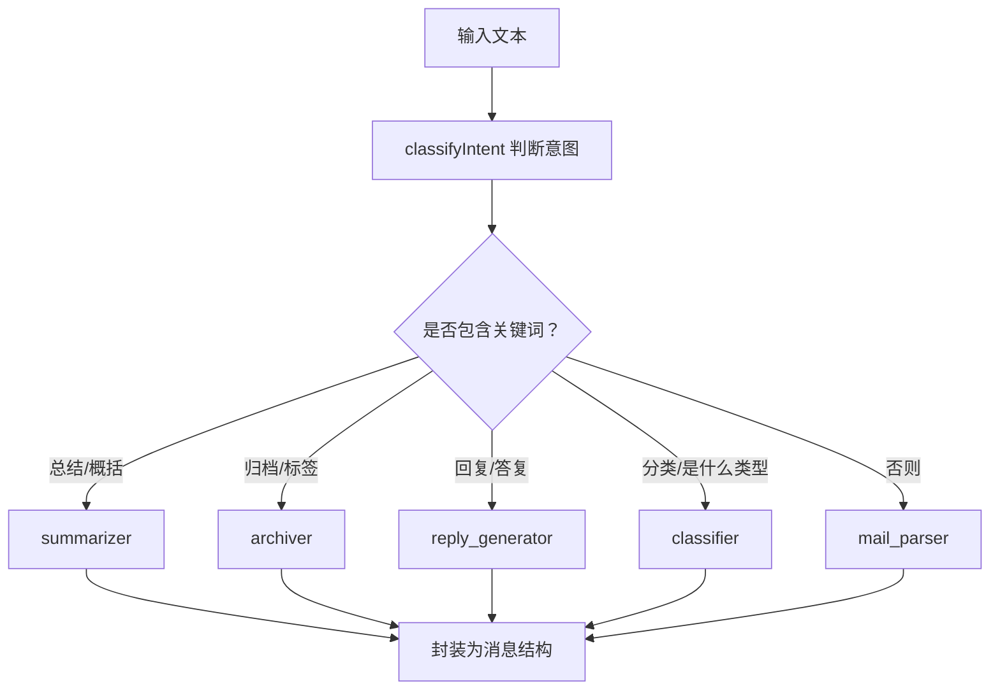
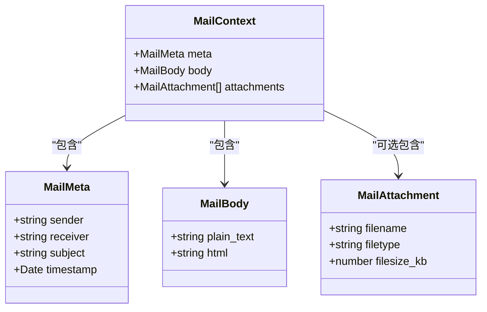
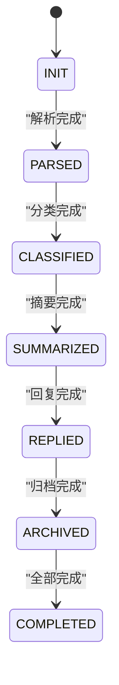
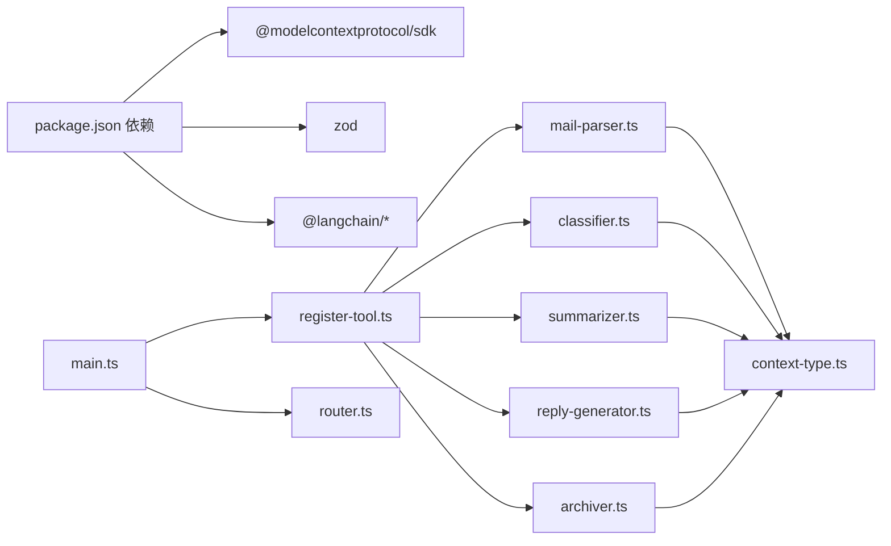

# 邮件解析器

<cite>
**本文引用的文件**
- [src/tools/mail-parser.ts](file://src/tools/mail-parser.ts)
- [src/server/context-type.ts](file://src/server/context-type.ts)
- [src/server/router.ts](file://src/server/router.ts)
- [src/tools/register-tool.ts](file://src/tools/register-tool.ts)
- [src/server/main.ts](file://src/server/main.ts)
- [README.md](file://README.md)
- [package.json](file://package.json)
- [src/tools/classifier.ts](file://src/tools/classifier.ts)
- [src/tools/summarizer.ts](file://src/tools/summarizer.ts)
- [src/tools/reply-generator.ts](file://src/tools/reply-generator.ts)
- [src/tools/archiver.ts](file://src/tools/archiver.ts)
- [src/client/context-chain.ts](file://src/client/context-chain.ts)
- [src/client/state-machine.ts](file://src/client/state-machine.ts)
</cite>

## 目录
1. [简介](#简介)
2. [项目结构](#项目结构)
3. [核心组件](#核心组件)
4. [架构总览](#架构总览)
5. [详细组件分析](#详细组件分析)
6. [依赖分析](#依赖分析)
7. [性能考虑](#性能考虑)
8. [故障排查指南](#故障排查指南)
9. [结论](#结论)
10. [附录](#附录)

## 简介
本文件面向“邮件解析器工具”的使用者与维护者，系统性说明其输入参数、解析规则、输出结构与扩展方向。当前实现采用“伪解析”策略，将输入的原始邮件文本直接封装为统一的邮件上下文结构；同时，项目提供了完整的工具注册与路由框架，便于后续以正则表达式、结构化解析等方式增强解析能力，并与分类、摘要、回复、归档等工具协同工作。

## 项目结构
- 核心解析器位于 tools 子目录，负责将原始邮件文本转换为标准化的邮件上下文对象。
- 服务器入口与工具注册位于 server 子目录，负责启动 MCP 服务、注册工具并暴露给客户端调用。
- 类型定义集中在 server/context-type.ts，确保各工具间的数据契约一致。
- 其他工具（分类、摘要、回复、归档）提供配套功能，体现“解析-处理-归档”的完整链路。

图表来源
- [src/server/main.ts:1-42](file://src/server/main.ts#L1-L42)
- [src/server/router.ts:1-67](file://src/server/router.ts#L1-L67)
- [src/tools/register-tool.ts:1-186](file://src/tools/register-tool.ts#L1-L186)
- [src/tools/mail-parser.ts:1-37](file://src/tools/mail-parser.ts#L1-L37)
- [src/server/context-type.ts:1-101](file://src/server/context-type.ts#L1-L101)

章节来源
- [README.md:88-97](file://README.md#L88-L97)
- [package.json:1-37](file://package.json#L1-L37)

## 核心组件
- 邮件解析器（mail-parser）
  - 输入：原始邮件文本（字符串）
  - 输出：标准化邮件上下文（包含元数据与正文），当前为伪实现，直接填充默认值并透传正文
- 邮件上下文类型（context-type）
  - 元数据（sender、receiver、subject、timestamp）
  - 正文（plain_text、html 可选）
  - 附件（filename、filetype、filesize_kb 可选）
- 工具注册与调用（register-tool）
  - 将 mail_parser 等工具注册为 MCP 工具，提供输入校验与输出封装
- 路由与意图识别（router）
  - 基于关键词的简易意图识别，将默认分支指向 mail_parser
- 服务器入口（main）
  - 初始化 MCP 服务器、注册工具、建立 stdio 传输并保持运行

章节来源
- [src/tools/mail-parser.ts:11-36](file://src/tools/mail-parser.ts#L11-L36)
- [src/server/context-type.ts:11-54](file://src/server/context-type.ts#L11-L54)
- [src/tools/register-tool.ts:74-93](file://src/tools/register-tool.ts#L74-L93)
- [src/server/router.ts:24-38](file://src/server/router.ts#L24-L38)
- [src/server/main.ts:6-35](file://src/server/main.ts#L6-L35)

## 架构总览
下图展示了从客户端发起调用到解析器返回结果的整体流程，以及工具间的依赖关系。

图表来源
- [src/server/main.ts:1-42](file://src/server/main.ts#L1-L42)
- [src/server/router.ts:40-63](file://src/server/router.ts#L40-L63)
- [src/tools/register-tool.ts:74-93](file://src/tools/register-tool.ts#L74-L93)
- [src/tools/mail-parser.ts:23-36](file://src/tools/mail-parser.ts#L23-L36)

## 详细组件分析

### 组件：邮件解析器（mail-parser）
- 功能定位
  - 将原始邮件文本包装为统一的邮件上下文对象，供后续工具消费
- 输入参数
  - raw_text: string（原始邮件文本）
- 输出结构
  - meta.sender、meta.receiver、meta.subject、meta.timestamp
  - body.plain_text、body.html（可选）
  - attachments（可选）
- 当前实现特点
  - 伪解析：直接返回固定默认值与原文透传，便于快速集成与演示
  - 可扩展点：未来可替换为基于正则表达式的头部解析、HTML 正文抽取、附件识别等
- 错误处理
  - 当前未显式抛错；建议在扩展实现中增加空值校验、格式异常捕获与降级策略

图表来源
- [src/tools/mail-parser.ts:23-36](file://src/tools/mail-parser.ts#L23-L36)
- [src/server/context-type.ts:47-54](file://src/server/context-type.ts#L47-L54)

章节来源
- [src/tools/mail-parser.ts:11-36](file://src/tools/mail-parser.ts#L11-L36)
- [src/server/context-type.ts:11-54](file://src/server/context-type.ts#L11-L54)

### 组件：工具注册与调用（register-tool）
- 注册 mail_parser 工具
  - 输入校验：raw_text 必填且为字符串
  - 输出封装：将解析结果序列化为 JSON 文本，作为工具输出
- 与其他工具的关系
  - 提供统一的工具接口，便于与分类、摘要、回复、归档等工具组合使用

图表来源
- [src/tools/register-tool.ts:74-93](file://src/tools/register-tool.ts#L74-L93)
- [src/tools/mail-parser.ts:23-36](file://src/tools/mail-parser.ts#L23-L36)

章节来源
- [src/tools/register-tool.ts:74-93](file://src/tools/register-tool.ts#L74-L93)

### 组件：路由与意图识别（router）
- 简易意图识别
  - 关键词命中优先级：总结/概括 -> 归档/标签 -> 回复/答复 -> 分类/是什么类型 -> 默认 mail_parser
- 路由行为
  - 将消息文本交由对应工具处理，并将工具输出封装为标准消息结构

图表来源
- [src/server/router.ts:24-38](file://src/server/router.ts#L24-L38)
- [src/server/router.ts:40-63](file://src/server/router.ts#L40-L63)

章节来源
- [src/server/router.ts:24-38](file://src/server/router.ts#L24-L38)
- [src/server/router.ts:40-63](file://src/server/router.ts#L40-L63)

### 组件：类型定义（context-type）
- 邮件上下文结构
  - meta：sender、receiver、subject、timestamp
  - body：plain_text、html（可选）
  - attachments：filename、filetype、filesize_kb（可选）
- 作用
  - 规范化各工具的输入输出，确保跨工具的一致性与可扩展性

图表来源
- [src/server/context-type.ts:11-54](file://src/server/context-type.ts#L11-L54)

章节来源
- [src/server/context-type.ts:11-54](file://src/server/context-type.ts#L11-L54)

### 组件：状态机与上下文链（client）
- 状态机（StateMachine）
  - 状态流转：INIT → PARSED → CLASSIFIED → SUMMARIZED → REPLIED → ARCHIVED → COMPLETED
  - 用途：驱动多工具串联处理流程
- 上下文链（ContextChain）
  - 记录每一步的上下文数据，支持快照与恢复，便于调试与回放

图表来源
- [src/client/state-machine.ts:1-43](file://src/client/state-machine.ts#L1-L43)

章节来源
- [src/client/state-machine.ts:1-43](file://src/client/state-machine.ts#L1-L43)
- [src/client/context-chain.ts:1-35](file://src/client/context-chain.ts#L1-L35)

## 依赖分析
- 外部依赖
  - @modelcontextprotocol/sdk：MCP 协议与传输层
  - zod：工具输入参数的运行时校验
  - langchain：可选的后续处理能力（当前未在解析器中直接使用）
- 内部依赖
  - mail-parser 依赖 context-type 的类型定义
  - register-tool 依赖 mail-parser 与各工具的实现
  - router 与 main 作为控制流入口，协调工具注册与调用

图表来源
- [package.json:25-35](file://package.json#L25-L35)
- [src/tools/register-tool.ts:10-14](file://src/tools/register-tool.ts#L10-L14)
- [src/tools/mail-parser.ts:6](file://src/tools/mail-parser.ts#L6)
- [src/server/main.ts:1-42](file://src/server/main.ts#L1-L42)
- [src/server/router.ts:1-67](file://src/server/router.ts#L1-L67)

章节来源
- [package.json:25-35](file://package.json#L25-L35)
- [src/tools/register-tool.ts:10-14](file://src/tools/register-tool.ts#L10-L14)
- [src/server/main.ts:1-42](file://src/server/main.ts#L1-L42)

## 性能考虑
- 当前解析器为伪实现，时间复杂度近似 O(1)，内存占用极低
- 若扩展为正则解析或结构化解析，建议：
  - 预编译常用正则表达式，避免重复编译
  - 对超长正文采用分块处理或流式解析，减少一次性内存峰值
  - 缓存解析模板与中间结果，降低重复计算
  - 在工具注册层引入超时与重试策略，提升鲁棒性
- I/O 与网络
  - 服务器通过 stdio 与客户端通信，注意缓冲区与背压处理
  - 日志输出至 stderr，便于在客户端侧聚合与分析

## 故障排查指南
- 无法看到响应
  - 确认已正确配置客户端（如 Claude Desktop），MCP 服务器并非交互式命令行
  - 参考项目说明中的配置步骤与常见问题
- 工具调用报错
  - 检查输入参数是否满足 zod 校验（raw_text 必须为字符串）
  - 查看服务器日志（stderr 输出），定位具体错误位置
- 解析结果不符合预期
  - 当前解析器为伪实现，返回固定默认值与原文透传
  - 建议在扩展实现中加入更严格的头部解析、正文剥离与附件识别逻辑
- 常见失败原因与解决
  - 输入为空或非字符串：在调用前进行预处理与校验
  - 正文过长导致内存压力：采用分块或流式策略
  - 未实现附件字段：在扩展解析器中补充附件识别与元数据提取

章节来源
- [README.md:111-124](file://README.md#L111-L124)
- [src/tools/register-tool.ts:78-80](file://src/tools/register-tool.ts#L78-L80)
- [src/server/main.ts:25-34](file://src/server/main.ts#L25-L34)

## 结论
邮件解析器当前处于“伪解析”阶段，提供统一的上下文结构与最小可用接口，便于快速集成与演示。建议在后续迭代中：
- 引入正则表达式与结构化解析，提升元数据提取与正文分离的准确性
- 增强错误处理与边界条件覆盖，提高鲁棒性
- 与分类、摘要、回复、归档等工具形成完整处理流水线，配合状态机与上下文链实现端到端自动化

## 附录

### 输入参数与输出结构对照
- 输入参数
  - mail_parser.input.raw_text: string
- 输出结构
  - meta.sender: string
  - meta.receiver: string
  - meta.subject: string
  - meta.timestamp: Date
  - body.plain_text: string
  - body.html: string（可选）
  - attachments: 数组（可选）

章节来源
- [src/tools/mail-parser.ts:11-36](file://src/tools/mail-parser.ts#L11-L36)
- [src/server/context-type.ts:11-54](file://src/server/context-type.ts#L11-L54)

### 解析示例（概念性说明）
- 示例场景
  - 场景A：普通工作邮件（正文较长）
    - 预期：解析器返回默认元数据与原文透传；后续可接入摘要器生成摘要
  - 场景B：带附件的邮件
    - 预期：当前未解析附件；扩展后应产出附件列表与元数据
  - 场景C：营销类邮件
    - 预期：结合分类器进行类别标注，再决定是否进入归档或回复流程
- 注意事项
  - 以上为概念性示例，当前实现不会改变输入内容

章节来源
- [src/tools/summarizer.ts:23-34](file://src/tools/summarizer.ts#L23-L34)
- [src/tools/classifier.ts:23-44](file://src/tools/classifier.ts#L23-L44)
- [src/tools/archiver.ts:23-31](file://src/tools/archiver.ts#L23-L31)