# 项目概述

<cite>
**本文档引用的文件**
- [README.md](file://README.md)
- [package.json](file://package.json)
- [src/server/main.ts](file://src/server/main.ts)
- [src/server/router.ts](file://src/server/router.ts)
- [src/server/context-type.ts](file://src/server/context-type.ts)
- [src/tools/register-tool.ts](file://src/tools/register-tool.ts)
- [src/tools/mail-parser.ts](file://src/tools/mail-parser.ts)
- [src/tools/classifier.ts](file://src/tools/classifier.ts)
- [src/tools/summarizer.ts](file://src/tools/summarizer.ts)
- [src/tools/reply-generator.ts](file://src/tools/reply-generator.ts)
- [src/tools/archiver.ts](file://src/tools/archiver.ts)
- [src/client/state-machine.ts](file://src/client/state-machine.ts)
- [comparison.md](file://comparison.md)
</cite>

## 目录
1. [项目简介](#项目简介)
2. [MCP协议基础](#mcp协议基础)
3. [项目架构概览](#项目架构概览)
4. [核心功能特性](#核心功能特性)
5. [技术架构分析](#技术架构分析)
6. [与传统CLI工具的区别](#与传统cli工具的区别)
7. [应用场景与价值](#应用场景与价值)
8. [快速开始指南](#快速开始指南)
9. [详细组件分析](#详细组件分析)
10. [性能考虑](#性能考虑)
11. [故障排除指南](#故障排除指南)
12. [结论](#结论)

## 项目简介

MCP路由服务器是一个基于MCP（Model Context Protocol）协议的消息路由服务器，专门用于智能邮件处理、意图识别和任务分发。该项目旨在为AI代理生态系统提供一个标准化的基础设施，通过MCP协议实现与各种AI客户端（如Claude Desktop）的无缝集成。

### 项目核心目标

- **标准化接口**：通过MCP协议提供统一的AI工具接口
- **智能路由**：根据用户输入自动识别意图并分发到相应的处理工具
- **邮件处理**：提供完整的邮件生命周期管理能力
- **可扩展架构**：支持多种邮件处理工具的灵活组合

**章节来源**
- [README.md:1-131](file://README.md#L1-L131)

## MCP协议基础

### 什么是MCP协议

MCP（Model Context Protocol）是一个新兴的AI代理通信协议，专门为AI模型和代理之间的交互而设计。与传统的HTTP API不同，MCP协议提供了更丰富的上下文管理和工具调用机制。

### MCP协议的核心特性

| 特性 | 描述 | 优势 |
|------|------|------|
| **标准化接口** | 统一的工具调用协议 | 跨平台兼容性 |
| **上下文管理** | 支持复杂的对话上下文 | 更好的用户体验 |
| **流式响应** | 支持渐进式响应 | 实时交互体验 |
| **错误处理** | 结构化的错误报告 | 更好的调试能力 |

### MCP服务器的工作原理

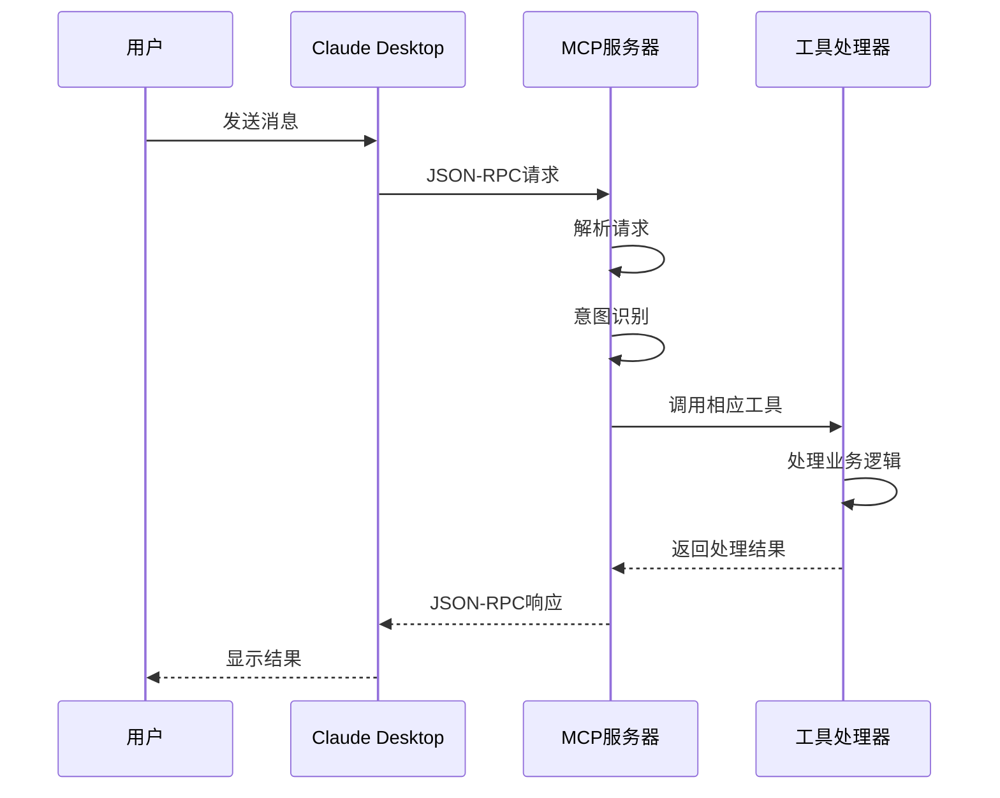

**图表来源**
- [src/server/main.ts:6-35](file://src/server/main.ts#L6-L35)
- [src/server/router.ts:41-63](file://src/server/router.ts#L41-L63)

**章节来源**
- [comparison.md:1-135](file://comparison.md#L1-L135)

## 项目架构概览

### 整体架构设计

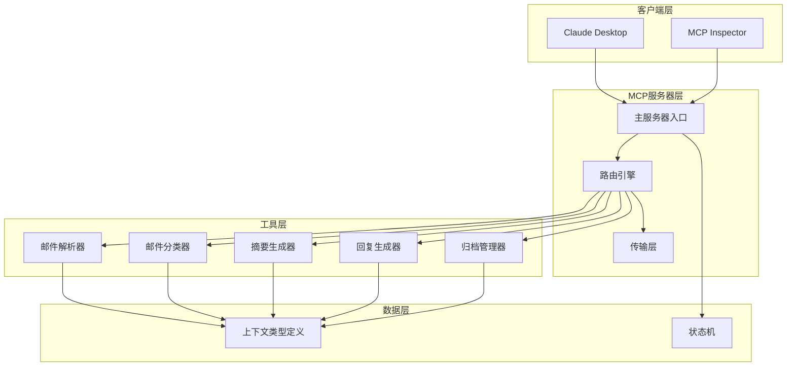

**图表来源**
- [src/server/main.ts:1-42](file://src/server/main.ts#L1-L42)
- [src/server/router.ts:1-67](file://src/server/router.ts#L1-L67)
- [src/tools/register-tool.ts:1-186](file://src/tools/register-tool.ts#L1-L186)

### 模块组织结构

项目采用清晰的模块化组织结构，主要分为以下几个层次：

1. **服务器层**：负责MCP协议的实现和工具注册
2. **工具层**：提供具体的邮件处理功能
3. **客户端层**：状态管理和上下文处理
4. **配置层**：项目配置和依赖管理

**章节来源**
- [package.json:1-37](file://package.json#L1-L37)

## 核心功能特性

### 智能邮件处理能力

项目提供了完整的邮件处理流水线，从原始邮件解析到最终的归档管理：

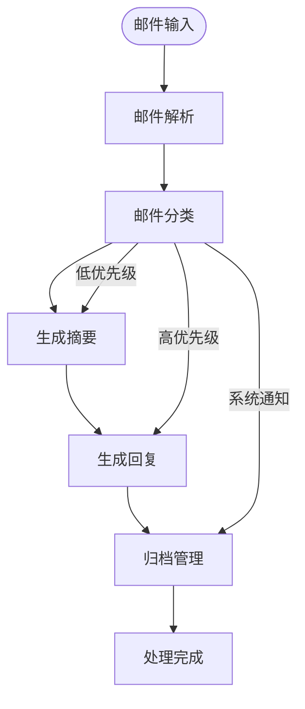

**图表来源**
- [src/server/router.ts:24-38](file://src/server/router.ts#L24-L38)
- [src/tools/classifier.ts:23-44](file://src/tools/classifier.ts#L23-L44)

### 意图识别系统

系统通过关键词匹配实现智能意图识别，支持以下意图类型：

| 意图类型 | 关键词 | 功能描述 |
|----------|--------|----------|
| **summarizer** | 总结、概括 | 生成邮件摘要 |
| **archiver** | 归档、标签 | 管理邮件归档 |
| **reply_generator** | 回复、答复 | 生成标准回复 |
| **classifier** | 分类、类型 | 邮件类型识别 |
| **mail_parser** | 默认 | 邮件内容解析 |

### 任务分发机制

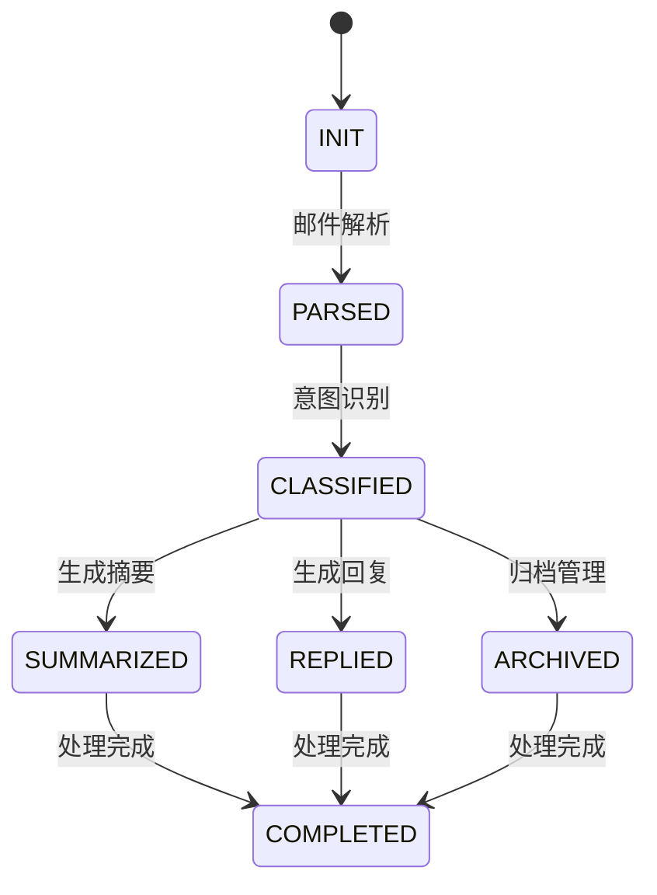

**图表来源**
- [src/client/state-machine.ts:1-43](file://src/client/state-machine.ts#L1-L43)

**章节来源**
- [README.md:80-87](file://README.md#L80-L87)
- [src/server/router.ts:24-38](file://src/server/router.ts#L24-L38)

## 技术架构分析

### 核心技术栈

项目采用了现代化的技术栈，确保了代码质量和可维护性：

| 技术组件 | 版本 | 用途 | 优势 |
|----------|------|------|------|
| **TypeScript** | ^6.0.2 | 类型安全 | 编译时错误检测 |
| **MCP SDK** | ^1.29.0 | 协议实现 | 标准化通信 |
| **Zod** | ^4.3.6 | 参数验证 | 运行时类型检查 |
| **LangChain** | ^1.1.39 | AI框架 | 强大的AI能力 |
| **Node.js** | 运行环境 | 服务器运行 | 跨平台支持 |

### 数据模型设计

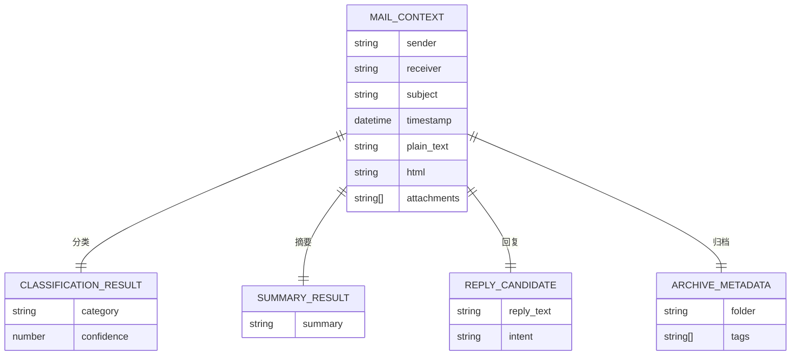

**图表来源**
- [src/server/context-type.ts:47-101](file://src/server/context-type.ts#L47-L101)

**章节来源**
- [package.json:25-35](file://package.json#L25-L35)
- [src/server/context-type.ts:1-101](file://src/server/context-type.ts#L1-L101)

## 与传统CLI工具的区别

### 核心差异对比

| 方面 | 交互式命令行 | MCP服务器 |
|------|-------------|-----------|
| **stdin用途** | 接收用户输入 | 接收JSON-RPC消息 |
| **输入格式** | 纯文本 | JSON-RPC协议 |
| **输出方式** | stdout打印 | JSON-RPC响应 |
| **使用方式** | 直接在终端运行 | 通过MCP客户端调用 |
| **输入来源** | 直接可见 | 必须通过客户端 |

### 工作流程对比

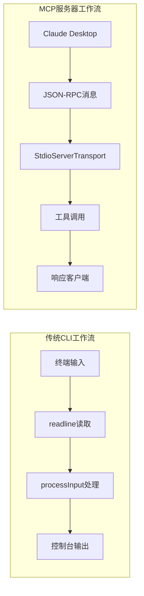

**图表来源**
- [comparison.md:3-27](file://comparison.md#L3-L27)
- [comparison.md:30-57](file://comparison.md#L30-L57)

### 常见误解澄清

当运行 `pnpm dev` 后，许多开发者会困惑为什么在终端输入没有反应。这是因为：

1. **StdioServerTransport接管了stdin**：用于接收JSON-RPC消息
2. **终端输入不是JSON-RPC格式**：会被忽略或报错
3. **正确的输入必须通过MCP客户端**：如Claude Desktop

**章节来源**
- [comparison.md:73-135](file://comparison.md#L73-L135)

## 应用场景与价值

### 主要应用场景

1. **企业邮件自动化**
   - 自动分类和归档大量邮件
   - 生成标准回复模板
   - 智能摘要生成

2. **AI助手集成**
   - 作为MCP服务器为各种AI客户端提供服务
   - 支持多平台的统一接口

3. **邮件处理流水线**
   - 完整的邮件生命周期管理
   - 可扩展的工具链架构

### 项目价值体现

| 价值维度 | 具体体现 | 技术优势 |
|----------|----------|----------|
| **标准化** | MCP协议实现 | 跨平台兼容性 |
| **智能化** | 意图识别和任务分发 | AI驱动决策 |
| **可扩展性** | 模块化工具设计 | 灵活的功能组合 |
| **易用性** | 简洁的API接口 | 降低集成成本 |

**章节来源**
- [README.md:125-131](file://README.md#L125-L131)

## 快速开始指南

### 环境准备

1. **安装Node.js**：确保系统已安装Node.js运行环境
2. **安装包管理器**：推荐使用pnpm作为包管理器
3. **克隆项目**：获取项目源码

### 安装依赖

```bash
# 安装项目依赖
pnpm install

# 开发模式运行
pnpm dev

# 生产构建
pnpm build
pnpm start
```

### 配置Claude Desktop

1. **找到配置文件位置**：
   - macOS: `~/Library/Application Support/Claude/claude_desktop_config.json`
   - Windows: `%APPDATA%\Claude\claude_desktop_config.json`

2. **添加MCP服务器配置**：
```json
{
  "mcpServers": {
    "mcp-router-server": {
      "command": "pnpm",
      "args": ["dev"],
      "cwd": "/path/to/project"
    }
  }
}
```

3. **重启Claude Desktop**：使配置生效

### 基本使用示例

在Claude Desktop中直接发送消息，服务器会自动处理：

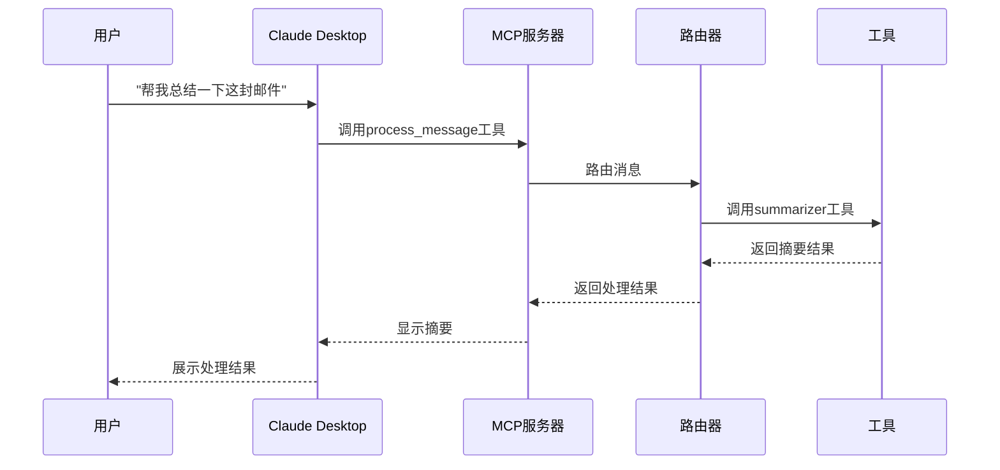

**图表来源**
- [README.md:73-78](file://README.md#L73-L78)

**章节来源**
- [README.md:15-72](file://README.md#L15-L72)

## 详细组件分析

### 主服务器组件

主服务器组件负责MCP协议的初始化和工具注册：

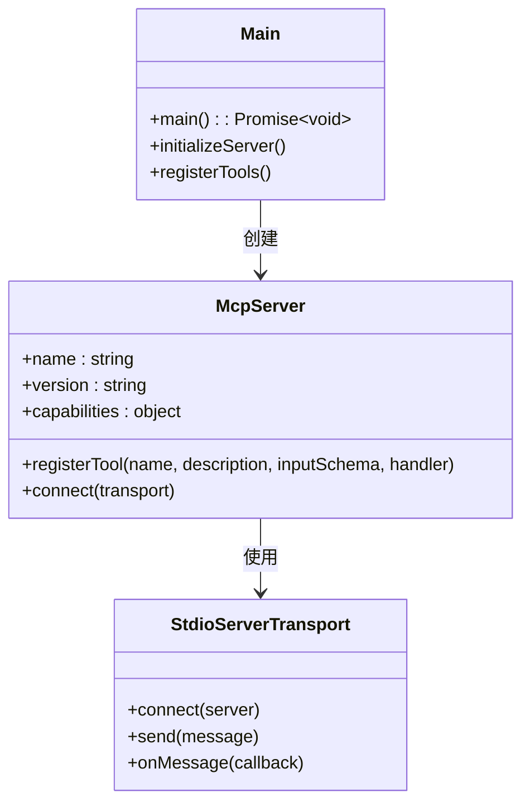

**图表来源**
- [src/server/main.ts:6-35](file://src/server/main.ts#L6-L35)

### 路由器组件

路由器组件实现了智能意图识别和任务分发：

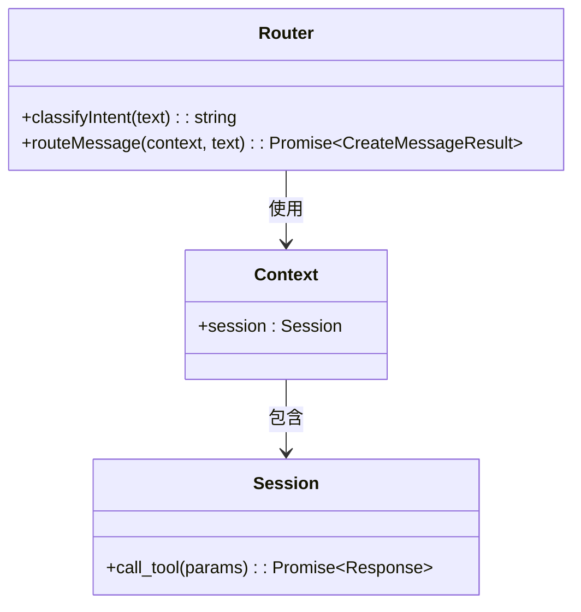

**图表来源**
- [src/server/router.ts:24-63](file://src/server/router.ts#L24-L63)

### 工具注册系统

工具注册系统提供了统一的工具注册接口：

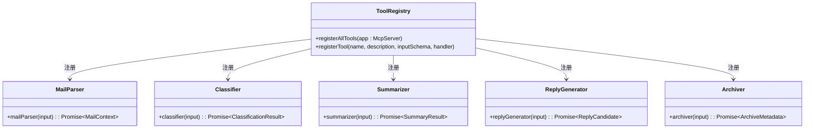

**图表来源**
- [src/tools/register-tool.ts:55-183](file://src/tools/register-tool.ts#L55-L183)

**章节来源**
- [src/server/main.ts:1-42](file://src/server/main.ts#L1-L42)
- [src/server/router.ts:1-67](file://src/server/router.ts#L1-L67)
- [src/tools/register-tool.ts:1-186](file://src/tools/register-tool.ts#L1-L186)

## 性能考虑

### 内存管理

- **工具实例复用**：避免重复创建工具实例
- **缓存策略**：对频繁使用的数据进行缓存
- **异步处理**：使用Promise避免阻塞主线程

### 并发处理

- **并发限制**：控制同时处理的任务数量
- **队列管理**：实现任务排队机制
- **资源监控**：实时监控内存和CPU使用情况

### 优化建议

1. **懒加载**：按需加载工具模块
2. **连接池**：复用数据库和网络连接
3. **批量处理**：合并相似的任务请求

## 故障排除指南

### 常见问题及解决方案

| 问题类型 | 症状 | 原因 | 解决方案 |
|----------|------|------|----------|
| **服务器无法启动** | 启动后立即退出 | 端口占用或权限问题 | 检查端口占用，修改权限 |
| **客户端连接失败** | 客户端显示连接错误 | 网络配置或防火墙问题 | 检查网络配置，放行端口 |
| **工具调用失败** | 工具返回错误 | 参数验证失败或工具异常 | 检查输入参数，查看日志 |
| **性能问题** | 响应缓慢 | 资源不足或算法复杂度高 | 优化算法，增加资源 |

### 调试技巧

1. **启用详细日志**：使用 `console.error()` 输出调试信息
2. **使用MCP Inspector**：通过Web界面测试工具
3. **单元测试**：为关键功能编写测试用例
4. **性能分析**：使用Node.js内置分析工具

### 日志记录

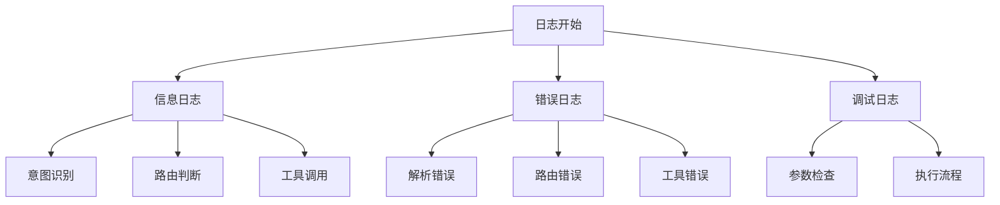

**图表来源**
- [src/server/router.ts:26](file://src/server/router.ts#L26)
- [src/server/router.ts:46](file://src/server/router.ts#L46)

**章节来源**
- [README.md:111-124](file://README.md#L111-L124)
- [comparison.md:93-135](file://comparison.md#L93-L135)

## 结论

MCP路由服务器项目代表了AI代理生态系统的一个重要发展方向。通过采用标准化的MCP协议，项目实现了与各种AI客户端的无缝集成，为智能邮件处理提供了完整的解决方案。

### 项目优势

1. **标准化协议**：基于MCP协议，确保跨平台兼容性
2. **智能路由**：通过意图识别实现智能化的任务分发
3. **模块化设计**：支持灵活的功能组合和扩展
4. **易于集成**：提供简洁的API接口，降低集成成本

### 技术展望

随着AI技术的不断发展，该项目将继续演进，可能的方向包括：

- **增强学习**：引入机器学习模型提升意图识别准确性
- **多模态支持**：支持图片、音频等多种媒体类型的处理
- **云原生架构**：支持容器化部署和微服务架构
- **实时协作**：支持多人协作和共享工作流

该项目为AI代理技术的实际应用提供了有价值的参考，展示了如何通过标准化协议实现智能系统的互操作性。