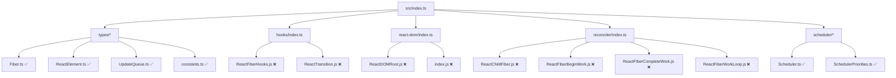
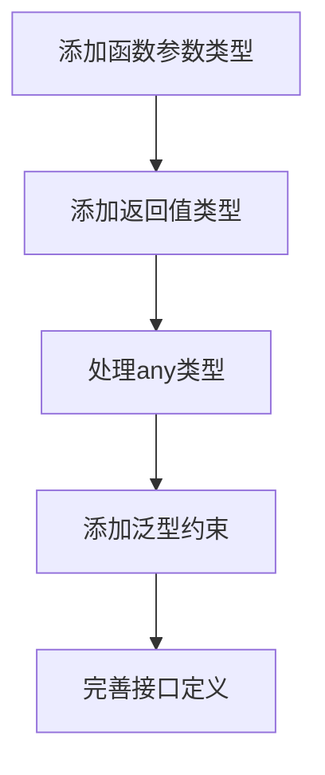
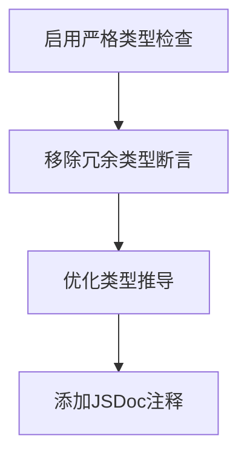
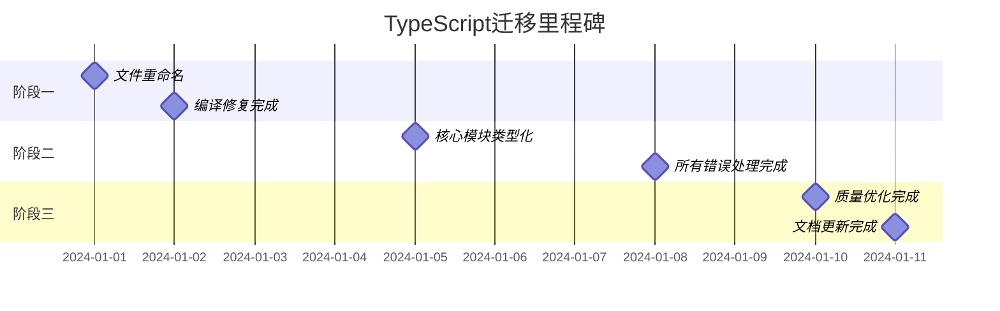
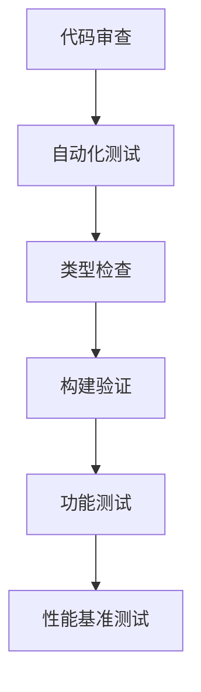

# 简易React项目TypeScript完全迁移设计

## 概述

本设计文档旨在将简易React项目中所有JavaScript文件迁移到TypeScript，包括源代码、测试文件、配置文件和示例文件。项目当前已具备基础的TypeScript基础架构，需要将剩余的JavaScript文件完全转换为TypeScript以实现类型安全和更好的开发体验。

**迁移原则**：
- 可以忽略TypeScript错误，优先完成文件扩展名转换
- 保持现有功能完整性
- 利用已有的类型定义系统
- 渐进式添加类型注解

## 技术架构

### 当前架构状态
项目采用模块化TypeScript架构，核心模块已部分迁移：



### 迁移目标架构
所有模块完全TypeScript化：

```mermaid
graph TB
    A[src/index.ts] --> B[types/*]
    A --> C[hooks/index.ts]
    A --> D[react-dom/index.ts]
    A --> E[reconciler/index.ts]
    A --> F[scheduler/*]
    
    B --> B1[Fiber.ts ✅]
    B --> B2[ReactElement.ts ✅]
    B --> B3[UpdateQueue.ts ✅]
    B --> B4[constants.ts ✅]
    
    C --> C1[ReactFiberHooks.ts ✅]
    C --> C2[ReactTransition.ts ✅]
    
    D --> D1[ReactDOMRoot.ts ✅]
    D --> D2[index.ts ✅]
    
    E --> E1[ReactChildFiber.ts ✅]
    E --> E2[ReactFiberBeginWork.ts ✅]
    E --> E3[ReactFiberCompleteWork.ts ✅]
    E --> E4[ReactFiberWorkLoop.ts ✅]
    
    F --> F1[Scheduler.ts ✅]
    F --> F2[SchedulerPriorities.ts ✅]
    
    G[examples/] --> G1[complete-app.ts ✅]
    H[test/] --> H1[*.test.ts ✅]
    I[rollup.config.ts ✅]
```



## 文件迁移映射

### 源代码文件迁移

| 当前文件路径 | 目标文件路径 | 迁移复杂度 | 依赖关系 |
|-------------|-------------|-----------|----------|
| `src/hooks/ReactFiberHooks.js` | `src/hooks/ReactFiberHooks.ts` | 高 | 依赖Fiber、UpdateQueue类型 |
| `src/hooks/ReactTransition.js` | `src/hooks/ReactTransition.ts` | 中 | 依赖基础调度类型 |
| `src/react-dom/ReactDOMRoot.js` | `src/react-dom/ReactDOMRoot.ts` | 中 | 依赖Fiber、DOM类型 |
| `src/react-dom/index.js` | `src/react-dom/index.ts` | 低 | 主要为导出文件 |
| `src/reconciler/ReactChildFiber.js` | `src/reconciler/ReactChildFiber.ts` | 高 | 依赖Fiber协调算法类型 |
| `src/reconciler/ReactFiberBeginWork.js` | `src/reconciler/ReactFiberBeginWork.ts` | 高 | 依赖组件类型和工作流程 |
| `src/reconciler/ReactFiberCompleteWork.js` | `src/reconciler/ReactFiberCompleteWork.ts` | 高 | 依赖DOM操作和Fiber类型 |
| `src/reconciler/ReactFiberWorkLoop.js` | `src/reconciler/ReactFiberWorkLoop.ts` | 高 | 核心调度逻辑，复杂度最高 |

### 测试文件迁移

| 当前文件路径 | 目标文件路径 | 迁移复杂度 |
|-------------|-------------|-----------|
| `test/basic-api.test.js` | `test/basic-api.test.ts` | 低 |
| `test/dom-rendering.test.js` | `test/dom-rendering.test.ts` | 中 |
| `test/index.js` | `test/index.ts` | 低 |

### 配置和示例文件迁移

| 当前文件路径 | 目标文件路径 | 迁移复杂度 |
|-------------|-------------|-----------|
| `examples/complete-app.js` | `examples/complete-app.ts` | 中 |
| `rollup.config.js` | `rollup.config.ts` | 低 |

## 类型系统扩展

### 核心类型接口扩展

基于现有类型系统，需要扩展以下接口：

```typescript
// 扩展全局类型声明
declare global {
  var __DEV__: boolean;
  var __PROFILE__: boolean;
  var __UMD__: boolean;
  var __EXPERIMENTAL__: boolean;
}

// 调度器相关类型
interface SchedulerCallback {
  id: number;
  callback: (hasTimeRemaining: boolean, initialTime: number) => boolean | null;
  priorityLevel: number;
  startTime: number;
  expirationTime: number;
  sortIndex: number;
}

// Hook分发器类型
interface HooksDispatcher {
  useState: <T>(initialState: T | (() => T)) => [T, (value: T | ((prev: T) => T)) => void];
  useEffect: (effect: () => void | (() => void), deps?: any[]) => void;
  useCallback: <T extends (...args: any[]) => any>(callback: T, deps: any[]) => T;
  useMemo: <T>(factory: () => T, deps: any[]) => T;
  useReducer: <T, A>(reducer: (state: T, action: A) => T, initialState: T) => [T, (action: A) => void];
  useRef: <T>(initialValue: T) => { current: T };
  useContext: <T>(context: ReactContext<T>) => T;
}

// DOM操作相关类型
interface DOMContainer {
  _reactRootContainer?: any;
  nodeType: number;
  parentNode: DOMContainer | null;
  removeChild: (child: DOMContainer) => void;
  appendChild: (child: DOMContainer) => void;
  insertBefore: (newChild: DOMContainer, beforeChild: DOMContainer) => void;
}
```

### 模块特定类型定义

#### Hooks模块类型
```typescript
// ReactFiberHooks.ts 需要的类型
interface HookQueue<S, A> {
  pending: Update<S, A> | null;
  interleaved: Update<S, A> | null;
  lanes: Lanes;
  dispatch: ((action: A) => void) | null;
  lastRenderedReducer: ((state: S, action: A) => S) | null;
  lastRenderedState: S;
}

interface EffectHook {
  memoizedState: Effect | null;
  baseState: Effect | null;
  baseQueue: Update<any, any> | null;
  queue: any;
  next: Hook | null;
}

interface Effect {
  tag: number;
  create: () => (() => void) | void;
  destroy: (() => void) | void;
  deps: any[] | null;
  next: Effect;
}
```

#### 协调器模块类型
```typescript
// Reconciler模块需要的类型
interface WorkLoopConfig {
  shouldYieldToHost: () => boolean;
  requestPaint: () => void;
  getCurrentTime: () => number;
  forceFrameRate: (fps: number) => void;
}

interface RootState {
  element: ReactElement | null;
  isDehydrated: boolean;
  cache: any;
  pendingSuspenseBoundaries: Set<Fiber> | null;
  isRenderingConcurrentlyByDefault: boolean;
}
```

## 迁移执行策略

### 阶段一：基础迁移（文件扩展名转换）

**目标**：将所有.js文件重命名为.ts，确保项目可以编译通过


**执行顺序**：
1. 配置文件（rollup.config.js → rollup.config.ts）
2. 测试文件（test/*.js → test/*.ts）  
3. 示例文件（examples/*.js → examples/*.ts）
4. 源代码文件（按依赖关系由底层到顶层）

### 阶段二：类型注解增强

**目标**：为忽略的TypeScript错误添加适当的类型注解



### 阶段三：代码质量优化

**目标**：利用TypeScript特性提升代码质量



## 配置文件更新

### TypeScript配置优化

更新`tsconfig.json`以支持所有文件类型：

```json
{
  "compilerOptions": {
    "target": "ES2020",
    "module": "ES2020", 
    "moduleResolution": "node",
    "lib": ["ES2020", "DOM"],
    "outDir": "./dist",
    "rootDir": "./src",
    "declaration": true,
    "declarationDir": "./dist",
    "strict": false,
    "noImplicitAny": false,
    "strictNullChecks": false,
    "allowJs": true,
    "checkJs": false,
    "skipLibCheck": true,
    "allowSyntheticDefaultImports": true,
    "esModuleInterop": true,
    "forceConsistentCasingInFileNames": true,
    "resolveJsonModule": true,
    "isolatedModules": true,
    "incremental": true,
    "tsBuildInfoFile": "./dist/.tsbuildinfo"
  },
  "include": [
    "src/**/*",
    "test/**/*",
    "examples/**/*",
    "rollup.config.ts"
  ],
  "exclude": [
    "node_modules",
    "dist"
  ]
}
```

### 构建配置更新

更新`package.json`脚本以支持新的文件结构：

```json
{
  "scripts": {
    "build": "tsc && rollup -c rollup.config.ts",
    "dev": "tsc -w & rollup -c rollup.config.ts -w",
    "test": "tsc && node --experimental-modules test/index.ts",
    "type-check": "tsc --noEmit --skipLibCheck",
    "type-check-strict": "tsc --noEmit"
  }
}
```

## 迁移时间和资源估算

### 工作量估算

| 迁移阶段 | 预估工时 | 主要工作内容 |
|---------|----------|-------------|
| 阶段一：基础迁移 | 4-6小时 | 文件重命名、路径更新、基础编译修复 |
| 阶段二：类型注解 | 8-12小时 | 添加类型注解、处理复杂类型错误 |
| 阶段三：质量优化 | 4-6小时 | 代码优化、文档完善 |
| **总计** | **16-24小时** | **完整TypeScript迁移** |

### 里程碑和交付物



## 风险评估与缓解策略

### 主要风险

| 风险类型 | 风险级别 | 影响描述 | 缓解策略 |
|---------|----------|----------|----------|
| 类型兼容性 | 中 | 复杂类型转换可能破坏现有功能 | 分阶段迁移，保持向后兼容 |
| 依赖关系 | 中 | 文件间依赖关系复杂，迁移顺序错误 | 按依赖层次自底向上迁移 |
| 构建流程 | 低 | 构建配置更新可能影响开发流程 | 保留原有构建脚本作为备份 |
| 测试覆盖 | 低 | 迁移过程中可能遗漏测试用例 | 每阶段完成后运行完整测试套件 |

### 质量保证措施



## 测试策略

### 迁移验证测试

```typescript
// 测试用例示例
describe('TypeScript迁移验证', () => {
  test('所有模块可以正确导入', () => {
    expect(() => {
      require('../src/index.ts');
      require('../src/hooks/index.ts');
      require('../src/react-dom/index.ts');
    }).not.toThrow();
  });

  test('类型定义完整性', () => {
    // 验证主要接口是否正确导出
    const { Fiber, ReactElement } = require('../src/types');
    expect(typeof Fiber).toBe('function');
    expect(typeof ReactElement).toBe('object');
  });

  test('现有功能保持不变', () => {
    const React = require('../src/index.ts');
    const element = React.createElement('div', null, 'Hello');
    expect(element.type).toBe('div');
    expect(element.props.children).toBe('Hello');
  });
});
```

### 性能基准测试

确保TypeScript迁移不影响运行时性能：

```typescript
// 性能测试示例
describe('性能基准测试', () => {
  test('createElement性能', () => {
    const start = performance.now();
    for (let i = 0; i < 10000; i++) {
      React.createElement('div', { key: i }, `Item ${i}`);
    }
    const end = performance.now();
    expect(end - start).toBeLessThan(100); // 期望在100ms内完成
  });
});
```// 扩展全局类型声明
declare global {
  var __DEV__: boolean;
  var __PROFILE__: boolean;
  var __UMD__: boolean;
  var __EXPERIMENTAL__: boolean;
}

// 调度器相关类型
interface SchedulerCallback {
  id: number;
  callback: (hasTimeRemaining: boolean, initialTime: number) => boolean | null;
  priorityLevel: number;
  startTime: number;
  expirationTime: number;
  sortIndex: number;
}

// Hook分发器类型
interface HooksDispatcher {
  useState: <T>(initialState: T | (() => T)) => [T, (value: T | ((prev: T) => T)) => void];
  useEffect: (effect: () => void | (() => void), deps?: any[]) => void;
  useCallback: <T extends (...args: any[]) => any>(callback: T, deps: any[]) => T;
  useMemo: <T>(factory: () => T, deps: any[]) => T;
  useReducer: <T, A>(reducer: (state: T, action: A) => T, initialState: T) => [T, (action: A) => void];
  useRef: <T>(initialValue: T) => { current: T };
  useContext: <T>(context: ReactContext<T>) => T;
}

// DOM操作相关类型
interface DOMContainer {
  _reactRootContainer?: any;
  nodeType: number;
  parentNode: DOMContainer | null;
  removeChild: (child: DOMContainer) => void;
  appendChild: (child: DOMContainer) => void;
  insertBefore: (newChild: DOMContainer, beforeChild: DOMContainer) => void;
}
```

### 模块特定类型定义

#### Hooks模块类型
```typescript
// ReactFiberHooks.ts 需要的类型
interface HookQueue<S, A> {
  pending: Update<S, A> | null;
  interleaved: Update<S, A> | null;
  lanes: Lanes;
  dispatch: ((action: A) => void) | null;
  lastRenderedReducer: ((state: S, action: A) => S) | null;
  lastRenderedState: S;
}

interface EffectHook {
  memoizedState: Effect | null;
  baseState: Effect | null;
  baseQueue: Update<any, any> | null;
  queue: any;
  next: Hook | null;
}

interface Effect {
  tag: number;
  create: () => (() => void) | void;
  destroy: (() => void) | void;
  deps: any[] | null;
  next: Effect;
}
```

#### 协调器模块类型
```typescript
// Reconciler模块需要的类型
interface WorkLoopConfig {
  shouldYieldToHost: () => boolean;
  requestPaint: () => void;
  getCurrentTime: () => number;
  forceFrameRate: (fps: number) => void;
}

interface RootState {
  element: ReactElement | null;
  isDehydrated: boolean;
  cache: any;
  pendingSuspenseBoundaries: Set<Fiber> | null;
  isRenderingConcurrentlyByDefault: boolean;
}
```

## 迁移执行策略

### 阶段一：基础迁移（文件扩展名转换）

**目标**：将所有.js文件重命名为.ts，确保项目可以编译通过


**执行顺序**：
1. 配置文件（rollup.config.js → rollup.config.ts）
2. 测试文件（test/*.js → test/*.ts）  
3. 示例文件（examples/*.js → examples/*.ts）
4. 源代码文件（按依赖关系由底层到顶层）

### 阶段二：类型注解增强

**目标**：为忽略的TypeScript错误添加适当的类型注解


### 阶段三：代码质量优化

**目标**：利用TypeScript特性提升代码质量


## 配置文件更新

### TypeScript配置优化

更新`tsconfig.json`以支持所有文件类型：

```json
{
  "compilerOptions": {
    "target": "ES2020",
    "module": "ES2020", 
    "moduleResolution": "node",
    "lib": ["ES2020", "DOM"],
    "outDir": "./dist",
    "rootDir": "./src",
    "declaration": true,
    "declarationDir": "./dist",
    "strict": false,
    "noImplicitAny": false,
    "strictNullChecks": false,
    "allowJs": true,
    "checkJs": false,
    "skipLibCheck": true,
    "allowSyntheticDefaultImports": true,
    "esModuleInterop": true,
    "forceConsistentCasingInFileNames": true,
    "resolveJsonModule": true,
    "isolatedModules": true,
    "incremental": true,
    "tsBuildInfoFile": "./dist/.tsbuildinfo"
  },
  "include": [
    "src/**/*",
    "test/**/*",
    "examples/**/*",
    "rollup.config.ts"
  ],
  "exclude": [
    "node_modules",
    "dist"
  ]
}
```

### 构建配置更新

更新`package.json`脚本以支持新的文件结构：

```json
{
  "scripts": {
    "build": "tsc && rollup -c rollup.config.ts",
    "dev": "tsc -w & rollup -c rollup.config.ts -w",
    "test": "tsc && node --experimental-modules test/index.ts",
    "type-check": "tsc --noEmit --skipLibCheck",
    "type-check-strict": "tsc --noEmit"
  }
}
```

## 迁移时间和资源估算

### 工作量估算

| 迁移阶段 | 预估工时 | 主要工作内容 |
|---------|----------|-------------|
| 阶段一：基础迁移 | 4-6小时 | 文件重命名、路径更新、基础编译修复 |
| 阶段二：类型注解 | 8-12小时 | 添加类型注解、处理复杂类型错误 |
| 阶段三：质量优化 | 4-6小时 | 代码优化、文档完善 |
| **总计** | **16-24小时** | **完整TypeScript迁移** |

### 里程碑和交付物


## 风险评估与缓解策略

### 主要风险

| 风险类型 | 风险级别 | 影响描述 | 缓解策略 |
|---------|----------|----------|----------|
| 类型兼容性 | 中 | 复杂类型转换可能破坏现有功能 | 分阶段迁移，保持向后兼容 |
| 依赖关系 | 中 | 文件间依赖关系复杂，迁移顺序错误 | 按依赖层次自底向上迁移 |
| 构建流程 | 低 | 构建配置更新可能影响开发流程 | 保留原有构建脚本作为备份 |
| 测试覆盖 | 低 | 迁移过程中可能遗漏测试用例 | 每阶段完成后运行完整测试套件 |

### 质量保证措施


## 测试策略

### 迁移验证测试

```typescript
// 测试用例示例
describe('TypeScript迁移验证', () => {
  test('所有模块可以正确导入', () => {
    expect(() => {
      require('../src/index.ts');
      require('../src/hooks/index.ts');
      require('../src/react-dom/index.ts');
    }).not.toThrow();
  });

  test('类型定义完整性', () => {
    // 验证主要接口是否正确导出
    const { Fiber, ReactElement } = require('../src/types');
    expect(typeof Fiber).toBe('function');
    expect(typeof ReactElement).toBe('object');
  });

  test('现有功能保持不变', () => {
    const React = require('../src/index.ts');
    const element = React.createElement('div', null, 'Hello');
    expect(element.type).toBe('div');
    expect(element.props.children).toBe('Hello');
  });
});
```

### 性能基准测试

确保TypeScript迁移不影响运行时性能：

```typescript
// 性能测试示例
describe('性能基准测试', () => {
  test('createElement性能', () => {
    const start = performance.now();
    for (let i = 0; i < 10000; i++) {
      React.createElement('div', { key: i }, `Item ${i}`);
    }
    const end = performance.now();
    expect(end - start).toBeLessThan(100); // 期望在100ms内完成
  });
});
```


