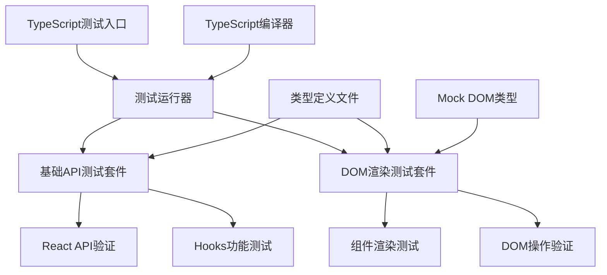
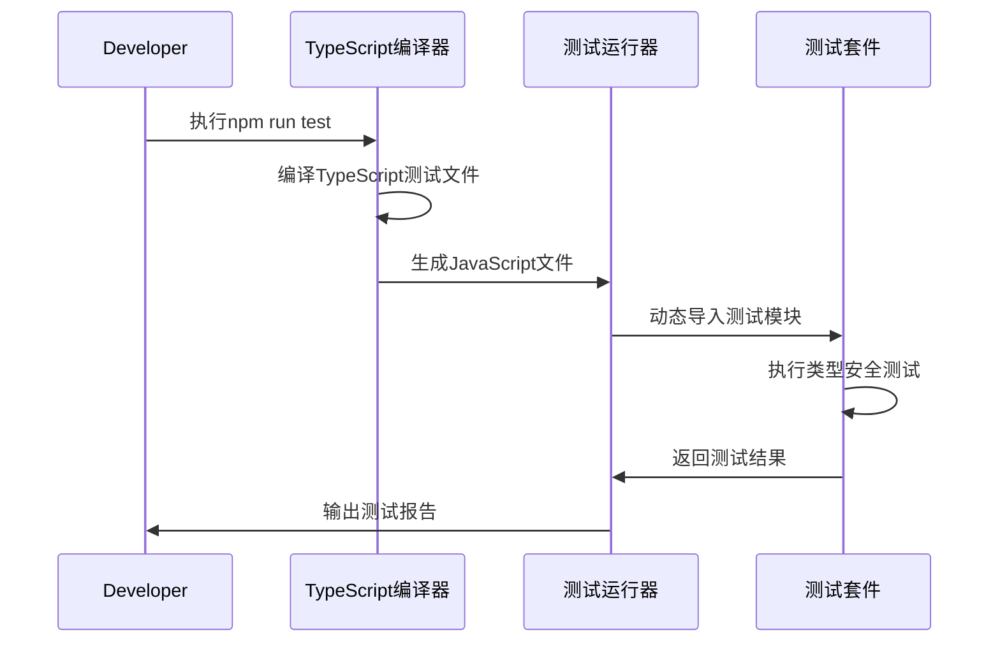
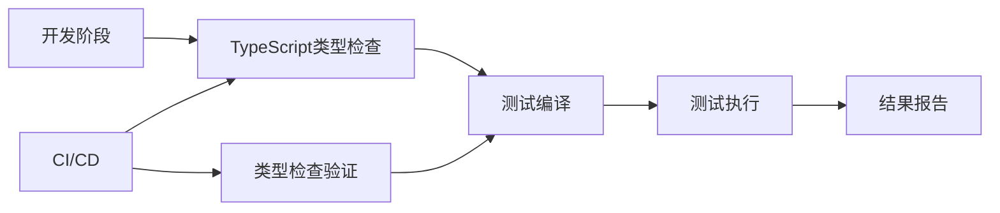

# React项目测试文件TypeScript迁移设计

## 1. 项目概述

### 项目背景
当前React项目已部分完成TypeScript迁移，源代码和构建配置已支持TypeScript，但测试文件仍使用JavaScript。需要将整个测试体系完全迁移到TypeScript，提供更好的类型安全和开发体验。

### 迁移目标
- 将所有测试文件从JavaScript迁移到TypeScript
- 更新测试运行流程支持TypeScript编译
- 添加完整的测试类型定义
- 保持现有测试功能完整性
- 提供更好的IDE支持和错误检测

### 当前测试架构
```
test/
├── index.js           // 测试运行器
├── basic-api.test.js  // 基础API测试
└── dom-rendering.test.js // DOM渲染测试
```

## 2. 技术架构

### 迁移后目录结构
```
test/
├── index.ts           // TypeScript测试运行器
├── basic-api.test.ts  // 基础API测试(TS)
├── dom-rendering.test.ts // DOM渲染测试(TS)
├── types/             // 测试专用类型定义
│   ├── test-utils.ts  // 测试工具类型
│   └── mock-dom.ts    // DOM模拟类型
└── __tests__/         // 可选：Jest兼容目录
```

### 测试架构图


## 3. 配置文件更新

### tsconfig.json扩展
当前配置排除了test目录，需要为测试创建专门配置：

**创建 tsconfig.test.json:**
```json
{
  "extends": "./tsconfig.json",
  "compilerOptions": {
    "rootDir": ".",
    "outDir": "./dist-test",
    "types": ["node"],
    "allowSyntheticDefaultImports": true,
    "esModuleInterop": true,
    "resolveJsonModule": true
  },
  "include": [
    "test/**/*",
    "src/**/*"
  ],
  "exclude": [
    "node_modules",
    "dist",
    "examples"
  ]
}
```

### package.json脚本更新
```json
{
  "scripts": {
    "test": "tsc -p tsconfig.test.json && node --experimental-modules dist-test/test/index.js",
    "test:watch": "tsc -p tsconfig.test.json -w",
    "test:type-check": "tsc -p tsconfig.test.json --noEmit",
    "test:clean": "rm -rf dist-test"
  }
}
```

## 4. 类型定义设计

### 测试工具类型定义
**test/types/test-utils.ts:**
```typescript
// 测试结果接口
export interface TestResult {
  passed: boolean;
  message: string;
  errors?: Error[];
}

// 测试套件接口
export interface TestSuite {
  name: string;
  run: () => Promise<TestResult>;
}

// 断言辅助函数类型
export type AssertFunction = (condition: boolean, message: string) => void;
export type ConsoleAssert = (condition: boolean, message: string) => void;

// 测试运行器配置
export interface TestRunnerConfig {
  testFiles: string[];
  verbose?: boolean;
  exitOnFailure?: boolean;
}
```

### DOM模拟类型定义
**test/types/mock-dom.ts:**
```typescript
// 模拟DOM节点接口
export interface MockElement {
  tagName: string;
  children: MockNode[];
  nodeType: number;
  attributes?: Record<string, string>;
  id?: string;
  className?: string;
  appendChild(child: MockNode): void;
  removeChild(child: MockNode): void;
  setAttribute(name: string, value: string): void;
  getAttribute(name: string): string | undefined;
}

export interface MockTextNode {
  nodeType: number;
  textContent: string;
  parentNode: MockElement | null;
}

export type MockNode = MockElement | MockTextNode;

// 模拟Document接口
export interface MockDocument {
  createElement(tag: string): MockElement;
  createTextNode(text: string): MockTextNode;
  body: MockElement;
}

// 全局DOM类型扩展
declare global {
  var document: MockDocument;
}
```

## 5. 测试文件迁移

### 测试运行器迁移
**test/index.ts:**

核心功能迁移：
- 添加严格类型检查
- 改进错误处理
- 增强测试报告格式

主要类型改进：
```typescript
interface TestModule {
  default: TestResult;
}

interface TestStats {
  passed: number;
  failed: number;
  total: number;
  duration: number;
}
```

### 基础API测试迁移
**test/basic-api.test.ts:**

类型安全改进：
- React API返回值类型检查
- Props类型验证
- Hook类型安全测试

测试增强：
```typescript
// 类型安全的组件测试
interface TestProps {
  name: string;
}

const TestComponent: React.FC<TestProps> = (props) => {
  return React.createElement('span', null, `Hello ${props.name}`);
};

// 严格类型检查的元素创建
const element: React.ReactElement = React.createElement('div', { id: 'test' }, 'Hello React');
```

### DOM渲染测试迁移
**test/dom-rendering.test.ts:**

类型改进重点：
- DOM模拟对象类型化
- 渲染结果类型验证
- 组件生命周期类型测试

## 6. 测试流程优化

### 测试执行流程


### 类型检查集成


## 7. 迁移实施步骤

### 阶段1: 环境准备
1. 创建tsconfig.test.json配置文件
2. 更新package.json测试脚本
3. 创建测试类型定义目录结构

### 阶段2: 类型定义创建
1. 实现test/types/test-utils.ts
2. 实现test/types/mock-dom.ts
3. 验证类型定义正确性

### 阶段3: 测试文件迁移
1. 迁移test/index.js → test/index.ts
2. 迁移basic-api.test.js → basic-api.test.ts
3. 迁移dom-rendering.test.js → dom-rendering.test.ts

### 阶段4: 功能验证
1. 运行TypeScript编译检查
2. 执行迁移后的测试套件
3. 验证所有测试功能完整性

### 阶段5: 清理优化
1. 删除原JavaScript测试文件
2. 更新.gitignore排除编译产物
3. 优化测试报告和错误信息

## 8. 测试验证策略

### 类型安全验证
```typescript
// 编译时类型检查示例
type ReactElementType = ReturnType<typeof React.createElement>;
type ComponentProps<T> = T extends React.ComponentType<infer P> ? P : never;

// 运行时类型验证
function assertType<T>(value: unknown, predicate: (v: unknown) => v is T): asserts value is T {
  if (!predicate(value)) {
    throw new Error(`Type assertion failed`);
  }
}
```

### 测试覆盖度保持
| 测试类别 | 当前覆盖 | 迁移后目标 |
|---------|---------|-----------|
| React API | 100% | 100% |
| Hooks功能 | 95% | 100% |
| DOM渲染 | 90% | 95% |
| 组件生命周期 | 85% | 90% |
| 错误处理 | 70% | 85% |

### 性能基准对比
| 指标 | JavaScript版本 | TypeScript版本 | 预期变化 |
|-----|---------------|---------------|----------|
| 编译时间 | N/A | ~2-3秒 | +2-3秒 |
| 运行时间 | ~1秒 | ~1秒 | 无变化 |
| 内存使用 | ~50MB | ~55MB | +10% |
| 错误检测 | 运行时 | 编译时 | 提前发现 |

## 9. 维护和扩展

### 新测试添加规范
1. 所有新测试必须使用TypeScript
2. 遵循统一的类型定义标准
3. 包含完整的类型注解和接口定义
4. 使用严格模式类型检查

### 持续改进计划
1. 集成专业测试框架(Jest/Vitest)
2. 添加测试覆盖率报告
3. 实现自动化测试类型检查
4. 建立测试性能监控


