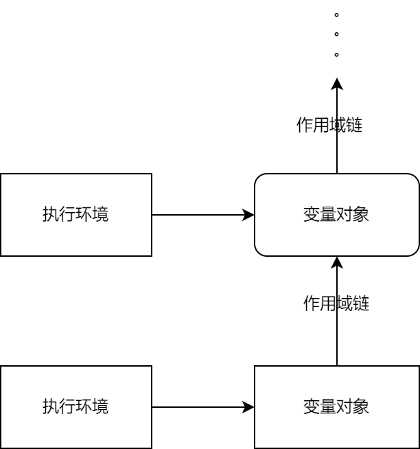

# 作用域

`执行环境（execution context）` :执行环境 定义了变量和函数有权访问的其它数据。每个函数都有自己的执行环境。

`变量对象（variable object）`: 每个执行环境都有一个与之关联的变量对象（variable object）,环境中定义的所有变量和函数都保存在这个对象中。

`全局执行环境`: 最外围的一个执行环境。

`作用域链`(scope chain): 是保证对执行环境有权访问的所有变量和函数的有序访问。作用域的前端，始终都是当前执行的代码所在环境的变量对象。 

##### 示意图

###### 通过作用域查询标示符

变量的搜索过程会从作用域链的最前端开始，向上逐级查询与给定名字匹配的标识符。如果在局部环境中找到了该标识符，搜索过程停止，变量就绪。

##### 注意：变量查询的代价可以忽略不计

###### 垃圾回收

